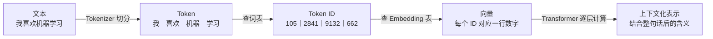
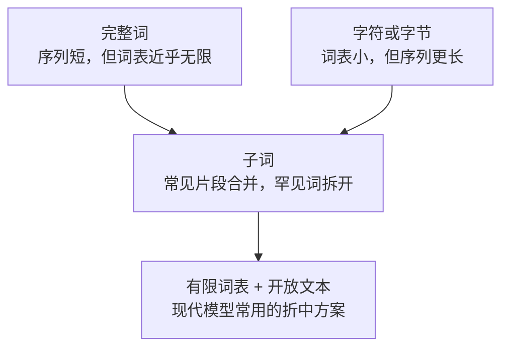

# 第 01 课：模型为什么不直接读汉字

<div class="lesson-lead">计算设备只能处理数字。Tokenizer 像一台“可重复使用的切词机”：先把任意文字切成有限词表里的积木，再把每块积木换成编号。本课会手算一遍 BPE，不把 Tokenization 当成黑盒。</div>

::: info 本课怎样使用台大 Applied Deep Learning 课件
本课按照台大 Applied Deep Learning 的 **Tokenization** 主线重新组织：未登录词 → 字符与子词 → BPE 训练 → 新词切分 → 多语言问题；在此基础上补充了大模型里的词表成本、特殊 token、byte fallback 与实用检查方法。你可以对照阅读[站内 PDF 原稿](https://www.csie.ntu.edu.tw/~miulab/f114-adl/doc/250908_Tokenization.pdf)，也可以打开[课程官方 PDF](https://www.csie.ntu.edu.tw/~miulab/f114-adl/doc/250908_Tokenization.pdf)。

[Stanford CS336 Lecture 1 可执行 Slides](/lectures/?trace=var/traces/lecture_01.json)提供了字符、字节、单词和 BPE tokenizer 的逐步代码。正文先手算规则，学完后再打开它，把算法直觉接到实现。

对应论文按“问题 → 方法 → 工程化”阅读：

1. [Sennrich et al. · Rare Words with Subword Units](https://arxiv.org/pdf/1508.07909.pdf)：为什么子词能缓解未登录词；
2. [BPE 论文材料](https://aclanthology.org/P16-1162.pdf)：合并规则怎样从语料学出来；
3. [SentencePiece](https://aclanthology.org/D18-2012.pdf)：怎样直接从原始字符串训练语言无关 tokenizer。
:::

<figure class="teaching-figure">
  
  <figcaption>同一句文本要经历三站：切成 token、查 token ID、再由 embedding 表查出向量。Tokenizer 不直接生产语义。</figcaption>
</figure>
<div class="visual-key"><div><b>切分</b>常见片段可更大，罕见片段通常更碎。</div><div><b>编号</b>ID 只是词表索引，大小没有语义顺序。</div><div><b>向量</b>Embedding 才是模型后续计算使用的表示。</div></div>

## 先看全景：四个名词不要混



先记住这四句话：

1. **Token** 是切出来的文字片段。
2. **Token ID** 是片段在词表中的编号。
3. **Embedding** 是模型根据 ID 查出的初始向量。
4. **上下文化表示** 是向量经过 Transformer、结合周围内容后得到的新表示。

例如：

```text
“我喜欢机器学习”
      ↓ 切分
[“我”, “喜欢”, “机器”, “学习”]
      ↓ 查词表编号
[105, 2841, 9132, 662]
      ↓ 查 embedding 表
四个高维向量
```

Tokenizer 只负责前两步：**切分与编号**。具体模型切出的结果会不同，上面的 ID 只是教学示意。

<TokenLab />

<figure class="teaching-figure source-figure"><a href="/lectures/images/tokenized-example.png" target="_blank"></a><figcaption>Stanford CS336 Lecture 1 的 tokenizer 往返图。`encode` 把字符串变成 token ID，`decode` 必须能还原原字符串；彩色边界也说明空格、标点和数字未必各自单独成 token。<a href="/lectures/?trace=var/traces/lecture_01.json">打开 Lecture 1 可执行 Slides</a>。</figcaption></figure>

## 1. 为什么“一个完整单词一个 Token”行不通

最直觉的办法是建立一个单词词典：`cat`、`student`、`learning` 各占一个位置。但真实世界不断产生词典外的内容：

- 新人名、新产品名与新缩写；
- `learn`、`learned`、`learning` 等词形变化；
- 拼写错误、网址、代码变量、emoji；
- 能组合出大量词形的语言。课件用 Swahili 提醒我们：一个词根可以带上丰富的前后缀，枚举所有完整词形很困难。

训练时没见过、词表里也没有的完整词叫 **未登录词**（out-of-vocabulary，OOV）。如果只能把它变成 `<unk>`，模型会失去大量信息：`KimiK3` 和 `OpenDataLoader` 可能都只剩同一个“未知”标记。

所以问题不是“中文应该按字还是按词”，而是：**怎样用一个有限词表，稳定地表示几乎无限的文本？**

## 2. 四种切分粒度

| 粒度 | `unbelievable` 可能变成 | 优点 | 主要代价 |
|---|---|---|---|
| 完整词 | `unbelievable` | 序列短，片段常有完整语义 | 词表巨大，容易遇到 OOV |
| 字符 | `u n b e …` | 词表小，几乎不怕新词 | 序列很长，模型要自己拼回词义 |
| 子词 | `un + believ + able` | 在词与字符之间折中 | 切分未必符合语言学直觉 |
| 字节 | UTF-8 字节序列 | 任意文本都有保底表示 | 某些语言或符号可能变成更多 token |

现代大语言模型常以**子词**为主，并用字符或字节作兜底。中文也不是天然“一字一 token”：高频词、标点组合、英文代码和罕见汉字都可能采用不同粒度。



> 子词不是固定的语法单位。它有时碰巧对应 `un-`、`-est` 等词素，但它首先是从训练语料频率中学出的片段。

## 3. BPE 在训练时到底学什么

**Byte-Pair Encoding（BPE）** 的核心动作只有一句话：

> 反复找到语料中出现次数最多的相邻符号对，把它们合并成一个新符号。

为了看清词尾，下面沿用课件记法，用 `</w>` 表示“一个词结束”。训练语料是：

```text
low    出现 5 次
lower  出现 2 次
newest 出现 6 次
widest 出现 3 次
```

### 第 0 步：先拆成字符

```text
l o w </w>           × 5
l o w e r </w>       × 2
n e w e s t </w>     × 6
w i d e s t </w>     × 3
```

词频必须参与计数。相邻对 `e + s` 在 `newest` 中出现 6 次、在 `widest` 中出现 3 次，总计 9 次，因此是一个高频候选。

### 接下来反复合并

| 轮次 | 学到的合并规则 | 为什么值得合并 | 新增子词 |
|---:|---|---|---|
| 1 | `e + s → es` | 合计出现 9 次 | `es` |
| 2 | `es + t → est` | `newest` 与 `widest` 都需要 | `est` |
| 3 | `est + </w> → est</w>` | 高频词尾整体出现 | `est</w>` |
| 4 | `l + o → lo` | `low` 与 `lower` 共享 | `lo` |
| 5 | `lo + w → low` | 共享词干继续合并 | `low` |
| 6 | `n + e → ne` | `newest` 的高频开头 | `ne` |
| 7 | `ne + w → new` | 形成更长高频片段 | `new` |

实际训练会继续合并，直到达到预设词表大小或合并次数。若同一轮有并列高频候选，实现会用固定规则打破平局；重点是**每次只增加一个可复用片段**。

### 用一张“积木长大图”记住它

```text
e + s ──→ es
           └─ + t ──→ est
                         └─ + </w> ──→ est</w>

l + o ──→ lo
           └─ + w ──→ low
```

BPE 的“训练”就是保存这份有先后顺序的合并规则；真正处理新文本时，Tokenizer 重放允许的合并。

## 4. 新词怎样被切开：手算 `lowest`

假设训练语料里从未出现完整单词 `lowest`，但已经学会：

```text
l + o → lo
lo + w → low
e + s → es
es + t → est
est + </w> → est</w>
```

那么：

```text
l o w e s t </w>
↓ 按已经学到的规则合并
low | est</w>
```

模型虽然没见过完整的 `lowest`，仍能复用 `low` 与 `est`。这就是子词方法解决 OOV 的关键。

课件还举了 `powest`：如果初始字符词表中没有 `p`，示例会得到 `<unk> o w est</w>`。但许多现代 tokenizer 有 **byte fallback**：陌生字符还能拆成 UTF-8 字节，因此通常不必丢成 `<unk>`。代价是这种文本可能被切得更碎。

::: warning BPE 不是“词根词缀分析器”
`unlikeliest` 可能被切成类似 `un + likely + est`，看起来符合语言学；也可能切出不自然的边界。BPE 优化的是语料中的重复与压缩，不保证每块都有独立词义。
:::

## 5. 词表大小是一笔资源账

设词表大小为 $V$，隐藏维度为 $d$。仅输入 embedding 表大约就有：

$$
V\times d
$$

个参数。输出层也要给 $V$ 个候选词打分（有的模型会与输入 embedding 共享权重）。因此：

| 更小的词表 | 更大的词表 |
|---|---|
| embedding/output 参数更少 | 常见片段能合成更长 token |
| 文本往往变成更长序列 | 同样文本通常 token 更少 |
| attention、KV Cache 和上下文占用增加 | 输出 softmax 的候选更多 |
| 罕见形式可由小块拼出 | 低频大 token 可能学得不充分 |

标准全量 Attention 对序列长度 $T$ 的主要配对项近似为 $T^2$。所以少 20% token 不只是少读 20% 位置，某些计算项可能下降得更多；但大词表也不是免费午餐。

K3 使用 160K 词表。它的含义是 tokenizer 最多可输出约 16 万类片段，**不是模型只懂 16 万个词，也不是每个 token 都有一个固定词义**。

## 6. 为什么同一句话在不同语言里成本不同

多语言模型常用统一词表。训练语料多、频率高的语言，更容易获得长而常见的子词；覆盖少的语言可能更碎。可以用 **token fertility** 粗看这一点：

$$
\text{fertility}=\frac{\text{token 数}}{\text{原文字数或单词数}}
$$

fertility 越高，同样长度的原文占用的 token 通常越多。影响来自：

- 词表训练时各语言的数据比例；
- Unicode 与 UTF-8 编码方式；
- 语言本身的词形变化和书写系统；
- 空格、标点与规范化规则。

因此“支持某种语言”不只看能否编码，还要看**压缩效率、数据质量与模型效果**。中文、emoji、少数语言、代码都应单独实测，不能用英文经验直接推断。

## 7. 特殊 Token：把聊天协议也写进序列

词表通常还包含：

- 序列开始与结束；
- system、user、assistant 角色边界；
- 工具调用开始与结束；
- 图片或视觉位置的占位；
- padding、mask 等训练标记。

它们不一定对应自然语言。聊天模板可能把：

```text
system: 你是助教
user: 请解释 BPE
```

改写为类似：

```text
<system> 你是助教 </system> <user> 请解释 BPE </user> <assistant>
```

模型通过这些约定标记区分角色。若训练与推理使用了不同模板，即使正文相同，模型看到的 token 序列也不同。

## 8. 三个最常见误解

### 误解一：Token ID 越大，意义越复杂

错。ID 只是 embedding 表的行号。图书馆书架编号 `9132` 不代表书比编号 `662` 更高级。

### 误解二：一个 Token 永远等于一个汉字或一个英文词

错。切分由具体 tokenizer 与词表决定。同一个字符串在不同模型中可能得到完全不同的 token 数。

### 误解三：Tokenizer 已经理解了语义

错。Tokenizer 主要解决“如何离散编码”。初始 embedding 也只是起点；语境中的含义要靠后续网络逐层计算。

## 9. 拿到一个 Tokenizer，该怎样体检

准备一组小测试，不要只试一句英文：

```text
普通中文：我正在学习大语言模型。
生僻字：𠮷野家
英文形态：unlikely / unlikeliest
数字：2026-08-03 / 3.1415926
空白：一个空格、多个空格、换行、Tab
代码：user_id = getUserID()
Emoji：👨‍👩‍👧‍👦 🤖
混合文本：Kimi K3 支持 tool_call 吗？
```

逐项检查：

1. token 列表与 token 数；
2. ID 是否能完整 decode 回原文；
3. 空格、换行、大小写是否被保留或规范化；
4. 是否出现 `<unk>`；
5. 不同语言是否明显更碎；
6. 聊天模板额外加入了多少特殊 token。

## 本课练习：先做再展开答案

### 练习 1

为什么“全用字符”几乎没有未登录词，却不是大模型的唯一答案？

<details><summary>参考答案</summary>

字符词表小、覆盖强，但会显著拉长序列；模型还要用更多层和位置重新拼出词与短语。子词在覆盖能力和序列长度之间更平衡。

</details>

### 练习 2

若合并规则按顺序为 `e+s→es`、`es+t→est`、`l+o→lo`、`lo+w→low`，`lowest` 最后至少能切成哪两块？

<details><summary>参考答案</summary>

`low | est`。如果还学过 `est + </w> → est</w>`，词尾会表示成 `est</w>`。

</details>

### 练习 3

同一篇文章换了 tokenizer 后 token 数少了，能否直接断言模型更好？

<details><summary>参考答案</summary>

不能。更少 token 可能节省上下文与序列计算，但还要看词表与输出层成本、低频 token 的学习质量、训练数据、语言覆盖以及模型本身。

</details>

## 本课闭卷复述

请不用看页面，画出：

1. “文本 → token → ID → 初始向量 → 上下文化表示”；
2. `e+s→es→est→est</w>` 的 BPE 合并链；
3. 小词表与大词表的两边代价。

<ConceptCheck question="下面哪个说法正确？" :options='["token ID 越大，语义越复杂", "一个 token 永远等于一个汉字", "token ID 是查 embedding 表的地址"]' :answer="2" explanation="ID 本身只是离散编号；语义表示从 embedding 向量以及后续上下文计算中产生。" />

下一课：[词和 Token 怎样变成有关系的向量](/beginner/02-vector)。

<ChapterReadings lesson="01-token" />
