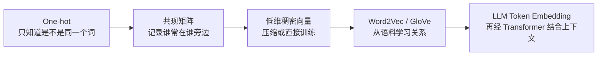
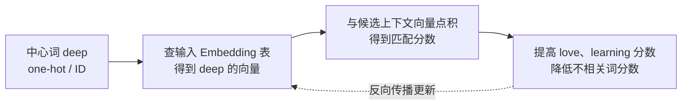

# 第 02 课：怎样把词放进“意义空间”

<div class="lesson-lead">向量不是一串神秘坐标，而是一种可被比较、混合和训练的表示。本课从“car 和 motorcycle 为什么应该更近”出发，逐步走过 one-hot、共现矩阵、SVD、Word2Vec、负采样与 GloVe，最后接回现代大语言模型的 Token Embedding。</div>

::: info 本课怎样使用台大 Applied Deep Learning 课件
本课依照台大 Applied Deep Learning 的 **Word Embeddings** 课件路线重写：表示方法 → 共现矩阵 → 低维稠密向量 → Word2Vec → 负采样 → GloVe → 评估；同时补充矩阵形状、余弦相似度与现代 LLM 的上下文化表示。你可以对照阅读[站内 PDF 原稿](https://www.csie.ntu.edu.tw/~miulab/f111-adl/doc/220929_WordEmbeddings.pdf)，也可以打开[课程官方 PDF](https://www.csie.ntu.edu.tw/~miulab/f111-adl/doc/220929_WordEmbeddings.pdf)。

论文证据链：

- [Word2Vec](https://arxiv.org/pdf/1301.3781.pdf)：用预测上下文直接学习稠密表示；
- [Negative Sampling](http://papers.nips.cc/paper/5021-distributed-representations-of-words-and-phrases-and-their-compositionality.pdf)：避免每次更新完整词表；
- [GloVe](http://nlp.stanford.edu/pubs/glove.pdf)：把全局共现比值写进目标函数；
- [Embedding Evaluation](https://aclanthology.org/D15-1036.pdf)：解释为什么“近邻看起来合理”仍不足以证明表示有效。
:::

## 先看全景：词向量是怎样一步步学出来的



这条路线背后的核心想法叫 **分布式假设**（distributional hypothesis）：

> 经常出现在相似上下文中的词，往往有相近的意义或用法。

比如 `猫` 与 `狗` 都常出现在“喂养、宠物、可爱、动物”等语境中。我们不必先给它们手写定义，也可以从邻居统计中发现关系。

## 1. 表示一个词，有哪些办法

课件先把表示方法分成两条思路：

| 思路 | 怎样得到表示 | 例子 | 局限 |
|---|---|---|---|
| 知识驱动 | 人工整理概念与上下位关系 | 词典、WordNet、知识图谱 | 建设成本高，新词更新慢 |
| 语料驱动 | 从真实文本中的邻居与任务学习 | 共现矩阵、Word2Vec、GloVe | 会继承语料偏见，依赖数据覆盖 |

语料驱动又可以经历三种形态：

1. **原子编号 / one-hot**：每个词只是不同的格子；
2. **高维稀疏表示**：每一维记录与某个邻居共同出现的次数；
3. **低维稠密表示**：用几十到几千个连续数字压缩重要关系。

## 2. One-hot：能区分身份，却不会表达相似

假设词表只有四个词：

```text
car        = [1, 0, 0, 0]
motorcycle = [0, 1, 0, 0]
banana     = [0, 0, 1, 0]
music      = [0, 0, 0, 1]
```

每个向量只有一个位置是 1，因此叫 **one-hot**。它很适合表示“这是第几个词”，但：

$$
\text{car}\cdot\text{motorcycle}=0
$$

$$
\text{car}\cdot\text{banana}=0
$$

两组得分完全相同。one-hot 只告诉我们“不是同一个词”，无法表达 car 与 motorcycle 比 car 与 banana 更相近。

> 上一课的 Token ID 本质上也是身份索引。把 ID 直接当数字做距离没有意义；`ID=100` 并不天然比 `ID=9000` 更接近 `ID=99`。

## 3. 共现矩阵：用“身边经常是谁”描述一个词

沿用课件的小语料，窗口长度为 1，也就是只看一个词左边和右边紧挨的邻居：

```text
I love NTU. I love deep learning. I enjoy learning.
```

统计得到：

| 中心词 \ 邻居 | I | love | enjoy | NTU | deep | learning |
|---|---:|---:|---:|---:|---:|---:|
| I | 0 | 2 | 1 | 0 | 0 | 0 |
| love | 2 | 0 | 0 | 1 | 1 | 0 |
| enjoy | 1 | 0 | 0 | 0 | 0 | 1 |
| NTU | 0 | 1 | 0 | 0 | 0 | 0 |
| deep | 0 | 1 | 0 | 0 | 0 | 1 |
| learning | 0 | 0 | 1 | 0 | 1 | 0 |

怎样读第一行？`I` 的相邻位置出现过 2 次 `love`、1 次 `enjoy`。所以 `I` 的表示可以先写成：

```text
[0, 2, 1, 0, 0, 0]
```

`NTU` 与 `deep` 都靠近 `love`，两个共现向量便不再完全无关。这是“意义来自使用方式”的最小例子。

<figure class="teaching-figure source-figure"><a href="/paper-figures/ntu-word-embeddings-cooccurrence-slide.webp" target="_blank"></a><figcaption>台湾大学 Applied Deep Learning《Word Embeddings》Slide 7。红框比较 `love` 与 `enjoy` 两列：它们都在 `I` 旁出现，因此计数向量不再正交。下方蓝框同时指出共现矩阵会随词表变大、维度高且稀疏。<a href="https://www.csie.ntu.edu.tw/~miulab/f111-adl/doc/220929_WordEmbeddings.pdf#page=7">打开原始 PDF 第 7 页</a>。</figcaption></figure>

### 窗口大小会改变学到的关系

- 小窗口更偏局部句法：什么词能紧挨在一起；
- 大窗口更偏主题语义：什么词常出现在同一段话；
- 只看左侧、只看右侧或两侧都会改变统计。

因此，向量中的“相似”不是宇宙真理，而是由**语料、窗口与训练目标共同定义**的。

## 4. 高维稀疏矩阵为什么不够好

若词表有 160K 个词，每个共现向量就可能有 160K 维；绝大多数格子仍是 0。这带来：

- 存储与计算开销大；
- 新词出现后矩阵要扩展；
- 低频词统计很不稳定；
- 两个意思接近的词若没有共享足够邻居，仍可能显得很远。

一种经典方法是对共现矩阵做 **SVD（奇异值分解）**，保留最重要的低维结构。直觉上，它把许多相关邻居压成较少的“潜在方向”。

$$
X\approx U_k\Sigma_kV_k^\top
$$

这里 $k$ 远小于词表大小。$U_k\Sigma_k$ 可以作为低维词表示。SVD 路线利用全局统计，但大型语料上的矩阵构建和分解成本高，加入新词也不够灵活。

另一条路线更直接：**设计一个预测任务，用反向传播直接学低维向量。** Word2Vec 就属于这一类。

## 5. 先把向量和矩阵读懂

向量是一组共同工作的数字。可以把一首歌粗略表示为：

```text
[节奏强度, 明亮程度, 人声比例, 情绪张力]
```

例如 `[0.8, 0.3, 0.6, 0.9]` 是 4 维向量。真实词向量的维度没有这么清晰的人工标签；信息往往分布在许多方向和组合中。

<figure class="teaching-figure"><figcaption>把矩阵乘法看成调音台：权重把多路输入重新组合成多路输出。图由本教程生成。</figcaption></figure>

<div class="visual-key"><div><b>左：输入向量</b>四个颜色通道代表四个输入维度。</div><div><b>中：权重矩阵</b>每条连线决定某个输入对某个输出贡献多少。</div><div><b>右：输出向量</b>同一批信息被重新混合成三个新维度。</div></div>

论文常写：

$$
X\in\mathbb{R}^{T\times d}
$$

翻译成人话：`T` 行对应 T 个 token，`d` 列对应每个 token 的 d 个数。若线性层为：

$$
Y=XW
$$

`X` 是 `T × d`，`W` 是 `d × m`，那么 `Y` 就是 `T × m`。矩阵 `W` 是一套对所有 token 复用的“混合配方”。

### 只算一个二维例子

$$
x=[2,3],\qquad
W=\begin{bmatrix}1&0.5\\-1&2\end{bmatrix}
$$

输出第一维是 `2×1 + 3×(-1) = -1`，第二维是 `2×0.5 + 3×2 = 7`，所以：

$$
y=[-1,7]
$$

## 6. 点积与余弦：两个向量有多匹配

<figure class="teaching-figure concept-figure"><figcaption>上半图：点积把两个向量压成一个匹配分数；下半图：矩阵重新混合各维，输出仍是一组特征。</figcaption></figure>

点积为：

$$
a\cdot b=\sum_i a_i b_i
$$

它既受方向影响，也受向量长度影响。比较词义时常使用 **余弦相似度**，把长度除掉：

$$
\cos(a,b)=\frac{a\cdot b}{\lVert a\rVert\lVert b\rVert}
$$

直觉上：

- 接近 1：方向相近；
- 接近 0：近似无关；
- 接近 -1：方向相反。

例如 $a=[1,1]$、$b=[2,2]$，两者长度不同，但方向相同，余弦相似度为 1。

::: warning 相似度不等于事实正确
向量接近只说明在给定语料与目标下用法相似。反义词也常共享上下文，例如“气温很高”与“气温很低”；它们的向量可能靠近，却不表示意义相同。
:::

<VectorSimilarityLab />

先选“猫—狗”，再换成“猫—汽车”。图上的夹角、点积和余弦会一起变化。这个二维空间只是为了能画出来；真实 embedding 往往有数百或数千维，计算方法完全相同。

### PyTorch：ID 为什么能直接查到向量

`nn.Embedding(V, d)` 本质是一张 $V\times d$ 的可训练表。下面用四个 ID 查出两行向量，并计算余弦相似度：

```python
import torch
import torch.nn as nn
import torch.nn.functional as F

embedding = nn.Embedding(num_embeddings=4, embedding_dim=2)
with torch.no_grad():
    embedding.weight[:] = torch.tensor([
        [0.9, 0.8],   # 猫
        [0.8, 0.9],   # 狗
        [-0.8, 0.2],  # 汽车
        [0.2, 0.9],   # 快乐
    ])

cat, dog = embedding(torch.tensor([0, 1]))
similarity = F.cosine_similarity(cat, dog, dim=0)
print(round(similarity.item(), 3))  # 约 0.994
```

`embedding(torch.tensor([0, 1]))` 没有做文字理解，只是取第 0、1 行。真正训练时，这些行会被反向传播逐步更新。

## 7. Word2Vec Skip-gram：用中心词猜邻居

给定句子：

```text
I love deep learning
```

若窗口为 1，以 `deep` 为中心，正例邻居是 `love` 与 `learning`。Skip-gram 的任务是：

> 输入中心词，尽可能提高真实邻居的概率。



### “隐藏层权重就是词向量表”是什么意思

假设词表大小为 $V$，词向量维度为 $d$。输入权重矩阵形状是：

$$
E_{in}\in\mathbb{R}^{V\times d}
$$

one-hot 与这个矩阵相乘，实际上只会选出对应的一行。因此实现中不必真的构造巨大 one-hot，直接用 token ID 查表即可。

Skip-gram 通常给每个词学习**两份向量**：

- 作为中心词时的输入向量；
- 作为上下文候选时的输出向量。

训练完成后，常取输入向量或两者组合做下游表示。千万不要误以为一个词从头到尾只存在一份参数。

## 8. 全词表 Softmax 为什么贵

若要计算“真实邻居在整个词表中的概率”，需要给 $V$ 个候选逐个打分：

$$
P(w_o\mid w_i)=
\frac{\exp(v'_{w_o}{}^\top v_{w_i})}
{\sum_{j=1}^{V}\exp(v'_{w_j}{}^\top v_{w_i})}
$$

词表很大时，每个训练样本都计算整个分母非常昂贵。经典替代方案包括层次 Softmax 与采样方法。

### 负采样：只比较少量“错误答案”

对正例 `(deep, learning)`：

1. 拉近 `deep` 与真实邻居 `learning`；
2. 随机抽几个负例，例如 `banana`、`airport`、`violin`；
3. 推远中心词与这些负例；
4. 只更新本轮涉及的少量向量。

这把“每次检查整个词表”变成了“小规模真假判断”。负例并非完全均匀抽取。经典 Word2Vec 常使用：

$$
P_{neg}(w)\propto \text{count}(w)^{3/4}
$$

为什么是 $3/4$？与原始词频相比，它会压平分布：超高频词不至于垄断负例，较低频词又比均匀采样更符合语料分布。这是经验上有效的折中，不是从第一原则推导出的唯一答案。

## 9. Skip-gram、CBOW 与语言模型别混淆

| 方法 | 给什么 | 猜什么 | 直觉 |
|---|---|---|---|
| Skip-gram | 中心词 | 左右邻居 | 从一个点向外看 |
| CBOW | 周围多个词 | 中心词 | 用上下文填空 |
| 自回归语言模型 | 前面所有可见 token | 下一个 token | 从左到右续写 |

它们都能学到表示，但训练信号与最终用途不同。现代 LLM 的下一 token 预测比经典 Word2Vec 更深、更大，并让表示经过多层 Attention 动态结合上下文。

## 10. GloVe：让全局计数和直接训练合作

Word2Vec 从一个个局部预测样本直接学习。GloVe（Global Vectors）则显式利用整个语料的共现统计，再通过一个加权目标学低维向量。

它的关键直觉不是只看 $P(x\mid ice)$，而是看概率比：

$$
\frac{P(x\mid ice)}{P(x\mid stream)}
$$

- 若 $x=$ `solid`：更常靠近 `ice`，比值大于 1；
- 若 $x=$ `gas`：更常靠近 `stream`，比值小于 1；
- 若 $x=$ `water`：两边都常见，比值接近 1；
- 若 $x$ 是无关词：两边都少，比值也可能接近 1。

这个**比值模式**比单个计数更能区分 ice 与 stream 的关系。GloVe 用加权最小二乘拟合对数共现次数；权重函数会避免：

- 极罕见共现因为噪声被放得过大；
- 超高频共现凭巨大计数支配训练。

可以这样记：**Word2Vec 更像边读边做邻居预测，GloVe 更像先汇总全局邻居表，再压缩其中的比例结构。**

## 11. 怎样判断一个词向量好不好

### 内在评估（Intrinsic）

直接检查向量空间：

- 类比：`king - man + woman ≈ queen`；
- 近邻：`cat` 附近是否有 `dog`、`kitten`；
- 与人工相似度评分的相关性。

优点是快，缺点也明显：类比关系未必线性；城市、国家等集合可能有歧义；词义会随时间变化；一个静态向量还会把多义词压在一起。

### 外在评估（Extrinsic）

把向量放进真实任务，例如情感分类、命名实体识别或检索，看最终指标是否提高。它更接近实际价值，但成本更高，且结果还受模型结构、训练方法与数据影响。

> “近邻看起来不错”不保证下游任务更好；“某个任务更好”也不保证表示在所有领域通用。两类评估最好配合使用。

## 12. 从静态词向量走到现代 LLM

经典 Word2Vec/GloVe 通常给同一个词一份固定向量：

```text
“我去银行存钱”里的 银行
“我在河流的银行旁”里的 bank
```

只要 token 相同，查表得到的初始向量就相同，难以直接处理一词多义。Transformer 的做法分两步：

1. **初始 Token Embedding**：仍然按 ID 查同一张表；
2. **上下文化**：每一层 Attention 让它读取周围 token，于是同一 token 在不同句子中的最终向量不同。

```text
Token ID
   ↓ 查表：只知道“它是谁”
初始 Embedding + 位置信息
   ↓ 多层 Attention / FFN：结合“它在哪里、周围是谁”
上下文化表示
```

这也解释了第一课为何强调：**Tokenizer 不生产语义，Embedding 也不是理解的终点。**

## 13. 为什么神经网络还需要非线性

两个线性层直接连起来仍能合成一个线性层：

$$
(XW_1)W_2=X(W_1W_2)
$$

中间加入激活函数，网络才有能力形成更复杂的弯曲关系与条件组合。Transformer 的 FFN 常用 SwiGLU：一条分支提供内容，另一条像门一样控制通过多少。

向量维度也不是越大越聪明。把 10 维信息机械复制到 10,000 维不会产生新知识；有效表示取决于训练目标、数据覆盖、优化过程与模型结构。

## 本课练习：先做再展开答案

### 练习 1

为什么 one-hot 无法表达 `car` 比 `banana` 更接近 `motorcycle`？

<details><summary>参考答案</summary>

不同词的 one-hot 向量彼此正交，点积都为 0。它只能区分身份，没有从语料学习邻居关系。

</details>

### 练习 2

在“我 喜欢 深度 学习”中，窗口为 1、中心词为“深度”时，Skip-gram 的正例邻居有哪些？CBOW 又会怎样构造任务？

<details><summary>参考答案</summary>

Skip-gram 正例是“喜欢”和“学习”；CBOW 则把周围的“喜欢、学习”作为输入，预测中心词“深度”。

</details>

### 练习 3

`X` 是 `5 × 8`，`W` 是 `8 × 3`，`XW` 的形状是什么？

<details><summary>参考答案</summary>

`5 × 3`。中间维 8 对齐并被求和，保留两侧的 5 与 3。

</details>

### 练习 4

为什么现代 LLM 仍要有 embedding 表，却不再局限于一词一个静态意义？

<details><summary>参考答案</summary>

Embedding 表提供每个 token 的初始向量；后续 Transformer 会根据上下文反复更新表示，所以同一个 token 在不同句子中的最终向量可以不同。

</details>

## 本课闭卷复述

请不用看页面，画出“one-hot → 共现矩阵 → 低维向量 → Word2Vec/GloVe → Transformer 上下文化表示”，并用一句话分别解释负采样与余弦相似度。

<ConceptCheck question="Skip-gram 的核心训练任务是什么？" :options='["输入中心词，预测周围词", "输入周围词，预测中心词", "把共现矩阵做 SVD"]' :answer="0" explanation="Skip-gram 从中心词出发预测窗口内的上下文；第二项描述的是 CBOW。" />

下一课：[模型怎样从错误中更新参数](/beginner/03-training)。

<ChapterReadings lesson="02-vector" />
