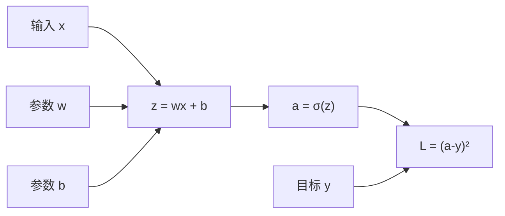

# 第 04 课：参数怎样“学会”

<div class="lesson-lead">训练不是把答案复制进参数，而是反复改变参数，使正确 token 的概率变高、错误 token 的概率变低。</div>

::: info 本课按三组先修讲义补齐
本课 follow 台大 ADL 的 [Neural Network Basics](https://www.csie.ntu.edu.tw/~miulab/f114-adl/doc/250901_NNBasics.pdf) 与 [Backpropagation](https://www.csie.ntu.edu.tw/~miulab/f114-adl/doc/250901_Backprop.pdf)，再接入 Stanford CS224N 的 [Neural Networks and Backpropagation](https://web.stanford.edu/class/cs224n/slides_w26/cs224n-2026-lecture03-neuralnets.pdf)和 [Stanford CS336 Lecture 2 可执行 Slides](/lectures/?trace=var/traces/lecture_02.json)里的 PyTorch、dtype、张量形状与资源核算。目标是能手算一个计算图，也能看懂最小训练代码，不要求先学完整微积分。

对应论文/讲义用于核对不同层次：先用 [Matrix Calculus Notes](https://web.stanford.edu/class/cs224n/readings/gradient-notes.pdf)核对形状，再用 [Auto-Diff Survey](https://arxiv.org/pdf/1502.05767.pdf)理解框架怎样记录计算图，最后用 [On the Difficulty of Training RNNs](https://arxiv.org/pdf/1211.5063.pdf)观察梯度消失/爆炸如何成为真实研究问题。
:::

## 1. 先准备一道题

文本：

> 今天天气很好，我们去公园放____

目标 token 是“风筝”。模型当前输出：

| 候选 | 概率 |
|---|---:|
| 足球 | 0.50 |
| 风筝 | 0.20 |
| 钢琴 | 0.15 |
| 其他 | 0.15 |

损失函数会因为目标“风筝”只有 0.20 而给出较大惩罚。常用 next-token loss：

$$
\mathcal L=-\log p(\text{目标 token})
$$

目标概率越接近 1，loss 越接近 0。

## 2. 梯度不是“答案”，是局部方向

想象你在雾里下山：

- 当前高度 = loss；
- 当前位置 = 全部参数；
- 坡度 = gradient；
- 每一步大小 = learning rate。

梯度告诉你“在当前位置，某个参数稍微增大，loss 会怎样变化”。优化器沿降低 loss 的方向走一小步。

<figure class="teaching-figure"><figcaption>训练像在雾中的损失地形上反复下坡：梯度只告诉当前位置附近的方向，学习率决定每一步多大。图由本教程生成。</figcaption></figure>

<div class="visual-key"><div><b>等高线</b>同一条线上的 loss 高度接近；越靠低谷通常越好。</div><div><b>橙色箭头</b>梯度给出本地最陡方向，优化器据此决定更新。</div><div><b>连续脚印</b>一次 step 不会训练完成，参数靠许多小步逐渐移动。</div></div>

$$
\theta\leftarrow\theta-\eta\nabla_\theta\mathcal L
$$

逐符号翻译：

- `θ`：全部参数；
- `∇θL`：loss 对每个参数的局部变化方向；
- `η`：学习率；
- 减号：往下坡方向更新。

## 3. 为什么要一小批数据一起算

单个句子的梯度很吵，可能把模型往只适合这个句子的方向推。把多个样本组成 batch，平均梯度更稳定，也能利用 GPU 的矩阵并行。

但 batch 太大也有代价：

- 显存与通信增加；
- 每次参数更新之间看到的数据更多；
- 最优学习率和训练动态会变化。

## 4. 一次完整训练 step

<figure class="teaching-figure concept-figure"><figcaption>蓝色是从输入走向预测的前向路径；橙色是误差信号返回参数的学习路径。推理时只走前向，不走后两步。</figcaption></figure>

```text
取一个 batch
  ↓
tokenize + embedding
  ↓
前向传播，得到每个位置的 logits
  ↓
计算 next-token loss
  ↓
反向传播，得到梯度
  ↓
优化器更新参数
  ↓
清空梯度，进入下一 batch
```

训练时真实后续 token 已知，所以序列中所有位置可以一起产生监督：

```text
输入：我 | 喜欢 | 机器 | 学习
目标：喜欢 | 机器 | 学习 | 。
```

这叫 teacher forcing。它与推理时逐 token 生成不同。

## 5. Pre-training 为什么能学到很多东西

要在多样语料中持续预测下一个 token，模型必须压缩大量统计规律：

- 语法与指代；
- 事实共现；
- 程序结构；
- 数学步骤；
- 图像中文字和布局（多模态模型）；
- 人类写作与对话模式。

但“能压缩规律”不保证每次都能可靠取回，也不保证服从用户目标。这就是 SFT、RL、工具和 verifier 继续发挥作用的地方。

## 6. 过拟合与泛化

如果模型只记住训练样本，却不能处理新样本，叫过拟合。训练系统通常分：

- training set：用来更新参数；
- validation set：不更新参数，用来观察泛化与调参；
- test / benchmark：最后评估。

论文如果反复根据测试集调设计，测试分数也会被间接“训练”，这就是 benchmark contamination 风险的一部分。

## 7. 优化器做什么

最简单的 SGD 直接沿梯度走。AdamW 为不同参数维护一阶、二阶统计，自动调整步长并加入 weight decay。Muon 则把二维矩阵参数作为整体处理，校正更新方向。

优化器能改变收敛速度与稳定性，但不能替代数据和模型结构。

## 8. 计算图：把复杂公式拆成小操作

考虑：

$$
z=wx+b,\qquad a=\sigma(z),\qquad L=(a-y)^2
$$

计算图是：



前向传播从左到右存中间值；反向传播从 loss 出发，逐个问“上游结果对我有多敏感、我对输入有多敏感”。

## 9. 链式法则手算一遍

若 $x=2,w=0.5,b=0,y=0$，先算：

$$
z=1,\qquad a=\sigma(1)\approx0.731,\qquad L\approx0.534
$$

梯度按链相乘：

$$
\frac{\partial L}{\partial w}
=\frac{\partial L}{\partial a}
\frac{\partial a}{\partial z}
\frac{\partial z}{\partial w}
$$

其中：

$$
\frac{\partial L}{\partial a}=2(a-y),\quad
\frac{\partial a}{\partial z}=a(1-a),\quad
\frac{\partial z}{\partial w}=x
$$

代入约得 $2(0.731)(0.731)(0.269)(2)\approx0.575$。学习率 0.1 时，$w$ 更新为约 $0.4425$。这里不是为了背数，而是看清局部导数怎样沿图相乘。

### PyTorch 自动微分怎样对应计算图

```python
import torch

x = torch.tensor(2.0)
y = torch.tensor(0.0)
w = torch.tensor(0.5, requires_grad=True)
b = torch.tensor(0.0, requires_grad=True)

z = w * x + b
a = torch.sigmoid(z)
loss = (a - y) ** 2
loss.backward()

print(round(loss.item(), 3))    # 0.534
print(round(w.grad.item(), 3))  # 0.575，与手算一致
```

PyTorch 在前向时记录 `乘法 → 加法 → sigmoid → 平方` 的依赖关系，`backward()` 再从 loss 逆着图应用链式法则。它不是数值猜测，也不是把完整导数公式提前写死。

真实训练循环还多三步：

```python
optimizer.zero_grad()  # 1. 清上一轮梯度
loss.backward()        # 2. 求本轮梯度
optimizer.step()       # 3. 用梯度更新参数
```

PyTorch 默认会累加梯度，因此忘记 `zero_grad()` 会把多轮梯度叠在一起；只有明确做梯度累积时才应故意保留。

## 10. Softmax + Cross-Entropy 为什么常一起出现

logits $z_i$ 先变成概率：

$$
p_i=\frac{e^{z_i}}{\sum_j e^{z_j}}
$$

目标类别为 $y$ 时：

$$
L=-\log p_y
$$

组合后的梯度非常直观：

$$
\frac{\partial L}{\partial z_i}=p_i-\mathbf 1[i=y]
$$

- 正确 token：梯度 $p_y-1<0$，更新会提高它的 logit；
- 其他 token：梯度 $p_i>0$，更新会降低它们的 logit；
- 模型已经很确定且正确时，梯度自然变小。

## 11. 自动微分到底自动了什么

框架在前向时记录张量操作和依赖；调用 backward 后按反向拓扑顺序应用每个操作的局部导数，并把多条路径的梯度相加。

它自动做的是链式法则 bookkeeping，不会自动保证：

- loss 写对；
- 标签对齐；
- mask 没泄漏未来；
- 梯度尺度稳定；
- 数据和目标符合需求。

最小调试应检查张量 shape、少量数值、是否有 NaN、梯度是否为零，并让小模型过拟合极小 batch。

## 12. 为什么深网络会梯度消失或爆炸

反向传播要连续乘许多 Jacobian。如果典型尺度小于 1，越乘越小；大于 1，则快速变大。RNN 沿时间共享同一变换，问题尤其明显。

<figure class="teaching-figure source-figure"><a href="/lectures/images/deep-network.png" target="_blank"></a><figcaption>Stanford CS336 Lecture 2 的深网络张量图。每层输入输出仍是 `B×D`，但反向传播必须穿过多次 Linear 与 ReLU；深度增加时，Jacobian 连乘才会造成梯度消失或爆炸。<a href="/lectures/?trace=var/traces/lecture_02.json">在可执行 Slides 中查看对应张量与梯度</a>。</figcaption></figure>

缓解手段：

- 合理初始化；
- ReLU/GELU/SwiGLU 等激活；
- 残差连接给梯度短路；
- LayerNorm/RMSNorm 稳定尺度；
- 梯度裁剪限制极端更新；
- LSTM/GRU 的门控路径。

## 13. 初始化为什么不能全设成零

同一层神经元若权重全相同，会收到相同梯度，永远学成一样的特征，这叫对称性没有被打破。随机初始化让不同单元开始探索不同方向。

但随机尺度也不能随意。Xavier/Glorot 和 He 初始化根据输入/输出维度选择方差，让前向激活与反向梯度在层间不过快放大或缩小。

## 14. SGD、Momentum、AdamW 的区别

### SGD

$$
\theta\leftarrow\theta-\eta g
$$

简单、内存少，但不同方向尺度差异大时会震荡。

### Momentum

累积历史梯度方向，像小球带惯性穿过窄谷，减少来回摆动。

### AdamW

维护梯度一阶矩与平方梯度二阶矩，对每个参数自适应缩放；weight decay 与梯度更新解耦。它多保存两份优化器状态，显存成本高。

## 15. 学习率通常比优化器名字更敏感

典型 schedule：

```text
Warmup：从很小学习率升到峰值
Decay：cosine / linear 等逐渐降低
```

训练初期参数和优化器统计未稳定，直接大步容易发散；后期降低学习率用于细化。batch、模型规模、初始化和精度改变时，原学习率不一定还能用。

## 16. 梯度累积和梯度裁剪别混

- 梯度累积：多个 micro-batch 的梯度相加/平均后再更新，用时间换显存；
- 梯度裁剪：当全局梯度范数超过阈值时按比例缩小，防极端 step。

裁剪频繁触发可能说明数据异常、学习率过大或数值不稳定，不应只把阈值调得更低来掩盖。

## 17. 训练/验证曲线怎样读

| 现象 | 可能原因 | 下一步 |
|---|---|---|
| train 与 val 都高 | 欠拟合、优化失败 | 容量、学习率、训练时间 |
| train 降、val 升 | 过拟合或分布差异 | 正则、数据、早停 |
| loss 突然 NaN | 溢出、坏 batch、学习率 | 检查梯度/精度/输入 |
| loss 平稳但任务不升 | 目标与任务错位 | 换数据/目标/评测 |
| 训练很慢 | 数据或系统瓶颈 | profiler、吞吐、通信 |

## 18. 一次训练 step 的调试清单

1. 输入 token 和 label 是否错一位；
2. padding 是否从 loss 中 mask；
3. causal mask 是否阻止未来信息；
4. logits 与 label 词表是否一致；
5. loss 是否有限、初始量级合理；
6. 关键参数是否有非零梯度；
7. optimizer.step 后参数是否真的改变；
8. 小 batch 能否快速过拟合。

## 本课闭卷复述

画出“数据 → 预测 → 损失 → 梯度 → 参数更新”闭环，并解释验证集为什么不能参与梯度更新。

<ConceptCheck question="训练时模型为什么能一次并行计算整段序列的 next-token loss？" :options='["因为训练时允许看未来答案", "因为真实前缀已知，causal mask 在矩阵运算里阻止未来信息泄漏", "因为训练时不用 Transformer"]' :answer="1" explanation="Teacher forcing 提供完整输入，所有位置可并行；逻辑因果性仍由 mask 保证。" />

下一课：[Attention 怎样查资料](/beginner/04-attention)。

<ChapterReadings lesson="03-training" />
