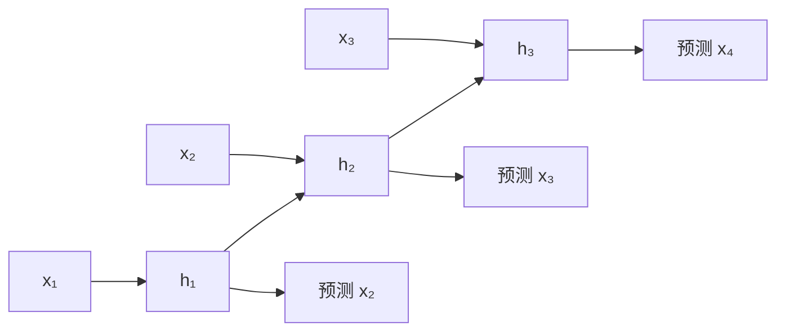

# 第 05 课　语言模型怎样一步步长出来

<div class="lesson-lead">语言模型最核心的工作只有一句话：看到前文，给“下一个 token”分配概率。n-gram、RNN、Transformer 的差别，不是目标变了，而是“怎样利用前文”不断升级。</div>

::: info 本课的三条历史线
本课把 [CS224N Language Models and RNNs](https://web.stanford.edu/class/cs224n/slides_w26/cs224n-2026-lecture04-rnnlm.pdf)、[CMU Autoregressive Language Modeling](https://cmu-l3.github.io/anlp-spring2026/static_files/anlp-s2026-03-lm.pdf)、[CMU Recurrent Neural Networks](https://cmu-l3.github.io/anlp-spring2026/static_files/anlp-s2026-04-rnns.pdf)与 [Stanford CS336 Lecture 1 可执行 Slides](/lectures/?trace=var/traces/lecture_01.json)合并。目标不是背年代，而是看清每代方法怎样表示历史、怎样训练、又卡在哪里，并知道“from scratch”真正要实现哪些组件。

论文沿同一条问题链阅读：[Bengio et al., 2003](https://www.jmlr.org/papers/volume3/bengio03a/bengio03a.pdf)把神经网络用于下一词概率，[On the Difficulty of Training RNNs](https://arxiv.org/pdf/1211.5063.pdf)解释循环网络的优化障碍，[Attention Is All You Need](https://arxiv.org/pdf/1706.03762.pdf)则把“逐步压缩历史”改成“按内容直接读取历史”。
:::

<figure class="teaching-figure">
  
  <figcaption>从左到右：数短语 → 把历史压进循环状态 → 直接按内容读取历史 → 从概率分布中选出下一个 token。</figcaption>
</figure>
<div class="visual-key"><div><b>旧方法在保存什么</b>n-gram 保存局部统计；RNN 保存滚动状态。</div><div><b>Transformer 改了什么</b>当前 token 可以直接读取许多历史位置。</div><div><b>最后一步</b>模型只给概率，解码策略负责作选择。</div></div>

## 1. 先固定一个问题：下一词是什么

假设训练语料里出现很多句子：

> 我喜欢吃苹果。　我喜欢吃面条。　我喜欢读小说。

给出“我喜欢”，模型希望得到类似下面的分布：

| 候选 | 概率 |
|---|---:|
| 吃 | 0.46 |
| 读 | 0.27 |
| 看 | 0.15 |
| 其他 | 0.12 |

模型不是先在脑中写好整段答案。生成时会重复：

1. 根据已有 token 算下一个 token 的概率；
2. 选择一个 token；
3. 把它接到末尾；
4. 用更长的前文再算一次。

这叫**自回归生成**。训练时，正确的下一个 token 已经在数据里，可以同时计算许多位置的误差；推理时，下一个 token 还没出现，只能一个接一个生成。

### 1.1 “下一词预测器”其实定义了整句分布

把句子末尾的 `<EOS>` 也当作一个 token，语言模型定义的是一套对**所有有限序列**归一化的概率：

$$
p(x_1,ldots,x_T,mathrm{EOS})
=\prod_{t=1}^{T+1}p(x_t\mid x_{<t})
$$

`EOS` 很重要。没有它，模型只会说“下一个词是什么”，却没有明确表示“这句话现在结束”的概率。生成过程正是在每一步从条件分布中抽样，直到抽到 `EOS` 或达到长度上限。

同一个分布可以完成三类操作：

| 操作 | 已知什么 | 模型做什么 |
|---|---|---|
| **评分 scoring** | 一整段已有文本 | 把每一步条件概率相乘，或把 log 概率相加 |
| **采样 sampling** | 只有开头或空前缀 | 逐步抽样，得到一条新序列 |
| **条件生成 conditioning** | 提示词、问题或源句前缀 | 固定已知部分，只继续生成后缀 |

所以聊天、代码补全、分类标签生成和条件翻译看起来不同，底层都可以写成“给定前缀，继续分配下一 token 概率”。这也是 [CMU L03 第 3–8 页](https://cmu-l3.github.io/anlp-spring2026/static_files/anlp-s2026-03-lm.pdf#page=3)先讲 distribution、scoring、sampling，再进入训练公式的原因。

### 1.2 链式法则与 Markov 假设不是一回事

链式法则使用全部历史，是一个精确恒等式：

$$
p(x_1,ldots,x_T)=p(x_1)p(x_2\mid x_1)\cdots p(x_T\mid x_{<T})
$$

n-gram 接着才作近似：只保留最近 $n-1$ 个词。RNN 和 Transformer 没有改变链式法则，它们改变的是“怎样把完整历史变成条件概率”。把这两层分开，才能看懂模型演化：**概率分解没有换，历史表示方法在换。**

## 2. 第一代办法：n-gram 像查短语卡片

### 2.1 它怎样工作

bigram 只看前 1 个词，trigram 看前 2 个词。以 trigram 为例：

$$P(w_t\mid w_1,\ldots,w_{t-1})\approx P(w_t\mid w_{t-2},w_{t-1})$$

统计语料中“喜欢 吃 苹果”出现 80 次，“喜欢 吃 面条”出现 20 次，那么：

$$P(\text{苹果}\mid\text{喜欢 吃})=\frac{80}{80+20}=0.8$$

### 2.2 为什么不能把 n 一直增大

- n 小：见过的组合多，但看得太短，容易误解远处信息。
- n 大：上下文更具体，但多数长组合在训练集里从没出现，概率会变成 0。
- 存储量会迅速增加；换一种说法，卡片柜越来越大，却仍不会“理解”没见过的表达。

**平滑**会从常见组合借一点概率给没见过的组合，避免“没见过 = 永远不可能”。但它不能从根本上解决语言的长距离依赖。

### 2.3 为什么“出现次数 ÷ 上下文总次数”恰好是最大似然

固定一个历史 $h=$“喜欢 吃”，设词表候选 $w_i$ 在它后面出现 $c_i$ 次。我们要在 $sum_i p_i=1$ 的约束下，让这些观测的 log 概率最大：

$$
\max_{p_1,ldots,p_V}\sum_i c_i\log p_i
\quad\text{s.t.}\quad\sum_i p_i=1
$$

加入拉格朗日乘子 $lambda$：

$$
\mathcal J=\sum_i c_i\log p_i+\lambda\left(1-\sum_i p_i\right)
$$

对每个 $p_i$ 求导并令其为 0：

$$
\frac{c_i}{p_i}-\lambda=0
\Rightarrow p_i=\frac{c_i}{\lambda}
$$

再用 $sum_i p_i=1$，得到 $lambda=\sum_jc_j$，因此：

$$
\boxed{p_i=\frac{c_i}{\sum_jc_j}}
$$

所以计数公式不是拍脑袋的频率规则；它就是这个上下文下的最大似然解。[CMU L03 第 15–18 页](https://cmu-l3.github.io/anlp-spring2026/static_files/anlp-s2026-03-lm.pdf#page=15)用 bigram 计数导出同一结论。

### 2.4 零概率为什么危险，Add-$\alpha$ 又做了什么

若四个候选“苹果、面条、香蕉、米饭”的计数是 `[80, 20, 0, 0]`，最大似然给出的概率是 `[0.8, 0.2, 0, 0]`。一旦测试句出现“喜欢 吃 香蕉”，整句概率就被一个 0 乘成 0，NLL 变成无穷大。

最简单的 Add-$\alpha$ 平滑为：

$$
p_\alpha(w_i\mid h)=\frac{c(h,w_i)+\alpha}{c(h)+\alpha V}
$$

取 $alpha=1$ 后，四个概率变成 `[81/104, 21/104, 1/104, 1/104]`。它牺牲一点已见事件的概率，给未见事件留下非零质量。真实 n-gram 系统更常用 backoff、interpolation 或 Kneser–Ney，因为“给每个未见词同样一票”过于粗糙；这里的 Add-1 只负责把零概率问题算清楚。

### 2.5 神经前馈语言模型怎样共享统计强度

Bengio 等人不再为每个上下文存一张独立卡片，而是把最近 $n-1$ 个词的 Embedding 拼接后送入同一个网络：

$$
z=[E(w_{t-n+1});\ldots;E(w_{t-1})],\quad
h=\tanh(W_1z+b_1),\quad
p(w_t\mid h)=\operatorname{softmax}(W_2h+b_2)
$$

它有三层共享：

1. `猫` 在所有上下文中复用同一行 Embedding；
2. 不同短语复用同一个隐藏网络 $W_1$，相似上下文可得到相近表示；
3. 输出矩阵 $W_2$ 的每一行学习某个候选词喜欢哪些隐藏特征。

这让“我喜欢吃苹果”和“我爱吃苹果”不再是两张毫无关系的卡片。但上下文窗口仍固定，且把多个位置直接拼接会让输入层随窗口变宽。RNN 的下一步，就是用同一状态更新反复读取任意长度的历史。参见 [CMU L03 第 31–40 页](https://cmu-l3.github.io/anlp-spring2026/static_files/anlp-s2026-03-lm.pdf#page=31)与 [Bengio et al., 2003](https://www.jmlr.org/papers/volume3/bengio03a/bengio03a.pdf)。

## 3. 第二代办法：RNN 像一张不断改写的便签

RNN 每读一个 token，就把旧状态和新输入合成新状态：

$$h_t=f(W_hh_{t-1}+W_xx_t+b)$$

这里 $h_t$ 是“读到当前位置后的摘要”。下一时刻不必携带全部原文，只要携带这张便签。

### 3.1 好在哪里

- 理论上可以处理任意长度，不再固定只看前 n 个词；
- 不同表达能通过向量表示共享规律，而不是每个短语单独计数；
- 同一套参数在每个时间步重复使用。

### 3.2 痛在哪里

1. **必须串行**：第 100 个状态必须等第 99 个算完，训练难并行。
2. **远处信息会被挤掉**：一张便签不断改写，早期细节容易丢。
3. **梯度消失或爆炸**：误差信号沿很长链条反传，可能越来越小或越来越大。

LSTM、GRU 加入“门”，让模型决定哪些内容保留、写入、忘记，缓解了问题，但串行链仍在。

## 4. 第三代办法：Transformer 像带索引的开放书桌

Self-Attention 让当前位置根据内容，从许多历史位置读取信息。它不再强迫所有历史先挤进一张便签：

$$\operatorname{Attention}(Q,K,V)=\operatorname{softmax}\left(\frac{QK^\top}{\sqrt{d}}+M\right)V$$

零基础先只读成三步：

1. **Q 问问题**：我当前需要什么？
2. **K 用来匹配**：历史每个位置和问题有多相关？
3. **V 提供内容**：按相关程度把历史信息加权取回。

$M$ 是因果遮罩：生成式语言模型不能偷看未来答案。训练时每个位置虽然同时计算，但位置 5 仍然只能看位置 1–5。

### 4.1 它赢在哪里，又付出什么

| 方面 | RNN | Transformer |
|---|---|---|
| 训练并行 | 时间步串行 | 训练时可并行处理多个位置 |
| 访问远处信息 | 经很多次状态传递 | Attention 可直接建立联系 |
| 历史表示 | 固定状态 | 保留各位置表示并按需读取 |
| 代价 | 长链难训练 | 标准 Attention 对长度约为 $O(T^2)$ |

这正是 K3 为什么研究 KDA、MLA 和长上下文系统：Transformer 解决了“读远处难”，又带来“历史太长时算力和缓存昂贵”。

## 5. 模型给了概率，怎样选词

### 5.1 五种常见策略

| 策略 | 做法 | 常见效果 | 风险 |
|---|---|---|---|
| Greedy | 每次取概率最大者 | 稳、快 | 局部最优，可能重复和呆板 |
| Beam Search | 同时保留若干条高分序列 | 适合翻译等目标明确任务 | 仍偏爱高概率、常缺少多样性 |
| Top-k | 只在最高的 k 个里抽样 | 易控制候选数 | 分布很尖或很平时，固定 k 不灵活 |
| Top-p | 保留累计概率达到 p 的最小集合 | 随分布动态变化 | p 太低会过于保守 |
| Temperature | 改变概率分布的尖锐程度 | 控制随机性 | 不是“事实正确度”旋钮 |

<SamplingLab />

::: warning 三个旋钮的正确顺序
实现细节因框架而异，但理解时可记作：温度先改变分布形状，Top-k/Top-p 再确定候选集合，最后重新归一化后采样。不要把“温度 0.7”当作所有模型通用的最佳答案。
:::

## 6. 怎样知道一个语言模型好不好

### 6.1 困惑度：它对正确文本有多“意外”

若平均交叉熵为 $L$，困惑度常写成：

$$\mathrm{PPL}=e^L$$

直觉上，PPL 越低，模型对测试文本给出的平均概率越高。但要满足**同一数据、同一切词方式、同一计算口径**才适合比较。不同 tokenizer 会把一句话切成不同数量的 token，PPL 不能直接横比。

### 6.2 任务指标：答案与参考答案有多接近

- **BLEU** 更偏重生成片段是否出现在参考答案中，常用于翻译。
- **ROUGE** 更偏重参考内容有多少被覆盖，常用于摘要。
- **BERTScore** 用语义向量匹配，能容忍不同表述。
- **LLM-as-a-Judge / G-EVAL** 让模型按评分标准评判，更灵活，但会受评委模型偏好、提示、位置和成本影响。

一个指标只能看到一面。聊天系统通常还要看事实性、帮助性、安全性、延迟、成本和真实用户任务成功率。

## 7. 把整条演化线压成一句话

> n-gram 记最近的局部统计；RNN 把历史压进滚动状态；Transformer 让当前位置直接按内容读取历史；解码器再从下一个 token 的概率中作选择。

## 7.1 链式法则把整句话拆成下一词任务

任意序列概率都可以精确写成：

$$
p(x_1,\ldots,x_T)=\prod_{t=1}^{T}p(x_t\mid x_{<t})
$$

这不是 Transformer 的假设，而是概率链式法则。不同模型只是在近似每个条件概率时怎样表示 $x_{<t}$。

最大似然训练等价于最小化负对数似然：

$$
\mathcal L=-\sum_t\log p_\theta(x_t\mid x_{<t})
$$

一段长度为 T 的文本提供约 T 个训练目标，所以无需人工逐句标注也能获得大量监督信号。

但“最大似然为什么合理”还需要再走一步。把训练集的经验分布记作 $p_{data}$，模型分布记作 $p_\theta$：

$$
D_{KL}(p_{data}\|p_\theta)
=\mathbb E_{p_{data}}[\log p_{data}(x)]
-\mathbb E_{p_{data}}[\log p_\theta(x)]
$$

第一项只由数据决定，不随 $	heta$ 变化。因此最小化 $D_{KL}(p_{data}\|p_\theta)$，等价于最大化训练文本在模型下的 log 概率，也等价于最小化 NLL。换句话说，训练不是要求模型复刻某一句话，而是在当前模型族里让整套概率分布尽量贴近数据分布。

实际代码把长乘积改写成 log 之和：

$$
\log p_\theta(x)=\log\prod_t p_\theta(x_t\mid x_{<t})
=\sum_t\log p_\theta(x_t\mid x_{<t})
$$

这是因为几十、几百个小于 1 的浮点数直接相乘很快会下溢成 0，而 log 概率相加稳定得多。[CMU L03 第 19–26 页](https://cmu-l3.github.io/anlp-spring2026/static_files/anlp-s2026-03-lm.pdf#page=19)完整串起了 KL、最大似然、log space、NLL 与 PPL。

<figure class="teaching-figure concept-figure"><figcaption>一条训练链分成三层理解：链式法则把整句拆开；最大似然把模型分布拉向经验分布；BPTT 再把各时间位置的误差信号累加回共享参数。</figcaption></figure>

## 7.2 RNN 为什么同一套参数可以处理任意长度

RNN 在每个时间步重复使用 $W_h,W_x$：



把网络沿时间展开后像很深的前馈网络，但参数共享。优点是长度不改变参数量；代价是计算与梯度都必须沿链传播。

若总损失为 $\mathcal L=\sum_t\mathcal L_t$，共享循环矩阵 $W_h$ 在展开图里虽然画了很多次，代码中却只有一份。因此它收到的是每个出现位置贡献之和：

$$
\frac{\partial\mathcal L}{\partial W_h}
=\sum_t\frac{\partial\mathcal L_t}{\partial W_h}
$$

而某个晚期损失要影响 $k$ 步前的状态，需要穿过一串 Jacobian：

$$
\frac{\partial h_t}{\partial h_{t-k}}
=\prod_{j=t-k+1}^{t}\frac{\partial h_j}{\partial h_{j-1}}
$$

若沿某个方向每步大约乘 $|\lambda|<1$，走 $k$ 步后变成 $|\lambda|^k$，梯度消失；若 $|\lambda|>1$，则可能爆炸。这不是一句“序列长所以难”，而是连乘带来的指数级数量差异。[CS224N L04 第 33–43 页](https://web.stanford.edu/class/cs224n/slides_w26/cs224n-2026-lecture04-rnnlm.pdf#page=33)先画共享权重的梯度求和，再逐步展开这条乘法链。

**Truncated BPTT** 只让梯度反传最近 $K$ 步，并把更早状态 `detach`：它减少显存和训练时长，却也明确切断了超过 $K$ 步的直接信用分配。前向状态仍可以携带旧信息，“梯度能不能回去”和“状态能不能向前走”是两件事。

梯度爆炸通常用范数裁剪：

$$
g\leftarrow g\cdot\min\left(1,\frac{c}{\lVert g\rVert}\right)
$$

当 $\lVert g\rVert>c$ 时，向量方向不变，只把长度缩到 $c$；当梯度已经接近 0 时，公式什么也不会放大。因此**裁剪能治爆炸，不能治消失**。后者需要更好的初始化、归一化、残差/门控路径或完全不同的序列架构。参见 [On the Difficulty of Training RNNs](https://arxiv.org/pdf/1211.5063.pdf)。

<RecurrentGradientLab />

### PyTorch：一个最小 RNN 语言模型

```python
import torch
import torch.nn as nn

class TinyRNNLM(nn.Module):
    def __init__(self, vocab_size=100, hidden=32):
        super().__init__()
        self.embedding = nn.Embedding(vocab_size, hidden)
        self.rnn = nn.RNN(hidden, hidden, batch_first=True)
        self.output = nn.Linear(hidden, vocab_size)

    def forward(self, token_ids):
        x = self.embedding(token_ids)  # [B, T] -> [B, T, H]
        states, _ = self.rnn(x)        # 每步复用同一组 RNN 参数
        return self.output(states)     # [B, T, V]

model = TinyRNNLM()
tokens = torch.tensor([[5, 9, 2, 7]])
logits = model(tokens[:, :-1])         # 输入 5, 9, 2
targets = tokens[:, 1:]                # 目标 9, 2, 7
loss = nn.functional.cross_entropy(
    logits.reshape(-1, 100), targets.reshape(-1)
)
print(logits.shape, loss.item())       # [1, 3, 100]
```

`tokens[:, :-1]` 与 `tokens[:, 1:]` 是 next-token 训练最重要的一格错位：每个位置用当前及之前的历史预测下一格。把 `nn.RNN` 换成许多 causal Transformer blocks，训练目标仍然相同。

## 7.3 LSTM 的门在控制什么

LSTM 引入 cell state $c_t$ 与三类门：

- forget gate：旧记忆保留多少；
- input gate：新候选写入多少；
- output gate：当前向外暴露多少。

核心更新可读成：

$$
c_t=f_t\odot c_{t-1}+i_t\odot\tilde c_t
$$

第一项保旧信息，第二项写新信息。加法路径让梯度更容易跨长距离，不必每步都经过同一种非线性乘法。但状态宽度固定，仍可能把很多事实挤在一起。

更精确地看，若某个维度的 forget gate $f_t\approx1$，沿 cell state 的局部导数近似：

$$
\frac{\partial c_t}{\partial c_{t-1}}\approx f_t\approx1
$$

信号可以沿加法主干跨过更多时间步。GRU 的 $h_t=(1-z_t)h_{t-1}+z_t\tilde h_t$ 也有类似直觉：当更新门 $z_t$ 很小时，状态主要复制旧值。注意“更容易”不等于“永不消失”；门值本身由数据学习，饱和、状态容量和串行计算仍是限制。[CMU L04 第 35–40 页](https://cmu-l3.github.io/anlp-spring2026/static_files/anlp-s2026-04-rnns.pdf#page=35)把普通 RNN 的乘法路径与这种加法门控路径并排展示。

## 7.4 Encoder–Decoder RNN 为什么先出现 Attention

早期机器翻译把整句源语言压成最终状态，再由 Decoder 生成目标句。长句成为信息瓶颈。Attention 最初让 Decoder 每一步直接加权读取所有 Encoder 状态，而不是只依赖一个最终向量。

这条演化线是：

```text
固定最终状态 → 对全部源位置做 Attention → Self-Attention 替代循环 → Transformer
```

因此 Attention 并非突然从语言模型中凭空出现，它先解决序列到序列模型的固定瓶颈。

## 7.5 Teacher Forcing 与 Exposure Bias

训练时第 $t$ 步输入是真实前缀，推理时输入包含模型自己生成的 token：

```text
训练：正确 → 正确 → 正确 → 预测
推理：正确 → 模型错误 → 基于错误继续预测
```

这叫 exposure bias。Scheduled sampling 曾尝试在训练中混入模型输出，但会改变目标且带来不稳定；现代 LLM 预训练仍主要使用 teacher forcing，再通过更大数据、后训练、on-policy RL/蒸馏与外部验证减少部署错位。

## 7.6 PPL 的“等效候选数”只是直觉

若平均 loss 为 $L$，PPL=$e^L$。可以粗略理解为模型在每步像在 $e^L$ 个等概率候选间犹豫；真实分布并不均匀，所以不要把 PPL=10 解释为每步正好有 10 个词可选。

对一个包含 $M$ 个被预测 token 的语料，更完整的写法是：

$$
\mathrm{NLL}_{token}=-\frac{1}{M}\sum_{m=1}^{M}\log p_\theta(x_m\mid x_{<m}),
\qquad
\mathrm{PPL}=\exp(\mathrm{NLL}_{token})
$$

若 log 使用自然底数，指数用 $e$；若用 $log_2$，则对应 $2^{\text{cross-entropy}}$。关键不是底数，而是分母究竟按 token、word、byte 还是 character 归一化。

比较 PPL 必须固定 tokenizer、数据和按 token/byte/word 的归一化口径。多语言场景中 byte-normalized loss 有时比 token PPL 更可比。

## 8. 常见误区

- **“概率最高就是真相。”** 概率表示模型偏好，不等于事实验证。
- **“随机性越低越聪明。”** 低温更稳定，但不能修复缺失或错误知识。
- **“Transformer 一次写完整段。”** 自回归模型仍逐 token 生成。
- **“训练和聊天计算完全一样。”** 训练有完整正确序列，可并行；推理依赖刚生成的 token。

<ConceptCheck question="模型给出下一个 token 的概率后，Top-p 做了什么？" :options="['把模型参数缩小到 p 倍','保留累计概率达到 p 的最小候选集合','固定只保留 p 个词']" :answer="1" explanation="Top-p 的候选数量会随概率分布变化；这正是它与固定 Top-k 的核心区别。" />

## 9. 你已经学会了吗

请合上页面回答：

1. 为什么 n-gram 的 n 变大不等于无限接近真正理解？
2. RNN 的“固定便签”解决了什么，又丢失了什么？
3. 为什么低 PPL 不能自动保证聊天回答事实正确？
4. Temperature、Top-k、Top-p 分别改变什么？

接下来先进入[第 06 课 Attention](/beginner/04-attention)与[第 07 课完整 Transformer](/beginner/05-transformer)，再用第 08–10 课比较 BERT、T5/BART、GPT/LLaMA/SSM，最后在[第 11 课架构全景](/beginner/13-architectures)把这些路线放回同一张地图。

> 本课对应原书第 1 章（PDF 第 8–39 页），并补充了适合初学者的统一例子、比较边界与交互实验。

<ChapterReadings lesson="10-language-models" />
