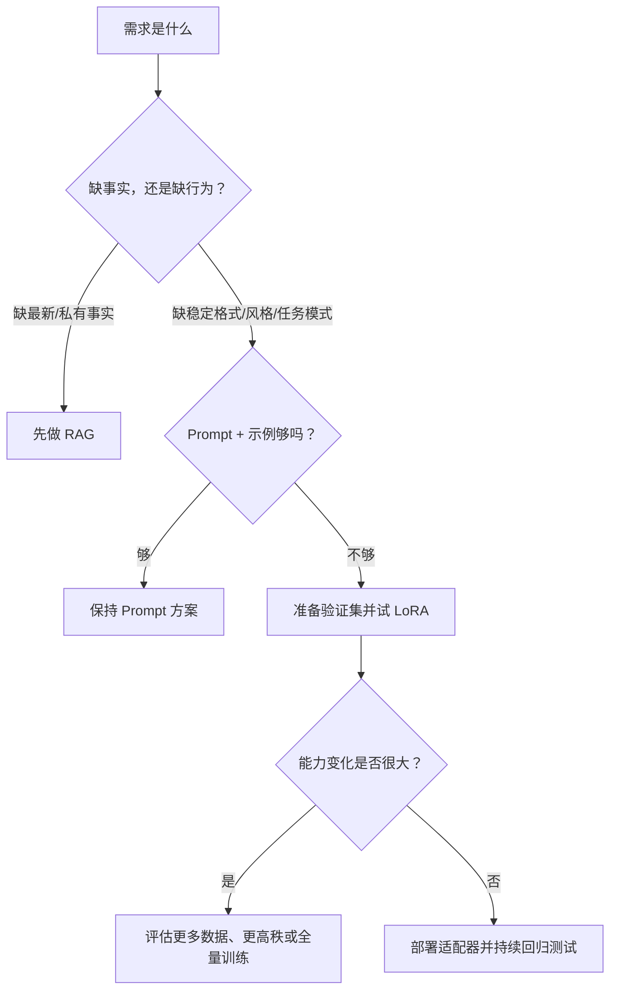

# 第 20 课　参数高效微调全景

<div class="lesson-lead">一个几十亿参数的模型，完整微调不只要保存参数，还要保存梯度和优化器状态。PEFT 的目标是：冻结大部分底座，只训练一小部分“任务差值”。</div>

::: info 本课资料地图：先看全景，再进入 LoRA 数学
- 方法总览与 Prompt/Adapter/LoRA 对照：[CS224N · Efficient Adaptation Slides](https://web.stanford.edu/class/cs224n/slides_w26/cs224n-2026-lecture09-peft.pdf)；
- 微调、蒸馏与指令数据：[CMU ANLP · Fine-tuning and Distillation](https://cmu-l3.github.io/anlp-spring2026/static_files/anlp-s2026-08-finetuning.pdf)；
- 中文图解与训练实践：[台大 ADL · LLM Adaptation](https://www.csie.ntu.edu.tw/~miulab/f114-adl/doc/250922_Adaptation.pdf)；
- 原论文：[Adapter](https://arxiv.org/pdf/1902.00751.pdf)、[LoRA](https://arxiv.org/pdf/2106.09685.pdf)、[QLoRA](https://arxiv.org/pdf/2305.14314.pdf)。

这一课比较“把少量可训练参数放在哪里”；下一课才把 LoRA 的矩阵、初始化、显存与部署写成代码。
:::

<figure class="teaching-figure">
  
  <figcaption>LoRA 不拆掉整面墙重建，而是在旁边学习两块很薄的修正板；部署时还可以把修正合回原矩阵。</figcaption>
</figure>
<div class="visual-key"><div><b>冻结底座</b>原模型权重 W 不更新。</div><div><b>学习低秩差值</b>只训练小矩阵 A 与 B。</div><div><b>合成输出</b>原能力加上任务方向的修正。</div></div>

## 1. 为什么全量微调这么贵

假设模型有 7B（70 亿）参数。仅用 16-bit 保存参数，大约是 14 GB；训练时还可能需要：

- 同规模梯度；
- 优化器的一阶、二阶状态，常用更高精度；
- 前向传播中为了反向计算而保留的激活；
- 分布式通信和临时缓冲。

所以“模型能放进显卡”不等于“能全量训练”。而一个任务未必需要重写每个参数。

## 2. PEFT 是一组方法，不等于 LoRA

<figure class="teaching-figure concept-figure"><figcaption>四种方法都尽量不动底座，但插入位置不同：输入前、每层注意力、层间插件或权重低秩支路。</figcaption></figure>

Parameter-Efficient Fine-Tuning（参数高效微调）常见三类：

| 思路 | 训练什么 | 代表方法 |
|---|---|---|
| 增加少量参数 | 在输入、层间或注意力旁加入可训练模块 | Soft Prompt、Prefix、Adapter |
| 选择少量原参数 | 只更新偏置或特定层 | BitFit、部分层微调 |
| 低秩重参数化 | 用小矩阵表示权重变化 | LoRA 及其变体 |

**Hard Prompt** 是人写的离散 token，不训练参数；**Soft Prompt** 是可训练向量；**SFT** 描述用监督样本训练的阶段，既可以全量，也可以用 LoRA。它们不是同一维度的概念。

### 2.1 加在输入：Prompt Tuning

在真实 token embedding 前拼接若干可训练“虚拟 token”。底座冻结，梯度只更新这些向量。参数极少，但它们通常不能直接翻译成人类可读文字；模型越大、任务越接近底座能力时往往越有效。

```text
[可训练向量 1..m] + [真实输入 token] → 冻结模型 → 输出
```

### 2.2 加在每层：Prefix Tuning

不只在输入层加向量，而是为多层 Attention 提供可训练的前缀 K/V。模型每层都能读取任务前缀，表达力更强；代价是每个任务增加 KV 长度，并需要正确管理层数和维度。

### 2.3 加在模型中间：Adapter

在 Transformer 子层旁插入瓶颈模块：

$$h'=h+W_{up}\sigma(W_{down}h)$$

$W_{down}$ 先降维，非线性后再升维。残差保证初始时可以接近恒等映射。Adapter 模块化清楚，但每层增加额外顺序计算，可能影响推理延迟。

### 2.4 加在输出：任务头与可训练输出模块

分类任务可以只训练最后的线性头。它最便宜，但底座表示必须已经足够分离目标类别；复杂生成行为只改输出头通常不够。

### 2.5 只选一部分原参数

- 规则选择：只更新 bias、LayerNorm 或最后几层；
- 学习选择：训练掩码或重要性分数，找出需要更新的参数；
- 稀疏差值：只保存少量非零权重变化。

它们不增加独立支路，但参数选择和跨任务管理可能更复杂。

## 3. LoRA 的核心式子

普通线性层：

$$y=Wx$$

LoRA 冻结 $W$，只学习权重变化 $\Delta W$。假设有用变化集中在少数方向，用两个窄矩阵近似：

$$W'=W+\Delta W,\qquad \Delta W=\frac{\alpha}{r}BA$$

$$y=Wx+\frac{\alpha}{r}BAx$$

- $r$ 是秩，通常远小于输入和输出维度；
- $A$ 先把高维输入压到 $r$ 维；
- $B$ 再把 $r$ 维展开回输出维度；
- $\alpha/r$ 控制修正强度。

### 3.1 参数量手算

若原矩阵 $W$ 是 $4096\times4096$：

- 原参数：$4096\times4096\approx 16.78$M；
- 取 $r=8$，LoRA 参数：$8\times4096+4096\times8=65,536$；
- 约是原矩阵的 $0.39\%$。

一般情况下，可训练参数比例为：

$$
\rho=\frac{N_{lora}}{N_{full}}
=\frac{r(d_{in}+d_{out})}{d_{in}d_{out}}
$$

当 $d_{in}=d_{out}=d$ 时，$\rho=2r/d$。这说明在隐藏维度很大而 $r$ 很小时，比例会很低；但它只核算该矩阵的权重数量，不含激活、临时张量与底座前向成本。

这不表示整个训练显存精确降到 0.39%：激活、底座推理、其他层和框架开销仍在。但可训练权重、梯度与优化器状态会显著减少。

## 4. 为什么“低秩”可能够用

底座已经学会语言、常识和大量通用模式。新任务通常不是从零创造全部能力，而是让模型沿少数方向调整：采用特定风格、遵循特殊格式、掌握一个垂域模式。

把它想成摄影调色：不是重新拍摄每个像素，而是调整少量全局和局部色彩方向。这个假设不总成立；任务越远离底座能力，可能需要更高秩、更多目标层、更好数据，甚至全量微调。

## 5. LoRA 放在哪些层

常见目标包括 Attention 的 Q/K/V/O 投影和 FFN 线性层。不是放得越多越好：

- 只放 Q/V：参数更少，经典设置常见；
- 放 Q/K/V/O：表达力更强，成本略高；
- 再放 FFN：适配容量进一步增加；
- 不同任务、模型和数据需要验证。

训练结束后，LoRA 可以作为独立适配器加载，也可以把 $BA$ 合并进 $W$，从而避免额外分支带来的推理开销。多个适配器共享同一底座也便于服务多个任务。

## 6. Adapter、Prefix、LoRA 的直觉区别

| 方法 | 像什么 | 优点 | 注意 |
|---|---|---|---|
| Adapter | 每层旁边接一个小插件 | 模块化、任务切换清楚 | 推理增加额外层路径 |
| Prefix/Prompt Tuning | 给每层或输入加可训练提示向量 | 参数极少 | 小模型或复杂任务效果可能受限 |
| LoRA | 给权重变化加低秩支路 | 通用、易合并、生态成熟 | 秩与目标层需要调节 |

选择时不要只比“可训练参数百分比”。还要比较训练激活、推理额外路径、每任务存储、批次内切换、量化兼容和最终质量。

## 7. QLoRA 又做了什么

QLoRA 的“Q”是量化底座：把冻结的基础模型以更低位宽存储和计算，同时用 LoRA 训练高精度适配参数。核心分工：

```text
量化：减少冻结底座的显存
LoRA：减少需要训练的参数和优化器状态
```

量化会引入近似误差；不同硬件、算子、序列长度与批量会影响实际速度。QLoRA 主要保证训练可行性，不等于任何场景都更快。

## 8. 什么时候不该先上 LoRA

- 只是希望模型知道最新公司制度：优先 RAG；
- 只有几条样本：先写好 Prompt 和验证集；
- 要精确修改单条事实：考虑外部记忆或模型编辑；
- 任务需要大幅改变底层能力且有充足资源：评估全量微调或继续预训练；
- 数据含隐私、错误标签或危险行为：先解决数据与评测，不要用训练掩盖。

## 9. 一个最小训练决策流程



## 10. 训练后要测什么

至少保留三套数据：

1. 训练分布内：是否学会目标任务；
2. 边界与反例：是否只记模板、遇到歧义就崩；
3. 通用回归集：原本会的问答、拒答、安全能力有没有退化。

只看训练 loss 下降，无法证明适配器在真实任务上有用。

<ConceptCheck question="LoRA 训练时，最典型的做法是什么？" :options="['删除基础模型，只保留 A 和 B','冻结原矩阵 W，训练低秩矩阵 A 和 B','把每个 token 减少到两个字符']" :answer="1" explanation="LoRA 用 BA 表示小型权重增量，原矩阵通常冻结；推理时可保留支路或合并。" />

> 本课对应原书第 4 章（PDF 第 158–191 页），并加入参数手算、方法选择和训练后回归评测。

<ChapterReadings lesson="19-peft" />
