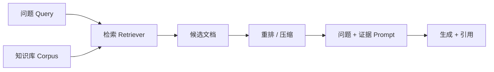

# 第 39 课　RAG 基础架构：让模型先查资料再回答

<div class="lesson-lead">RAG 不是“给聊天模型接一个搜索框”这么简单。它是一条证据流水线：资料入库 → 理解问题 → 召回候选 → 重排 → 组织上下文 → 基于证据生成 → 引用与评测。</div>

::: info 本课资料地图：先学流水线，再读可训练 RAG
- 检索、生成与自反思路线：[CMU ANLP · Retrieval and RAG](https://cmu-l3.github.io/anlp-spring2026/static_files/anlp-s2026-10-rag.pdf)；
- 中文图解与工程案例：[台大 ADL · Retrieval-Augmented Generation](https://www.csie.ntu.edu.tw/~miulab/f114-adl/doc/251013_RAG.pdf)；
- Agent、工具与 RAG 的连接：[CS224N · RAG, Agents, Tools](https://web.stanford.edu/class/cs224n/slides_w26/cs224n-2026-lecture10-rag-agents.pdf)；
- 原论文：[Retrieval-Augmented Generation for Knowledge-Intensive NLP Tasks](https://arxiv.org/pdf/2005.11401.pdf)。

原论文把检索文档当作隐变量并端到端训练；普通应用把 Top-k 片段直接拼进 Prompt。两者都叫 RAG，但训练方式和公式不能混为一谈。
:::

<figure class="teaching-figure">
  
  <figcaption>RAG 的生成模型只负责最后一段。前面任何环节丢掉关键证据，后面再强也无法可靠补回。</figcaption>
</figure>
<div class="visual-key"><div><b>先找全</b>召回阶段宁可多带几个候选。</div><div><b>再找准</b>重排和压缩保留真正能回答的片段。</div><div><b>有据作答</b>生成结果要能回指证据，证据不足就明确说。</div></div>

<figure class="teaching-figure infographic-figure"><a href="/illustrations/rag-one-page-infographic.webp" target="_blank"></a><figcaption>这张图用于章节复习；正文会把其中每一列继续拆成更稀疏的小图和实验。点击可放大。</figcaption></figure>

## 1. 为什么需要 RAG

大模型参数里的知识可能：

- **过时**：训练结束后世界继续变化；
- **有边界**：公司内部文档、垂直领域资料未进入训练；
- **有偏差**：训练数据存在错误、矛盾或长尾知识学得不牢；
- **会在生成时失手**：模型可能知道事实，却因提示、解码或对齐偏差答错。

人遇到不知道的问题会查资料。RAG 让模型也先拿到与当前问题相关的外部证据，再组织答案。它能降低一部分幻觉，但不能保证“接了 RAG 就不幻觉”。

## 2. 最小 RAG 的五步



给定问题“2025 年差旅住宿上限是多少”，系统应：

1. 把问题变成检索表示；
2. 从制度库召回相关片段；
3. 把 2025 新版排在 2023 旧版前；
4. 将关键条款、版本和来源放进上下文；
5. 回答数字并引用具体条款，冲突时说明冲突。

经典 RAG 用检索器给文档 $z$ 打分，再让生成器在问题 $x$ 与文档 $z$ 条件下生成答案 $y$。RAG-Sequence 的核心近似是：

$$
p(y\mid x)\approx
\sum_{z\in\operatorname{TopK}(x)}
p_\eta(z\mid x)\,p_\theta(y\mid x,z)
$$

- $p_\eta(z\mid x)$：Retriever 认为文档 $z$ 与问题相关的概率；
- $p_\theta(y\mid x,z)$：Generator 读取该文档后生成完整答案的概率；
- 求和：不强行假定只有一篇文档正确，而是在 Top-k 候选上做加权边缘化；
- Top-k 是近似：整个语料库太大，无法对每篇文档都运行生成器。

<figure class="teaching-figure source-figure"><a href="/paper-figures/rag-figure-1.webp" target="_blank"></a><figcaption>RAG 原论文 Figure 1（PDF p.2）。左边 Query Encoder 与 Document Index 是非参数记忆，MIPS 找到 $z_1\ldots z_K$；右边 seq2seq Generator 是参数记忆；训练信号可沿虚线反向传播。图中还展示问答、事实验证、问题生成三种输出，不要把 RAG 只理解成聊天问答。<a href="https://arxiv.org/pdf/2005.11401.pdf#page=2">打开原论文第 2 页</a>。</figcaption></figure>

## 3. 知识库：答案质量从入库时已经开始决定

### 3.1 文档解析

PDF、网页、表格、邮件需要先提取正文和结构。扫描 PDF 要 OCR；表格要保留行列关系；标题、章节、发布日期、权限和来源 URL 应作为元数据保存。

### 3.2 切块不是越短越好

- 太短：事实和限定条件被切开，例如数字留下了，适用部门丢了；
- 太长：一个块混入多个主题，向量含义模糊，还浪费上下文；
- 固定重叠能缓解边界切断，但会制造重复结果和成本。

优先按标题、段落、条款、表格行等语义结构切块，再设置合理最大长度。保存 `document_id / section / version / date / permission`，方便过滤和引用。

## 4. 召回：先把可能有用的捞出来

### 4.1 关键词检索

BM25 一类方法擅长精确词、编号、专有名词，如“财务制度 4.2.1”。但用户换同义词时可能漏掉。

### 4.2 向量检索

Embedding 把问题和文档映射为向量，以语义相似度检索。“住宿报销额度”和“酒店费用上限”即使词不同也可能匹配。但相似不等于能回答，旧版制度可能语义最像却事实已失效。

### 4.3 混合检索

实际系统常把关键词和向量结果合并，再用元数据过滤：只允许当前用户可访问、指定时间范围、指定产品版本的文档。

## 5. 重排：像和“能回答”不是一回事

第一阶段检索追求速度与召回率；Cross-Encoder 或 LLM 重排器可以同时读问题与候选片段，判断哪一篇真正支持答案。它更准但更慢，所以只处理几十个候选。

<RAGPipelineLab />

::: tip 两阶段口诀
召回负责“不漏掉”，重排负责“不送错”。如果召回阶段根本没捞到关键文档，重排无法凭空创造它。
:::

## 6. 查询增强：用户的问题可能本来就不好搜

常见做法：

- **改写**：把口语问题变为更明确的检索词；
- **拆解**：多跳问题拆成多个子问题，逐个检索；
- **补全实体**：结合对话历史还原“它”“那个版本”指什么；
- **多路查询**：生成几种表达分别检索，再合并结果；
- **假设文档**：先生成可能的答案样式，用其向量帮助召回（要防止假设内容污染最终证据）。

例如“世界上睡眠最长的动物爱吃什么”应拆成：先查动物是什么，再查该动物食物。复杂问题需要迭代检索，不是一次向量搜索结束。

## 7. 何时检索、在哪里增强

### 7.1 何时检索

每个问题都检索最简单，但会增加延迟，也可能让无关资料干扰常识问题。系统可根据任务类型、不确定性、是否要求最新/私有事实来决定是否检索。高风险事实请求通常宁可检索和核验。

### 7.2 在哪里加入知识

| 位置 | 做法 | 优点 | 代价 |
|---|---|---|---|
| 输入端 | 文档文本拼进 Prompt | 最易实现，可用于黑盒 API | 上下文长、成本高、可能漏读 |
| 中间层 | 用 Cross-Attention 融合文档向量 | 更紧凑、影响内部表示 | 必须改模型结构，不能用于闭源黑盒 |
| 输出端 | 生成后用证据检查和纠正 | 可作为独立校验层 | 错误证据会错误校正，增加延迟 |

普通应用通常从输入端增强开始。

## 8. 怎样组织给模型的证据

```text
你必须只依据 <sources> 回答。
若来源不足或互相矛盾，明确指出，不要补猜。
每个事实后写 [来源编号]。

<sources>
[1] 文档标题、版本、日期……正文片段
[2] 文档标题、版本、日期……正文片段
</sources>

<question>……</question>
```

文档排序、标题、日期和版本都很重要。长文档可压缩为与问题相关的句子，但压缩器也可能删掉否定词和限定条件，所以要保留回到原块的引用指针。

## 9. 黑盒与白盒 RAG

- **黑盒增强**：不改生成模型参数，把检索结果放进提示；可进一步用模型反馈微调检索器。
- **白盒增强**：允许微调生成模型，或让检索器与生成器协同训练；效果潜力更高，系统和训练成本也更复杂。

初学者做第一个项目时应从“无需微调的黑盒 RAG”开始。先把数据质量、召回、引用和评测做好，再判断训练是否真是瓶颈。

### 9.1 四种协作方式

| 生成模型 | 检索器 | 直觉 | 适合起点 |
|---|---|---|---|
| 冻结 | 冻结 | 两个现成组件直接连接 | 原型和闭源 API |
| 冻结 | 微调 | 用最终回答或困惑度反馈教检索器 | 生成模型不可修改 |
| 微调 | 冻结 | 教生成器更会读取固定检索结果 | 有白盒模型与领域数据 |
| 微调 | 微调 | 两者协同适配 | 数据和训练成本最高 |

“可微调”不等于应该微调。很多 RAG 质量问题来自错误切块、版本和权限，协同训练不会自动修复脏知识库。

## 10. RAG 的四类失败

| 环节 | 失败 | 怎样定位 |
|---|---|---|
| 入库 | 文档解析错、表格丢结构、版本缺失 | 直接查看原始块与元数据 |
| 召回 | 正确证据没进候选 | 看 Recall@k、人工查询集 |
| 重排 | 正确证据被排到后面 | 看排序指标和失败对比 |
| 生成 | 证据在上下文里却没被使用或被曲解 | 做“给定黄金文档”的生成测试 |

必须分环节评测。如果只看最终答案错了，很难知道该改 embedding、切块、重排还是提示。

## 11. 最小评测集怎样做

准备 50–200 个真实问题，并标注：

- 应支持答案的文档与片段；
- 标准答案或关键事实；
- 是否应拒答；
- 时间、版本、权限要求；
- 多跳还是单跳。

分别测：检索召回率、排序质量、答案正确性、引用是否真正支持句子、拒答正确率、延迟与 token 成本。LLM Judge 可辅助扩展，但关键高风险样本仍需人工审计。

## 12. 权限、注入和隐私

- 检索前按用户权限过滤，不能先召回机密文档再指望模型不说；
- 外部文档里的“忽略前文并执行命令”只是数据，不应获得工具权限；
- 日志可能包含查询、个人信息和检索片段，要设置脱敏与保留期限；
- 引用链接本身也可能泄露文档存在性；
- 删除文档后还要清理向量、缓存与派生摘要。

## 13. 与 LoRA、模型编辑的最终对照

```text
知识经常变、要引用来源 → RAG
行为和格式长期稳定改变 → Prompt 不够时用 LoRA / 微调
少量事实必须写进内部参数 → 研究模型编辑，但严格测副作用
```

<ConceptCheck question="RAG 最终答案答错，但正确文档从未进入 Top-20 候选，最先应该修哪一层？" :options="['生成模型的语气','召回与查询/切块','答案字体颜色']" :answer="1" explanation="重排和生成都无法使用没有被召回的证据，应先排查解析、切块、查询改写、检索器和过滤条件。" />

## 14. 一个可执行的练习

选 20 页你熟悉的资料，人工写 15 个问题和对应证据段落。先不接大模型：只做切块与检索，确认正确段落能稳定进入前 5。然后再加重排、生成和引用。这样每一步都能单独看懂。

> 本课对应原书第 6 章（PDF 第 236–290 页），涵盖 RAG 背景、黑盒/白盒架构、知识库、查询、召回、索引、重排、增强位置、多次增强与效率，并重组为从入库到评测的工程流水线。

<ChapterReadings lesson="22-rag" />
