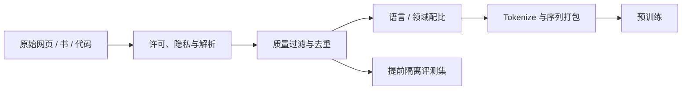

# 第 14 课　Scaling：参数、数据与算力怎样配平

<div class="lesson-lead">先从架构图里把参数量一笔一笔算出来，再把有限算力分给“更大的模型”和“更多的训练 token”。这才是 Scaling 的核心问题：不是单独追求某个数字最大，而是在参数、数据和算力之间找到更合适的配平方案。</div>

<figure class="teaching-figure"><figcaption>Scaling 不是只放大参数。模型大小、训练 token、计算量和上下文长度要一起分配。</figcaption></figure>

::: info 这节课吸收了哪些名校内容
本课把 [CS224N Pretraining](https://web.stanford.edu/class/cs224n/slides_w26/cs224n-2026-lecture07-pretraining.pdf)、[CMU Pretraining](https://cmu-l3.github.io/anlp-spring2026/static_files/anlp-s2026-06-pretraining.pdf)、[CMU Scaling Laws](https://cmu-l3.github.io/anlp-spring2026/static_files/anlp-s2026-07-pretraining2-prompting.pdf) 与 Stanford CS336 的 [Lecture 2：Resource Accounting](/lectures/?trace=var/traces/lecture_02.json)、[Lecture 3：Architecture and Hyperparameters](https://stanford-cs336.github.io/spring2026/)、[Lecture 9：Scaling Laws](https://stanford-cs336.github.io/spring2026/) 合并为一条“架构参数 → 内存 → 训练计算 → 数据配比”的流水线。原论文使用 [Scaling Laws for Neural Language Models](https://arxiv.org/pdf/2001.08361.pdf)、[Chinchilla](https://arxiv.org/pdf/2203.15556) 和 [FineWeb](https://arxiv.org/pdf/2406.17557.pdf)。
:::

## 1. 预训练到底在做什么

给定 token 序列 $x_1,\ldots,x_T$，Decoder-only 模型最常见的目标是最小化：

$$
\mathcal L=-\sum_{t=1}^{T}\log p(x_t\mid x_{<t})
$$

这条式子只说“预测下一个 token”，没有保证事实正确、服从指令或安全。模型之所以学到语法、知识和一些推理模式，是因为要在海量语境里持续降低预测误差。后面的 SFT、RL 和 RAG 是在这个底座上补不同能力。

## 2. 一条训练样本怎样进入模型

1. **收集**：网页、书籍、代码、论文、对话和领域数据；
2. **许可与隐私检查**：确认来源、用途和敏感信息处理；
3. **解析**：从 HTML、PDF、代码仓库中恢复正文与结构；
4. **语言与质量分类**：去掉乱码、模板页、机器垃圾和低信息文本；
5. **去重**：文档级、段落级和近似去重，减少死记与污染；
6. **混合配比**：决定中文、英文、代码、数学、科学等各占多少；
7. **分词与打包**：转成 token，并把短文档高效装进固定长度序列；
8. **留出评测集**：在训练前隔离，不能边训练边偷看。



::: warning 数据多不等于数据好
重复 100 次的低质量页面既浪费算力，又会放大偏见。高质量小领域如果占比过高，也可能让模型失去通用能力。配比必须通过消融实验验证。
:::

## 3. 参数量不是模型名：先把 N 算出来 {#parameter-count}

当别人说“这是一个 7B 模型”，`7B` 指约 70 亿个可训练数字。它不是一个手工填写的标签，而是把模型里每张权重矩阵的格子数相加得到的结果。

先记住唯一规则：

> 一个形状为“行数 × 列数”的矩阵，参数量就是行数 × 列数。没有第三件事。

<figure class="teaching-figure concept-figure"><figcaption>先数入口和出口，再数一个 Block，最后乘层数。图中 <code>m=2</code> 表示普通 FFN 的两个矩阵，<code>m=3</code> 表示 SwiGLU 的门、上投影和下投影三个矩阵。</figcaption></figure>

### 3.1 先认识六个旋钮

| 符号 | 中文 | 它决定什么 |
|---|---|---|
| $V$ | 词表大小 | Embedding 有多少行；例如 32,000 个 token |
| $d$ | 隐藏维度 / `d_model` | 每个 token 的向量有多宽；也是残差流宽度 |
| $L$ | Block 数 | 同一套 Attention + FFN 结构重复多少次 |
| $h$ | Query head 数 | 把 $d$ 维切成多少个头；通常每头维度 $d_h=d/h$ |
| $h_{kv}$ | KV head 数 | MHA 中等于 $h$；GQA 中小于 $h$ |
| $d_{ff}$ | FFN 中间维度 | FFN 先把 $d$ 维扩到多宽，再压回来 |

它们不是六个互不相干的数字。CS336 Lecture 3 总结的常见经验是：普通 FFN 常取 $d_{ff}\approx4d$；SwiGLU 多一个矩阵，为保持近似参数预算常取约 $\frac{8}{3}d$；并且通常满足“每头维度 × 头数 = 模型维度”。这些是常见起点，不是物理定律。

### 3.2 Embedding：词表的每个 token 都有一行

Token Embedding 是 $V\times d$：词表里有 $V$ 个 token，每个 token 存一个 $d$ 维向量，所以参数量是：

$$
N_{embed}=Vd
$$

模型最后还要把 $d$ 维隐藏向量变成 $V$ 个词表分数，LM Head 通常也是 $d\times V$，再花 $Vd$。如果输入 Embedding 与输出 LM Head **权重共享**，两处用同一张表，就只计算一次：

$$
N_{入口+出口}=\begin{cases}2Vd,&\text{不共享}\\Vd,&\text{共享}\end{cases}
$$

### 3.3 Attention：为什么多头不能再乘一次 head 数

普通 Multi-Head Attention 有 Q、K、V、O 四张投影矩阵。若 $h$ 个 head 合起来仍是 $d$ 维，每张矩阵都是 $d\times d$：

$$
N_{attn}=d^2+d^2+d^2+d^2=4d^2
$$

最常见的错误是看到 $h$ 个头，再把 $4d^2$ 乘 $h$。实际上每个头只有 $d/h$ 维，$h\times(d/h)=d$；多头只是把同一份输出宽度重新分组，没有凭空复制 $h$ 份完整矩阵。

GQA 则真的会改变参数量。令 KV 总宽度：

$$
d_{kv}=d\frac{h_{kv}}{h}
$$

Q 与 O 仍各是 $d\times d$，K 与 V 缩成 $d\times d_{kv}$：

$$
N_{attn,GQA}=2d^2+2dd_{kv}
$$

例如 32 个 Query heads 只用 8 个 KV heads，K/V 两张矩阵的宽度就只剩原来的四分之一。

### 3.4 FFN：很多模型里最大的参数桶

普通 GELU / ReLU FFN 先做 $d\rightarrow d_{ff}$，再做 $d_{ff}\rightarrow d$，共有两张矩阵：

$$
N_{FFN}=dd_{ff}+d_{ff}d=2dd_{ff}
$$

SwiGLU 还要单独计算 gate，变成三张矩阵：

$$
N_{SwiGLU}=3dd_{ff}
$$

这就是为什么不能在所有架构上机械套用“每层 $12d^2$”：当 FFN 类型、$d_{ff}/d$ 比例或 GQA 配置改变时，每层参数都会变。

### 3.5 Norm、bias 与整机公式

现代 bias-free、Pre-Norm Decoder Block 常有两个 RMSNorm。RMSNorm 只保存一条长度为 $d$ 的缩放向量，所以每层约 $2d$；堆完全部 Block 后通常还有一个 Final RMSNorm，再加 $d$。它们必须计算，但与 $d^2$ 级矩阵相比通常很小。

以不共享 Embedding、GQA、SwiGLU 为例，总参数量近似为：

$$
N_{total}=2Vd+L\left(2d^2+2dd_{kv}+3dd_{ff}+2d\right)+d
$$

若使用 MHA，把 $d_{kv}$ 换成 $d$；若用普通 FFN，把系数 3 换成 2；若共享 Embedding，把开头的 $2Vd$ 换成 $Vd$。bias 若存在，再按每个 bias 向量的长度补上即可。

### 3.6 手算一个 23M 教学模型

设 $V=8192$、$d=512$、$L=6$、$d_{ff}=2048$，使用普通 FFN、MHA 和共享 Embedding：

| 部分 | 算式 | 参数量 |
|---|---:|---:|
| 共享 Embedding | $8192\times512$ | 4,194,304 |
| 每层 Attention | $4\times512^2$ | 1,048,576 |
| 每层 FFN | $2\times512\times2048$ | 2,097,152 |
| 每层两个 RMSNorm | $2\times512$ | 1,024 |
| 6 个 Block | $6\times(1,048,576+2,097,152+1,024)$ | 18,880,512 |
| Final RMSNorm | $512$ | 512 |
| **总计** | 三部分相加 | **23,075,328 ≈ 23.08M** |

下面不要只看答案。先点“教学小模型”核对上表，再把 Query heads 从 8 改大：总参数几乎不变；接着把 KV heads 变小、普通 FFN切到 SwiGLU，观察是哪一张“参数小票”在变化。

<ScalingLab />

::: info 在 PyTorch 里怎样核对
手算用于理解结构；代码核对只需把每个张量的元素数相加：`sum(p.numel() for p in model.parameters())`。CS336 Lecture 2 就用这个方法验证一个 $L$ 层、每层 $D\times D$ 的网络共有 $D^2L$ 个参数。代码结果与手算不一致时，应打印 `named_parameters()` 逐张检查是否漏算共享权重、bias 或额外投影。
:::

## 4. Scaling Law 在回答什么

经验 Scaling Law 常把损失写成模型参数量 $N$、数据量 $D$ 和不可约误差的函数：

$$
L(N,D)\approx L_\infty+aN^{-\alpha}+bD^{-\beta}
$$

不要背指数。它的教学意义是：在固定计算预算下，如果模型做得很大却没有足够 token，参数会“吃不饱”；如果数据很多但模型过小，容量又装不下。Chinchilla 一类工作关心的是怎样把一次训练预算在 $N$ 和 $D$ 之间分配。

<figure class="teaching-figure source-figure"><a href="/lectures/images/chinchilla-isoflop.png" target="_blank"></a><figcaption>Stanford CS336 的 Chinchilla IsoFLOP 图。每条曲线固定一档总计算量，横轴改变模型参数量；曲线最低点就是该预算下参数与 token 的较优分配。它说明“更大模型”越过最低点后可能反而更差，因为数据 token 被压缩了。<a href="https://stanford-cs336.github.io/spring2026/">打开 CS336 Scaling Slides</a>。</figcaption></figure>

### 4.1 为什么幂律在 log-log 图上像一条直线

先暂时只看一个变量 $x$（它可以是数据量、参数量或计算量），把可继续降低的那部分损失写成：

$$
L(x)-L_\infty=ax^{-\alpha}
$$

两边取对数：

$$
\log\big(L-L_\infty\big)=\log a-\alpha\log x
$$

这就是一条直线：横轴是 $\log x$，纵轴是 $\log(L-L_\infty)$，斜率是 $-\alpha$。所以 Scaling 研究不是看到下降曲线就喊“幂律”，而是要先估计误差下限、找到近似直线的区间，再检查不同规模实验是否落在同一趋势上。

若数据 Scaling 的指数约为 $\alpha=0.095$，数据翻倍后的超额损失比例是：

$$
\frac{L(2D)-L_\infty}{L(D)-L_\infty}=2^{-0.095}\approx0.936
$$

也就是翻倍数据只把“仍可消除的损失”再降低约 $6.4\%$。注意不是说总损失永远固定下降 6.4%，更不是说下游正确率固定上涨 6.4%。

<figure class="teaching-figure concept-figure"><figcaption>CMU Scaling Slides 第 10–15 页的核心读图方法。普通坐标让你看到边际收益递减；log-log 坐标让幂律区接近直线。只有中间区间适合拟合，左右两端都可能让外推失真。</figcaption></figure>

### 4.2 三个区间不能混成一条无限直线

| 区间 | 你会看到什么 | 为什么不能直接外推 |
|---|---|---|
| 小规模区 | loss 震荡或曲线弯曲 | 优化尚未稳定，模型/数据中另一个因素可能先成为瓶颈 |
| 幂律区 | log-log 图近似直线 | 可以拟合，但只对当前架构、数据分布和训练配方成立 |
| 误差下限区 | 继续加资源，曲线逐渐变平 | 任务噪声、数据熵或模型偏差形成下限，简单幂律会过度乐观 |

架构、Tokenizer、数据质量或优化器改变时，曲线可能整体下移，也可能斜率改变。因此“新模型在一个规模点更好”还不能证明它有更好的 Scaling；至少需要多个规模点、相同预算口径和拟合残差。

### 4.3 数据 Scaling、模型 Scaling 与计算最优是三个实验

1. **数据 Scaling**：让模型足够大，主要改变训练 token $D$，避免容量先卡住；
2. **模型 Scaling**：给足数据，主要改变参数量 $N$，避免模型只是因为没吃饱而显得差；
3. **计算最优 Scaling**：固定总计算 $C$，同时改变 $N$ 和 $D$，寻找每条 IsoFLOP 曲线的最低点。

这三个实验回答不同问题。拿“固定数据、只增参数”的曲线，不能直接推出固定预算下应该训练多大的模型；拿一次 7B 对 70B 的结果，也不能推出完整的 Scaling 指数。

### 4.4 重复 token 不等于新增信息

原始 token 数 $D$ 只是账面数据量。若一个小数据桶被重复 20 个 epoch，后面的 token 仍产生计算成本，却不等价于看到 20 倍新信息。CMU Slides 把数据组成和重复次数列为 Scaling Law 的实际用途，原因正是：

- 早期重复可以帮助模型充分吸收稀缺高质量数据；
- 继续重复会出现收益递减，甚至记忆和过拟合；
- 去重、质量过滤或领域配比改变，会让“同样 $D$”对应不同有效数据量。

因此拟合曲线时必须记录数据版本、去重策略、混合比例和重复 epoch。否则曲线移动后，你无法判断是模型 Scaling 变好了，还是数据本身变好了。

### 一个小例子

团队 A 把预算全部用来把模型从 7B 扩到 70B，但训练 token 不变；团队 B 只扩到 30B，把剩余预算用于更多高质量 token。谁更好不能靠参数名判断，要比较同计算量下的验证损失和下游能力。

## 5. 训练配方不只有数据和参数

还包括学习率、warmup、batch size、优化器、权重衰减、梯度裁剪、初始化、精度格式和检查点策略。配方之间有耦合：增大 batch 后，学习率和 warmup 往往也要重新调；把上下文从 8K 拉到 128K，会同时改变显存、吞吐和数据打包效率。

## 6. 长上下文为什么常常后学

Attention 成本随序列长度近似二次增长。训练早期就让所有样本达到 128K，很多位置只是 padding 或低价值拼接。常见 curriculum 是先用较短上下文学习语言和知识，再逐级扩到 8K、32K、128K，配合位置编码扩展和长文数据。

## 7. 怎样判断训练数据方案有效

- 同预算比较验证损失，而不是只比最终模型大小；
- 分语言、领域、长度报告结果，避免平均分掩盖退化；
- 做数据比例消融：一次只改变一个数据桶；
- 测训练集污染与近似重复；
- 同时报告吞吐、失败重启、无效 token 比例和总能耗。

## 8. 网页数据清洗不是一个“质量分类器”

CMU Pretraining 课把数据因素拆成 extraction、filtering、deduplication、coverage 和 mixtures。它们解决的是不同错误：

### Extraction：先把正文取对

HTML 中有导航、Cookie 提示、页脚、评论与推荐链接。解析器若把模板当正文，模型会反复学到“Accept Cookies”“Related Articles”；若把代码缩进、表格列或数学公式弄丢，又会破坏高价值结构。

抽样检查至少包括：正文召回率、模板残留率、段落顺序、代码/公式保真和语言识别。只看清洗后文件数量无法发现结构性丢失。

### Filtering：什么叫高质量必须可操作

过滤信号可以来自规则、困惑度、分类器或小模型打分：

- 字符/单词重复率；
- 广告、色情、仇恨和个人信息；
- 乱码、机器翻译痕迹、SEO 拼接；
- 教育价值、事实密度、写作完整性；
- 代码是否可解析、论文是否保留引用。

过滤过弱会保留垃圾，过滤过强会把方言、口语、少数语言和非主流写法当异常删除。因此必须按语言和来源检查保留率。

### Deduplication：重复有三种尺度

| 粒度 | 例子 | 常用思想 |
|---|---|---|
| 精确文档 | 镜像页面完全相同 | hash |
| 近似文档 | 页眉或少量段落不同 | MinHash / LSH |
| 片段重复 | 多站转载同一段代码或题目 | n-gram / suffix / chunk hash |

去重能提高有效 token 多样性，降低记忆和评测泄漏，但也可能误删合法高频模式。代码许可证、法律条文与公式定义天然重复，不能一刀切。

## 9. 数据 mixture 是训练目标的一部分

设数据桶 $k$ 的采样概率为 $w_k$：

$$
p_{train}(x)=\sum_k w_kp_k(x)
$$

改变 $w_k$，等于改变模型在哪些错误上收到更多梯度。代码从 5% 调到 20%，不只是“多看代码”，还会挤压同预算下其他领域的更新。

一个可复现 mixture 表至少记录：

```text
数据桶 | 原始 token | 清洗后 token | 去重后 token | 采样权重 | 预计重复轮数
```

小桶被高权重采样时可能重复多个 epoch，导致记忆；大桶权重过低则大量数据从未见到。应同时查看“占比”和“重复次数”。

## 10. 训练计算的粗略账本

对 dense Transformer，预训练前后向总计算常用量级估算：

$$
C\approx 6ND
$$

$N$ 是非 embedding 参数量，$D$ 是训练 token 数，常数 6 来自前向与反向的粗略计算。它不是精确计费公式：MoE 激活参数、Attention 长度项、重计算与硬件利用率都会改变真实 GPU 时间。

它仍然帮助我们看到固定预算下的选择：

```text
更大 N → 每个 token 更贵 → 能看的 D 变少
更大 D → 数据覆盖更广 → 同预算下 N 必须受限
```

Kaplan 风格与 Chinchilla 风格的差异，不应背成两个神奇比例；核心是后来研究发现很多大模型在固定计算下数据不足，增加训练 token 比继续堆参数更划算。

## 11. Scaling Law 怎么用于决策，而不只是画直线

一个实际流程：

1. 训练多个小规模 $N,D$ 组合；
2. 在一致数据与配方下测验证损失；
3. 拟合损失随规模变化的趋势；
4. 预测目标预算下的较优组合；
5. 用中等规模验证外推；
6. 再决定昂贵的大训练。

风险包括：小模型趋势未必跨架构外推；数据质量改变会移动曲线；下游能力可能出现阈值；训练失败和硬件效率不在纯损失公式中。

## 12. 三种架构对应三种预训练信息可见性

| 架构 | 常见目标 | 每个位置能看什么 | 擅长的适配方向 |
|---|---|---|---|
| Encoder-only | Masked LM | 左右双向上下文 | 表示、分类、抽取 |
| Decoder-only | Causal LM | 只看左侧历史 | 开放生成、续写、Agent |
| Encoder–Decoder | Denoising / seq2seq | Encoder 双向，Decoder 因果 | 翻译、摘要、条件生成 |

目标函数决定训练时提供什么信息。BERT 遮盖词能利用右侧，GPT 下一 token 预测不能偷看未来；BART/T5 通过破坏再重建学习条件生成。不能只比较参数量而忽略目标与可见性。

## 13. 评测集污染要在数据进入训练前处理

如果先训练再检查，已经无法把记忆从参数中干净删除。更稳健流程：

1. 保存评测题与可能改写；
2. 在原始文档、段落和 n-gram 层面查重；
3. 对时间敏感基准做截止日期过滤；
4. 保存剔除日志和阈值；
5. 对训练后模型做异常措辞与近邻分析。

“测试题没有精确字符串匹配”仍可能存在答案、解释或改写版本泄漏。

## 14. 一次预训练运行怎样被实时看护

只看 loss 下降远远不够。应监控：

- train/validation loss 与各数据桶 loss；
- 梯度范数、学习率、溢出与跳过 step；
- token/s、MFU、通信等待和数据加载空转；
- 每个 batch 的语言、长度与重复分布；
- 检查点是否可恢复；
- 周期性小能力评测与记忆探测。

若总 loss 正常而代码桶 loss 突然跳变，可能是数据版本或 tokenizer 管线出错；若 token/s 下降而 GPU 利用率不变，可能是序列长度分布改变。训练监控要能追溯到数据版本。

## 15. 一个最小数据消融设计

假设你想证明高质量数学数据有效：

| 组别 | 总训练 token | 数学占比 | 其他条件 |
|---|---:|---:|---|
| A 基线 | 100B | 2% | 固定 |
| B 增加数学 | 100B | 8% | 从通用网页中等量替换 |
| C 只加 token | 106B | 8% | 计算预算更高 |

A 对 B 回答“同 token 预算下改变配比是否有效”；B 对 C 回答“收益是否只是多用了计算”。同时测数学、通用语言和代码，才能发现能力迁移与遗忘。

## 本课自测

1. 为什么“参数翻 10 倍、数据不变”不一定是好配方？
2. 去重怎样同时影响记忆、评测污染和训练效率？
3. 为什么长上下文常采用分阶段课程？

下一课进入训练机器内部：[自动微分、优化器、框架与 GPU](/beginner/26-training-engineering)。

<ChapterReadings lesson="25-data-scaling" />
