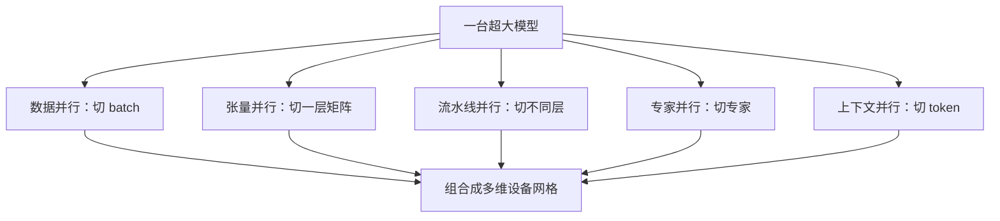
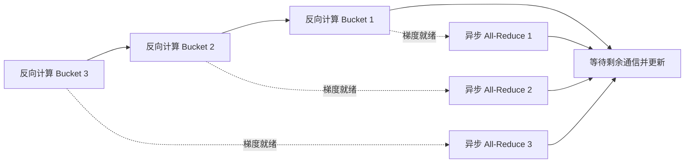

# 第 16 课　分布式训练与通信

<div class="lesson-lead">一张 GPU 放不下模型时，不是简单地“多插几张卡”。你要决定切数据、切层、切矩阵还是切状态；每一种切法都把显存问题变成不同的通信问题。</div>

<figure class="teaching-figure"><figcaption>分布式系统要同时记三本账：每张卡存什么、算什么、每一步要和谁通信。</figcaption></figure>

::: info 名校课程来源
本课以 [CMU Parallelism and Distributed Training](https://cmu-l3.github.io/anlp-spring2026/static_files/anlp-s2026-20-scaling-parallelism.pdf) 和 [CS336 Lecture 7 可执行 Slides](/lectures/?trace=var/traces/lecture_07.json) 为主线：单卡显存 → 集合通信 → 数据并行 → 张量并行 → 流水线并行 → ZeRO；原论文进一步核对 [Megatron-LM](https://arxiv.org/pdf/2104.04473)、[ZeRO](https://arxiv.org/pdf/1910.02054)、[Ring Attention](https://arxiv.org/pdf/2310.01889) 与 [DeepSpeed-Ulysses](https://arxiv.org/pdf/2309.14509)。
:::

## 1. 数据并行：每张卡一份模型

每张 GPU 拿不同 mini-batch，独立算梯度，再用 All-Reduce 求和或平均。优点是概念简单、计算并行；缺点是每张卡都要放完整参数、梯度和优化器状态。

<figure class="teaching-figure source-figure"><a href="/lectures/images/data-parallelism.png" target="_blank"></a><figcaption>CS336 Lecture 7 的数据并行图。切的是 batch 维，每个 rank 仍有完整模型；本地 forward/backward 后必须同步梯度，才能保证下一步参数继续一致。<a href="/lectures/?trace=var/traces/lecture_07.json">打开可执行 Slides</a>。</figcaption></figure>

## 2. ZeRO / FSDP：把“每张卡都复制”拆掉

- Stage 1：分片优化器状态；
- Stage 2：再分片梯度；
- Stage 3：连参数也分片，需要时 All-Gather。

分片越彻底，单卡显存越低，但通信和调度更复杂。不要只问“能不能放下”，还要问 token/s 是否下降、网络是否饱和。

## 3. 张量并行：把一层矩阵横着切

例如 $Y=XW$，把 $W$ 按列切到多张卡，每张卡算一部分输出，再通过集合通信拼起来。它适合单层就很大的模型，但几乎每层都可能通信，因此更依赖 NVLink / 高速互连，通常放在一台服务器内部。

<figure class="teaching-figure source-figure"><a href="/lectures/images/tensor-parallelism.png" target="_blank"></a><figcaption>CS336 Lecture 7 的张量并行图。切的是层内宽度；不同 rank 只算一部分矩阵乘，随后用 All-Gather 或 All-Reduce 重新组织完整结果。高频通信决定它通常留在高速互联域内。</figcaption></figure>

## 4. 流水线并行：把不同层竖着切

GPU 0 放前几层，GPU 1 放中间层，GPU 2 放后几层。为了避免后级 GPU 等待，把 batch 切成 micro-batch 像流水线上连续通过。代价是 pipeline bubble、激活传输和复杂的前后向调度。

<figure class="teaching-figure source-figure"><a href="/lectures/images/pipeline-parallelism.png" target="_blank"></a><figcaption>CS336 Lecture 7 的流水线并行图。切的是深度维，阶段之间传激活和梯度；micro-batch 越少，填充与排空的空泡越明显。它解决单卡放不下全部层，却引入阶段负载平衡问题。</figcaption></figure>

## 5. 序列与上下文并行

超长序列让激活和 Attention 状态过大，可以沿 token 维切分。Ring Attention 让 K/V 分块沿设备环传递；Ulysses 类方法通过 All-to-All 在序列切分和注意力头切分之间换布局。它们不是免费扩展：网络带宽和通信重叠决定实际效率。

## 6. 专家并行：MoE 的特殊通信

Router 决定 token 去哪个专家，专家分布在不同 GPU 时需要 All-to-All 把 token 送出再收回。负载不均会让少数 GPU 成为尾部瓶颈，因此容量因子、辅助损失、共享专家和路由策略同时影响模型质量与系统吞吐。

## 7. 怎样组合并行维度

超大训练往往同时使用：数据并行 × 张量并行 × 流水线并行 × 专家并行 × 上下文并行。一个实用决策顺序是：

1. 先估算参数、优化器、梯度和激活；
2. 优先在节点内做高频通信的张量并行；
3. 节点间用数据或流水线并行；
4. 长上下文、MoE 只在确有需要时加专用维度；
5. 实测 MFU、通信占比和最慢 rank，而不是只看理论 FLOPs。



## 8. 先在单卡上把四类显存算清楚

训练显存不是只有权重：

```text
参数 + 梯度 + 优化器状态 + 激活 + 临时缓冲区
```

以 Adam 混合精度粗略估算，每参数可能包含 BF16 权重 2 bytes、FP32 主权重 4 bytes、FP32 梯度 4 bytes、两个 FP32 动量 8 bytes，尚未计算激活。70B 模型仅这些状态就远超单卡。

激活随 micro-batch、层数、隐藏维和序列长度增加。Activation checkpointing 只保存部分层输入，反向时重算中间激活，用额外 FLOPs 换显存。

## 9. 梯度累积没有增加并行设备

若单卡一次只能放 2 条序列，但希望 batch 为 8，可以连续做 4 个 micro-batch，再更新一次参数：

$$
\text{global batch}=\text{micro batch}\times\text{grad accumulation}\times\text{data parallel size}
$$

例如 `2 × 4 × 128 = 1024` 条序列。梯度累积降低峰值激活显存，却让每次更新等待更多串行 micro-batch；它不等于数据并行。

## 10. All-Reduce 在数据并行里何时发生

朴素做法等整个 backward 完成后再同步全部梯度，GPU 会先算后等网络。更好的做法把梯度分桶：后面层的梯度一准备好就异步启动 All-Reduce，同时继续计算前面层的 backward。



分桶太小会启动很多通信，太大又无法与计算充分重叠。实际效率取决于网络拓扑、bucket 大小与最慢 rank。

### PyTorch：朴素同步一组梯度

```python
import torch.distributed as dist

# 需要由 torchrun 启动，每个进程绑定一张 GPU
dist.init_process_group(backend="nccl")
world_size = dist.get_world_size()

loss.backward()
for parameter in model.parameters():
    if parameter.grad is None:
        continue
    dist.all_reduce(parameter.grad, op=dist.ReduceOp.SUM)
    parameter.grad /= world_size
optimizer.step()
```

这段代码展示语义：每个 rank 先得到本地梯度，再求和并除以设备数。生产中的 `DistributedDataParallel` 会自动分 bucket、异步 All-Reduce 并与 backward 重叠；手写循环会失去这些优化，也没有处理异常 rank、梯度稀疏与通信错误。

## 11. 张量并行手算一次

对 $Y=XW$，按列切：

$$
W=[W_1\;W_2],\qquad Y=[XW_1\;XW_2]
$$

每张卡拿同一个 $X$ 与部分列，直接得到输出的不同部分。按行切：

$$
X=[X_1\;X_2],\qquad
W=\begin{bmatrix}W_1\\W_2\end{bmatrix},\qquad
Y=X_1W_1+X_2W_2
$$

两卡需要 All-Reduce 求和。Transformer FFN 常先列并行扩维，再行并行投回隐藏维，使两层中间不必先拼完整张量；Attention 可让每张卡处理一部分头。

## 12. Pipeline bubble 怎样估算

把 $L$ 个阶段与 $m$ 个 micro-batch 组成流水线。若只有一个 micro-batch，后级在开始时一直空等；增大 $m$ 可摊薄填充/排空时间。

直觉上，阶段数越多而 micro-batch 越少，bubble 比例越大。1F1B 调度让每个阶段尽早交替做前向与反向，减少激活存活时间，但需要一致的切层和负载平衡。

若某一阶段包含更大的 embedding 或 MoE 层，它会成为全流水线节拍器，其他卡只能等待。因此切分不能只按层数平均，要按实测 FLOPs、激活和通信平均。

## 13. ZeRO 三阶段到底减少什么

假设数据并行组有 $P$ 张卡：

| 方案 | 参数 | 梯度 | 优化器状态 | 主要新增通信 |
|---|---|---|---|---|
| 普通 DP | 每卡完整 | 每卡完整 | 每卡完整 | 梯度 All-Reduce |
| ZeRO-1 | 完整 | 完整 | 约 $1/P$ | 更新后同步参数 |
| ZeRO-2 | 完整 | 约 $1/P$ | 约 $1/P$ | Reduce-Scatter 等 |
| ZeRO-3 / FSDP | 约 $1/P$ | 约 $1/P$ | 约 $1/P$ | 按层 All-Gather 参数 |

“约 $1/P$”是理想状态，还要加通信缓冲、未分片层和碎片。ZeRO-3 省得最多，却在每层前后需要获取/释放参数；慢网络或小模型上未必更快。

## 14. 通信算子要会认名字

| 算子 | 动作 | 常见位置 |
|---|---|---|
| All-Reduce | 每卡输入聚合，所有卡得到结果 | DP 梯度、TP 行并行 |
| All-Gather | 收集各卡分片，每卡得到完整张量 | FSDP 参数、列输出拼接 |
| Reduce-Scatter | 聚合后把结果分片 | ZeRO 梯度 |
| All-to-All | 每卡把不同片段发给不同目的地 | MoE token 路由、序列布局变换 |
| Send/Recv | 点对点传输 | 流水线阶段、环形 Attention |

通信量相同不代表耗时相同。跨节点带宽、延迟、拓扑和拥塞都会影响；All-to-All 对负载不均尤其敏感。

## 15. 怎样选择设备网格

一个 64 GPU 集群可能组织为：

```text
DP=8 × TP=4 × PP=2 = 64
```

选择顺序可以是：

1. 用 TP/FSDP 先让单层和模型状态放得下；
2. 把高频 TP 通信限制在 NVLink 节点内；
3. 用 PP 跨较慢边界切层，但控制 bubble；
4. 用剩余设备做 DP 提吞吐；
5. MoE 和长上下文再加 EP/CP，检查是否与现有维度冲突。

最终要比较 tokens/s/GPU、MFU、峰值显存、通信占比和扩展效率。能启动训练只是约束，较高有效吞吐才是目标。

## 16. 三个典型故障怎样定位

### 所有 GPU 利用率周期性掉到零

可能是数据加载、checkpoint 写盘或同步 barrier。对齐时间线，看掉速是否同时发生。

### 平均利用率高，但扩到更多卡反而更慢

可能是 global batch 没调整、通信超过计算、跨节点 TP 或 straggler。比较每个 collective 的耗时与最慢 rank。

### 只有 MoE 层出现长尾

查看每专家 token 数、All-to-All 字节和丢弃 token。路由不均或某些专家计算更重会决定 step 时间。

## 本课自测

1. 数据并行为什么省时间却不一定省模型显存？
2. ZeRO-3 用什么代价换参数分片？
3. 张量并行和流水线并行分别在哪里产生通信？

学完训练基础后，进入[后训练与对齐](/beginner/28-alignment-rl)。

<ChapterReadings lesson="27-distributed-training" />
