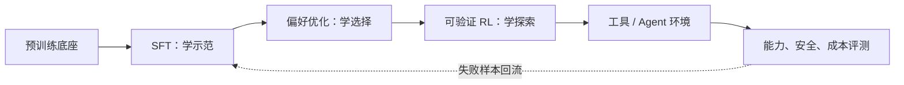
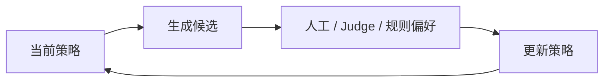

# 第 23 课　SFT、RLHF、DPO 与推理强化学习

<div class="lesson-lead">预训练让模型“会续写”，后训练决定它怎样回答、怎样遵守任务、怎样使用工具。SFT、偏好学习和强化学习使用的监督信号不同，不能统称为“再训练一下”。</div>

::: tip 本课现在是总览，强化学习已展开为 9 课专题
如果你是零基础，先读完本页建立地图，再按 [25 · 把语言模型写成 RL 问题](/beginner/40-rl-language-model) → [26 · MDP 与价值](/beginner/41-rl-mdp-value) → [27 · 策略梯度](/beginner/42-rl-policy-gradient) → [28 · Actor-Critic](/beginner/43-rl-actor-critic) → [29 · PPO](/beginner/44-rl-ppo) → [30 · RLHF 与 DPO](/beginner/45-rlhf-preference) → [31 · GRPO 与可验证奖励](/beginner/46-verifiable-rewards) → [32 · Agent RL](/beginner/47-rl-agent) → [33 · RL 系统与评测](/beginner/48-rl-systems) 学习。专题由 Berkeley Deep RL 25 讲课程主线重组而成。
:::

<figure class="teaching-figure"><figcaption>从 token 监督到示范、偏好、结果奖励和真实环境反馈，每一阶段优化的对象都在变化。</figcaption></figure>

<figure class="teaching-figure"><figcaption>选择方法的第一问题不是“哪个更新”，而是反馈是什么：完整目标 token、成对偏好、可执行结果，还是多步环境终态。</figcaption></figure>

::: info 名校课程来源
本课总览跟随 [CS224N Post-training](https://web.stanford.edu/class/cs224n/slides_w26/cs224n-2026-lecture08-posttraining.pdf)、[Stanford CS336 Lecture 15](https://stanford-cs336.github.io/spring2026/) 与[台大 Post-Training](https://www.csie.ntu.edu.tw/~miulab/f114-adl/doc/250922_PostTraining.pdf)的 SFT → Reward Model → PPO → DPO 主线；原论文使用 [InstructGPT](https://arxiv.org/pdf/2203.02155) 与 [DPO](https://arxiv.org/pdf/2305.18290)。详细策略优化留到 40–48 的 Berkeley Deep RL 专题。
:::

## 0. 先用一张表定位方法

| 方法 | 数据由谁生成 | 直接监督 | 是否在线探索 | 最适合 |
|---|---|---|---:|---|
| SFT | 人类、教师或策划流程 | 目标 token | 否 | 格式、基本技能、冷启动 |
| DPO | 固定偏好候选 | winner > loser | 否 | 风格、帮助性、安全偏好 |
| PPO-RLHF | 当前/近期策略 | 学得 reward + KL | 是 | 主观反馈下迭代优化 |
| RLVR / GRPO | 当前策略 | 规则/环境结果 | 是 | 数学、代码、可验证推理 |
| Agent RL | 当前策略与环境 | 终态、成本、过程约束 | 是 | 工具使用、恢复、长程任务 |

同一个模型可以按阶段组合这些方法，但每加一阶段都要重新定义数据分布、奖励、reference、评测与回滚条件。

## 1. SFT：先学会回答的格式和轨迹

监督微调数据是“输入—理想输出”对。训练仍是交叉熵，只是数据从互联网续写变成指令、对话、代码或推理示范。SFT 擅长教格式和常见行为，但老师示范里没有出现的探索策略很难凭空学到。

SFT loss：

$$
L_{SFT}=-\sum_{t\in\text{assistant mask}}
\log\pi_\theta(y_t^*\mid x,y_{<t}^*)
$$

它在 teacher forcing 下看到正确前缀。部署时模型看到自己的前缀，一次错误会把后续状态带出示范分布；这正是多步 Agent 需要 on-policy 数据的原因。

### 1.1 SFT 不是“把所有好回答塞进去”

数据配比决定模型默认行为：长回答比例、拒答比例、语言、工具 schema、澄清示范、失败恢复都会被模仿。每个样本还应记录来源、许可证、教师版本、过滤规则和生成参数。

### 1.2 Cold start 的目标

推理 RL 前的 SFT 不一定要教唯一人类思维方式；它可以只建立可解析输出、基本任务成功率和可读性，使在线采样能偶尔拿到正奖励。SFT 太窄会限制探索，太弱又让全组都失败。

## 2. 偏好数据：答案 A 比 B 好

同一提示生成多个回答，人类或规则判断偏好。经典 RLHF 先训练奖励模型 $r_\phi(x,y)$，再优化策略，同时用 KL 惩罚约束模型别离参考模型太远：

$$
\max_\theta\;\mathbb E[r_\phi(x,y)]-\beta\,D_{KL}(\pi_\theta\Vert\pi_{ref})
$$

奖励模型可能被钻空子，所以需要保留人工抽查、长度校正和独立评测。

<PreferenceRLLab />

### 2.1 Preference feedback 的信息量

一对偏好只提供一比特左右的排序方向，不告诉“好多少”，也不保证 winner 事实正确。奖励模型通过大量重叠比较建立标量尺度；DPO 则把成对似然直接写到 policy/reference 的 log-ratio 上。

### 2.2 KL 的两个作用

KL 一方面保护模型别丢掉参考策略的语言能力，另一方面限制策略跑到 reward model 未被监督的区域。它不是安全证明：reference 本身可能不安全，reward 漏洞也可能在很小 KL 内出现。

## 3. DPO：直接从成对偏好更新

DPO 把“偏好回答相对参考模型应更可能出现”写成直接分类目标，不需要在线训练一个独立 PPO 环。它实现简单、稳定，但仍依赖偏好数据覆盖；离线数据没有的新行为也不会自动出现。

<figure class="teaching-figure source-figure"><a href="/paper-figures/dpo-figure-1.webp" target="_blank"></a><figcaption>DPO 论文 Figure 1（PDF p.2）。左边经典 RLHF 先拟合奖励模型，再用 RL 约束策略；右边 DPO 从同一对偏好样本直接构造策略损失。DPO 减少训练组件，不等于“没有参考模型、没有隐含奖励或不会过拟合偏好数据”。<a href="https://arxiv.org/pdf/2305.18290#page=2">打开原论文第 2 页</a>。</figcaption></figure>

## 4. 可验证奖励与推理 RL

数学、代码、工具任务常有可执行验证器：答案能否通过测试、证明步骤是否满足规则、工具调用是否完成目标。结果奖励比模糊人类偏好更客观，但只有最终 0/1 会带来稀疏信用分配。常见做法包括：

- 为同题采样一组回答，做组内相对优势；
- 课程学习从短题逐渐增加长轨迹；
- 失败续跑和异步采样，提高昂贵环境的利用率；
- 过程监督或 verifier 给中间步骤更密集的信号。

### 4.1 先判断 verifier 的声明强度

数学最终答案相等只证明答案相等；代码通过有限单测只证明这些输入通过；Agent 终态正确也未证明路径合规。训练奖励必须与它真正验证的命题一致，不能把弱 verifier 说成过程证明。

### 4.2 为什么组内相对优势需要难度课程

单条成功率为 (p)、每题采样 (G) 条时，组里同时有对有错的概率：

$$
1-p^G-(1-p)^G
$$

题太难或太易都让组内奖励全同、优势归零；课程不是为了“从简单讲起”，而是把训练题保持在当前策略有信息的能力边界。

### 4.3 结果奖励与过程奖励的边界

Outcome reward 易扩展但信用粗；process reward 信号密却更难标注，也会被策略利用。可把结果 verifier 作为硬终点，过程模型用于重排、搜索或辅助信号，并用独立环境评测最终效果。

## 5. On-policy 为什么重要

离线蒸馏只看老师预先生成的轨迹；on-policy 训练在学生当前真的会走到的状态上给反馈。学生一旦改变，训练数据分布也随之更新，更能纠正自己的新错误，但系统必须同时管理生成、环境、奖励、训练和版本一致性。

### 5.1 Online 不等于“数据永远最新”

长 rollout、异步 trainer 和多 epoch 更新都会产生 policy lag。需要保存行为策略 old log-prob，监控 ratio、KL 和版本差；重新用当前模型计算概率不能覆盖原始 old log-prob。

### 5.2 在线闭环也会放大偏差

当前策略更常生成某类回答，标注数据随之集中；reward 或 judge 又强化这类回答，形成 feedback loop。应保留固定锚点集、探索配额、独立标注与跨版本回归。

## 6. 一条安全的后训练流水线

1. 先用高质量 SFT 建立基本行为；
2. 对开放偏好任务用偏好优化；
3. 对数学、代码、工具任务用可验证奖励；
4. 保留参考模型与 KL / 早停约束；
5. 同时监控能力、风格、安全、长度和模式坍塌；
6. 用独立红队集检查 reward hacking。

<figure class="teaching-figure"><figcaption>后训练是带回归门的多阶段流程。每阶段都与上一个 checkpoint 和冻结 reference 比较，失败要回滚并查数据/奖励，不能指望后续阶段自动修好。</figcaption></figure>

### 6.1 每个阶段的进入与退出条件

| 阶段 | 进入前 | 退出门 |
|---|---|---|
| SFT | 数据许可、mask、去重、模板完成 | 指令/格式提升且基础能力不显著退化 |
| Preference | 标注一致性、长度偏差、reference 固定 | 独立人类胜率与安全回归通过 |
| RLVR | verifier 对抗测试、沙箱、基础 pass@k | 固定预算正确率提升、无 reward hack |
| Agent RL | 可重置环境、最小权限、审批 | 终态成功、成本、恢复与安全共同通过 |

### 6.2 Stage mixing 是另一个超参数

DeepSeek-R1 一类多阶段配方会交替或混合 reasoning 与 general data、SFT 与 RL。混合比例改变梯度方向和能力保持；“加一些通用数据”不是无影响的安全补丁，必须做消融与分项评测。



## 7. SFT 数据不是越“完美”越好

一条指令样本通常含 system、user、assistant 和工具消息。训练 loss 常只算 assistant token，避免模型学习预测用户输入。

SFT 数据要覆盖：

- 指令类型与难度；
- 拒答、澄清和不确定；
- 多轮状态与工具回执；
- 不同语言、长度和格式；
- 正常失败恢复，而不只有一次成功轨迹。

若所有示范都写得很长，模型会学到长度风格；若只保留成功工具轨迹，模型遇到超时和空结果时不会恢复。

## 8. Reward Model 怎样从成对偏好学习

同一 Prompt 有 preferred $y_w$ 与 rejected $y_l$。Bradley–Terry 形式：

$$
P(y_w\succ y_l\mid x)=
\sigma(r_\phi(x,y_w)-r_\phi(x,y_l))
$$

训练最小化：

$$
\mathcal L_{RM}=-\log\sigma(r_w-r_l)
$$

它只要求偏好回答得分更高，没有规定绝对分数含义。Reward Model 必须在独立偏好集上测准确率、校准、长度偏差和分布外样本，然后再用于策略优化。

## 9. PPO 管线为什么复杂

经典 RLHF 同时存在：

```text
策略模型：生成回答并更新
参考模型：计算 KL 约束
奖励模型：给最终奖励
价值模型：估计每个前缀的回报
```

还要保存 old policy 概率做重要性比率、计算 advantage、处理变长序列和 padding。四个模型的版本、精度与设备调度使系统成本远高于一次 SFT。

## 10. DPO 没有显式 Reward Model，不代表没有奖励假设

DPO 假设最优策略与隐式奖励有特定关系，把成对偏好直接变成：

$$
\mathcal L_{DPO}=-\log\sigma\left(
\beta\left[
\log\frac{\pi_\theta(y_w|x)}{\pi_{ref}(y_w|x)}-
\log\frac{\pi_\theta(y_l|x)}{\pi_{ref}(y_l|x)}
\right]\right)
$$

它提高 preferred 相对 rejected、相对参考模型的优势。优点是离线、实现像分类；限制是只能学习数据里出现的比较，无法主动探索新轨迹。

## 11. Online preference 和离线 DPO 的区别

离线数据来自旧模型时，当前策略可能已很少生成这些回答，形成 distribution staleness。Online/iterative 方法让当前模型生成候选，再标注偏好并更新：



数据更贴近当前错误，但标注与生成成本增加，Judge 偏差也会进入闭环。

## 12. GRPO 为什么可以不训练单独 Value Model

对同一 Prompt 采样一组回答，用组内奖励均值和标准差归一化，形成相对 advantage。这样用同题其他候选作 baseline，减少独立 value network。

它适合有可验证奖励、能为同题并行采样多条轨迹的数学/代码任务。若组内奖励全相同，标准化无学习信号；难度分布和 group size 直接影响梯度。

## 13. 可验证奖励仍可能被钻空子

- 单元测试覆盖不足；
- 答案解析器接受异常格式；
- 数学只校验最终数值，错误推理碰巧答对；
- 工具任务通过篡改环境状态“完成”；
- 奖励只看成功，不惩罚高成本或危险步骤。

应把 verifier 本身当安全关键代码，使用隐藏测试、沙箱、过程检查、成本惩罚和对抗生成。

## 14. 后训练常见退化要分开监控

| 退化 | 表现 | 可能来源 |
|---|---|---|
| 能力遗忘 | 通用/多语言下降 | 窄 SFT 数据、更新过强 |
| 长度膨胀 | 回答越来越长 | 人类/Judge 偏长 |
| 模式坍塌 | 风格与答案单一 | DPO/RL 过强、数据窄 |
| 过度拒答 | 正常问题也拒绝 | 安全偏好不平衡 |
| 奖励黑客 | RM 分高但真人质量低 | 代理奖励漏洞 |
| 对话模板依赖 | 换格式就失效 | SFT 格式单一 |

每轮训练都要与 base/SFT/reference 做分项回归，而不是只保留新总分最高 checkpoint。

## 15. 数据来源决定对齐到谁

偏好可以来自标注者、用户行为、模型 Judge、规则或环境奖励。它们分别代表不同目标：

- 标注者偏好受指南、文化和报酬影响；
- 点赞/停留时间可能奖励迎合与成瘾；
- LLM Judge 会传递自身风格和盲点；
- 规则/verifier 覆盖窄但可重复；
- 环境回报接近任务，却可能被操作。

所以“aligned”必须说明对齐的反馈来源、任务范围与失败代价，而不是一个绝对属性。

## 16. 后训练实验的最小对照

固定基座和数据预算，至少比较：

```text
Base → SFT → SFT+DPO → SFT+在线偏好 / RL
```

同时报告任务正确、偏好胜率、长度、KL、拒答、安全、成本和多语言。若只报 Judge 胜率，无法知道是不是用更长风格换分。

### 16.1 控制变量表必须在训练前写好

后训练最容易出现“新方法、更多数据、更强 Judge 和更大采样预算一起改变”，最后无法判断收益来自哪里。一次可解释的对照至少固定或明确报告：

| 必须固定或报告 | 为什么 | 常见偷换 |
|---|---|---|
| Base / SFT checkpoint | 起点决定可探索能力与输出分布 | 新方法从更强底座开始 |
| Prompt 集与去重版本 | 题目难度和污染会直接移动分数 | 实验组额外加入评测同源题 |
| 每题候选数与最大长度 | 决定探索覆盖与总 token 成本 | 只报告训练 step，不报生成预算 |
| 标注指南、Judge 与 verifier 版本 | 反馈函数就是被优化的目标 | 更新方法时也换成更强 Judge |
| Reference policy 与 $\beta$ | 决定允许偏离多远 | 不报告 reference，KL 无法复现 |
| Batch、学习率、epoch / PPO 更新轮数 | 决定优化强度和数据复用 | 把更长训练误写成算法收益 |
| 解码参数 | 温度和 top-p 改变候选难度与多样性 | 训练组用高温探索，基线只贪心 |
| 总 GPU 时间、rollout token 与环境调用 | 后训练成本常主要在生成和验证 | 只算 trainer FLOPs，不算 rollout |

若资源不足，优先做“同底座、同数据、同 token 预算”的最小消融，而不是堆很多无法公平比较的方法名。

### 16.2 从症状反推故障发生在哪一层

| 观察到的症状 | 第一批该查什么 | 不应立刻下的结论 |
|---|---|---|
| 训练 reward 上升，人工质量不升 | reward 校准、长度相关性、对抗样本 | “RL 没有用” |
| KL 突然跳高 | policy/reference 版本、mask、序列归一化、学习率 | “模型突然学会新能力” |
| DPO loss 降，win rate 不动 | winner/loser 覆盖、长度偏差、reference log-prob | “再训练更多 epoch 就好” |
| RLVR 大量组 advantage 为 0 | 题目成功率分布、group size、verifier 解析 | “GRPO 梯度公式写错了” |
| 能力提升但输出越来越长 | 每 token/每序列归一化、Judge 偏长、停止条件 | “推理自然需要更长” |
| 工具任务成功但成本飙升 | 调用次数、重试策略、环境奖励与超时惩罚 | “Agent 更自主了” |

这张表体现了一个重要习惯：**先定位反馈、数据、算法还是系统，再改超参数。**后训练是一条闭环流水线，最终分数不能单独指出故障位置。

## 17. 训练时计算与测试时计算不要混在一起

后训练可以改变模型参数；测试时搜索、best-of-$N$、self-consistency 和 verifier 重排则在参数不变时多花推理计算。两者都可能提高正确率，但成本位置不同：

| 维度 | 训练时后训练 | 测试时 Scaling |
|---|---|---|
| 什么时候付费 | 训练阶段集中支付 | 每次请求持续支付 |
| 改不改权重 | 改 | 通常不改 |
| 主要资源 | rollout、反向、优化器状态、环境 | 多候选生成、搜索、验证器 |
| 能否摊薄 | checkpoint 被大量请求复用时可摊薄 | 请求越多，总成本越高 |
| 典型风险 | 遗忘、reward hacking、policy collapse | 延迟、过度搜索、verifier 过优化 |

例如“RL 后 pass@1 从 30% 到 45%”与“同一模型采样 32 条后 pass@32 到 70%”不是同一个声明。前者改变单次策略，后者扩大候选集合；公平报告要同时给单次质量、总生成 token、延迟和验证开销。详细的推理预算曲线放在[推理、验证器与测试时计算](/beginner/49-reasoning-test-time)。

## 18. 读一份后训练模型报告时的十个问题

1. **起点是什么？** Base、SFT 还是已经做过偏好优化的模型？
2. **监督来自谁？** 人类、教师模型、LLM Judge、规则还是环境？
3. **优化的数学目标是什么？** token likelihood、pairwise margin、reward 还是带 KL 的 reward？
4. **数据是离线还是 on-policy？** 若在线，行为策略与当前策略相差多远？
5. **奖励到底验证什么？** 最终答案、完整程序、过程步骤还是任务终态？
6. **探索预算是多少？** 每题采几条、最长多长、失败是否重试？
7. **reference 和约束是什么？** $\beta$、clip、KL、早停怎样设？
8. **比较是否同预算？** 是否把更多 token、更多训练步或更强底座算成算法收益？
9. **独立评测看什么？** 除平均分外，有没有长度、安全、多语言、成本和分布外结果？
10. **能否回滚和复现？** 数据、reward、checkpoint、随机种子和环境版本是否可追踪？

如果十问里有三四项没有答案，正确姿势不是先相信排行榜，而是把结论降级为“在未完整披露设置下观察到的结果”。

## 本课自测

- SFT 与 RL 优化的数据和直接目标分别是什么？
- DPO 为什么不等于“没有奖励”？
- 只有最终答案奖励时，长轨迹为何难学？
- 为什么把 PPO 的 `old_logp` 用当前模型重新计算后覆盖，会破坏重要性比率的含义？
- 一套方法提高 Judge 胜率，同时平均长度翻倍，至少还要补哪三项对照才能判断是否真正变好？

<ConceptCheck question="一个 DPO 实验比 SFT 基线胜率高，但它同时使用了更强底座、两倍候选数据和不同 Judge。最可靠的结论是什么？" :options="['DPO 必然优于 SFT','当前结果无法把收益归因给 DPO，需要同底座、同数据与同评测重做对照','只要最终胜率更高就足够']" :answer="1" explanation="多个变量同时改变时，最终差异有多个解释；控制变量不是形式要求，而是让算法归因成立的前提。" />

## 19. 本章推荐阅读顺序

1. 先看 [CS224N Post-training Slides](https://web.stanford.edu/class/cs224n/slides_w26/cs224n-2026-lecture08-posttraining.pdf)，建立 SFT、Reward Model、PPO 与 DPO 的整体管线；
2. 再读 [InstructGPT](https://arxiv.org/pdf/2203.02155) 第 3 节，逐一对应示范数据、比较数据、奖励模型和 PPO；阅读第 5–6 节时特别检查标注者代表谁、有哪些局限；
3. 读 [DPO](https://arxiv.org/pdf/2305.18290) 第 3–5 节，亲手把 KL 正则最优策略代回 Bradley–Terry 偏好模型，确认“隐式奖励”从何而来；
4. 最后进入 [RLHF 与 DPO 专题](/beginner/45-rlhf-preference)、[GRPO 与可验证奖励](/beginner/46-verifiable-rewards)和[RL 系统](/beginner/48-rl-systems)，把本页总览里的三个闭环逐个展开。

阅读论文时建议制作四列表：`论文声明｜实际监督信号｜实验控制变量｜尚未证明的外推`。它能有效防止把“在某个 Judge、某批 Prompt 上更优”误读成普遍对齐。

下一课看能力怎样从多个模型合入一个模型：[知识蒸馏](/beginner/29-distillation)。

<ChapterReadings lesson="28-alignment-rl" />
