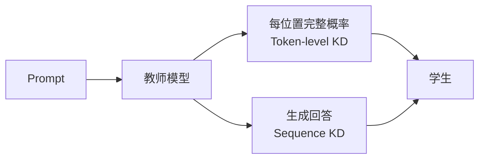
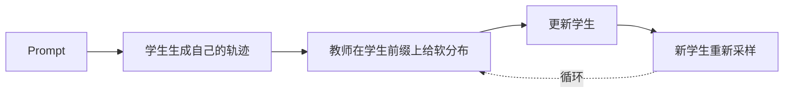

# 第 34 课　知识蒸馏与多教师学习

<div class="lesson-lead">蒸馏不是把大模型文件压缩成 zip，而是让学生在输入分布上模仿教师的概率、轨迹、特征或决策。教师可以更大，也可以只是某个领域更专长。</div>

<figure class="teaching-figure"><figcaption>数学、代码、工具等教师围绕学生当前轨迹给出信号，再合进一个可部署学生模型。</figcaption></figure>

<figure class="teaching-figure concept-figure"><figcaption>“教师给什么”决定学生能学到什么。硬标签最省，完整 logits 信息最密，Sequence KD 易保存，On-policy KD 最贴近学生真实错误；它们不是同一个方法的四种叫法。</figcaption></figure>

::: info 名校课程来源
本课跟随 [CMU Fine-tuning and Distillation](https://cmu-l3.github.io/anlp-spring2026/static_files/anlp-s2026-08-finetuning.pdf) 先建立 teacher distribution、soft label 与[序列级蒸馏原论文](https://arxiv.org/pdf/1606.07947.pdf)，再用 [CS224N Reasoning II](https://web.stanford.edu/class/cs224n/slides_w26/cs224n-2026-lecture13-reasoning-part2.pdf) 补齐 on-policy distillation、Forward/Reverse KL 与学生分布错位；推理系统中的蒸馏与剪枝对照 [CS336 Lecture 10](/lectures/?trace=var/traces/lecture_10.json)。
:::

## 0. 先分清三个经常混用的词

CMU L08 前 32 页先讲 Fine-tuning、Instruction Tuning 和 Chat Tuning，最后才引出 Knowledge Distillation。它们并不是互斥算法，而是从不同角度描述同一次训练：

| 问题 | 它关心什么 | 例子 |
|---|---|---|
| Fine-tuning | 从预训练参数出发，是否继续用梯度更新 | 全参数更新、只训输出头、LoRA |
| Instruction / Chat Tuning | 样本怎样组织，模型要学什么交互形式 | `instruction + input → output`、多轮消息 |
| Distillation | 训练目标或数据由谁产生 | 教师 logits、教师生成、教师增强系统 |

所以“用 GPT-4 生成 100 万条指令，再用 LoRA 训练小模型”同时属于三类：数据格式是 instruction tuning，监督来源是 sequence distillation，参数更新方式是 PEFT。只写“我们做了 SFT”会漏掉决定结果的两个维度。

### 0.1 Fine-tuning 的基本目标仍是经验风险最小化

从预训练参数 $\theta_0$ 出发，给定数据 $\mathcal D=\{(x_n,y_n)\}_{n=1}^N$：

$$
\theta^*=\arg\min_\theta
\mathbb E_{(x,y)\sim\mathcal D}[\mathcal L(f_\theta(x),y)]
$$

分类任务可能在最后隐藏状态上加输出头；生成任务则逐 token 最小化 $-\log p_\theta(y_t\mid x,y_{<t})$。选择“只训头、全参数还是少量适配参数”改变可学习容量和过拟合风险，却不自动改变目标来自人工还是教师。

### 0.2 为什么微调会“缩窄”预训练分布

预训练数据覆盖网页、书、代码和多种语言，微调集通常只覆盖很窄的任务与格式。持续让模型降低窄分布上的 loss，会把概率质量推向这批样本：摘要模型可能不再擅长翻译，只见过固定模板的模型会依赖模板，few-shot 能力也可能下降。

这不是“微调一定毁模型”，而是在提醒我们设置保留集、通用数据混合、正则化、较小学习率和早停。蒸馏也不能天然避免遗忘；若教师数据本身很窄，学生同样会被缩窄。

### 0.3 Instruction 数据怎样自然走向蒸馏

Instruction tuning 把不同任务统一成 `(指令 + 输入, 输出)`。指令、输入和输出都可以来自模板、人类或模型。Self-Instruct 一类流程从少量 seed 出发，让模型扩写新任务和回答；OpenOrca 则使用手写 system prompt 与强模型输出。此时“训练数据从哪里来”已经成为模型能力的一部分：

```text
人类任务 / Seed → 教师生成指令与回答 → 去重、过滤、验证 → 学生 SFT
```

教师能放大数据规模，也会放大自己的措辞、拒答边界和错误。进入蒸馏前必须记录教师版本、system prompt、采样参数、候选数量与过滤器，否则无法解释学生到底复制了什么。

## 1. 四种常见蒸馏信号

- **Logit 蒸馏**：学生模仿教师在整个词表上的软概率；
- **序列蒸馏**：教师先生成答案，学生把它当训练目标；
- **特征蒸馏**：对齐中间层表示或 Attention；
- **策略 / 轨迹蒸馏**：模仿教师在多步推理或工具环境中的动作分布。

温度 $T$ 会把教师分布变软：

$$
p_i^{(T)}=\frac{\exp(z_i/T)}{\sum_j\exp(z_j/T)}
$$

较软的分布不仅告诉学生正确 token，还透露“哪些错误更接近”。但温度过高会把有意义差异冲淡。

### 1.1 温度改变的不是排名，而是概率间距

假设教师 logits 是 `[3.4, 1.8, 0.9, -0.7]`。除以 $T$ 后再 Softmax：

- $T<1$：差距被放大，分布更尖，几乎退化为只教第一名；
- $T=1$：使用教师原始校准；
- $T>1$：差距缩小，第二、第三名获得可见概率，暴露类别关系；
- $T\rightarrow\infty$：趋近均匀分布，教师知识被冲淡。

经典混合目标常写成：

$$
\mathcal L=(1-\alpha)\,\mathrm{CE}(y,p_1)
+\alpha T^2\,\mathrm{CE}(q_T,p_T)
$$

第一项保留人工 hard label，第二项让学生匹配教师软分布。对学生 logit $z_i$，未乘 $T^2$ 时软损失梯度含有约 $1/T$ 的缩放；分布差本身又随温度缩小，所以实践中常乘 $T^2$ 让不同温度下的梯度量级较可比。它不是理论上必须的常数，必须和 $\alpha$、学习率一起报告。

<DistillationLab />

### 1.2 “Soft label”到底多了什么

假设硬标签是“巴黎”。one-hot 只提供“巴黎为 1、其他为 0”，无法区分“里昂”和“东京”哪个更像合理误答。教师若给 `[0.72, 0.18, 0.08, 0.02]`，学生同时收到三类信息：

1. 第一名是谁；
2. 第一名比第二名领先多少；
3. 错误候选之间的相似结构。

第三项就是常说的 *dark knowledge*。但它只和教师一样可靠：若教师把刻板偏见或事实错误放在第二名，学生也会收到密集错误监督。

### 1.3 手算一次更新方向

设 $T=2$ 时，教师对 `[巴黎, 里昂, 法国, 东京]` 给出 $q=[0.55,0.25,0.15,0.05]$，学生给出 $p=[0.43,0.31,0.18,0.08]$。Soft-label cross entropy 对学生缩放后 logit 的梯度方向就是 $p-q$：

| token | $p-q$ | 梯度下降会怎样做 |
|---|---:|---|
| 巴黎 | -0.12 | 提高 logit，补上学生少给的概率 |
| 里昂 | +0.06 | 降低 logit，学生给多了 |
| 法国 | +0.03 | 略微降低 |
| 东京 | +0.03 | 略微降低 |

四项和为 0，因为 Softmax 只重新分配总计 100% 的概率。硬标签梯度则用 one-hot 取代 $q$，会更强烈地只推高“巴黎”；混合目标把两种方向加权相加。交互实验显示的是乘上 $T^2$ 后对原始 student logits 的总梯度，因此数值还会受 $T$ 与 $\alpha$ 缩放。

<figure class="teaching-figure source-figure"><a href="/lectures/images/pruning-kd.png" target="_blank"></a><figcaption>Stanford CS336 Lecture 10 的知识蒸馏图。学生不是复制教师权重，而是在一批输入上匹配教师输出分布；因此教师推理数据、温度、学生容量与采样分布都会影响结果。<a href="/lectures/?trace=var/traces/lecture_10.json">打开可执行 Slides</a>。</figcaption></figure>

## 2. 多教师为什么难

数学教师偏好长推理，代码教师关心测试通过，语言教师关心表达，安全教师可能拒绝某些请求。简单把数据拼在一起会发生梯度冲突、领域比例失衡和风格混杂。

实用方案包括按任务路由教师、对奖励归一化、为共享能力与专长能力设置不同权重，以及在统一评测集上检查“合并一个能力是否损伤另一个能力”。

## 3. 离线与 on-policy 蒸馏

离线蒸馏便宜、稳定，但教师轨迹和学生真实错误可能错位。On-policy 蒸馏先让学生生成，再请相应教师对学生到达的状态给分或给分布，更贴近部署时会遇到的问题；代价是教师推理、版本同步和数据回放更复杂。

## 4. 蒸馏与量化不是一回事

蒸馏改变训练信号，通常让更小模型学大模型能力；量化改变数值表示，让同一个模型更省存储与计算。两者可以组合，但必须分别评测：小学生可能已损失容量，进一步低比特量化会叠加误差。

## 5. 怎样验证蒸馏成功

- 与同尺寸、未蒸馏基线比较，而不只和教师比较；
- 分能力报告，不用总平均掩盖遗忘；
- 报告教师调用成本和蒸馏 token；
- 检查学生是否复制教师的事实错误与不安全行为；
- 在学生自己的生成分布上再测一次。

## 6. Soft label 比标准答案多告诉了什么

假设下一 token 候选只有四个：

| token | one-hot 标签 | 教师概率 |
|---|---:|---:|
| Paris | 1 | 0.72 |
| Lyon | 0 | 0.18 |
| France | 0 | 0.08 |
| Tokyo | 0 | 0.02 |

one-hot 只说 Paris 对、其余都错；教师分布还表达 Lyon 比 Tokyo 更接近当前语境。这种“错误之间的结构”常被称作 dark knowledge。

Token-level 蒸馏的交叉熵为：

$$
\mathcal L_{KD}=-\sum_t\sum_{v\in V}
q(v\mid x,y_{<t})\log p_\theta(v\mid x,y_{<t})
$$

$q$ 是教师，$p_\theta$ 是学生。它等价于在给定上下文上最小化教师到学生的 Forward KL（忽略与学生无关常数）。

### PyTorch：温度缩放的 logit 蒸馏

```python
import torch
import torch.nn.functional as F

teacher_logits = torch.randn(2, 6, 100)  # [batch, token, vocab]
student_logits = torch.randn(2, 6, 100, requires_grad=True)
temperature = 2.0

teacher_prob = F.softmax(teacher_logits / temperature, dim=-1)
student_log_prob = F.log_softmax(student_logits / temperature, dim=-1)
kd_loss = F.kl_div(
    student_log_prob,
    teacher_prob,
    reduction="batchmean",
) * temperature**2
kd_loss.backward()
```

教师概率要停止梯度，学生使用 `log_softmax`。末尾乘 $T^2$ 用来补偿温度增大后梯度缩小；实际训练常再与真实标签交叉熵加权，且要 mask 掉 padding token。

## 7. Token-level KD 与 Sequence KD 的差异

### Token-level KD

教师对每个位置输出完整词表分布，学生直接模仿。信号密集，但要保存或在线计算巨大的 logits，教师和学生词表不同时还要对齐。

### Sequence-level KD

教师先生成一条或多条完整回答，学生用普通 NLL 学这些文本。数据易保存，也适合黑盒 API 教师；但只保留被采样出来的 token，丢掉其他候选概率。

<figure class="teaching-figure concept-figure"><figcaption>Kim 与 Rush 的关键区分：Seq-KD 用 Beam 近似教师序列分布的 mode；Seq-Inter 则在 Beam 内找最接近人工 Gold 的序列。一个追教师概率，一个把教师与数据折中。</figcaption></figure>



### 7.1 为什么完整序列分布算不动

自回归教师的序列概率是：

$$
q(y\mid x)=\prod_{t=1}^{|y|}q(y_t\mid x,y_{<t})
$$

若词表大小为 $V$、最大长度为 $H$，候选序列数量约为 $V^H$。Sequence-level 交叉熵理论上要对所有完整序列求和：

$$
\mathcal L_{seq}=-\sum_{y\in\mathcal Y}q(y\mid x)\log p_\theta(y\mid x)
$$

论文因此用 Teacher Beam 的最高分序列 $\hat y$ 近似整个 $q$：

$$
\mathcal L_{SeqKD}\approx-\log p_\theta(\hat y\mid x)
$$

这一步非常激进：指数大的分布被一条 mode 替代。它之所以可能帮助小学生，是因为学生不再浪费有限容量覆盖教师的所有表达，而是集中拟合高概率区域；代价是输出多样性可能变窄。

### 7.2 论文结果应该怎样读

在论文的英德翻译实验里，2×500 学生的 greedy BLEU 从 14.7 提到 18.9，而 4×1000 教师的 beam-5 BLEU 是 19.5；学生 greedy 推理在当时 GPU 上约为教师 beam-5 的 10 倍速度。更反直觉的是，Seq-KD 学生 perplexity 从基线的 8.2 **变差到 22.7**，BLEU 却显著上升。

这不是“困惑度没用”，而是训练和评测分布改变了：Seq-KD 让概率集中到教师 mode，可能更容易贪心找到好序列，却不再努力解释人工参考的全部变化。论文还把蒸馏与 magnitude pruning 组合，80% pruning 后得到相对原教师约 13× 更少参数、BLEU 只下降约 0.4 的模型。这个结论来自 2016 年 NMT/LSTM 设置，不能直接当作现代 LLM 的固定压缩比例。

## 8. Forward KL 和 Reverse KL 的直觉

设目标教师分布为 $q$，学生为 $p$。

### Forward KL：$D_{KL}(q\Vert p)$

教师有概率质量的地方，学生若没覆盖会被强烈惩罚，所以倾向 **mass-covering**。适合让学生学习教师的多种合理表达，但小模型可能容量不足，最后分布过宽。

### Reverse KL：$D_{KL}(p\Vert q)$

损失由学生自己会采到的区域加权，学生倾向集中在教师高概率模式，常称 **mode-seeking**。它更关注部署时学生真正到达的状态，但可能忽略教师的其他模式。

“Forward=平均、Reverse=坍缩”只是低维直觉。真实自回归模型还受采样、上下文与近似优化影响。

### 8.1 为什么 Token KD 常被称为 Forward KL

在同一个前缀 $c=(x,y_{<t})$ 上：

$$
D_{KL}(q\Vert p)=\sum_vq(v\mid c)\log\frac{q(v\mid c)}{p(v\mid c)}
=-H(q)-\sum_vq(v\mid c)\log p(v\mid c)
$$

$H(q)$ 与学生参数无关，所以最小化教师到学生的 Forward KL，等价于最小化 soft-label cross entropy。这里有一个常被省略的条件：**前缀从哪里来**。在 gold/teacher 前缀上匹配 token 分布，只约束这些上下文；学生部署时走到自己的错误前缀，仍可能完全没受过教。

### 8.2 序列级 Forward KL 与采样的关系

利用自回归分解：

$$
D_{KL}(q(y\mid x)\Vert p(y\mid x))
=\mathbb E_{y\sim q}\left[\sum_t
\log\frac{q(y_t\mid x,y_{<t})}{p(y_t\mid x,y_{<t})}\right]
$$

因此从教师采样完整轨迹、再在教师前缀上做 token KD，是序列 Forward KL 的 Monte Carlo 思路；只取 Beam mode 是低方差但有偏的近似。On-policy 蒸馏把前缀改为 $y\sim p_\theta$，更接近 Reverse-KL / imitation-learning 的状态覆盖直觉，但具体目标仍取决于教师在这些前缀上给什么信号。

## 9. Off-policy 错位是怎样出现的

标准 KD 常在教师生成的前缀上问教师与学生的分布：

```text
Teacher prefix: 正确步骤 1 → 正确步骤 2 → …
```

部署时学生可能早早写错：

```text
Student prefix: 正确步骤 1 → 错误步骤 2 → ???
```

学生从未在自己的错误前缀上得到密集教师信号，这与 teacher forcing 的 exposure bias 相似。

## 10. On-policy 蒸馏的一轮数据流

1. 学生根据当前策略生成前缀；
2. 在学生实际到达的每个前缀上调用教师；
3. 教师给出软分布或改进建议；
4. 学生只更新涉及的轨迹；
5. 新学生再次生成，数据分布随之变化。



这消除了部分训练/部署上下文错位。与 RL 相比，教师为每个 token 提供密集分布，而不是只给稀疏终局奖励；但仍要付教师推理成本。

## 11. 多教师怎样路由，而不是简单平均

假设三个教师：数学 $q_m$、代码 $q_c$、通用语言 $q_g$。一种硬路由是先判断任务 $r(x)$，只调用对应教师；软路由则使用权重：

$$
q(v\mid x)=\sum_k\alpha_k(x)q_k(v\mid x),
\qquad \sum_k\alpha_k=1
$$

但直接平均会遇到：

- tokenizer 或词表不同；
- 教师校准尺度不同；
- 一个教师不知道时仍给高置信错误；
- 写作风格与安全边界冲突。

实用系统可按领域、可验证性和置信度路由，并记录哪个教师为哪条轨迹提供信号。对数学/代码，可用外部验证器决定教师输出是否纳入。

## 12. 教师不一定只是更大的裸模型

CMU 课程强调教师可以是增强系统：

$$
q(y\mid x)\propto p_{LM}(y\mid x)A(x,y)
$$

$A$ 可以是检索器、分类器、代码执行、定理验证器或搜索算法。学生蒸馏的不只是“更大参数”，还可以是大模型 + 工具 + 搜索在昂贵推理下得到的行为。

这解释了为什么学生有时能超过裸教师的单次生成：训练目标来自增强后的教师系统，而不是教师模型原始分布。

## 13. 蒸馏配方怎样同时保能力和学专长

领域 mid-training 可能让已后训练模型失去指令跟随。一个混合 batch 可包含：

```text
70% 领域继续训练数据
30% 通用指令 on-policy 蒸馏
```

领域数据写入新知识，蒸馏信号约束学生保留原有助手行为。比例不是固定答案，要用“领域提升 vs. 通用退化”曲线选择。

## 14. 蒸馏的完整成本账

不能只报学生推理更便宜。还要报告：

- 教师生成了多少 token；
- 是否保存全 logits，存储多大；
- 教师与学生各用多少 GPU 小时；
- on-policy 循环更新多少轮；
- 外部工具/验证器调用成本；
- 数据过滤掉多少教师错误；
- 学生部署节省多久才能收回训练成本。

### 14.1 为什么完整 logits 很快装不下

若有 10 亿训练 token、词表 128K、每个 logit 用 BF16 保存，裸存储约为：

$$
10^9\times128000\times2\text{ bytes}
\approx256\text{ PB}
$$

所以真实系统不会天真地永久保存全词表 logits。常见折中包括在线调用教师、只存 top-$k$ logits 加“其余概率质量”、量化 logits、缩短蒸馏数据，或直接改用 Sequence KD。top-$k$ 也会丢掉长尾结构，且教师与学生 tokenizer 不同会使 token 对齐更困难。

### 14.2 Tokenizer 不同不能按 token 下标硬对齐

教师可能把 `unbelievable` 切成两个 token，学生切成四个；两边词表下标没有共同语义。可选方案包括：

- 使用同一 tokenizer；
- 在字符/字节跨度上对齐概率，但实现复杂；
- 只蒸馏完整文本序列；
- 对齐隐藏特征或任务结果，而不是词表 logits。

选择 Sequence KD 解决了词表对齐，却不再保留每个位置的完整概率关系，这是一项明确交换，不是免费兼容。

## 15. 一个可靠的蒸馏对照实验

同样学生、token 与训练步数，比较：

| 组 | 信号 | 回答什么问题 |
|---|---|---|
| A | 人工/原始 hard label | 学生基础能力 |
| B | 教师生成序列 | Sequence KD 是否有效 |
| C | 教师 soft logits | 软分布是否额外有效 |
| D | 学生轨迹上的教师 logits | on-policy 是否减少错位 |

还要与同尺寸强基线比较，按领域、格式、长推理与安全分项报告，检查是否只是学会教师的语言风格。

## 16. 一轮可复现的蒸馏数据流水线

```text
1. 冻结 teacher、student 起点、tokenizer 与 prompt 集版本
2. 为每条 prompt 记录领域、难度、许可证和隐私标签
3. Teacher 生成 K 个候选；保存温度、top-p、seed 与停止原因
4. 用 verifier / 人工规则筛掉事实错、泄漏、越权和格式坏样本
5. 选择信号：全 logits、top-k logits、mode 序列或 on-policy 反馈
6. 按任务/长度/教师分桶，控制混合比例和重复 epoch
7. 训练学生；保存 teacher/student log-prob、mask 和 checkpoint 谱系
8. 在冻结集、学生自由生成和分布外任务上共同验收
```

特别注意第 4 步：大教师生成的数据不是天然真值。数学要验证答案，代码要跑隐藏测试，检索型回答要核引用，多教师冲突要保留来源而不是平均后抹掉责任。

## 17. 容量差距决定学生能不能接住知识

蒸馏不是无限压缩算法。学生容量太小时可能出现：

- 能学第一名，却学不了教师的长尾分布；
- 能模仿短答案，却不能维持长程状态；
- 能复现常见任务，却牺牲多语言或低频知识；
- 训练 loss 继续下降，下游能力却提前饱和。

因此要画“学生大小 × 蒸馏 token × 能力”的曲线，而不是只训练一个尺寸。教师也不是越大越好：过强教师的分布可能对小学生过于复杂；辅助教师、课程难度、分阶段蒸馏或只蒸馏可接收技能有时更有效。

## 18. 从症状定位蒸馏故障

| 症状 | 优先检查 | 可能修复 |
|---|---|---|
| KD loss 低，任务分数低 | 教师本身、评测分布、学生容量 | 过滤教师、换任务信号、增大学生 |
| 学生风格像教师，事实能力没提升 | 数据只覆盖表面格式、无 verifier | 增加可验证任务和独立事实评测 |
| greedy 好、采样多样性差 | Seq-KD mode 过窄、温度太低 | 混合 Gold / 多候选、提高覆盖 |
| 常见任务升、低频能力掉 | 数据 mixture 和重复轮数 | 加保留集、重配桶、早停 |
| On-policy 成本失控 | 学生轨迹过长、每 token 调教师 | 前缀抽样、缓存、批量调用、先离线冷启动 |
| 多教师互相抵消 | 路由、校准、tokenizer、冲突规则 | 按领域路由并保留教师身份 |

## 19. 本章阅读路线

1. 先看 [CMU L08 Slides](https://cmu-l3.github.io/anlp-spring2026/static_files/anlp-s2026-08-finetuning.pdf) 第 33–38 页，把 soft-label cross entropy、Forward KL、教师生成和 augmented teacher 连起来；
2. 再读 [Sequence-Level Knowledge Distillation](https://arxiv.org/pdf/1606.07947.pdf) 第 3–5 节，自己推导为什么全序列求和不可解、Beam mode 是什么近似；
3. 阅读论文表 1–3 时分别追踪 BLEU、perplexity、mode probability、速度和参数量，不要把五个指标压成“压缩成功”；
4. 最后读 [Orca](https://arxiv.org/pdf/2306.02707.pdf)，比较“只模仿最终答案”和“逐级学习解释轨迹”怎样改变数据设计。

## 20. 读蒸馏模型报告时的十问

1. 学生是否比**同尺寸、同 token 预算**的非蒸馏基线更强？
2. Teacher 是裸模型，还是加入搜索、检索、工具或 verifier 的系统？
3. 教师信号是 hard sequence、top-$k$ logits、全 logits、隐藏特征还是环境反馈？
4. 温度 $T$、hard/soft 混合权重 $\alpha$ 和 $T^2$ 缩放是否报告？
5. 前缀来自 Gold、Teacher 还是 Student；训练与部署状态是否错位？
6. Teacher 与 Student tokenizer 是否相同；不同的话怎样对齐？
7. 教师输出经过哪些事实、安全、许可证与隐私过滤？
8. 总成本是否包含教师生成、Beam/Search、验证、存储和多轮 on-policy 调用？
9. 评测是否同时覆盖任务质量、生成多样性、校准、速度、内存和安全？
10. 论文的压缩率相对哪个教师、什么硬件和哪种解码设置？

若只报告“学生保留教师 95% 的分数”，至少还缺同尺寸基线、成本分母和分项退化。蒸馏的成功标准不是“像教师”，而是学生在目标部署约束下形成更好的**质量—成本—风险前沿**。

最清楚的汇报方式是一张 Pareto 图：横轴用端到端延迟或每请求成本，纵轴用目标任务质量，并用颜色标出安全回归是否通过。教师、同尺寸基线、不同蒸馏信号和量化版本放在同一坐标系里，才看得出学生是真正改善了前沿，还是只换了一个计算口径。

## 本课自测

1. 软 logits 比 one-hot 标签多提供了什么？
2. 多教师的主要冲突在哪里？
3. on-policy 蒸馏为什么更贵但可能更有效？
4. 为什么 Seq-KD 学生的 perplexity 可能更差，greedy 任务指标却更好？
5. 教师与学生 tokenizer 不同时，为什么不能逐下标匹配 logits？

<ConceptCheck question="Sequence KD 用 Teacher Beam 的最高分序列训练学生，它对完整教师序列分布做了什么近似？" :options="['精确枚举了所有序列','用一条近似 mode 替代指数大的分布，降低训练成本但可能压窄多样性','把教师权重直接复制给学生']" :answer="1" explanation="完整序列空间随词表和长度指数增长；Seq-KD 用 Beam 搜到的高概率完整序列作为训练目标，是有偏但实用的 mode 近似。" />

下一阶段进入部署前的模型压缩：[量化与低精度计算](/beginner/30-quantization)。

<ChapterReadings lesson="29-distillation" />
