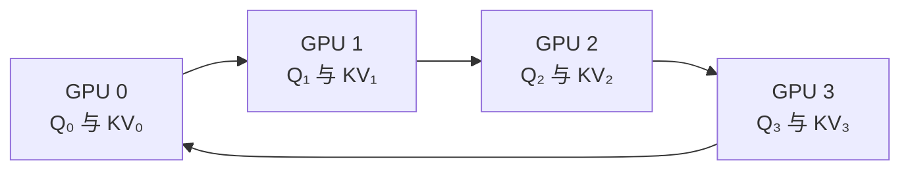

# 第 37 课　FlashAttention、线性 Attention 与长上下文

<div class="lesson-lead">标准 Attention 的困难有两类：算得多，以及把中间矩阵搬来搬去。FlashAttention 不改变精确答案，主要减少 HBM 访问；稀疏、线性和状态空间方法则改变计算结构。</div>

<figure class="teaching-figure"><figcaption>全注意力保留逐 token 档案；线性 Attention / SSM 维护固定或压缩状态。两条路线交换的是精确检索能力与资源成本。</figcaption></figure>

::: info 名校课程来源
本课以 [CMU Scaling Sequence Length](https://cmu-l3.github.io/anlp-spring2026/static_files/anlp-s2026-22-longcontext.pdf) 与 [CS336 Lecture 4](https://stanford-cs336.github.io/spring2026/) 的“长序列困难 → 稀疏/线性/SSM → 混合架构”路线为骨架；原论文核对 [FlashAttention](https://arxiv.org/pdf/2205.14135.pdf)、[FlashAttention-2](https://arxiv.org/abs/2307.08691)、[FlashAttention-3](https://arxiv.org/abs/2407.08608)、[FlashAttention-4](https://arxiv.org/pdf/2603.05451)、[Ring Attention](https://arxiv.org/pdf/2310.01889)、[RoPE](https://arxiv.org/pdf/2104.09864) 与 [YaRN](https://arxiv.org/pdf/2309.00071)。
:::

::: tip 本节采用的讲解顺序
你提供的 [ELI5: FlashAttention](https://gordicaleksa.medium.com/eli5-flash-attention-5c44017022ad) 适合建立 kernel、fusion 与 materialization 直觉，[Towards Data Science 的逐块推导](https://towardsdatascience.com/flash-attention-fast-and-memory-efficient-exact-attention-with-io-awareness-a-deep-dive-724af489997b/) 适合跟算 online softmax，[版本演化文章](https://medium.com/@sailakkshmiallada/the-evolution-of-flash-attention-revolutionizing-transformer-efficiency-8a039918d507) 适合先看 FA1–FA3 全景，[入门文章](https://medium.com/@sthanikamsanthosh1994/introduction-to-flash-attention-a-breakthrough-in-efficient-attention-mechanism-3eb47e8962c3) 可作预习。本站借用它们的教学节奏，但算法、性能数字与兼容边界以原论文和官方实现为准。
:::

## 1. 标准 Attention 的两张账单

对长度 $n$、头维 $d$，$QK^\top$ 的计算约为 $O(n^2d)$；注意力分数矩阵有 $O(n^2)$ 个元素。序列翻倍，二次项约变四倍。

但 GPU 上还要算 IO：如果把完整分数矩阵写回 HBM，再读回来做 softmax 和乘 $V$，数据搬运可能比算术更慢。

### 1.1 计算复杂度、激活显存、IO 不是同一件事

把一次单头 Attention 拆开：

$$
S=QK^\top/\sqrt d,\qquad P=\operatorname{softmax}(S),\qquad O=PV
$$

- 两次矩阵乘的算术量仍约为 $4n^2d$ FLOPs；
- 若把 $S$、$P$ 留在 HBM，它们各有 $n^2$ 个元素；
- softmax、mask、dropout 是逐元素/归约操作，计算量不一定大，却会读写大量数据；
- GPU 是否快，取决于算力够不够，也取决于数据能否及时送到计算单元。

因此，“$O(n^2)$”至少可能指三件事：算术量、某个实现的中间显存、或 HBM 数据流量。FlashAttention 大幅改变后两者，但**没有把密集 Attention 的两两点积数量改成线性**。

### 1.2 先算一个会 OOM 的具体例子

设 batch=1、32 个头、序列长度 16K、BF16。忽略 causal 上三角可跳过的优化，仅一个完整 score 矩阵就需要：

$$
1\times32\times16384^2\times2\ \text{bytes}=16\ \text{GiB}
$$

若分离 kernel 同时保留 $S$ 和 softmax 后的 $P$，就是约 32 GiB；还没算 Q/K/V/O、MLP、其他层和反向激活。相反，Q/K/V/O 四个 $n\times d$ 张量（$d=128$）合计约 512 MiB。真正突然爆炸的是被 materialize 的 $n\times n$ 中间矩阵。

## 2. FlashAttention 为什么仍是精确 Attention

它把 $Q,K,V$ 分块搬到片上 SRAM / shared memory，分块更新 softmax 的最大值、分母和输出，不落盘完整 $n\times n$ 矩阵。Online softmax 通过代数重缩放保持与普通 softmax 等价。它节省的是 IO 和中间显存，不是把注意力近似掉。

请同时记住三句话：

1. **函数不变**：仍计算 dense scaled dot-product attention；
2. **执行顺序改变**：把多个 kernel 融合，并按 tile 重排计算；
3. **浮点位级结果不保证完全相同**：加法次序与精度策略改变后会有舍入差，但应在数值容差内匹配参考实现。

### 2.1 HBM、SRAM 与 kernel fusion

可以把 HBM 想成远处大仓库，SRAM/shared memory 想成计算台旁的小桌面：

- HBM 容量大，所有 SM 都能访问，但一次往返相对昂贵；
- 片上存储小得多，却能高带宽地喂给矩阵乘单元；
- 一个 GPU kernel 结束后，其中间结果若要给下一个 kernel 使用，通常要落到全局显存；
- kernel fusion 把点积、mask、softmax、dropout 与乘 $V$ 尽量放进一次片上流水线。

衡量“算多少、搬多少”的常用量是 arithmetic intensity：

$$
\text{arithmetic intensity}=\frac{\text{FLOPs}}{\text{从内存搬运的 bytes}}
$$

矩阵乘通常较 compute-bound；softmax、mask 等更容易 memory-bound。FlashAttention 的目标不是让指数函数消失，而是避免为每个逐元素步骤反复搬运完整 $n^2$ 张量。

<figure class="teaching-figure concept-figure"><figcaption>普通分离 kernel 把 S 与 P 写回 HBM，再被下一步读回；FlashAttention 只让一个 Br×Bc tile 短暂停留在片上，完整 N×N 中间矩阵从未出现。</figcaption></figure>

### 2.2 Online Softmax 的三个运行状态

对某一行已经处理过的 score，维护：

$$
m=\max_i s_i,\qquad
\ell=\sum_i e^{s_i-m},qquad
r=\sum_i e^{s_i-m}v_i
$$

当前输出就是 $o=r/\ell$。新块到来后，令新全局最大值为 $m'$：

$$
\begin{aligned}
m'&=\max(m,m_{block})\\
\ell'&=e^{m-m'}\ell+\sum_{j\in block}e^{s_j-m'}\\
r'&=e^{m-m'}r+\sum_{j\in block}e^{s_j-m'}v_j
\end{aligned}
$$

若新块出现更大 score，旧分母和旧加权和同时乘 $e^{m-m'}$，等价于把所有旧指数换到新最大值的坐标系。没有信息被近似，只是不再保存每个概率。

<FlashAttentionLab />

### 2.3 Forward Pass 按 tile 做了什么

省略 batch、head、dropout 和具体线程映射，可把核心写成：

```text
for 每个 Query tile Qi:
    初始化 mi = -∞, li = 0, Oi = 0
    for 每个 Key/Value tile (Kj, Vj):
        从 HBM 载入 Qi, Kj, Vj 到片上存储
        Sij = Qi @ Kjᵀ / √d
        应用 causal / padding / local mask
        用 Sij 更新 mi、li，并重缩放旧 Oi
        Oi += 当前未归一化概率 tile @ Vj
        当前 Sij / Pij tile 用完即丢
    把 Oi / li 与必要的归一化统计写回 HBM
```

真实 kernel 会在不同 SM、thread block、warp 之间并行这些 tile，循环顺序也会随版本与硬件改变。理解算法时先抓住不变量：任一 Query 行最终看过所有允许的 Key；每次最大值变化都同步重缩放分母与输出累计。

### 2.4 Backward 为什么“多算一点”反而可能更快

普通训练为了反向传播，往往保存巨大的 $S$ 或 $P$。FlashAttention forward 只保存输出与每行 log-sum-exp 等小统计；backward 再从 Q/K/V 按 tile 重算需要的 score 和概率。

这与 activation checkpointing 的思想相似：用额外 FLOPs 换显存。但 GPU 上矩阵乘很快，HBM 往返很贵，因此**重算一个 tile 可能比从 HBM 读取整个中间矩阵更快**。代价仍存在：

- backward 的矩阵乘次数会增加；
- dropout 必须可重现同一随机 mask，通常依赖可复现的计数式 RNG；
- deterministic backward 往往更慢或需要更多空间；
- 自定义 mask、特殊 bias、非标准 head dimension 可能让框架回退到其他 kernel。

### 2.5 “Exact” 的边界

FlashAttention 的 exact 指**没有像低秩、稀疏或核近似那样改变目标 Attention 函数**。它不表示：

- FP16/BF16 与 FP32 位级相同；
- 不同 tile 大小、不同 GPU、不同 kernel 的最后一位完全一致；
- 开启 FP8 的 FA3 仍与高精度实现无误差；
- 任意 dropout 与 nondeterministic backward 都可逐 bit 复现。

正确验证方法是用同一输入、mask、scale 与 dropout 设置，比较输出和 Q/K/V 梯度相对高精度参考实现的最大/平均误差，并单独做 causal、变长序列、GQA 和极端 score 测试。

### 2.6 从 FlashAttention-1 到 4，瓶颈一直在移动

| 版本 | 主要硬件/问题 | 核心改动 | 不应误解为 |
|---|---|---|---|
| FA1（2022） | HBM IO 与 $n^2$ materialization | tiling、online softmax、kernel fusion、backward recomputation | 线性时间 Attention |
| FA2（2023） | FA1 占用率低、warp 间共享内存通信多 | 减少 non-matmul FLOPs；沿序列并行；重新划分 thread block / warp 工作 | 新 Attention 公式 |
| FA3（2024） | Hopper H100 的 Tensor Core 与 TMA 可异步，softmax 跟不上 matmul | warp specialization；重叠数据搬运和计算；交错 matmul/softmax；FP8 incoherent processing | 所有 GPU 都自动获得同样加速 |
| FA4（2026） | Blackwell B200 的 Tensor Core 翻倍更快，shared memory 与 exponential 单元未同比扩展 | fully asynchronous MMA、大 tile、软件模拟 exp、条件 softmax rescale、TMEM、2-CTA backward、CuTe-DSL | 一个跨硬件固定不变的 kernel |

FA2 原论文报告在 A100 上达到理论峰值的约 50–73%，较 FA1 再快约 2×；FA3 针对 H100，FP16 比 FA2 快 1.5–2.0×、最高约 740 TFLOPs/s，并以 FP8 接近 1.2 PFLOPs/s。你给出的 FA4 论文针对 B200，BF16 实验最高约 1613 TFLOPs/s（71% 理论峰值），相对论文当时的 cuDNN 9.13 最高 1.3×、相对 Triton 最高 2.7×；论文也说明后续 cuDNN 已吸收多项技术，差距会随软件版本变化。

FA4 最值得学的不是某个倍数，而是 **asymmetric hardware scaling**：矩阵乘吞吐翻倍后，瓶颈会转移到 shared-memory traffic、指数函数、寄存器压力与原子累加。下一代优化必须重新做 roofline，而不是把 FA3 源码原样搬到新 GPU。

### 2.7 实际使用时怎样确认真的走了 Flash kernel

[PyTorch 的 `scaled_dot_product_attention` 官方说明](https://docs.pytorch.org/docs/stable/generated/torch.nn.functional.scaled_dot_product_attention)显示，它会依据设备、dtype、shape、mask、dropout 与 GQA 等条件自动选择 Flash、memory-efficient、cuDNN 或 math backend。教学阶段可强制选择并让框架给出不能运行的原因：

```python
import torch.nn.functional as F
from torch.nn.attention import SDPBackend, sdpa_kernel

with sdpa_kernel(SDPBackend.FLASH_ATTENTION):
    out = F.scaled_dot_product_attention(
        q, k, v,
        dropout_p=0.0,
        is_causal=True,
    )
```

不要只看到代码中写了 `flash_attention=True` 就宣布加速。至少记录 GPU 型号、PyTorch/CUDA/driver 版本、实际选中的 backend、Q/K/V shape 与 stride、dtype、head dimension、mask 类型、forward/backward、warmup 后延迟、峰值显存和数值误差。

若要进一步看可安装版本、支持的 GPU 与 head dimension，以 [Dao-AILab 官方仓库](https://github.com/Dao-AILab/flash-attention)当时的 README 和 release notes 为准。硬件 kernel 的支持矩阵变化很快，不要把某一篇教程文章里的安装条件永久记住。

### 2.8 哪些情况下收益可能不大

- 序列很短：kernel launch 与调度开销占比更高；
- Decode 的 Query 长度接近 1：主要问题变成读取不断增长的 KV Cache，需要专门的 FlashDecoding / paged KV kernel；
- batch×heads 太小：可并行的 tile 不够，GPU 占用率低；
- 自定义 mask 或 bias 不被融合 kernel 支持：框架可能回退；
- head dimension、dtype、设备架构不在当前实现支持范围；
- 整个模型瓶颈在 MLP、通信或数据管线：Attention kernel 变快不等于端到端同比加速。

因此性能结论必须分清 kernel microbenchmark 与整模型 step time。FA1 论文中的 GPT-2、BERT 与 Long Range Arena 数字是特定硬件、序列长度和基线下的实验结果，不是对任意模型的固定“3×”。

## 3. 其他长序列路线

- **局部 / 滑窗 Attention**：只看邻域，成本近似线性，但远距离信息需跨层传播；
- **稀疏 Attention**：预定义或学习少量连接；
- **线性 Attention**：利用核映射重排乘法，维护汇总状态；
- **SSM / Mamba**：用递推状态压缩历史；
- **混合架构**：多数层用固定状态，间隔插入全 Attention 恢复精确检索。

<figure class="teaching-figure source-figure"><a href="/lectures/images/longformer-attention.png" target="_blank"></a><figcaption>Stanford CS336 Lecture 4 的 Longformer 连接图。斜带是局部滑窗，少数整行/整列是全局 token；稀疏度降低计算，但远距离信息必须经全局点或跨层传播。连接图本身就是模型的信息道路。<a href="https://stanford-cs336.github.io/spring2026/">打开 Lecture 4 PDF</a>。</figcaption></figure>

## 4. 位置编码怎样扩长

RoPE 用旋转角度编码相对距离。直接超出训练长度会进入未见过的频率区间。位置插值、NTK-aware scaling、YaRN 等方法改变不同频率的缩放，并常配合长上下文继续训练。仅修改一个配置项，不能保证模型真正会用 1M token。

## 5. KV Cache 仍是推理瓶颈

即使 Prefill 用 FlashAttention，Decode 仍需读取历史 K/V。MQA、GQA、MLA、KV 量化和缓存淘汰分别从共享头、压缩表示、降低精度或丢弃历史减少成本。它们不能混为同一种“Attention 加速”。

## 6. 长上下文能力怎样测

Needle-in-a-haystack 只测显眼字符串召回；还要测多跳信息整合、顺序理解、干扰鲁棒性、长文生成一致性和真实延迟。声明“支持 1M”至少要说明位置编码、训练长度、有效检索曲线和成本。

## 7. “长上下文”有四个不同瓶颈

| 瓶颈 | 训练时 | Prefill | Decode |
|---|---|---|---|
| 计算 | Attention 二次项、FFN | 一次处理全部输入 | 每个新 token 读取历史 |
| 激活显存 | 保存多层中间状态 | 临时 Q/K/V 与工作区 | 相对较少 |
| KV Cache | 训练通常不长期保存 | 建立缓存 | 随长度、batch 线性增长 |
| 位置/能力 | 是否见过长数据 | 能否建立远距关系 | 能否稳定利用早期信息 |

FlashAttention 主要优化前两项的 IO 与中间存储；GQA/MLA/KV 量化主要优化缓存；位置扩展和长数据训练解决能力。一个方法不会自动解决四项。

## 8. 把 Online Softmax 写成可运行的教学代码

第 2 节已经用两个小块手算了三个运行状态。下面把同一递推写成 PyTorch，以便你用随机输入和普通 Attention 对拍。普通 softmax 需要全行最大值 $m$ 与分母 $l$：

$$
m=\max_i s_i,\qquad l=\sum_i e^{s_i-m}
$$

读到新块时，若新最大值为 $m'$，旧分母可重缩放：

$$
l'=e^{m-m'}l+\sum_{i\in\text{new}}e^{s_i-m'}
$$

旧的加权输出也按同样因子重缩放。因此只需维护当前最大值、分母和输出累积，不保存完整分数矩阵。这是 FlashAttention 能“分块但不近似”的核心。

### PyTorch：用块状 online softmax 得到精确全注意力

```python
import math
import torch

def blockwise_attention(q, k, v, block_size=128):
    # q/k/v: [B, H, T, D]；教学版省略 causal mask
    B, H, T, D = q.shape
    running_max = torch.full((B, H, T, 1), -torch.inf, device=q.device)
    running_sum = torch.zeros((B, H, T, 1), device=q.device)
    running_out = torch.zeros_like(q)

    for start in range(0, T, block_size):
        kb = k[:, :, start:start + block_size]
        vb = v[:, :, start:start + block_size]
        scores = q @ kb.transpose(-1, -2) / math.sqrt(D)

        block_max = scores.amax(dim=-1, keepdim=True)
        new_max = torch.maximum(running_max, block_max)
        old_scale = torch.exp(running_max - new_max)
        probabilities = torch.exp(scores - new_max)

        running_out = old_scale * running_out + probabilities @ vb
        running_sum = old_scale * running_sum + probabilities.sum(-1, keepdim=True)
        running_max = new_max

    return running_out / running_sum
```

每次只 materialize 一个 $T\times\text{block}$ 分数块，并用 `old_scale` 把旧累计值换到新的最大值基准。它解释数学等价性，不是高性能 FlashAttention kernel：Python 循环、自动微分保存与 SRAM tiling 都还没有优化。

## 9. Ring Attention / Context Parallelism 在做什么

序列太长时，把 token 块分到不同 GPU。每张卡保留本地 Query，K/V 块沿环传递：



每轮用本地 Q 与当前 K/V 块更新 online softmax，传完一圈后等价于看过全序列。若通信能与块计算重叠，单卡不必存完整序列；慢网络或块太小会让环传输成为瓶颈。

## 10. 稀疏 Attention 的连接图决定可达性

滑窗宽度为 $w$ 时，单层只能读取邻近 $w$ 个位置。堆叠 $L$ 层后，信息可逐层传播得更远，但路径变长。可加入：

- 全局 token：所有位置都能访问少数枢纽；
- 跨块连接：每块摘要或路由到其他块；
- 内容路由：只选择相关远距位置；
- 周期全 Attention：局部层之间插入全局层。

评估时要看任务需要的是“某个远处 token”还是“许多远处证据的精确组合”。连接图够覆盖前者，不一定支持后者。

## 11. 线性 Attention 怎样把历史压成状态

若相似度核可写成：

$$
\operatorname{sim}(q,k)=\phi(q)^\top\phi(k)
$$

就能重排：

$$
\sum_i\phi(q_t)^\top\phi(k_i)v_i
=\phi(q_t)^\top\left(\sum_i\phi(k_i)v_i^\top\right)
$$

括号内是可递推状态，不必保存所有两两分数。代价是状态把许多历史压在一起，难以像全 Attention 一样精确回取任意单条记录。

## 12. SSM 的 recurrent 与 convolution 两种视角

连续状态空间模型可写成：

$$
h_t=\bar Ah_{t-1}+\bar Bx_t,\qquad y_t=Ch_t
$$

递推视角适合逐 token 推理，状态大小固定；展开后又可写成输入与长卷积核的卷积，训练时能并行。

S4 通过结构化矩阵让长卷积可计算；Mamba 让部分参数依赖输入，选择性决定哪些信息写入/忘记。它们消除显式 $n^2$ Attention，却没有免费获得任意位置精确检索。

## 13. RoPE 超长时具体出了什么问题

RoPE 把每对维度旋转不同频率。训练到长度 $L$ 时，模型只见过有限相位组合；直接输入远大于 $L$ 的位置会产生未训练的旋转模式。

- Position Interpolation 把更长位置压回训练区间；
- NTK-aware 等方法对频率区别缩放；
- YaRN 同时处理频率与幅度/温度并配合继续训练。

这些方法解决“位置数值可外推”，不代表模型学过在 100K 文档中整合 20 条证据。还需要长文数据、打包策略与任务训练。

## 14. 长上下文数据不等于把短文随机拼起来

随机拼接能训练位置范围和系统吞吐，却未必产生长依赖。有效数据应包含：

- 跨章节指代与因果；
- 多文档证据汇总；
- 代码仓库跨文件依赖；
- 长对话状态变化；
- 中间有强干扰、答案不在开头/结尾。

还要控制文档边界 mask，避免模型错误地把无关文档当连续文本。

## 15. 长上下文评测矩阵

| 能力 | 最小任务 | 不能替代什么 |
|---|---|---|
| 位置召回 | Needle / passkey | 多跳整合 |
| 多证据 | 需要 2–10 段联合回答 | 全局一致生成 |
| 顺序 | 事件时间线、状态更新 | 噪声鲁棒性 |
| 干扰 | 相似实体与矛盾段落 | 真实领域性能 |
| 生成 | 长摘要、代码修改 | 精确检索 |
| 系统 | TTFT、吞吐、峰值显存 | 语义能力 |

必须按目标位置画曲线：开头、中间、结尾。只报平均准确率可能隐藏“lost in the middle”。

## 16. 什么时候 RAG 比硬塞长上下文更合适

长上下文让模型有机会看到更多原文，RAG 先选择少量相关证据：

- 文档集合经常更新、总量远超窗口：优先 RAG；
- 任务需要整本合同全局一致性：可能需要长上下文 + 分层检索；
- 需要可引用证据和权限隔离：RAG 更容易控制；
- 检索问题难、相关性依赖全局结构：长上下文可减少漏召回。

现实系统常组合：先检索文档/章节，再在较长窗口内做细粒度整合。

## 17. 从直觉文章读到 FA4 的路线

不要从最新 kernel 代码硬啃。按下面顺序，每一步只回答一个问题：

1. 先读 [ELI5: FlashAttention](https://gordicaleksa.medium.com/eli5-flash-attention-5c44017022ad)：什么是 kernel、fusion、materialization，HBM 为什么可能比算术更先卡住？
2. 再读 [逐块推导文章](https://towardsdatascience.com/flash-attention-fast-and-memory-efficient-exact-attention-with-io-awareness-a-deep-dive-724af489997b/)并操作本页实验：新块最大值变大时，旧分母和旧分子为什么要一起缩放？
3. 精读 [FA1 原论文](https://arxiv.org/pdf/2205.14135.pdf)：把算法 1 的外层/内层循环、HBM IO 复杂度与 backward recomputation 对起来。
4. 读 [FA2 原论文](https://arxiv.org/abs/2307.08691)：哪些 non-matmul FLOPs 被减少，为什么沿序列长度增加并行度，warp 间怎样少通信？
5. 读 [FA3 原论文](https://arxiv.org/abs/2407.08608)：Hopper 的异步执行怎样让矩阵乘、softmax 与数据搬运重叠？FP8 为什么还要讨论数值误差？
6. 最后读[FA4 原论文](https://arxiv.org/pdf/2603.05451)：当 Tensor Core 比 shared memory 和 exponential 单元扩得更快时，旧优化为什么会遇到新瓶颈？

前两篇是建立直觉的二手讲解；版本功能、性能数字与适用硬件应回到论文、框架文档和官方仓库核对。读 benchmark 时总把“kernel 吞吐”和“整模型 step time”分成两列。

## 本课练习：先回答，再展开

### 练习 1：16K 为什么会突然爆显存？

在 batch=1、heads=32、BF16、非 causal 的教学账本中，完整 $S$ 与 $P$ 各需要多少 GiB？FlashAttention 是否也把点积计算量降成了线性？

<details><summary>参考答案</summary>

每个矩阵有 $1\times32\times16384^2$ 个 BF16 元素，共 16 GiB；两个矩阵约 32 GiB。FlashAttention 避免把它们完整写入 HBM，但仍计算允许位置的密集点积，所以算术量仍约为 $O(n^2d)$。

</details>

### 练习 2：“exact”为什么不等于逐 bit 相同？

<details><summary>参考答案</summary>

它没有稀疏化、低秩化或改变 softmax 目标函数；Online Softmax 只是代数等价地重排计算。但浮点加法不满足严格结合律，不同 tile、累加顺序与混合精度会改变末位舍入，所以应在合理容差内比较输出和梯度，而非要求所有设备逐 bit 相同。

</details>

### 练习 3：为什么 Decode 不一定像 Prefill 一样受益？

<details><summary>参考答案</summary>

Prefill 的 Query 长度长，能形成大量规则 tile，并避免 $n^2$ 中间矩阵；逐 token Decode 的 Query 长度通常为 1，主要成本变成读取历史 KV Cache。此时需要 FlashDecoding、PagedAttention、GQA/MLA 或 KV 量化等另一组优化。

</details>

### 练习 4：FA4 说明了什么通用系统规律？

<details><summary>参考答案</summary>

硬件各单元不会同比扩展。Blackwell 的矩阵乘能力增长快于 shared-memory bandwidth 与指数单元后，瓶颈从 Tensor Core 转向数据供给、softmax、寄存器/TMEM 与跨 CTA 累加。kernel 优化必须随硬件重新做资源账，不能只复制上一代实现。

</details>

<ConceptCheck question="FlashAttention 最准确的描述是哪一个？" :options='["用稀疏连接近似全注意力", "重排并融合精确密集注意力，减少 HBM IO 与 N² 中间量", "把所有历史 token 压成一个固定状态"]' :answer="1" explanation="它仍计算允许位置的 dense scaled dot-product attention；节省来自 tiling、online softmax、fusion 与 backward recomputation。" />

<ConceptCheck question="序列长度从 4K 增到 16K，其他条件相同，materialize 的 S+P 约变为多少倍？" :options='["4 倍", "8 倍", "16 倍"]' :answer="2" explanation="矩阵元素数随 N² 增长；长度变 4 倍，中间矩阵约变 4²=16 倍。" />

下一课把单次推理扩展成并发服务：[vLLM、PagedAttention 与在线服务](/beginner/32-serving-systems)。

<ChapterReadings lesson="31-efficient-attention" />
