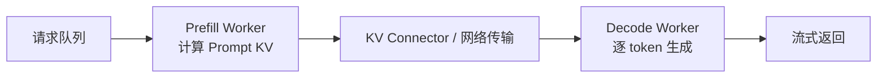

# 第 38 课　vLLM、PagedAttention 与在线服务

<div class="lesson-lead">模型能生成，不等于能高并发服务。vLLM 把请求队列、token 调度、分页 KV Cache、GPU 批处理和采样连成一个运行时，让许多长度不同、到达时间不同的请求共享同一批 GPU。</div>

<figure class="teaching-figure"><figcaption>Prefill 像批量读题，Decode 像逐字作答；二者的计算形状不同。vLLM 的工作不是改变模型答案，而是持续组织“下一轮哪些 token 一起算、历史 KV 放在哪里”。</figcaption></figure>

::: info 课程与实现来源
本课以 [Stanford CS336 Lecture 10 可执行课件](/lectures/?trace=var/traces/lecture_10.json) 和 [LLM Systems 的 vLLM 专题 Slides](https://llmsystem.github.io/llmsystem2025spring/assets/files/llmsys-22-vLLM_woosuk_kwon-1f34697dbb1a1fb5b798daf6eff14b67.pdf) 为教学骨架；原始系统论文使用[PagedAttention / vLLM PDF](https://arxiv.org/pdf/2309.06180)。当前实现机制核对 [vLLM V1 指南](https://docs.vllm.ai/en/stable/usage/v1_guide/)、[官方架构总览](https://docs.vllm.ai/en/stable/design/arch_overview/)、[Prefix Cache 设计](https://docs.vllm.ai/en/v0.14.0/design/prefix_caching/)和 [Scheduler API/源码页](https://docs.vllm.ai/en/latest/api/vllm/v1/core/sched/scheduler/)。
:::

::: warning 版本说明
下面的类名和实现映射以 2026 年 8 月的 vLLM V1 为参照。源码目录、参数默认值和支持矩阵会继续变化；**请求调度、块式 KV 管理、执行元数据和 GPU kernel 协作**才是本课需要长期记住的机制。代码框用于解释实现或直接使用 API，不要求初学者阅读完整源码。
:::

## 1. vLLM 解决的不是“模型会不会回答”

如果只有一个请求，普通 `model.generate()` 也能生成。服务系统真正困难的是：

- 请求随时到达，Prompt 和输出长度各不相同；
- 已结束的短请求不能等最长请求一起退出；
- 每条活跃序列都要保留 KV Cache，显存会随上下文和并发增长；
- Prefill 喜欢大矩阵，Decode 却每轮只推进少量 token；
- 用户既关心吞吐，也关心首 token 和后续 token 的等待时间。

vLLM 因此不是新模型，也不是训练框架。它主要是一个**推理运行时**：保持同一模型和采样设置的语义，同时改变请求怎样组批、KV 怎样放置、kernel 怎样执行。

| 层次 | 负责什么 | 不负责什么 |
|---|---|---|
| 模型权重 | 从输入计算 logits | 请求排队和显存分页 |
| vLLM Engine | 调度 token、维护请求状态、组织 GPU 执行 | 重新训练模型知识 |
| Attention Backend | 执行具体 Attention/KV kernel | 决定哪个用户优先 |
| API Server | 协议、鉴权、流式输出 | 决定 Transformer 数学结构 |

## 2. V1 中一轮请求经过哪些部件

<figure class="teaching-figure concept-figure"><figcaption>控制面输出的不是完整结果，而是一份“本轮执行计划”：哪些请求各执行多少 token、使用哪些 KV blocks、是否需要复制或加载。GPU Worker 根据这份计划构造真正的模型输入。</figcaption></figure>

可以把一轮 Engine Step 拆成十步：

1. API Server 收到请求，解析模型名、采样参数与流式连接；
2. 输入经过 tokenizer/chat template 变成 token IDs；
3. 新请求进入 Engine Core 的 waiting queue；
4. Scheduler 查看 running/waiting 请求和本轮 token budget；
5. KVCacheManager 查询 Prefix Cache，并为尚未计算的 token 分配 blocks；
6. Scheduler 生成 `SchedulerOutput`；
7. GPU Worker/ModelRunner 把来自不同请求的 token 压成一个批次；
8. Attention Backend 根据 slot mapping 和 block table 读写分页 KV；
9. Sampler 从 logits 产生新 token；
10. 完成请求释放 blocks，未完成请求带着新状态进入下一轮。

这里最重要的分工是：**Scheduler 决定算谁，KVCacheManager 决定放哪，ModelRunner 决定怎样组成 GPU 输入，Attention Backend 决定 kernel 怎样读写。**

## 3. Scheduler 调度的单位为什么是 token

传统静态 batch 先固定一组序列，直到全部结束。vLLM 的 Continuous Batching 每轮都可移除完成请求并加入新请求，因此每轮实际工作可写成：

$$
\text{本轮 token 数}=\sum_{r\in\text{scheduled requests}}\Delta t_r
\leq \text{token budget}
$$

对普通 Decode，通常每个请求只需推进一个 token，即 $\Delta t_r=1$；Prefill 请求一次可能有成百上千个 token。V1 的统一 Scheduler 不必把两类请求做成完全独立的代码路径，而是为每个请求决定本轮 `num_scheduled_tokens`。

下面是按当前机制改写的教学伪代码，不是从源码逐行复制：

```python
def schedule_one_step(running, waiting, token_budget, kv_manager):
    scheduled = {}

    # 先让已有生成请求继续前进，保护 inter-token latency
    for request in running:
        wanted = request.next_token_count()       # 普通 decode 通常为 1
        granted = min(wanted, token_budget)
        if granted == 0:
            break
        kv_manager.allocate_slots(request, granted)
        scheduled[request.id] = granted
        token_budget -= granted

    # 剩余预算接纳新 Prompt；放不下时可只做一个 chunk
    for request in waiting:
        cached = kv_manager.match_cached_prefix(request)
        remaining = request.prompt_len - cached
        granted = min(remaining, token_budget)
        if granted == 0:
            break
        kv_manager.allocate_slots(request, granted)
        scheduled[request.id] = granted
        token_budget -= granted

    return scheduled
```

真实实现还要处理优先级、最大序列数、投机 token、多模态 encoder、流水并行、KV transfer 和抢占。伪代码的用途是把主干固定下来：**先算预算，再分 KV，最后才能发给 GPU。**

## 4. Chunked Prefill 为什么能缓解队头阻塞

若一个 32K Prompt 必须整段塞入一轮，它可能长时间占满 GPU，让已有 Decode 请求的 TPOT 突然恶化。Chunked Prefill 把 Prompt 切成多个调度片段，与 Decode token 放进同一轮或相邻轮。

当前 V1 在可用时默认采用 Chunked Prefill，并优先安排 Decode；剩余 `max_num_batched_tokens` 再交给 Prefill。它带来两个效果：

- 已生成用户较少因长 Prompt 停顿；
- memory-bound Decode 与 compute-bound Prefill 有机会共享一批 GPU 工作。

它不是无条件更快：chunk 太小会增加调度和 kernel 边界开销，长 Prompt 完成 Prefill 的总时间也可能增加。优化目标必须明确是 TTFT、TPOT、吞吐还是 P99。

## 5. PagedAttention 首先是一套 KV 内存管理方法

假设某请求当前有 37 个 token，block size 为 16。它需要三个逻辑块：

```text
逻辑块 L0: token  0–15  → 物理块 P7
逻辑块 L1: token 16–31  → 物理块 P2
逻辑块 L2: token 32–36  → 物理块 P11（只用 5/16）
```

模型看到的 token 位置仍是连续的；底层物理显存无需连续。Block Table 完成 `L0→P7, L1→P2, L2→P11` 的地址翻译。

若每个请求都按最大长度 128 预留，37-token 请求会空置 91 个 token 槽；分页只在最后一个 block 内浪费 11 个槽。内部碎片上界从“最大长度减实际长度”缩到“大约一个 block”。

<figure class="teaching-figure source-figure"><a href="/lectures/images/paged-attention-fragmentation.png" target="_blank"></a><figcaption>CS336 的碎片对比。静态预留浪费未生成的大片空间；连续动态分配缓解内部浪费，却仍需要扩容搬动或连续空洞；分页把浪费限制在每条序列的尾块附近。</figcaption></figure>

一个逻辑 token block 跨全部层的 KV 字节数近似为：

$$
M_{block}=B_s\times 2\times L\times H_{kv}\times d_h\times b
$$

其中 $B_s$ 是 block tokens，2 表示 K 和 V，$L$ 是层数，$H_{kv}$ 是 KV heads，$d_h$ 是 head dimension，$b$ 是每元素字节。比如 `16×2×32×8×128×2 bytes = 2 MiB`。一个 block 看起来不大，并发数百条序列后就会成为主要容量账。

<figure class="teaching-figure source-figure"><a href="/lectures/images/paged-attention-logical.png" target="_blank"></a><figcaption>CS336 Lecture 10 的逻辑块映射图。请求增长时分配新页，结束时归还；已经写入的 KV 不必因为扩容而整体搬家。<a href="/lectures/?trace=var/traces/lecture_10.json">打开可执行课件</a>。</figcaption></figure>

<VLLMSchedulerLab />

## 6. Block Pool 为什么预先创建所有块对象

KVCacheManager 初始化时会建立 Block Pool，而不是每个 token 到来才创建一个 Python 对象。教学上可把一个 block 简化成：

```python
class KVCacheBlock:
    block_id: int            # 指向固定物理块
    block_hash: bytes | None # 满块后可用于 Prefix Cache
    ref_cnt: int             # 正在被多少请求引用
    prev_free: int | None    # 空闲队列指针
    next_free: int | None
```

预创建带来三个好处：

1. 物理 block 数在启动时已由可用显存决定，容量边界清晰；
2. 调度热路径避免频繁创建和销毁 Python 对象；
3. 空闲队列、引用计数、缓存哈希和驱逐状态可以围绕同一对象维护。

新的请求需要 block 时从 free queue 取；请求完成时降低引用计数，归零后重新进入可用队列。如果该 block 保存着可复用前缀，它可以“逻辑空闲但仍保留缓存内容”，直到被新分配真正驱逐。

## 7. 引用计数与 Copy-on-Write 怎样支持共享前缀

两个请求拥有相同系统提示或长文前缀时，不必复制整份 KV：

```text
请求 A block table: [P7, P2, P11]
请求 B block table: [P7, P2, P04]
                         ↑   ↑
                       共享前缀
```

`P7`、`P2` 的 `ref_cnt=2`。两条序列从第三块开始分叉。如果某请求需要修改仍被共享的块，就必须先得到自己的副本，即 Copy-on-Write；否则会污染另一请求看到的历史。

<figure class="teaching-figure source-figure"><a href="/lectures/images/paged-attention-sharing.png" target="_blank"></a><figcaption>共享不是复制：多条候选或相同 Prompt 的请求可让 Block Table 指向相同物理块，只有分叉后的尾部需要新块。引用计数决定旧块何时才真正可回收。</figcaption></figure>

这说明 PagedAttention 不是一个孤立 CUDA kernel。Scheduler 必须知道共享关系，KVCacheManager 必须正确维护引用计数和复制任务，ModelRunner 还要把最新 block table 交给 kernel。

## 8. Automatic Prefix Caching 实际缓存的是什么

Prefix Cache 不是拿原始字符串做字典查询。vLLM V1 为每个**完整 token block**构造链式哈希，概念上是：

```python
block_hash = hash((
    parent_block_hash,   # 前面所有完整块的链式摘要
    tuple(block_tokens), # 当前块的精确 token IDs
    extra_keys,          # LoRA、多模态输入、cache salt 等
))
```

必须加入父块哈希，因为相同的当前 16 个 token 出现在不同前缀后面，其 KV 通常不同。`extra_keys` 也不能遗漏：

- 同一文本配不同 LoRA adapter，隐藏状态可能不同；
- 多模态 placeholder token 相同，但实际图片不同；
- 多租户若允许任意共享，攻击者可能通过命中延迟推测其他用户内容；
- chat template、模型版本或其他影响计算图的条件变化后，旧 KV 不应复用。

标准 Full Attention 路径和官方入门设计以完整块为缓存边界；未满尾块继续随请求增长，避免把不稳定边界当成可共享前缀。较新的 hybrid/Mamba 管理器可以在特定模式下使用更细的 hash boundary 或 partial-tail 状态，但没有改变“按连续前缀验证并复用已计算状态”的主机制。命中后省掉的是共享 Prompt 的 Prefill 计算，**不会减少后续 Decode 必须完成的工作，也不会改善首次出现前缀的请求**。

## 9. KVCacheManager 的四类核心操作

| 操作 | 输入 | 关键输出 | 最容易出错的地方 |
|---|---|---|---|
| `get_computed_blocks` | 请求 token/hash 链 | 可复用的连续前缀 blocks | 命中必须从第 0 块连续开始 |
| `allocate_slots` | 新计算 token 数 | 新 blocks、CoW 复制 | 显存不足与跨 KV group 对齐 |
| `free` | 完成/取消请求 | 降引用、回 free queue | 共享块不能提前覆盖 |
| `reset_prefix_cache` | 管理操作 | 失效缓存哈希 | 活跃请求仍引用 block 时不能粗暴清空 |

现代模型还可能同时包含 Full Attention、Sliding Window、Mamba 或 MLA 等不同状态结构。V1 的 Hybrid KV Cache Manager 会按 cache group 协调不同管理器；因此“每层都是相同大小的标准 K/V block”只是最容易理解的起点，不是所有模型的最终形态。

## 10. ModelRunner 怎样把许多请求变成一个 GPU 批次

Scheduler 的输出仍是请求级对象，GPU 更喜欢紧凑张量。ModelRunner 要完成一次“控制面到数据面”的编译：

```python
# 教学化的数据准备，不是完整 vLLM 源码
input_ids = gather_scheduled_token_ids(requests, scheduled_counts)
positions = gather_positions(requests, scheduled_counts)

block_tables = build_block_tables(requests)
slot_mapping = map_new_tokens_to_physical_kv_slots(
    requests, block_tables
)

hidden = model(
    input_ids=input_ids,
    positions=positions,
    kv_caches=gpu_kv_cache,
    attention_metadata={
        "block_tables": block_tables,
        "slot_mapping": slot_mapping,
        "query_lengths": query_lengths,
        "context_lengths": context_lengths,
    },
)
logits = compute_logits(hidden)
```

- `block_tables` 回答“每个请求的历史 KV 在哪些物理块”；
- `slot_mapping` 回答“本轮新 token 的 K/V 写到哪个物理位置”；
- `query_lengths/context_lengths` 让 kernel 区分不同长度请求；
- Persistent Batch 会尽量在多轮间保留请求槽位，减少 CPU 反复重建整批元数据的开销。

所以 Continuous Batching 不是简单地把 Python list 每轮 `torch.stack()`。高性能实现要控制 CPU 调度开销、Host→Device 元数据传输、CUDA Graph 形状和 kernel 支持范围。

## 11. Attention Backend 怎样使用 Block Table

在普通连续 KV 张量中，第 $t$ 个 token 的地址可直接由 stride 计算；分页后需先查：

$$
\text{logical block}=\lfloor t/B_s\rfloor,
\quad
\text{offset}=t\bmod B_s,
\quad
\text{physical block}=\text{table}[\text{logical block}]
$$

kernel 再从 `physical block + offset` 读取对应 K/V。教学伪代码如下：

```text
for each query head:
    for logical_block in request_context:
        physical_block = block_table[logical_block]
        K_block, V_block = kv_cache[physical_block]
        scores = query @ K_block.T
        online_softmax_update(scores, V_block)
```

真实 kernel 会按 warp/thread/vector 重新排布 Key 和 Value 的读取，并融合 softmax、归约和输出累加。初学阶段只需知道：**Block Table 解决地址不连续；Attention kernel 仍要让 Query 看见所有允许的历史 token。**

## 12. PagedAttention、FlashAttention、Continuous Batching 不要混为一谈

| 技术 | 主要优化对象 | 是否改变 Attention 数学 |
|---|---|---|
| FlashAttention | 单次 dense Attention 的 HBM IO 与中间矩阵 | 否 |
| PagedAttention | 多请求 KV Cache 的放置、碎片和共享 | 否 |
| Continuous Batching | 哪些请求在同一 engine step 执行 | 否 |
| Prefix Cache | 重复 Prompt 的 Prefill 计算 | 否 |
| GQA/MLA/KV 量化 | 每 token 需要保存/读取的 KV 字节 | 可能改变模型结构或数值精度 |
| 稀疏/线性 Attention | token 之间实际计算的连接结构 | 通常改变 |

Prefill 可调用 FlashAttention 类 kernel；Decode 可调用针对分页 KV 的 kernel；Scheduler 又在更外层组织许多请求。它们处在不同抽象层，可以同时存在。

## 13. 显存不足时为什么不能只让请求“等一下”

运行中的请求已经占用 KV blocks。若新 token 没有空闲 slot，调度器必须在以下动作中选择：

- 暂不接纳新的 Prefill；
- 抢占一个或多个运行请求并让它们回 waiting queue；
- 释放已完成/取消请求的 blocks；
- 驱逐引用计数为 0 的 Prefix Cache blocks；
- 使用独立的 KV offloading/transfer 机制把状态移到其他层级或节点。

当前 V1 不再把旧式 GPU↔CPU swapping 当作默认抢占路径；被抢占请求可能依靠重新计算恢复。另一方面，KV Connector、P/D 分离和 offloading 功能仍在快速演进。两句话并不矛盾：**默认调度抢占策略**与**可选外部 KV 存储/传输系统**不是同一层功能。

## 14. Prefill / Decode 为什么会互相干扰

Prefill 一次处理长序列，矩阵大，往往更 compute-bound；Decode 每条序列通常只有一个新 Query，却不断读取权重和历史 KV，更容易 memory-bandwidth-bound。

<figure class="teaching-figure source-figure"><a href="/lectures/images/prefill-decode.png" target="_blank"></a><figcaption>同一 GPU 上，长 Prefill 可能让已有 Decode 用户等待；过度偏向 Decode 又会让新请求长时间拿不到首 token。Scheduler 的职责就是在 TTFT、TPOT 和吞吐之间取舍。</figcaption></figure>

大规模系统可把两阶段放在不同 worker 池：



分离可以独立扩容两种资源，却增加 KV 传输、路由一致性、故障恢复和全局背压。短 Prompt 的传输开销甚至可能超过分离收益。

## 15. 推测解码怎样接入同一个 Scheduler

草稿模型先提出 $k$ 个候选 token，目标模型一次并行验证。Scheduler 不仅要为普通目标 token 分配槽，还要为 lookahead/speculative token 预留位置，因此 `max_num_scheduled_tokens` 可能小于模型一次能容纳的 `max_num_batched_tokens`。

<figure class="teaching-figure source-figure"><a href="/lectures/images/speculative-sampling-algorithm.png" target="_blank"></a><figcaption>草稿模型 $q$ 连猜若干 token，目标模型 $p$ 并行验证；接受/拒绝还要校正分布。服务系统必须同时管理草稿状态、额外 KV slots、接受长度和回滚边界。</figcaption></figure>

接受率高时，一次读目标模型权重可推进多个 token；接受率低时，草稿计算和预留槽会变成浪费。它与 Continuous Batching 相互影响，不能只在单请求 microbenchmark 中判断收益。

## 16. 三段真正使用 vLLM 的代码

这些是用户接口示例，用来把系统机制落到可运行入口；不要求阅读内部源码。需要 Linux、受支持硬件和与环境匹配的 vLLM 版本。

### 16.1 离线批量推理

```python
from vllm import LLM, SamplingParams

llm = LLM(
    model="/path/to/model",
    max_model_len=8192,
    enable_prefix_caching=True,
)

params = SamplingParams(
    temperature=0.7,
    top_p=0.9,
    max_tokens=128,
)

prompts = [
    "用三句话解释 KV Cache：",
    "用三句话解释 PagedAttention：",
]

for result in llm.generate(prompts, params):
    print(result.outputs[0].text)
```

`LLM.generate()` 会把整组 Prompt 加入引擎；内部并不是按 Python list 顺序逐条完整生成，而是由 Engine 持续调度活跃序列。

### 16.2 启动 OpenAI-compatible 服务

```bash
vllm serve /path/to/model \
  --served-model-name tutorial-model \
  --max-model-len 8192 \
  --gpu-memory-utilization 0.90 \
  --enable-prefix-caching
```

这些参数分别影响对外模型名、允许的序列上限、这个 vLLM 实例可使用的总显存预算，以及是否允许自动前缀复用。不要把 `gpu-memory-utilization=0.90` 理解成“KV 一定占 90%”；启动阶段会先统计权重、激活峰值和其他 non-KV 开销，再用剩余预算配置 cache blocks。

### 16.3 使用 OpenAI Python Client 流式读取

```python
from openai import OpenAI

client = OpenAI(
    base_url="http://localhost:8000/v1",
    api_key="local-test",
)

stream = client.chat.completions.create(
    model="tutorial-model",
    messages=[{"role": "user", "content": "解释 vLLM 的 block table"}],
    temperature=0.2,
    stream=True,
)

for event in stream:
    piece = event.choices[0].delta.content
    if piece:
        print(piece, end="", flush=True)
```

客户端看到的是持续到达的 token；服务器内部每返回一个 token 之前，可能已经与许多其他用户共享了若干次 engine step。

## 17. 重要配置到底改变哪本账

| 配置 | 直接控制 | 调太大可能怎样 | 调太小可能怎样 |
|---|---|---|---|
| `max-model-len` | 单请求最大总长度 | KV 容量压力、启动可用并发下降 | 长请求被拒绝 |
| `max-num-batched-tokens` | 单轮 token 预算 | 显存/计算峰值和等待变大 | GPU 吃不满、Prefill 切得过碎 |
| `max-num-seqs` | 单轮最大序列数 | Decode 元数据和 KV 并发压力 | 高并发吞吐受限 |
| `gpu-memory-utilization` | Engine 可使用的显存预算 | 留给其他进程/通信的余量不足 | KV blocks 太少、频繁抢占 |
| `tensor-parallel-size` | 权重跨多少 GPU 切分 | 通信增加 | 单卡装不下或算力不足 |
| `kv-cache-dtype` | KV 元素精度 | 高精度占显存/带宽 | 低精度可能损失质量且需硬件支持 |
| Prefix Cache | 是否复用重复前缀 | hash/缓存管理及隐私边界 | 重复长 Prompt 被反复 Prefill |

参数名和默认值应以安装版本的 `vllm serve --help` 与官方文档为准。教程要学的是影响路径，而不是背默认数字。

## 18. Prefix Cache 何时命中也没有明显收益

- 前缀第一次出现：尚无缓存；
- 共同部分不足一个可缓存边界：命中块很少；
- 大部分成本在长 Decode：Prefix Cache 只省 Prefill；
- Prefix 后面的用户问题很短：本来 Prefill 就不贵；
- cache blocks 很快因容量压力被驱逐；
- 模型、adapter、多模态输入或 salt 不同：正确实现必须判为不匹配。

RAG 系统若把固定长文放在 Prompt 开头、用户问题放在末尾，最适合复用；若每次把时间戳、随机 request ID 放在最前面，会从第一个 block 就破坏共同前缀。

## 19. 上线压测不能只报 tokens/s

至少同时报告：

- **TTFT**：请求进入到首 token；
- **TPOT/ITL**：后续 token 间隔；
- **吞吐**：每秒输入/输出 token 或完成请求；
- **P95/P99**：尾部用户是否被长请求拖慢；
- **KV Cache usage**：物理 blocks 使用比例；
- **Prefix Cache hit rate**：查询 token 与命中 token 都要看；
- **preemption/eviction**：容量是否已经过载；
- **每百万 token 成本**：优化是否只是用更多 GPU 换延迟。

真实重放至少包含：

```text
短聊天：1K input → 200 output
RAG：16K input → 500 output，部分共享文档前缀
长文：128K input → 2K output
Agent：多次短 Prefill + Decode + 工具等待
```

固定 `128 input → 128 output` 的单一 benchmark 不能代表上述混合流量。吞吐更高也可能伴随 TTFT 或 P99 恶化。

## 20. 教程怎样使用 vLLM 源码，而不让初学者读源码

本站只把源码当“机制证据”，把它翻译成下面的实现地图：

| 教程概念 | 当前 V1 实现位置 | 本课让读者掌握什么 |
|---|---|---|
| 请求生命周期 | Engine Core | 一轮 schedule → execute → update |
| token budget | Scheduler | 每请求本轮推进多少 token |
| 分页与共享 | KVCacheManager / BlockPool | 分配、引用、驱逐、前缀命中 |
| GPU 批次 | GPU ModelRunner | 输入、位置、block tables、slot mapping |
| 地址翻译 | Attention Backend | 从逻辑 token 找到物理 KV |
| 外部 KV | KV Connector | P/D 分离、加载、保存和传输 |

你不需要打开这些文件才能完成本课。表格的作用是保证讲解能在真实实现中找到落点，也方便以后框架变化时重新核对，而不是让初学者跟着数千行代码迷路。

## 21. 常见故障怎样按层定位

| 现象 | 优先检查 |
|---|---|
| TTFT 很高、TPOT 正常 | waiting queue、长 Prefill、Prefix Cache 命中、chunk 大小 |
| TTFT 正常、TPOT 抖动 | Decode 是否被 Prefill 干扰、batch 波动、KV 读取带宽 |
| 吞吐低且 GPU 利用率低 | token budget、活跃请求数、CPU 调度/分词、shape 回退 |
| 频繁抢占 | KV blocks 不足、上下文/并发过大、缓存驱逐策略 |
| 相同 Prompt 不命中 | token IDs、模板、模型/LoRA、多模态 hash、cache salt |
| 输出与另一框架略不同 | chat template、generation config、dtype、采样与浮点顺序 |
| 服务 OOM | 权重、KV、CUDA Graph、workspace、通信缓冲不能只算一项 |

## 本课练习：先回答，再展开

### 练习 1：PagedAttention 改变了 Attention 公式吗？

<details><summary>参考答案</summary>

没有。它主要改变 KV Cache 的物理放置和地址访问方式。Query 仍需读取所有允许的历史 K/V；Block Table 把逻辑连续位置翻译到不连续物理块。

</details>

### 练习 2：为什么 Scheduler 要先问 KVCacheManager 能否分配？

<details><summary>参考答案</summary>

本轮新 token 会产生新的 K/V。如果只把请求列入 GPU 批次却没有合法 slot，kernel 就无处写入状态。调度计划必须同时满足 token 计算预算和 KV 容量预算。

</details>

### 练习 3：两个 Prompt 文本相同，为什么仍可能不能共享 KV？

<details><summary>参考答案</summary>

实际 token IDs、chat template、模型/adapter、多模态输入、位置或租户 salt 可能不同。只比较表面字符串会产生错误共享甚至隐私风险。

</details>

### 练习 4：Chunked Prefill 一定降低 TTFT 吗？

<details><summary>参考答案</summary>

不一定。它保护已有 Decode 的 TPOT并改善混合利用率，但一个新长 Prompt 被切成更多轮后，自己的 Prefill 完成时间可能增加。需要在真实到达率和长度分布下联合测 TTFT、TPOT、吞吐与 P99。

</details>

<ConceptCheck question="下面哪项最准确地描述 vLLM Scheduler 与 ModelRunner 的分工？" :options='["Scheduler 选择本轮请求/token，ModelRunner 把计划变成 GPU 张量和元数据", "Scheduler 训练模型，ModelRunner 标注数据", "两者都只负责 tokenizer"]' :answer="0" explanation="控制面先决定本轮做什么并分配 KV；数据面再构造 input IDs、positions、slot mapping、block tables 并执行模型。" />

<ConceptCheck question="Prefix Cache 命中最直接减少哪部分工作？" :options='["共享 Prompt 的 Prefill", "所有后续 Decode", "模型权重大小"]' :answer="0" explanation="它复用已经计算的前缀 KV，因此跳过对应 Prompt token 的重复 Prefill；后续生成和权重大小不变。" />

下一阶段让模型与外部世界交互：[Agent、工具与 Deep Research](/beginner/33-agents)。

<ChapterReadings lesson="32-serving-systems" />
