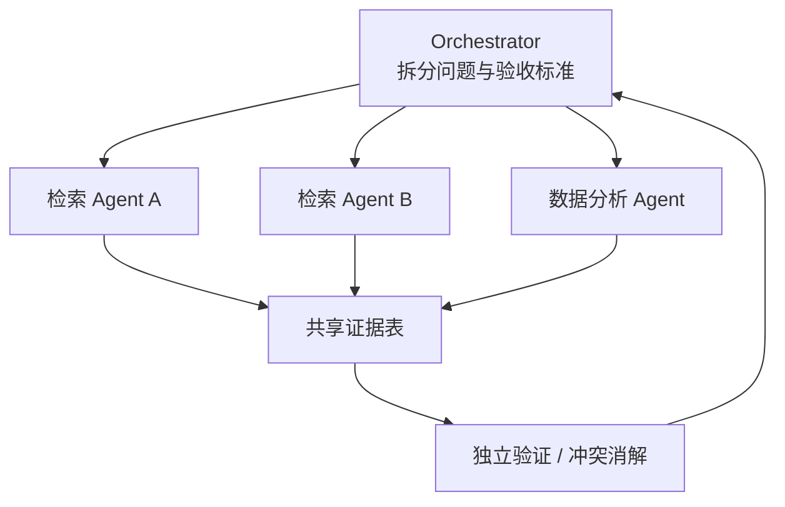

# 第 42 课　Agent、工具调用与 Deep Research

<div class="lesson-lead">Agent 不是一个更会聊天的模型，而是“模型 + 工具 + 环境状态 + 记忆 + 调度 + 验证”的闭环。模型负责提出动作，真实世界的观察决定下一步。</div>

<figure class="teaching-figure"><figcaption>每轮把目标变成动作，工具返回真实观察，验证器判断是否完成；失败时只修复需要重做的步骤。</figcaption></figure>

::: info 名校课程来源
本课把 [CS224N Agents, Tool Use and RAG](https://web.stanford.edu/class/cs224n/slides_w26/cs224n-2026-lecture10-rag-agents.pdf)、[CMU LM-based Agents](https://cmu-l3.github.io/anlp-spring2026/static_files/anlp-s2026-18-zora.pdf) 与[台大 Language Agents](https://www.csie.ntu.edu.tw/~miulab/f114-adl/doc/251110_LangAgent.pdf) 合并，并核对 [ReAct 原论文](https://arxiv.org/pdf/2210.03629)、[Toolformer](https://arxiv.org/pdf/2302.04761.pdf) 与 [SWE-Agent](https://arxiv.org/pdf/2405.15793.pdf)。三门课共同强调 observation、action、internal state、planning、memory 与 evaluation，而不是把“能连续调用工具”当作完整 Agent。
:::

## 1. ReAct 的最小循环

1. 读取目标与当前观察；
2. 选择一个工具和参数；
3. 执行工具；
4. 把返回结果写入状态；
5. 判断结束、重试还是下一步。

关键不是把“思考”写得很长，而是工具 schema 清晰、参数可校验、错误可恢复。

<figure class="teaching-figure source-figure"><a href="/paper-figures/react-figure-1.webp" target="_blank"></a><figcaption>ReAct 论文 Figure 1（PDF p.2）。左侧的 CoT 只在内部继续推理，错误事实会沿轨迹传播；Act-only 能查环境，却缺少维护目标的显式推理；右侧 ReAct 让 Thought、Action、Observation 交错，外部观察可以及时修正计划。图中的 Thought 是教学用轨迹表示，不意味着生产系统必须向用户展示内部推理。<a href="https://arxiv.org/pdf/2210.03629#page=2">打开原论文第 2 页</a>。</figcaption></figure>

## 2. 规划与执行为什么要分开

开放任务常先拆成检索、计算、写作和验证子任务。计划不是不可修改的合同：工具返回新事实后要重规划。一个稳健系统会保存依赖图、每步输入输出、失败原因和预算，而不是只保存一段聊天记录。

## 3. Deep Research 的信息流水线

问题澄清 → 查询分解 → 多源搜索 → 文档解析 → 证据去重 → 冲突检查 → 综合写作 → 逐句引用。它与普通 RAG 的区别是检索和阅读可以多轮迭代，系统必须追踪“结论由哪段证据支持”。

## 4. 记忆分哪几类

- 工作记忆：当前任务状态和短期观察；
- 情节记忆：过去任务轨迹与成败；
- 语义记忆：可检索的事实和文档；
- 程序记忆：工具说明、技能和流程模板。

把所有历史无脑塞进上下文会越来越贵，也会引入噪声。应按任务检索、压缩并设置过期策略。

## 5. 多 Agent 何时值得

适合可并行且能清晰验收的子任务，如多源调研、独立审稿、代码模块检查。若任务强依赖共享隐式状态，多 Agent 会增加通信、重复劳动和错误传播。角色名字变多不等于系统更强。

## 6. 安全边界

工具最小权限；读写操作分离；危险动作二次确认；网页和文档内容视为不可信输入；记录每次调用；验证输出而不盲信模型自评。Prompt injection 的本质是外部数据试图越权变成指令。

## 7. 用 observation / action / state 定义 Agent

每一步 $t$：

$$
o_t=\text{Observe}(environment),\qquad
a_t\sim\pi(a\mid o_{\le t},m_t),\qquad
m_{t+1}=\text{Update}(m_t,o_t,a_t)
$$

- observation：文件内容、网页 accessibility tree、截图、工具结果；
- action：API 调用、点击、输入、执行代码或回复用户；
- internal state：目标、计划、记忆、已完成步骤与预算。

如果模型只生成一段文字，环境没有改变也没有新 observation，它更像单次生成，不是完整闭环。

## 8. Observation 设计决定模型看见什么

同一个网页可以表示为：

- 原始 HTML：信息全，但模板与脚本很吵；
- accessibility tree：结构化、接近可交互元素；
- 过滤后的元素列表：短，但可能漏掉关键控件；
- 截图 + set-of-marks：保留视觉布局，需要视觉 grounding。

Observation 过长会淹没目标，过滤过强会让 Agent “看不见”。工程上要记录原始 observation、过滤结果与丢弃规则，失败时才能判断是模型没推理对还是根本没看到。

## 9. Action Space 越大，搜索和安全越难

Primitive action 如鼠标坐标点击很通用，但轨迹长、脆弱；语义 API 如 `search(query)` 或 `create_calendar_event(...)` 步数少、可验证，却需要人工设计接口。

```text
低层动作：move_mouse / click / type
高层工具：find_flight / run_tests / submit_form
学习技能：把稳定的多步轨迹封装成 reusable workflow
```

课程材料强调 use tools > primitive actions：若可靠 API 存在，优先 API；视觉操作留给没有结构化接口的部分。

## 10. Tool schema 是 Agent 的“动作语法”

一个好 schema 应明确：

```json
{
  "name": "transfer_money",
  "arguments": {
    "account_id": "经过授权的账户标识",
    "amount": "正数，单位 CNY",
    "idempotency_key": "防止重复执行"
  },
  "requires_confirmation": true
}
```

还要有确定性校验：类型、范围、权限、幂等、超时和错误码。模型生成了合法 JSON 只证明语法对，不证明业务动作被授权。

## 11. Planning 的三种粒度

### 反应式

每次看 observation 选下一步，适合短任务和变化环境；容易局部贪心。

### 先计划后执行

先写完整步骤，适合依赖清晰任务；环境变化后计划会过时。

### 分层与滚动规划

保持高层里程碑，每次只展开近期步骤；执行后根据新信息重规划。开放世界任务通常更适合这一方式。

计划质量的关键不是措辞，而是：依赖是否正确、每步是否可验收、失败是否有恢复边、预算是否受控。

## 12. Memory 不是一个向量数据库按钮

| 记忆 | 内容 | 写入条件 | 读取方式 |
|---|---|---|---|
| 工作记忆 | 当前任务状态 | 每步更新 | 直接放上下文 |
| 情节记忆 | 某次任务轨迹 | 完成/失败后总结 | 按相似任务检索 |
| 语义记忆 | 稳定事实、用户偏好 | 经确认后 | 结构化查询 / RAG |
| 程序记忆 | 可复用技能、工作流 | 多次验证成功后 | 按任务类型调用 |

记忆还需要 provenance、有效期、冲突解决和删除。一次对话中的猜测不能自动变成永久用户事实。

## 13. Self-reflection 何时有效

让模型写“反思”只增加一段内部文本。更可靠的是让反思绑定可观察失败：

```text
失败：单元测试 test_timezone 未通过
定位：日期解析默认使用 UTC
修复：显式传入 Asia/Shanghai
验证：重新运行全套测试
```

如果没有测试、检索或用户反馈，模型自评可能重复原错误。参见[测试时计算](/beginner/49-reasoning-test-time)中的内部/外部反馈区别。

## 14. 多 Agent 的通信协议比角色名字重要

一个可控并行研究系统：



需要定义：任务边界、输入快照、输出 schema、证据引用、截止预算、冲突处理与是否允许再委派。否则多个 Agent 只是重复写不同版本答案。

## 15. Agent benchmark 要同时包含环境

只给题目和标准答案不足以评测 Agent。最小 benchmark 单元包括：

```text
任务 + 初始环境 + 可用工具 + 权限 + 时间/步数预算 + 成功验证器
```

指标至少分开：

- task success / partial success；
- 平均步骤、工具错误与重试；
- 时间、token 和外部 API 成本；
- 不可逆错误与越权动作；
- 对环境变化的鲁棒性；
- 人工接管次数。

环境版本必须固定。网页改版或软件依赖更新会让同一 Agent 分数变化。

<figure class="teaching-figure source-figure"><a href="/lectures/images/swebench.png" target="_blank"></a><figcaption>CS336 Lecture 12 的 SWE-bench 示意。题目来自真实仓库 issue，Agent 要在指定代码版本上产出补丁，最后由隐藏测试而非语言相似度验收。它说明 Agent benchmark 必须把环境快照、可执行动作和确定性验证器一起交付。<a href="/lectures/?trace=var/traces/lecture_12.json">打开可执行课件</a>。</figcaption></figure>

## 16. 一条真实 Agent 失败怎样归因

| 失败层 | 例子 | 修复方向 |
|---|---|---|
| 感知 | 漏掉按钮或读错表格 | observation / grounding |
| 推理 | 目标分解错误 | Prompt、模型、计划器 |
| 工具 | schema 错、超时 | 接口与错误恢复 |
| 记忆 | 用到过期偏好 | 写入/检索/过期策略 |
| 验证 | 误判已经完成 | 外部检查与 success condition |
| 权限 | 执行了未授权写操作 | policy gate、确认、沙箱 |

不要把所有失败归为“模型不够大”。很多提升来自更好的环境表示、工具和验证器。

## 17. 最小可用 Agent 的实现顺序

1. 先做一个工具、一个任务、确定性验收；
2. 加结构化错误与有限重试；
3. 保存轨迹，建立失败分类；
4. 再加多步规划和短期状态；
5. 有重复任务后才加长期记忆/技能；
6. 子任务可独立验收时才加多 Agent；
7. 最后做高风险权限与人工审批。

这个顺序让每次复杂度增加都有可测收益，而不是一开始就接十个工具和永久记忆。

## 本课自测

- Agent 与单次 Prompt 的系统边界是什么？
- Deep Research 为什么必须保留证据链？
- 多 Agent 在什么情况下反而更差？

下一课扩展输入输出模态：[多模态、生成与具身智能](/beginner/34-multimodal)。

<ChapterReadings lesson="33-agents" />
