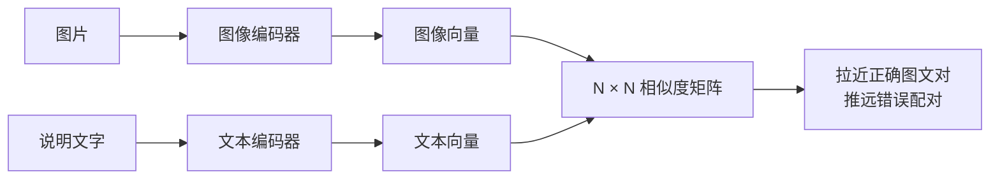
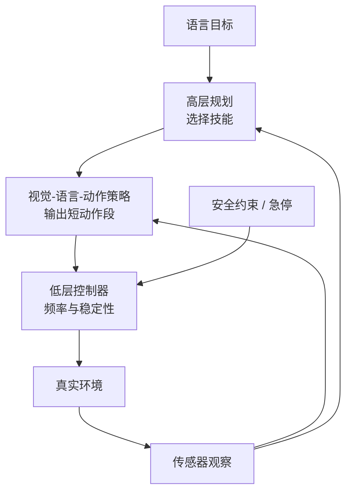

# 第 43 课　多模态理解、世界模型与具身智能

<div class="lesson-lead">“能看图”“能生成图”“能预测世界”“能控制机器人”是四个不同问题。它们可以共享表示和语言接口，但训练数据、输出空间和验证方式并不相同。</div>

<figure class="teaching-figure"><figcaption>视觉编码器把图像切块并压缩成视觉 token，再通过投影或交叉注意力接入语言模型。</figcaption></figure>

::: info 名校课程来源
本课按 [CMU Multimodal I](https://cmu-l3.github.io/anlp-spring2026/static_files/anlp-s2026-11-multimodal.pdf)、[Multimodal II](https://cmu-l3.github.io/anlp-spring2026/static_files/anlp-s2026-12-multimodal-ii.pdf) 与 [CS336 Lecture 17 可执行课件](/lectures/?trace=var/traces/lecture_17.json) 重建“图像表示 → CLIP → 视觉语言模型 → 训练与评测”主线；原论文核对 [ViT](https://arxiv.org/pdf/2010.11929.pdf)、[CLIP](https://arxiv.org/pdf/2103.00020.pdf) 与 [LLaVA](https://arxiv.org/pdf/2304.08485.pdf)。图像生成独立放在[第 44 课](/beginner/51-diffusion-flow)。
:::

## 1. 看图模型的三段结构

视觉编码器提取 patch 特征；连接器把视觉维度映射到语言模型；语言模型结合文字问题生成答案。连接器可以是线性投影、查询 token 压缩或 cross-attention。图像分辨率越高，视觉 token 越多，Prefill 成本越大。

## 2. 视觉理解不等于视觉生成

理解任务输出离散文本；图像生成要输出连续高维像素或潜变量。扩散模型从噪声逐步去噪，Flow Matching 学习连续流动方向。文本编码器提供条件，但生成主干不一定是自回归语言模型。

## 3. 音乐、生物与其他序列

只要对象能表示为 token、连续向量或图结构，就可能借用 Transformer；但归纳偏置不同。蛋白质重视结构与进化约束，音乐重视多时间尺度节奏，不能把自然语言指标直接搬过去。

## 4. 世界模型

世界模型学习“状态 + 动作 → 下一状态 / 观察”，用于预测、规划或模拟。生成逼真视频不自动代表理解物理因果；需要检查动作条件、长期一致性和反事实预测。

## 5. 具身 Agent 多了什么

机器人面对连续控制、传感器噪声、实时延迟和物理安全。语言模型可以做高层规划，视觉—动作策略做低层控制，安全控制器限制动作。真实环境试错昂贵，常结合仿真、离线数据和人工接管。

## 6. 多模态评测

除了问答准确率，还要测幻觉、OCR、空间关系、跨图比较、时间一致性、文化偏差和对抗图像。生成任务要把美学、文本对齐、多样性、版权和安全分开报告。

## 7. 图像怎样变成一串表示

Vision Transformer 常把图像切成 $P\times P$ patch。若图像高宽为 $H,W$，视觉 token 数近似：

$$
L=\frac{H}{P}\times\frac{W}{P}
$$

例如 336×336、patch 14，得到 $24\times24=576$ 个 patch。每个 patch 展平并线性投影，加位置表示后进入视觉编码器。

分辨率翻倍时，高和宽都翻倍，token 数约变四倍。多图、视频再乘帧数，因此视觉 Prefill 很快成为成本中心。

<figure class="teaching-figure source-figure"><a href="/lectures/images/vit.png" target="_blank"></a><figcaption>CS336 Lecture 17 的 ViT 图。每个方形 patch 像一个“视觉词”，经过线性投影与位置编码后交给普通 Transformer Encoder；分类 token 汇总整图信息。关键变化不是 Attention 公式，而是输入从词变成了图像块。<a href="https://arxiv.org/pdf/2010.11929.pdf">阅读 ViT 原论文</a>。</figcaption></figure>

## 8. CLIP 怎样把图像和文字放进同一空间

给一个 batch 的 $N$ 对图文 $(I_i,T_i)$：

$$
z_i^I=f_I(I_i),\qquad z_i^T=f_T(T_i)
$$

计算所有 $N\times N$ 相似度，要求正确配对 $(i,i)$ 得分高，错误配对低。它等价于在 batch 内做“这张图对应哪段文字”的分类。



训练后可做 zero-shot 分类：把类别写成文字 Prompt，与图片向量比较。不需要为每个类别另训分类头。

### PyTorch：把一个 batch 写成 CLIP 的双向分类

```python
import torch
import torch.nn.functional as F

def clip_loss(image_features, text_features, temperature=0.07):
    # image_features/text_features: [N, D]，第 i 行互为正确图文对
    image_features = F.normalize(image_features, dim=-1)
    text_features = F.normalize(text_features, dim=-1)
    logits = image_features @ text_features.T / temperature  # [N, N]
    labels = torch.arange(logits.size(0), device=logits.device)

    image_to_text = F.cross_entropy(logits, labels)
    text_to_image = F.cross_entropy(logits.T, labels)
    return (image_to_text + text_to_image) / 2
```

相似度矩阵的第 $i$ 行在问“图片 $i$ 对应哪段文字”，第 $i$ 列在问“文字 $i$ 对应哪张图片”。目标都是对角线位置；两次交叉熵让检索方向保持对称。`temperature` 越小，softmax 越尖锐，错配受到的惩罚越强。

## 9. CLIP 向量与视觉 Token 不同

单个全局 CLIP 向量适合检索和分类，却会丢掉对象位置与细节。视觉问答通常保留一串 patch 特征：

$$
f_{enc}(I)\rightarrow z_1,\ldots,z_L
$$

再通过 projector 把视觉维度 $d_v$ 映射到语言模型维度 $d_{lm}$。语言模型把这些视觉 token 与文字 token 一起处理，才能回答“左边第二个人拿着什么”。

## 10. 三种视觉接入方式

| 方式 | 数据流 | 优点 | 代价 |
|---|---|---|---|
| 直接投影 | patch → linear/MLP → LM | 简单、保留细节 | 视觉 token 多 |
| Query 压缩 | 少量 learned query cross-attend 图片 | 固定 token 预算 | 可能丢细节 |
| Cross-Attention 层 | LM 中插入视觉读取模块 | 模态分工清晰 | 改模型结构 |

“连接器很小”不代表作用小：若维度、归一化或位置对齐错误，语言模型会把视觉特征当成分布外输入。

<figure class="teaching-figure source-figure"><a href="/lectures/images/llava-architecture.png" target="_blank"></a><figcaption>CS336 Lecture 17 的 LLaVA 架构图。冻结或预训练好的视觉编码器输出 patch 特征，projection 负责把维度和分布接到语言模型；随后图像 token 与问题 token 一起进入自回归生成。小连接器是两种表示空间之间的“翻译器”，不是额外的图像知识库。<a href="https://arxiv.org/pdf/2304.08485.pdf">阅读 LLaVA 原论文</a>。</figcaption></figure>

## 11. 一台视觉语言模型通常分阶段训练

1. **预训练视觉编码器**：分类或 CLIP 对比学习；
2. **对齐连接器**：冻结大部分模块，用图文对让视觉特征进入 LM 空间；
3. **多模态指令微调**：图像问答、OCR、图表、文档与对话；
4. **高质量后训练**：偏好、安全、长图与工具使用；
5. **领域适配**：医疗、遥感、工业等专用数据。

只训练连接器便宜，但冻结视觉编码器可能限制细粒度能力；课程材料指出同时更新视觉编码器与 LM 往往更强，代价是训练更难、遗忘风险更高。

## 12. 动态分辨率与 tiling

固定缩放会把长文档或宽图压糊。动态方案把原图切成多个 tile，加一张缩略图提供全局结构：

```text
全局缩略图 + 左上 tile + 右上 tile + 左下 tile + 右下 tile
```

它改善 OCR 和细节，却增加 token，且模型要知道 tile 在原图的位置。文档模型还可能使用 OCR token、布局坐标和视觉 patch 的混合表示。

## 13. 多模态幻觉从哪里来

- 图像编码器没保留细节；
- connector 压缩过度；
- 语言先验比视觉证据强；
- 训练答案存在模板偏差；
- 问题指向图中不存在对象；
- 多图顺序或坐标混乱。

诊断时遮盖文字 Prompt、裁剪相关区域、交换图像、只给文本/只给图片做对照，判断答案主要来自哪种模态。

## 14. 视频又多了一条时间轴

若每帧 576 token、取 32 帧，就有 18,432 个视觉 token，尚未加文字。常见压缩：

- 降低帧率或事件驱动采样；
- 每帧空间池化；
- 时间注意力与空间注意力分解；
- 用 query 压缩跨帧信息；
- 先提取动作/字幕/物体轨迹。

视频任务还要测事件顺序、长时因果与对象持续性；单帧问答高分不能证明理解视频。

## 15. 世界模型和视觉语言模型的边界

视觉语言模型学习 $p(text\mid image,text)$；世界模型更关心：

$$
p(s_{t+1},o_{t+1}\mid s_t,a_t)
$$

动作条件是关键。一个视频生成器可能生成视觉逼真的未来，却忽略给定动作；规划需要比较不同动作导致的反事实后果。

评估世界模型应控制初始状态和动作，测长期状态、物理约束、可控性与用于规划后的真实回报，而不只测视频好看。

## 16. 机器人系统为什么必须分层



语言模型适合慢速高层决策，不适合独自承担毫秒级稳定控制。安全控制器应独立限制速度、力、工作区和碰撞，不能只靠 Prompt。

## 17. 多模态数据的独有风险

- 图片中的人脸、车牌、医疗信息与地理位置；
- 图文配对错误导致模型学到虚假关系；
- OCR 读取到的间接 Prompt injection；
- 图像版权和艺术家风格；
- 不同肤色、地区、文字系统的数据覆盖；
- 视觉工具输出被模型误当真实世界状态。

数据卡需要报告来源、许可、去重、人物处理、语言与地区分布，而不只是图片数量。

## 本课自测

1. 为什么高分辨率图片会显著增加语言模型 Prefill？
2. 扩散生成与自回归文字生成的状态有何不同？
3. 世界模型“生成得像”为什么不足以证明会规划？

下一课建立真实场景地图：[大模型应用全景](/beginner/35-applications)。

<ChapterReadings lesson="34-multimodal" />
