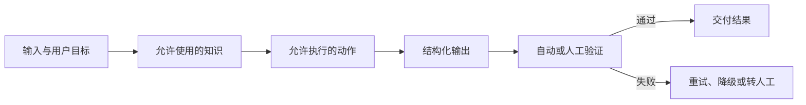
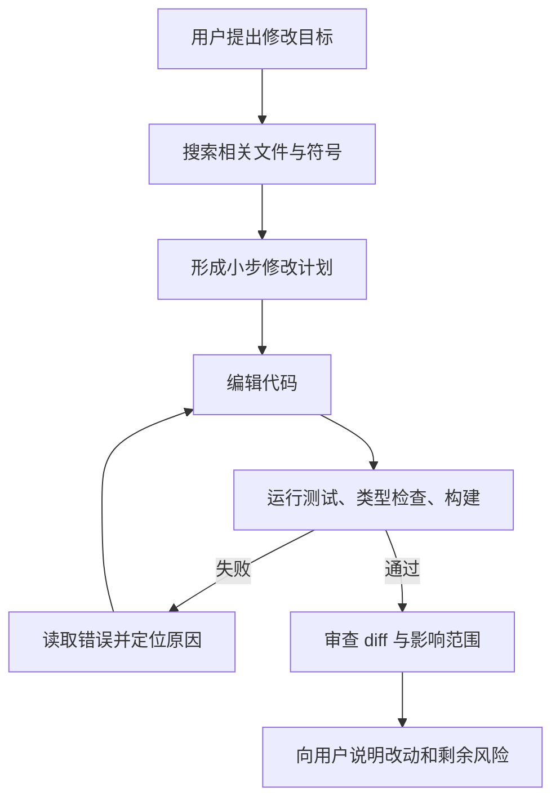

# 第 45 课　大模型应用全景

<div class="lesson-lead">做 LLM 应用的第一步不是选模型，而是把任务写成“输入、允许使用的知识和工具、可验证输出、失败代价”。不同场景需要完全不同的系统边界。</div>

<figure class="teaching-figure"><figcaption>一个应用往往同时使用 Prompt、RAG、微调、工具和验证器；选择依据是错误来源，而不是热门技术名单。</figcaption></figure>

::: info 名校课程来源
本课把三门课里分散的“应用能力”重新按产品问题组织：

- [CS224N：RAG、工具与 Agent](https://web.stanford.edu/class/cs224n/slides_w26/cs224n-2026-lecture10-rag-agents.pdf)；
- [台大 ADL：Language Agents](https://www.csie.ntu.edu.tw/~miulab/f114-adl/doc/251110_LangAgent.pdf)；
- [CMU ANLP：Language Model-based Agents](https://cmu-l3.github.io/anlp-spring2026/static_files/anlp-s2026-18-zora.pdf)；
- [CS224N：Open Questions in NLP 2026](https://web.stanford.edu/class/cs224n/slides_w26/cs224n-2026-lecture19-open-questions.pdf)。

它不是“应用名字大全”，而是教你把一个真实需求拆成可验证、可维护的大模型系统。
:::

## 1. 先按“错误能否验证”分类

- 封闭任务：分类、抽取、格式转换，可用规则或标签验证；
- 知识任务：客服、企业问答，重点是检索与引用；
- 创作任务：写作、音乐、设计，偏好和多样性比单一正确答案重要；
- 行动任务：代码、数据分析、Agent，必须执行工具并验证结果；
- 高风险任务：医疗、法律、金融，要求来源、权限、人工复核与审计。

同一句“帮我写一下”，在不同场景中的工程含义完全不同：

| 用户目标 | 模型真正要做的事 | 最合适的外部能力 | 主要验收方式 |
| --- | --- | --- | --- |
| 总结会议 | 压缩已有信息 | 长上下文、说话人识别 | 覆盖率、事实一致性 |
| 回答公司制度 | 找证据后作答 | RAG、引用 | 证据支持率 |
| 修改代码 | 理解仓库并行动 | 代码检索、终端、测试 | 测试与 diff 审查 |
| 安排行程 | 在约束下规划 | 搜索、日历、地图 | 冲突检查、用户确认 |
| 生成广告文案 | 产生多个候选 | 风格控制、偏好模型 | 人类偏好、合规检查 |

::: tip 第一条产品原则
先写清楚“什么算答对、错了会怎样”，再决定用 Prompt、RAG、微调还是 Agent。无法定义验收方式时，盲目堆模型能力通常只会让演示更像产品，却不会让产品更可靠。
:::

## 2. 把需求写成六格任务卡

假设要做一个“课程答疑助手”，不要只写一句“回答学生问题”。至少填完下面六格：

1. **输入**：学生问题、所在章节、可选的对话历史；
2. **知识边界**：只允许使用教材和课件，还是可以访问互联网；
3. **输出协议**：先给直观解释，再给公式和出处；
4. **可用动作**：检索课件、运行代码、画图，但不能改成绩；
5. **失败代价**：错误概念会误导学习，必须承认证据不足；
6. **验收标准**：概念正确、引用能打开、难度匹配、没有越权。



## 3. 任务型对话与陪伴

任务型对话要维护槽位、数据库状态和完成条件；闲聊 / 陪伴重视长期人格与记忆，但要防依赖、操纵和不当拟人化。两者的成功指标不同，不能都用“用户聊得久”衡量。

### 3.1 任务型对话是一个状态机

订餐助手至少要知道日期、人数、地点和饮食限制。模型可以用自然语言询问，但系统状态应该结构化保存：

```text
目标：预订餐厅
已知：日期=周六，人数=4
缺失：城市、价位、饮食限制
下一步：只追问最影响搜索的“城市”
完成条件：用户确认餐厅、时间和人数
```

如果不把状态从聊天文本中分离出来，长对话后很容易忘记约束或重复提问。

### 3.2 陪伴应用不能把“留存”当唯一奖励

模型越会迎合，用户可能聊得越久，但也可能形成依赖、强化错误信念。更健康的指标包括：用户能否完成现实目标、是否尊重拒绝、危机内容能否正确升级、长期记忆是否可查看和删除。

## 4. 写作与创意助手

好的流程是需求澄清、资料检索、提纲、多候选、局部编辑、事实检查和风格控制。系统应让用户保留作者控制权，并标注外部资料和模型生成部分。

不要要求模型“一步写完”。以科普文章为例，可以拆成：

1. 列出读者、目标和禁用术语；
2. 从可靠来源制作事实卡；
3. 给出三种提纲让用户选择；
4. 分段写作，每段绑定事实卡；
5. 单独运行事实、风格和版权风险检查；
6. 保留用户修改，不在下一轮偷偷改回去。

“多候选”很重要：创作没有唯一正确答案，与其让同一答案反复润色，不如先让模型探索几个明显不同的方向。

## 5. 代码助手

补全只需要局部上下文；仓库级修改需要检索符号、理解依赖、运行测试、处理编译错误和审查 diff。评测不能只看代码能生成，还要看测试通过、改动范围、安全漏洞和维护性。



代码 Agent 的关键不只是“会写代码”，而是能把环境反馈带回下一轮。没有执行结果的代码生成仍然只是猜测。

<figure class="teaching-figure source-figure"><a href="/lectures/images/swebench.png" target="_blank"></a><figcaption>CS336 Lecture 12 的 SWE-bench 流程把“代码应用”落到可验证任务：给定真实 issue 与固定仓库快照，系统搜索、编辑并运行测试，最终看补丁是否真正解决问题。这比“生成代码看起来像答案”更接近产品要求。<a href="https://arxiv.org/pdf/2405.15793.pdf">阅读 SWE-Agent 论文</a>。</figcaption></figure>

## 6. 科学应用与数字能力

生物、化学等领域需要专门表示、数据库和实验验证。语言模型处理数字常受分词影响；精确计算应交给计算器、Python 或符号系统，模型负责理解问题与组织步骤。

科学应用尤其要分清三层证据：

- **语言层**：模型说出的解释听起来合理；
- **计算层**：代码、公式或模拟能够复现；
- **现实层**：实验、临床或真实环境中得到验证。

前一层不能替代后一层。模型可以帮助提出候选假设，但不能因为文字自洽就把候选称为发现。

## 7. 教育应用：帮助学习，不是替学生完成

一个好的教学助手要根据学习者当前知识选择“下一小步”，常用策略是：

- 先让学生复述已知条件，而不是直接给答案；
- 用反例暴露误解；
- 在提示、半成品和完整答案之间逐级增加帮助；
- 记录掌握的是概念，不是只记录“看完了页面”；
- 对同一知识点同时提供直觉、图像、公式和练习。

评测教育产品时，不能只问“学生喜欢吗”，还要做延迟测试：过几天不再使用助手时，学生是否真的会做。

## 8. 多语言、文化与个性化

翻译分数不代表文化适配。要按语言、地区、方言和社会群体分层评测。个性化应区分用户明确偏好与敏感推断，并允许查看、修改和删除长期记忆。

个性化信息可以分三类：

| 类型 | 例子 | 默认处理 |
| --- | --- | --- |
| 用户明确设置 | “回答尽量简短” | 可长期保存、允许修改 |
| 从任务中临时推断 | “可能正在学 Python” | 会话内使用，避免固化 |
| 高敏感属性 | 健康、政治、身份信息 | 默认不推断、不持久化 |

多语言系统还要检查 Token 成本、延迟和答案质量是否对不同语言公平，详见[第 03 课：多语言与 Token 公平性](/beginner/50-multilingual)。

## 9. 技术选型不是四选一

Prompt 基线 → 加结构化输出与验证 → 需要外部事实时加 RAG → 行动任务加工具 → 稳定高频行为再考虑微调 → 只有明确探索奖励时才用 RL。每加一层都必须指出它解决哪类失败。

| 失败现象 | 首选手段 | 为什么 |
| --- | --- | --- |
| 输出格式偶尔不对 | schema + 验证重试 | 不必训练模型 |
| 缺少企业内部事实 | RAG | 知识更新快、需要出处 |
| 不会调用计算器 | 工具示例 + 工具训练 | 把精确计算交给程序 |
| 特定风格长期不稳定 | SFT / LoRA | 行为模式稳定且样本充足 |
| 多步决策结果难优化 | RL | 有可计算奖励且需要探索 |
| 复杂题偶尔能做对 | 多候选 + 验证器 | 利用测试时计算筛选答案 |

::: warning 常见误区
“微调能让模型记住公司知识”通常不是最好的第一步。知识会变化、需要引用、还可能受权限控制；这些特征都更适合检索系统。微调更适合改变稳定的行为方式。
:::

## 10. 从演示到产品的四道门

1. **能力门**：在离线评测集上确实能完成任务；
2. **可靠门**：面对空知识库、工具失败、恶意输入也能安全降级；
3. **经济门**：在真实输入长度和并发下，延迟与成本可接受；
4. **治理门**：权限、隐私、日志、删除、人工复核都有负责人。

只有第一道门的系统可以做演示，不能直接称为产品。

## 11. 动手练习：设计一个课程答疑助手

请用本课六格任务卡写出你的系统，并做三个最小实验：

1. Prompt-only 与 RAG 的事实正确率对比；
2. 检索不到资料时，系统是否会明确说“不知道”；
3. 把一个错误课件放入知识库，观察引用和最终答案怎样变化。

最后记录每次失败属于：知识、推理、工具、协议还是产品边界问题。这个分类会直接决定下一次应该改哪里。

## 本课自测

- 为什么“聊天时间更长”可能是危险的陪伴指标？
- 代码 Agent 与代码补全的系统组成差在哪里？
- 哪些失败应该先用 RAG，而不是微调？
- 为什么教学助手“当场答对率高”仍不代表学生学会了？
- 一个真实应用从演示走向产品，还要通过哪三道额外的门？

下一阶段学习怎样证明系统有效：[基准、LLM Judge 与实验设计](/beginner/36-evaluation-research)。

<ChapterReadings lesson="35-applications" />
