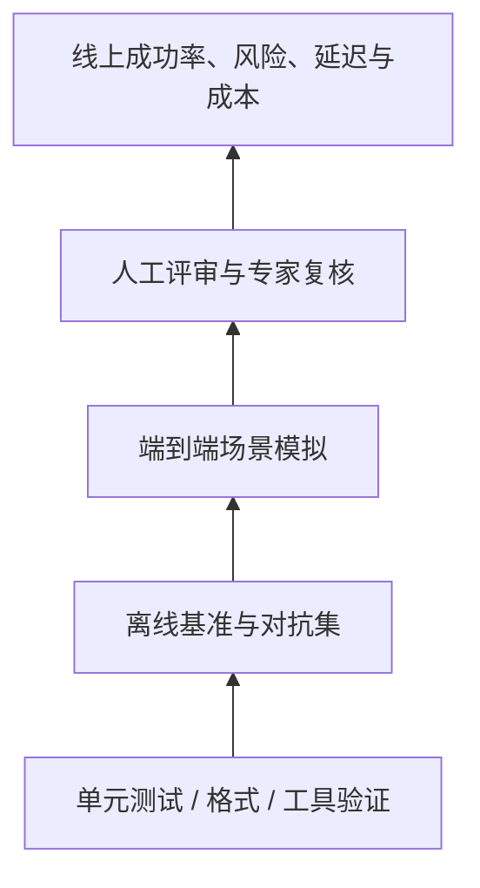

# 第 47 课　基准、LLM Judge 与实验设计

<div class="lesson-lead">评测不是模型训练结束后的排行榜，而是从需求开始定义“什么算成功、什么失败不能接受”。一个总分无法同时代表知识、推理、延迟、成本和安全。</div>

<figure class="teaching-figure"><figcaption>同一个输出要用多把尺检查：任务正确性、事实证据、鲁棒性、延迟、成本和风险。</figcaption></figure>

::: info 名校课程来源
本课把 [CS224N Benchmarking and Evaluation](https://web.stanford.edu/class/cs224n/slides_w26/cs224n-2026-lecture11-evaluation.pdf)、[CMU Evaluation Techniques](https://cmu-l3.github.io/anlp-spring2026/static_files/anlp-s2026-13-evaluation.pdf)、[Research Skills](https://cmu-l3.github.io/anlp-spring2026/static_files/anlp-s2026-14-experimentation.pdf) 与 [CS336 Lecture 12 可执行课件](/lectures/?trace=var/traces/lecture_12.json) 合并；原论文核对 [MMLU](https://arxiv.org/pdf/2009.03300.pdf) 和 [HELM](https://arxiv.org/pdf/2211.09110.pdf)。重点覆盖 benchmark 设计、动态/行为评测、污染、Judge 和置信区间。
:::

## 1. 建立评测金字塔

底层是单元测试和格式约束；中层是离线任务集；上层是端到端场景和真人反馈；上线后再看真实成功率、投诉、延迟和成本。越上层越接近用户，也越慢、越贵、噪声越大。



<figure class="teaching-figure source-figure"><a href="/lectures/images/hle-pipeline.png" target="_blank"></a><figcaption>CS336 Lecture 12 展示的 HLE 构建流水线。难题不是“从网上多抓一些选择题”：需要专家出题、自动与人工过滤、检查可验证性，再用模型评测。每一道过滤都改变最终 benchmark 测到的能力，因此数据构建过程本身也是实验设计。<a href="/lectures/?trace=var/traces/lecture_12.json">打开可执行课件</a>。</figcaption></figure>

## 2. 自动指标分别看什么

困惑度测 token 预测，不直接等于助手质量；BLEU/ROUGE 偏词面重合；embedding 指标偏语义相似；代码 pass@k 依赖测试覆盖；检索 Recall@k 不代表最终回答忠实。任何指标都要和失败案例一起读。

## 3. LLM-as-Judge 怎样减少偏差

Judge 擅长比较开放回答，但会有位置偏好、长度偏好、自家模型偏好和提示敏感性。较稳健流程是：打乱 A/B 顺序、明确评分量表、要求引用证据、重复多次、与人工标注校准，并报告一致率。Judge 不能成为唯一安全裁判。

## 4. 数据污染与“会背答案”

基准题可能出现在预训练或后训练数据中。检查精确匹配和近似匹配、使用时间切分、生成新变体、观察答案措辞异常一致。污染不能只靠模型自报。

## 5. 消融实验回答“为什么有效”

完整系统比基线高 5 分，只说明组合有效。要逐个去掉检索、重排、验证器、数据清洗或训练组件，并保持预算可比。若组件同时改变参数量和训练 token，就不能把收益全部归给架构。

## 6. 报告不确定性

不同采样种子、提示模板和数据子集会改变分数。至少报告样本数、均值、方差或置信区间；比较小差异时做配对分析。线上 A/B 还要防新奇效应和流量人群变化。

## 7. 成本也属于结果

同一准确率下，输入 token、输出 token、TTFT、TPOT、GPU 小时和人工标注量决定方法是否可用。论文中的“更强”必须补全“在什么预算下更强”。

## 8. Benchmark 的一个样本由什么组成

至少包含：

```text
输入 x + 参考信息/环境 + 允许的输出空间 + 评分函数 + 元数据
```

开放问答如果只有题目和一条参考答案，评分会把合理改写误判为错；Agent benchmark 还必须固定工具与环境；代码题需要隐藏测试和超时策略。

元数据应包含领域、难度、语言、时间、来源、作者与许可证，方便分层分析和污染检查。

## 9. 从静态题库走向行为评测

静态 benchmark 容易被训练数据吸收，且总分难解释。行为评测围绕一个能力构造最小对照：

```text
原题：所有 A 是 B，所有 B 是 C，A 是否是 C？
对照 1：打乱实体名
对照 2：加入无关段落
对照 3：交换前提顺序
对照 4：把结论改为否定
```

这能回答模型是否依赖表面模式、是否被干扰、是否理解否定，而不只知道“答对了多少题”。HANS 一类工作就是用受控例子揭示 NLI 模型的捷径。

## 10. Dynamic benchmark 解决什么、又带来什么

Model-in-the-loop 数据收集让标注者专门写当前模型会错的例子，持续刷新难度。优点是减少饱和并暴露新失败；风险是：

- 数据越来越针对某个模型族；
- 不同版本之间难直接比较；
- 标注者会形成新的套路；
- 维护成本高。

应保留冻结锚点集衡量长期趋势，同时用动态集探索新边界。

## 11. 多任务平均分怎样欺骗我们

假设模型在 10 个容易任务各提升 1 分，在 1 个高风险医疗任务下降 10 分，简单宏平均可能仍接近不变。聚合前要定义权重和底线：

- micro average 按样本数加权，大数据集占主导；
- macro average 每任务同权，小任务影响变大；
- geometric mean 对任何一项严重退化更敏感；
- minimum / pass threshold 适合安全底线。

主表给汇总，附表必须保留每任务、语言与难度分数。

## 12. 生成多样性不能只数不同字符串

Classical 指标如 distinct-n 统计不同 n-gram，比完全重复好，但可被随机词堆欺骗。语义多样性可以用 embedding 距离或聚类；Vendi Score 等信息论方法尝试综合样本间相似矩阵的有效秩。

多样性永远要与质量配对：生成 100 条彼此不同的错误答案不是好模型。

## 13. LLM Judge 的完整协议

一个可复核 judge prompt 至少包含：

1. 任务和必须使用的证据；
2. 分项 rubric，每个分数的锚点例子；
3. 待评回答，隐藏模型身份；
4. 输出 JSON schema；
5. 无法判断时的选项；
6. 是否允许参考答案或检索。

成对比较要做 A/B 与 B/A 两个顺序。若结果翻转，说明位置偏差大；可判平局，避免强迫 Judge 在接近答案间制造差异。

## 14. Generator–Validator Gap

有时模型判断一个答案是否正确比自己生成正确答案容易，这支持 Best-of-N；有时 Judge 与 Generator 共享盲点，验证并不更可靠。

应单独测验证器：给它正确、常见错误、对抗错误和长但空洞答案，画 ROC/校准曲线。不能因为“大模型更强”就默认它适合当 Judge。

## 15. Prompt 格式本身是评测变量

选择题的选项顺序、答案标签是 `A/B/C/D` 还是完整文字、是否要求 CoT、system prompt 和聊天模板，都能改变结果。公平比较要：

- 使用各模型官方推荐模板；
- 同时报告统一模板结果；
- 固定 few-shot 示例与顺序；
- 记录解码参数和最大 token；
- 对提示模板做敏感性分析。

## 16. 数据去污染不止精确查重

污染层级：

| 层级 | 例子 | 检查 |
|---|---|---|
| 题面 | 完整题目出现 | exact / normalized hash |
| 局部 | 关键句或代码片段出现 | n-gram / MinHash |
| 答案 | 题目不同但答案解释相同 | 语义检索 |
| 衍生 | 训练集含 benchmark 讲解、翻译、改写 | 来源与时间追踪 |

若无法获得训练数据，只能使用新鲜时间切分、私有测试、变体和措辞记忆探测，结论要标注不确定性。

## 17. 手算一个置信区间直觉

二分类准确率 $\hat p$、样本数 $n$ 的标准误差近似：

$$
SE\approx\sqrt{\frac{\hat p(1-\hat p)}{n}}
$$

若 $n=100,\hat p=0.70$，$SE\approx0.046$，95% 区间粗略为 $0.70\pm0.09$。此时 70% 对 73% 很可能只是抽样波动。

比较同一批题上的两个模型时应做配对 bootstrap 或 McNemar 类分析，因为两者错误相关；不能把两个独立区间简单比较。

### Python：配对 bootstrap 比较两个系统

```python
import random

def paired_bootstrap(correct_a, correct_b, rounds=10_000, seed=0):
    """两个列表逐题对齐，元素是 0/1；返回 A-B 的 95% 区间。"""
    assert len(correct_a) == len(correct_b)
    rng = random.Random(seed)
    n = len(correct_a)
    differences = []

    for _ in range(rounds):
        indices = [rng.randrange(n) for _ in range(n)]
        delta = sum(correct_a[i] - correct_b[i] for i in indices) / n
        differences.append(delta)

    differences.sort()
    return differences[int(0.025 * rounds)], differences[int(0.975 * rounds)]
```

每轮不是分别抽 A、B 的题，而是抽同一组题号，所以保留了“这道题对两个系统都难”的相关性。若区间跨过 0，就不能仅凭这批样本断言 A 稳定优于 B；这也不等于两个系统完全相同，只说明现有证据还不够强。

## 18. Error bar 之外还要看标注误差

统计区间只反映抽样不确定性，不包含：

- 题目标错；
- Judge 偏差；
- 模型 API 非确定性；
- 数据版本漂移；
- 解析与评分代码 bug。

随机抽查错题和边界题，报告标注一致率，对高风险集进行专家复核。

## 19. 一份严谨评测报告的最小结构

```text
1. 使用场景与失败代价
2. 数据来源、时间、语言、样本量
3. 模型、模板、解码与工具版本
4. 主指标 + 分层指标 + 成本指标
5. 置信区间 / 配对显著性
6. 污染、Judge 与标注审计
7. 代表成功、失败和边界案例
8. 可复现文件与已知限制
```

## 本课自测

1. LLM Judge 有哪些系统性偏好？
2. 为什么端到端提升不能直接归因于某一个模块？
3. 0.5 分提升在什么情况下没有意义？

下一课处理评测之外的风险：[可解释性、安全与攻击防护](/beginner/37-safety)。

<ChapterReadings lesson="36-evaluation-research" />
