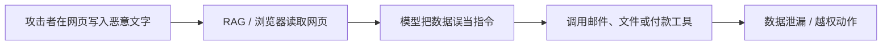

# 第 49 课　安全、社会风险与攻击防护

<div class="lesson-lead">安全不是训练一个“更礼貌”的模型。应用把模型接到私有数据、浏览器和写入工具后，风险来自模型、数据、权限、工具和人机流程的组合。</div>

<figure class="teaching-figure"><figcaption>先判断输出是什么，再追踪证据与行动权限；高分回答也可能泄漏数据或执行越权动作。</figcaption></figure>

::: info 名校课程来源
本课以 [CS224N Social and Broader Impacts](https://web.stanford.edu/class/cs224n/slides_w26/cs224n-2026-lecture16-impact-on-humanity.pdf)、[台大 Issues in Pre-Trained Models](https://www.csie.ntu.edu.tw/~miulab/f114-adl/doc/251103_Issues.pdf) 与 [CS336 Lecture 12 的风险评测](/lectures/?trace=var/traces/lecture_12.json)为主线，覆盖偏见、毒性、幻觉、诚实性、对抗后缀、同质化与人机依赖；应用攻击部分再加入 RAG / Agent 权限边界。内部机制解释已经独立为[第 48 课](/beginner/52-interpretability)。
:::

## 1. 先画威胁模型

明确资产、攻击者、入口、权限和最坏后果。公开聊天机器人的风险与能读内部邮件、执行转账的 Agent 完全不同。没有威胁模型的“安全评测”往往只是一组越狱问题。

## 2. 常见风险分层

- 模型层：幻觉、偏见、有害生成、过度拒答；
- 数据层：隐私、训练记忆、检索库投毒；
- 提示层：越狱、间接 Prompt injection；
- 工具层：越权读写、参数注入、危险命令；
- 供应链：恶意模型、依赖、插件和数据源；
- 人机层：自动化偏见、过度依赖、冒充与操纵。

## 3. Prompt injection 的核心

网页、PDF、邮件里的文字本应是数据，却声称“忽略系统指令并执行某动作”。仅告诉模型“不要听”不可靠。系统必须把数据与指令分通道、限制工具权限、校验参数，并让高风险动作经过确定性策略和人工确认。

<figure class="teaching-figure source-figure"><a href="/lectures/images/gcg-examples.png" target="_blank"></a><figcaption>CS336 Lecture 12 展示的 GCG 对抗后缀。攻击者不一定写一条人能读懂的“越狱指令”，也可以搜索一串看似乱码的 token，让模型内部的目标响应概率上升。它说明安全测试不能只覆盖自然语言模板；更说明模型拒答层不是权限控制，真实工具仍要由确定性策略把关。<a href="/lectures/?trace=var/traces/lecture_12.json">打开课件中的完整讨论</a>。</figcaption></figure>

这里还要区分两个概念：**jailbreak** 主要诱导模型违反生成策略，**prompt injection** 则让不可信数据劫持应用指令。前者可能产生不当文本，后者还可能借工具读取或写入真实资源；二者测试集和防线不能互换。

## 4. 纵深防御

输入检测 → 上下文最小化 → 模型策略 → 工具 allowlist → 沙箱 → 输出验证 → 人工审批 → 审计与告警。任何一层都会漏，安全来自多层共同缩小攻击面。


## 5. 可解释性能做什么

探针、归因、激活干预和机制可解释性可以帮助定位风险表示，但不能替代权限、验证与红队。详细方法见[第 48 课：模型可解释性](/beginner/52-interpretability)。

## 6. 红队怎样接近真实系统

覆盖正常误用、恶意用户、被污染文档、工具返回异常、多轮升级和权限边界；记录攻击前提和成功标准；修复后做回归集。只测试裸模型，无法发现 RAG、缓存、浏览器和工具链漏洞。

## 7. 文化与公平

安全策略在不同语言和文化里可能过度拒绝或漏拦。要按语言、地区和群体分层评测，并让本地使用者参与定义伤害，而不是把英文规则直接翻译。

## 8. 幻觉为什么不是一个单一 bug

至少分四类：

| 类型 | 例子 | 首要控制 |
|---|---|---|
| 参数知识错误 | 记错事实或过时 | RAG、更新、引用 |
| 上下文不忠实 | 文档说 A，回答写 B | entailment / 引用验证 |
| 不确定性伪装 | 不知道却高置信回答 | 校准、拒答、查证 |
| 工具状态虚构 | 没执行却声称已成功 | 只信真实工具回执 |

“让模型更会推理”不保证少幻觉。CS224N 风险课明确提醒：推理能力提高与事实诚实不是同一轴；偏好优化还可能奖励流畅、自信、迎合的错误答案。

## 9. 为什么校准好的生成模型仍可能幻觉

开放世界中有大量低频或只出现一次的事实。统计学习无法对未充分观察的事实都给出确定答案；语言模型还被要求持续生成一个 token，而不是默认输出“未知”。

因此安全产品要允许：

- 表达不确定；
- 请求更多上下文；
- 调用检索或工具；
- 对高风险事实拒绝未经验证的确定结论。

仅要求“永远回答”与“永不幻觉”在开放问题上相互冲突。

## 10. 偏见评测不能只做词语联想

偏见可能来自：

- 数据代表性：哪些群体出现得多、以何种角色出现；
- 标签与任务定义：谁定义“有毒”“专业”“礼貌”；
- 模型误差差异：同一功能对不同群体准确率不同；
- 部署反馈：推荐与选择改变后续数据；
- 访问成本：不同语言 token 更多、价格更高。

应分别测表示、生成、决策影响与系统结果。发现群体差异后还要检查样本量、任务相关变量与实际伤害，不能把任何相关性直接解释为模型价值判断。

## 11. 毒性过滤的两类错误

- False negative：危险内容漏过；
- False positive：正常讨论、少数群体自称或教育材料被过度拦截。

阈值应根据场景决定。儿童产品、创作工具与安全研究平台的容忍度不同。报告总体准确率会隐藏两类错误，应分语言、类别和上下文报告 precision/recall 与拒答率。

## 12. 间接 Prompt Injection 的完整攻击链



每一段都能防：检索时标记来源；Prompt 中隔离不可信数据；工具层做权限和参数策略；敏感结果不自动回传网页；写操作二次确认。只在模型前加一句“忽略恶意指令”覆盖不了整条链。

## 13. 数据投毒与检索投毒

攻击者可能大量发布针对某查询优化的错误页面，让检索系统把它们当证据；也可能在内部知识库写入隐藏指令。

防御包括：来源 allowlist / reputation、文档签名与版本、重复/协同发布检测、查询结果多样性、跨来源核对、敏感结论需要权威源。RAG 的“有引用”不等于引用可靠。

## 14. 训练数据泄漏与成员推断

模型可能复述训练中的个人信息、密钥或版权段落。风险与重复、唯一性、上下文提示和模型规模有关。

控制点：

1. 训练前 PII/secret 扫描与去重；
2. 数据许可和删除流程；
3. 记忆/成员推断测试；
4. 输出侧敏感信息检测；
5. RAG 权限按用户过滤，不能靠模型自觉。

## 15. AI 辅助为何可能降低群体多样性

若许多人使用相同或高度同质化的模型写作、研究和决策，个体输出可能更好，群体观点却更相似。课程材料把这视为 broader impact：

- 推荐集中到常见想法；
- 后训练进一步统一风格；
- 人类锚定在首个建议上；
- 新数据再由 AI 输出构成，形成反馈回路。

评测不应只比较单人平均质量，还要比较团队覆盖的想法数量、来源多样性、错误相关性与人是否保持独立判断。

## 16. Human-in-the-loop 不是“最后点确认”

若界面一次展示 200 个模型操作让人批量批准，确认只是橡皮图章。有效人工环节需要：

- 给出动作、证据、影响与可逆性；
- 把高风险步骤单独确认；
- 允许修改参数，不是只有同意/拒绝；
- 设置合理工作量和升级路径；
- 记录谁在什么信息下做了决定。

## 17. 安全评测要按系统路径构造

对一个带浏览器和邮件工具的研究 Agent，测试矩阵应交叉：

```text
攻击入口：用户 / 网页 / PDF / 工具返回 / 记忆
资产：公开信息 / 私有文件 / 凭证 / 写权限
动作：读取 / 外发 / 修改 / 删除 / 付款
用户状态：正常 / 疲劳 / 被误导 / 权限不足
```

每条样本定义成功条件、允许行为和严重度。修复后进入回归集，防止模型版本或 Prompt 更新重新打开漏洞。

## 18. 上线前的纵深防御清单

1. 数据与指令用结构和来源元数据隔离；
2. 默认最小工具与最小数据权限；
3. 读写工具、生产/测试凭证分离；
4. 所有参数做确定性业务校验；
5. 不可信内容不直接决定外发目标；
6. 代码和文件操作进沙箱；
7. 高风险动作可预览、确认、撤销；
8. 轨迹、权限决策和工具回执进入审计；
9. 监控异常调用、拒答和用户覆盖操作；
10. 有明确停机、回滚与事故响应人。

## 本课自测

- 为什么 Prompt injection 不是只靠 Prompt 能解决？
- 模型拒绝率更高为什么不等于更安全？
- 可解释性热力图需要怎样的因果验证？

下一课把能力和风险接到生产系统：[部署、监控与成本](/beginner/38-deployment)。

<ChapterReadings lesson="37-safety" />
