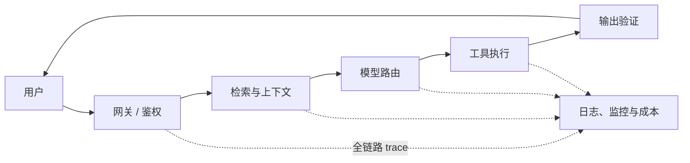
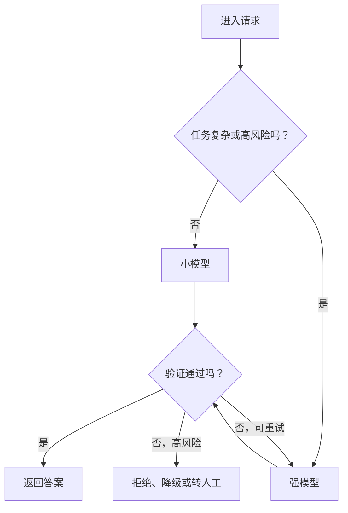
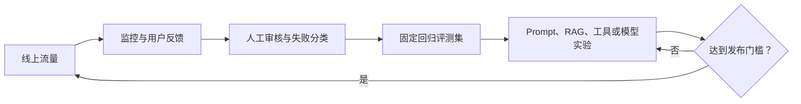

# 第 50 课　部署、监控与成本

<div class="lesson-lead">上线不是把 notebook 包成 API。真正的 LLM 产品需要确定版本、数据边界、回退路径、观测指标和预算；否则模型一更新，整个系统的行为可能悄悄变化。</div>

<figure class="teaching-figure"><figcaption>用户看到一个回答，背后经过网关、检索、模型服务、工具、验证、日志和反馈多层系统。</figcaption></figure>

::: info 名校课程来源
本课把三门主干课中的系统与实验思想落到上线环节，重点参考：

- [CS224N：Pretraining、Scaling、Systems 与 Data](https://web.stanford.edu/class/cs224n/slides_w26/cs224n-2026-lecture07-pretraining.pdf)；
- [CS224N：Final Project Practical Tips](https://web.stanford.edu/class/cs224n/slides_w26/cs224n-2026-lecture06-final-project.pdf)；
- [CMU ANLP：Parallelism and Distributed Training](https://cmu-l3.github.io/anlp-spring2026/static_files/anlp-s2026-20-scaling-parallelism.pdf)；
- [台大 ADL：NLP Project Lifecycle](https://www.csie.ntu.edu.tw/~miulab/f113-adl/doc/w2-ProjLife.pdf)。
- [CMU LLM Applications：Deployment](https://storage.googleapis.com/cmu-llms/2026/2026-03-16-deployment.pdf) 与 [CS336 Lecture 10 可执行课件](/lectures/?trace=var/traces/lecture_10.json)。

模型推理细节可和[第 38 课：推理服务系统](/beginner/32-serving-systems)对照阅读；本课更关心整个应用怎样持续、可控地运行。
:::

## 1. 先画端到端请求链

网关 → 鉴权 → 输入检查 → 会话 / Prompt 构造 → 检索 → 模型路由 → 工具调用 → 输出验证 → 引用与展示 → 日志。每一段都要有超时、错误码和降级方案。



请求链的每条边都可能失败。为每个节点写一张“运行契约”：输入是什么、多久算超时、能重试几次、失败时返回什么、日志记录什么。这样故障发生时，团队才能定位是检索、模型、工具还是展示层。

<figure class="teaching-figure source-figure"><a href="/lectures/images/inference-schema.png" target="_blank"></a><figcaption>CS336 Lecture 10 的推理系统图把“调用模型”拆成请求入口、调度与批处理、KV 管理、模型执行和 GPU kernel。应用层的 trace 还要继续穿过检索与工具；只有每层都有版本、延迟和错误信息，端到端告警才能定位到具体瓶颈。<a href="/lectures/?trace=var/traces/lecture_10.json">打开可执行课件</a>。</figcaption></figure>

## 2. 先定义 SLO，再选机器

SLO 是系统承诺达到的服务目标，例如：

- 99.9% 请求能得到有效响应；
- P95 首 Token 延迟小于 1.5 秒；
- P95 完整回答小于 8 秒；
- 引用支持率至少 95%；
- 高风险动作 100% 经过确认。

其中 P95 表示：把 100 次请求按耗时排序，第 95 个请求的耗时。平均值可能很好看，却掩盖尾部大量慢请求。

::: tip 不要混淆 SLA 与 SLO
SLO 是团队内部的工程目标；SLA 通常是对客户的正式承诺，达不到可能需要赔偿。工程上应让 SLO 比 SLA 更严格，留出安全余量。
:::

## 3. 模型路由与回退

简单任务可用小模型，复杂或高风险任务升级到大模型；某供应商失败时切备用模型；检索超时时返回受限答案而不是编造。路由规则要用真实流量验证，避免分类器误判抵消成本收益。



回退必须保持能力边界。例如主模型可以调用付款工具，备用模型没有经过工具安全评测，那么切换后应关闭付款能力，而不是只换一个模型名称继续执行。

## 4. 可观测性看四层

- 系统：QPS、TTFT、TPOT、P95/P99、OOM、错误率；
- 模型：拒答、格式失败、长度、工具调用成功率；
- 任务：问题解决率、引用正确率、测试通过率；
- 风险：注入命中、敏感数据、越权尝试和人工升级。

日志应可关联一次请求的检索片段、模型版本、Prompt 版本、工具结果和最终输出，同时执行最小留存与脱敏。

一次请求可以用 `trace_id` 串起来：

```text
trace_id: 8f2...
prompt_version: tutor-v17
retrieval_index: book-2026-08-01
model: k3-serving-r4
tool_calls: [search_course_material]
validation: citation_supported=true
latency_ms: {retrieval: 80, prefill: 310, decode: 920}
```

不要默认记录完整 Prompt。它可能含个人信息、公司机密或系统提示。可以保存经过脱敏的字段、哈希、统计量和有限期样本。

## 5. 版本管理与发布

把模型、系统 Prompt、检索索引、工具 schema、后处理和评测集都视为版本化组件。上线采用 shadow、canary、A/B 和逐步放量；保留一键回滚。只记录“用了某模型名”不足以复现。

四种发布方式回答的问题不同：

| 方法 | 用户会看到新版本吗 | 主要用途 |
| --- | --- | --- |
| Shadow | 不会 | 用真实流量比较延迟和输出，风险最低 |
| Canary | 少量用户会 | 尽早发现线上故障 |
| A/B | 两组用户分别看到 | 比较业务与体验指标 |
| 逐步放量 | 从 1% 增到 100% | 控制影响范围，随时回滚 |

回滚也要回滚“组件组合”。只把模型退回旧版、却保留新版 Prompt 和索引，可能得到从未测试过的组合。

## 6. 成本怎么算：做一次手算

端到端成本 = 模型输入 / 输出 token + embedding / rerank + 检索存储 + 工具 + GPU 空闲 + 监控 + 人工审核。缓存能省重复前缀和确定性结果，但必须考虑用户隔离、版本失效和隐私。

假设一天有 10 万次请求，每次平均输入 2,000 Token、输出 500 Token。若每百万输入 Token 为 2 元、每百万输出 Token 为 8 元，则每日模型成本是：

$$
100{,}000\times\left(\frac{2{,}000}{10^6}\times2 + \frac{500}{10^6}\times8\right)=800\text{ 元}
$$

如果 RAG 把无关上下文从 2,000 Token 降到 1,200 Token，在其他条件不变时，每天可少花：

$$
100{,}000\times\frac{800}{10^6}\times2=160\text{ 元}
$$

这说明“检索更准”不仅提升答案质量，也会减少 Prefill 时间和 Token 费用。但压缩过度又会损失证据，因此要同时画质量—延迟—成本曲线。

### Python：先把费用假设写成可复查函数

```python
def daily_token_cost(
    requests,
    avg_input_tokens,
    avg_output_tokens,
    input_price_per_million,
    output_price_per_million,
):
    input_cost = requests * avg_input_tokens / 1_000_000 * input_price_per_million
    output_cost = requests * avg_output_tokens / 1_000_000 * output_price_per_million
    return {"input": input_cost, "output": output_cost, "total": input_cost + output_cost}

print(daily_token_cost(100_000, 2_000, 500, 2, 8))
# {'input': 400.0, 'output': 400.0, 'total': 800.0}
```

真实账单还要把缓存命中率、重试、RAG、rerank、工具、GPU 空闲与人工审核加进去。这个小函数的意义不是精确预测，而是强迫每个数字都有单位和来源，并能做 1 万/10 万/100 万请求的敏感性分析。

### 6.1 容量估算的最小框架

先区分：

- **平均吞吐**决定长期资源量；
- **峰值吞吐**决定高峰是否排队；
- **上下文长度分布**决定显存和 Prefill 压力；
- **输出长度分布**决定 Decode 占用时间；
- **并发会话数**决定 KV Cache 容量。

只用“平均每秒请求数”压测，会漏掉长对话、批量上传和突发流量。

## 7. 缓存不是越多越好

常见缓存有三类：

1. **Prompt 前缀缓存**：复用相同系统提示和文档前缀；
2. **检索缓存**：复用查询改写、Embedding 或检索结果；
3. **答案缓存**：对完全相同且稳定的问题直接返回结果。

缓存键至少要包含模型 / Prompt / 索引版本、用户权限和影响答案的参数。否则 A 用户有权读取的内容，可能通过缓存泄露给 B 用户。涉及实时库存、余额或撤回文档时，要有明确失效机制。

## 8. 数据闭环

收集失败样本，先分类是解析、召回、推理、工具还是展示问题；经过隐私与质量审核后进入评测集，再决定改 Prompt、RAG、工具或训练。不要把所有差评直接喂回模型。



线上数据进入训练前还要处理同意、许可、个人信息、重复样本和反馈偏差。经常反馈的用户不一定代表所有用户。

## 9. 故障演练与事故响应

上线前主动演练这些情况：检索库为空、模型 API 超时、工具返回畸形 JSON、长输入导致 OOM、第三方服务限流、索引误发旧版本、恶意 Prompt 诱导越权。

事故发生时按统一顺序处理：

1. 限制影响：关工具、切只读、降级或回滚；
2. 保留证据：记录版本、trace 和时间线；
3. 修复根因：不要只对某一句失败 Prompt 打补丁；
4. 增加回归样本和监控；
5. 写清影响范围、后续负责人和完成时间。

## 10. 离线评测与线上指标为何会打架

新模型离线正确率更高，却可能因为输出更长导致延迟和成本翻倍；路由系统平均成本下降，却可能把少数高风险问题交给弱模型；更严格的安全策略降低事故，却提高无害请求的拒答率。

因此发布门槛要同时约束：质量、安全、延迟、成本和业务结果。任何单一平均分都不能代表上线成功。

## 11. 上线检查表

有明确 SLA；有离线与在线门槛；危险工具最小权限；数据可删除；日志可追溯；故障可降级；版本可回滚；成本有上限；重大动作有人确认。

### 最小可运营清单

- [ ] 每个请求能追溯模型、Prompt、索引和工具版本；
- [ ] P50 / P95 / P99 延迟按输入长度分桶；
- [ ] 空检索、超时、OOM、越权都有预期行为；
- [ ] 新版经过固定回归集、Shadow 和小流量 Canary；
- [ ] 缓存遵守用户权限并有失效策略；
- [ ] 日成本、峰值资源和人工审核成本都有预算；
- [ ] 数据留存、删除和训练用途对用户透明；
- [ ] 回滚按钮、值班负责人和事故流程真实演练过。

## 12. 动手练习：为课程助手做发布方案

请为本教程的答疑助手写一页发布卡：

1. 选择 5 个离线质量指标和 4 个线上运行指标；
2. 给出 Shadow → 1% Canary → 10% → 50% → 100% 的放量门槛；
3. 计算每日 1 万、10 万、100 万请求的 Token 费用；
4. 规定模型、课件索引或工具失败时分别怎样降级；
5. 写出一个必须立即回滚的红线指标。

## 本课自测

1. 为什么 Prompt 也必须版本化？
2. 模型成本之外还有哪些主要成本？
3. 用户差评为什么不能直接作为训练数据？
4. 平均延迟下降，为什么 P95 仍可能恶化？
5. 为什么只回滚模型、没有回滚 Prompt 和索引仍不安全？

最后补上做研究与读论文的统一方法：[怎样做一次可信研究](/beginner/39-research-method)。

<ChapterReadings lesson="38-deployment" />
