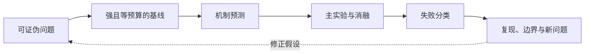
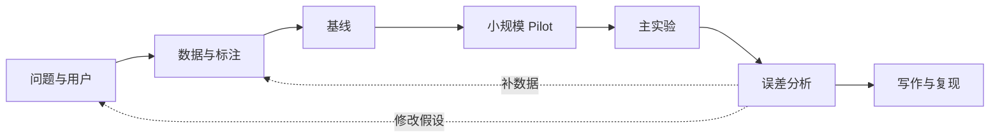

# 第 51 课　怎样做一次可信的大模型研究

<div class="lesson-lead">学完整套方法后，最后要学会判断证据。研究不是“换一个模块再刷榜”，而是提出可证伪问题、控制预算、解释机制，并诚实报告失败与边界。</div>

<figure class="teaching-figure"><figcaption>第一遍画问题地图，第二遍拆机制和代价，第三遍审实验、基线和可复现性。</figcaption></figure>

::: info 名校课程来源
本课直接 follow [CMU Research Skills and Experimental Design](https://cmu-l3.github.io/anlp-spring2026/static_files/anlp-s2026-14-experimentation.pdf) 与 [CS224N Final Project Practical Tips](https://web.stanford.edu/class/cs224n/slides_w26/cs224n-2026-lecture06-final-project.pdf)，再接入[台大 NLP Project Lifecycle](https://www.csie.ntu.edu.tw/~miulab/f113-adl/doc/w2-ProjLife.pdf)和 [CS336 从零构建课程](/lectures/?trace=var/traces/lecture_01.json)。四门课共同强调：问题、数据、模型、指标、基线和误差分析必须一起设计。
:::

## 1. 把主题改写成问题

“研究 RAG”太宽；“在相同延迟和生成模型下，加入 cross-encoder reranker 是否提高多跳问题的证据召回与引用正确率？”才可检验。问题里应出现对象、改变、控制变量和指标。

## 2. 先建最小可信基线

基线要强、公开、可复现，并使用相同数据和预算。复杂系统还要有简单规则、不开启新组件和等成本替代方案。弱基线会夸大贡献。

<figure class="teaching-figure source-figure"><a href="/lectures/images/design-decisions.png" target="_blank"></a><figcaption>CS336 的课程总图提醒我们：一次语言模型实验同时受基础实现、系统、Scaling、数据与对齐决策影响。若声称新 Attention 架构有效，却同时换了数据过滤和学习率，结果就有多个解释。可信实验要冻结无关列，只改变当前假设对应的变量。<a href="/lectures/?trace=var/traces/lecture_01.json">打开可执行课件</a>。</figcaption></figure>

## 3. 做一张实验账本

记录代码提交、数据版本、随机种子、模型与 tokenizer、硬件、超参数、Prompt、失败运行和总计算量。先跑小规模 sanity check，再申请完整预算。

## 4. 消融与机制预测

在实验前写下预测：如果模块真通过“减少 KV IO”生效，它应在哪种序列长度和硬件上收益最大？若所有场景都同样提升，可能还有别的原因。消融不是机械删模块，而是检验机制预测。



## 5. 失败分析比平均分更有用

把错误按数据、表示、检索、推理、生成、工具、评测器分类；每类抽样阅读。平均分提高但某高风险类别下降，不能宣称全面更好。

## 6. 复现的三层标准

- 结果复现：同设置得到接近数值；
- 结论复现：不同实现仍支持同一趋势；
- 机制复现：干预实验支持作者解释。

论文没有开放全部训练数据时，也可复现局部算法、资源账本和关键消融，并明确哪些结论无法验证。

## 7. 怎样使用本站的名校资料

先在主教程学统一概念；需要更深时去[课程来源](/courses/)看相应 Slides；再从[名校课程知识覆盖表](/curriculum/sources)追踪一个知识点来自哪些讲次；最后读[论文库](/papers/)的原文和证据。不要从 373 份课程资料第一页顺序读到最后一页。

## 8. 从好奇心到可证伪假设

研究问题可以来自两条路：

- Curiosity-driven：为什么长上下文模型在中间位置更差？
- Application-driven：怎样让法律 RAG 的引用错误率降到 1% 以下？

都要改成带方向的假设：

```text
如果失败来自 reranker 无法联合理解多个证据，
那么在相同召回和生成预算下，加入 listwise reranking
应主要提高多跳样本的 citation recall，
而对单跳样本提升较小。
```

这段话已经给出了机制、控制变量、受影响子集和预期结果，可被实验推翻。

## 9. 先画变量表，防止实验悄悄改变很多东西

| 类型 | RAG 示例 |
|---|---|
| 自变量 | 是否使用 cross-encoder reranker |
| 因变量 | 证据召回、回答正确、延迟 |
| 控制变量 | 文档库、chunk、top-k、生成模型、Prompt |
| 混杂变量 | 新模型同时更大、输入更长、数据更新 |
| 分层变量 | 单跳/多跳、语言、文档长度 |

若换 reranker 时也把 top-k 从 5 提到 20，无法知道提升来自模型还是更多上下文。

## 10. Pilot experiment：先用最小规模让想法有机会失败

正式训练前做：

1. 读 20–50 个真实样本，确认问题存在；
2. 用最简单规则基线跑通数据流；
3. 在极小数据上过拟合，确认代码能学习；
4. 人工检查输入、标签和评分；
5. 估算一轮完整实验的时间与费用。

小模型没任何趋势时，直接把预算扩大 100 倍通常不是严谨理由。

## 11. 数据集划分怎样防泄漏

随机划分不总是合适：同一用户、仓库、患者、文档模板或网页镜像可能跨 train/test。

- 按实体分组：同一人/项目不跨集合；
- 按时间：测试来自训练截止日之后；
- 按来源：某站点或机构完全留出；
- 去重后划分，而不是划分后各自去重；
- 超参数只看 validation，test 最后一次打开。

大模型研究还要检查基础模型预训练污染，无法确认时必须在限制中说明。

## 12. 标注规范本身需要实验

“回答是否有帮助”太模糊。标注指南应包含：

- 任务定义与范围；
- 正例、反例和边界例；
- 多标签冲突如何处理；
- 不确定/无法判断选项；
- 隐私和心理风险；
- 争议样本的仲裁。

先做小批次，计算一致率并访谈标注者。低一致率可能说明概念没有定义好，而不只是“标注员质量差”。

## 13. 样本量由你想检测的差异决定

样本越少，区间越宽。研究前应写最小有意义差异：例如引用正确率提升 0.5% 是否值得增加 2 倍延迟？若不值得，就不需要为极小差异堆巨大样本。

配对任务中，同一题比较两个系统通常比独立样本更省数据；生成任务的人工评分方差大，需要多评审或更明确 rubric。

## 14. Baseline 不是越多越好，而是要排除替代解释

针对一个新 reranker，至少需要：

- 无 reranker；
- 规则/BM25 或轻量 reranker；
- 同计算预算的强公开模型；
- Oracle 上界（若能构造）；
- 随机或无信息 sanity baseline。

Oracle 告诉你检索阶段最多还能提升多少；若 Oracle 也不能改善回答，瓶颈可能在生成或数据。

## 15. 消融矩阵应围绕机制，而不是列零件清单

若声称模块通过长距离路由有效，消融应改变路由距离、长短样本和通信代价；只做“有/无模块”不能验证机制。

```text
机制预测 → 最敏感条件 → 对照干预 → 可观察结果
```

对 Kimi K3 这类系统论文，可问：如果 MLA 的价值主要是 KV 压缩，收益是否随 batch 与上下文增大？如果只在小 batch 也同样快，可能还有 kernel 或实现差异。

## 16. 负结果怎样写得有价值

负结果不等于“没做出来”。需要说明：

- 假设在什么设置下失败；
- 置信区间能排除多大收益；
- 实现经过哪些 sanity check；
- 哪些子群可能仍有效；
- 对未来设计约束了什么。

“没有显著提升”与“证明完全无效”不同；预算不足或指标噪声大时只能得出有限结论。

## 17. 研究日志怎样记录失败运行

每次运行保存：

```text
run_id / git commit / data version / model & tokenizer
seed / config / hardware / start-end time / cost
train curves / eval outputs / errors / 人工备注
```

不要删除崩溃或低分运行，它们可揭示稳定性与选择偏差。只挑最好 seed 报告会夸大方法。

## 18. 论文图表应让读者看到代价和不确定性

- 轴与单位完整，避免截断 y 轴制造巨大提升；
- 误差条说明是标准差、标准误还是置信区间；
- 表中标出样本量和最好/第二好规则；
- 能力与成本同图或同表；
- 不用过多小数暗示虚假精确；
- 分层结果放在可访问附录。

一张最小结果表可以长这样：

| 系统 | 主要改动 | 质量 ↑ | P95 延迟 ↓ | 费用/千样本 ↓ | 95% CI | 失败边界 |
|---|---|---:|---:|---:|---|---|
| 基线 | 无 reranker | 72.1 | 820 ms | ¥4.2 | [70.4, 73.8] | 多跳召回低 |
| 方法 A | cross-encoder | 75.0 | 1,140 ms | ¥5.1 | [73.4, 76.6] | 长文成本高 |
| 等预算对照 | 增大 top-k | 73.0 | 1,130 ms | ¥5.0 | [71.3, 74.7] | 噪声增多 |

这里只是格式示例，不是实验结果。它强迫主张同时面对强基线、等预算替代解释、统计不确定性和工程代价；不能只把最高的质量数字加粗就结束。

## 19. 三门课共同指向的项目生命周期



模型只是中间一环。若 Demo 很漂亮但数据与评测不可信，项目没有完成研究闭环。

## 20. 进入 K3 案例前的证据卡

阅读每个 K3 模块时填写：

```text
主张：作者声称什么？
机制：为什么应该有效？
代价：参数、FLOPs、显存、通信、数据？
对照：与谁比较，预算是否相同？
证据：主实验、消融、曲线、统计？
边界：什么没有披露或无法复现？
迁移：换硬件、长度、语言后还成立吗？
```

这比摘抄论文结论更接近研究能力。

## 毕业检查

你应该能画出一个 LLM 从数据、预训练、后训练、量化、服务、RAG / Agent 到评测与安全的完整系统，并对每个组件回答：解决什么、怎样工作、花什么代价、怎样证明。

现在进入总案例：[Kimi K3 全景拼装](/beginner/09-k3-map)，再继续[第 0 章：K3 到底是什么](/guide/ch00)。

<ChapterReadings lesson="39-research-method" />
