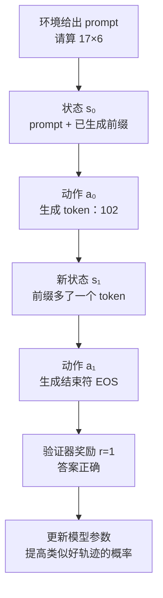
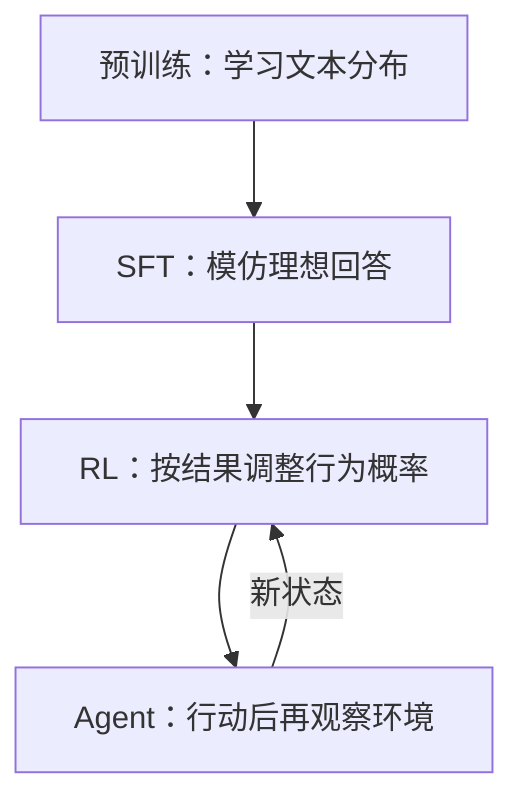

# 第 25 课　把语言模型写成强化学习问题

先别背 PPO、GRPO。强化学习最先要做的，只是把任务说清楚：谁在行动？它看见什么？能做什么？做完以后怎样知道好坏？如果这四件事没定义清楚，后面的公式再漂亮也没有意义。

::: info Berkeley 课程来源
本课主要重组 Berkeley CS 185/285 的 [L01 导论](/courses/berkeley-deeprl-2026#l01-导论强化学习解决什么问题)、[L04 RL Basics](https://rail.eecs.berkeley.edu/deeprlcourse/static/slides/lec-4.pdf) 与 [L14 LLM RL](https://rail.eecs.berkeley.edu/deeprlcourse/static/slides/lec-14.pdf)。原课从机器人和通用 RL 出发；本站把同一套语言换成 LLM 初学者能直接使用的版本。
:::

## 1. 先看一轮问答怎样变成“行动”

图里有五个主角：

| RL 名称 | 在聊天模型中 | 在工具 Agent 中 |
|---|---|---|
| Agent / policy | 当前语言模型 | 语言模型 + 工具选择策略 |
| observation | prompt、对话历史 | 页面、终端输出、工具返回值 |
| state | 用来决定下一动作的信息 | 历史、记忆、任务进度；真实世界状态可能不可见 |
| action | 一个 token 或一整段回答 | 搜索、点击、写代码、调用 API |
| reward | 偏好分、正确性、格式分 | 任务完成率、测试通过、成本或安全惩罚 |

这里的 **policy（策略）** 就是“看到当前状态后，各个动作分别有多大概率”：

$$
\pi_\theta(a_t\mid s_t)
$$

对语言模型来说，它就是熟悉的 next-token 概率。$θ$ 是模型参数，$s_t$ 是 prompt 加已生成前缀，$a_t$ 是下一个 token。

<figure class="teaching-figure source-figure"><figcaption>Berkeley CS285 Lecture 14 的“一步 RL”画法。prompt 是状态 $s$，完整 completion 是动作 $a$，自回归模型给整段动作的概率 $p(a\mid s)=\prod_t p(a_t\mid s,a_{1:t-1})$，验证器或偏好模型给 $r(s,a)$。把动作展开，就得到本页的 token 级多步过程；两种画法没有冲突。<a href="https://rail.eecs.berkeley.edu/deeprlcourse/static/slides/lec-14.pdf#page=20">打开原课件第 20 页</a>。</figcaption></figure>

## 2. 两种等价但用途不同的画法

### 画法 A：整段回答是一个动作

prompt 是状态，完整 completion 是动作，最后给一个奖励。它简单，适合解释偏好数据：“回答 A 比回答 B 好”。

### 画法 B：每个 token 是一步动作

每生成一个 token，状态就多一个 token，直到 `<eos>`。它更细，适合讨论中间奖励、价值函数和长推理的信用分配。

::: tip 不要争论谁“才是正确的”
两种画法描述同一个生成过程，只是放大倍数不同。若奖励只在答案末尾出现，整段动作最省事；若要判断哪一步推理导致失败，token 级轨迹更有用。
:::

## 3. 轨迹：一次完整尝试

一次从 prompt 到结束的过程叫 **trajectory（轨迹）**：

$$
\tau=(s_0,a_0,r_0,s_1,a_1,r_1,\ldots,s_T)
$$

例如代码 Agent 的轨迹不是只有最终代码，而可能是：读需求 → 搜索文件 → 修改代码 → 跑测试 → 看到报错 → 再修改 → 测试通过。最终奖励相同的两条轨迹，耗时、token 成本和风险却可能完全不同，所以真实系统常把奖励写成：

$$
r=\text{任务成功}-\lambda_1\text{成本}-\lambda_2\text{危险动作}
$$

## 4. 监督学习和强化学习到底差在哪

| 问题 | SFT | RL |
|---|---|---|
| 数据告诉模型什么 | “这个位置应输出哪个 token” | “整次尝试得了多少分” |
| 是否必须有标准答案文本 | 通常需要 | 不一定，只要能评价结果 |
| 能否探索新的解法 | 主要模仿数据中的解法 | 可以采样并强化新发现的有效解法 |
| 主要难点 | 高质量示范昂贵 | 奖励、探索、信用分配和稳定性 |

所以 RL 不是“更高级的 SFT”。它特别适合 **答案容易验证、正确轨迹却难手写** 的任务，例如代码测试、数学答案、工具调用和游戏环境。

## 5. 为什么预训练模型还不是 Agent

预训练优化的是“像训练文本”，不等于“完成用户目标”。后训练才逐步加入指令格式、偏好和任务奖励。更重要的是，普通问答只有一次生成；Agent 会根据环境反馈继续行动，状态分布由它自己的历史选择产生。

## 6. 本课只需记住的四句话

1. 策略就是语言模型的条件概率分布。
2. token 可以是动作，完整回答也可以视为一个宏动作。
3. 奖励只评价结果，不直接告诉每个位置的正确 token。
4. Agent 的难点来自“自己的动作会改变后续看见的数据”。

自测：数学题只在最后给 0/1 分，哪一步最难？

不是判断最终答案，而是把最终的 0/1 归因到前面几十或几百个 token：究竟哪一步推理值得增加概率，哪一步应该减少概率。这叫信用分配，下一课开始用回报和价值函数处理。

下一课：[MDP、回报与价值函数](/beginner/41-rl-mdp-value)。

<ChapterReadings lesson="40-rl-language-model" />
