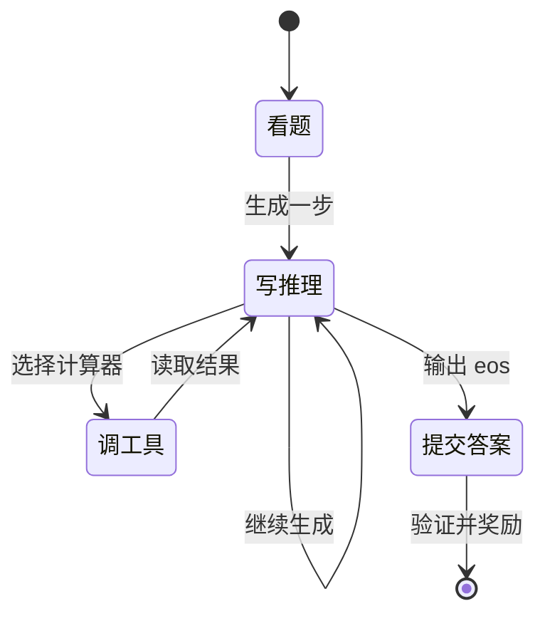

# 第 26 课　MDP、回报与价值函数

<div class="lesson-lead">奖励告诉我们某个时刻得了几分；价值回答的是“从现在开始，未来平均还能得多少分”。强化学习的大部分算法，都是在设法把这张未来账算得更准。</div>

::: info Berkeley 课程来源
本课对应 Berkeley [L04 RL Basics](https://rail.eecs.berkeley.edu/deeprlcourse/static/slides/lec-4.pdf)、[L07 Value-Based RL](https://rail.eecs.berkeley.edu/deeprlcourse/static/slides/lec-7.pdf) 与 [L20 RL Theory](https://rail.eecs.berkeley.edu/deeprlcourse/static/slides/lec-20.pdf)，并逐页对照 [CMU ANLP L16 第 14–26 页](https://cmu-l3.github.io/anlp-spring2026/static_files/anlp-s2026-16-rl.pdf#page=14) 的 agent—environment、trajectory、state/observation 和语言生成 MDP。
:::

## 1. MDP 是一份任务说明书

**Markov Decision Process（MDP）**常写成五元组：

$$
(\mathcal S,\mathcal A,p,r,\gamma)
$$

- $\mathcal S$：可能的状态；
- $\mathcal A$：可能的动作；
- $p(s'\mid s,a)$：执行动作后到哪个新状态；
- $r(s,a)$：立刻得到的奖励；
- $\gamma$：未来奖励折扣，介于 0 和 1。

**Markov** 的意思不是“没有历史”，而是当前状态已经包含预测未来所需的信息。聊天模型把完整上下文当状态，通常比只看最后一个 token 更接近 Markov；现实 Agent 看不到服务器内部、用户真实意图等隐藏状态，因此更像 POMDP。



<figure class="teaching-figure"><figcaption>即时奖励属于一次状态转移；Return 是一条已发生轨迹上的未来总账；Value 是在给定状态和策略下，对这些可能 Return 的条件期望。</figcaption></figure>

### 1.1 Environment state、observation 与 agent state

这三个对象在完全可观测的小例子里常被写成同一个 (s_t)，在真实 Agent 中却应分开：

| 对象 | 含义 | 网页 Agent 例子 |
|---|---|---|
| environment state (s_t^E) | 环境内部真实状态 | 服务器数据库、隐藏权限、购物车真实内容 |
| observation (o_t) | 环境本步暴露的信息 | 当前页面截图、DOM、API 返回 |
| agent state (s_t) | Agent 用来决策的内部摘要 | 对话上下文、记忆、工具历史、当前计划 |

若 observation 不能唯一确定环境状态，这更接近 POMDP。模型可以把历史压进上下文或外部记忆，改善 agent state，但不会因此自动知道从未观察到的隐藏事实。

### 1.2 Markov 性是对状态表示的要求

Markov 性写作：

$$
p(s_{t+1}\mid s_0,a_0,\ldots,s_t,a_t)
=p(s_{t+1}\mid s_t,a_t)
$$

它不是声称现实没有历史，而是要求 (s_t) 已经包含预测下一步所需的历史信息。若 Agent 只保留最后一条工具消息，丢掉此前的授权和目标，状态表示就不满足任务所需的 Markov 信息。

## 2. 回报：把未来奖励加起来

从时刻 $t$ 开始的折扣回报是：

$$
G_t=r_t+\gamma r_{t+1}+\gamma^2r_{t+2}+\cdots
$$

假设 Agent 完成任务得 10 分，每调用一次工具扣 1 分：

- 方案甲：2 次工具后成功，回报 $10-2=8$；
- 方案乙：7 次工具后成功，回报 $10-7=3$；
- 方案丙：不调用工具但答错，回报 $0$。

奖励设计把“什么叫好”变成数字。若只奖励最终正确，系统可能无限调用工具；若成本惩罚太大，它又可能不愿探索。

### 2.1 先统一奖励下标

有的教材把动作 (a_t) 后得到的奖励记作 (r_t)，有的记作 (r_{t+1})。两种都可以，但代码和公式必须一致。本教程在交互实验里把当前转移的奖励写作 (r_t)：

$$
s_t\xrightarrow{a_t,\,r_t}s_{t+1}
$$

### 2.2 折扣不只是“不重视未来”

(gamma<1) 有三种常见作用：

1. 表达越晚奖励越不确定或越不重要；
2. 让无限时域回报在有界奖励下收敛；
3. 调整信用传播距离和估计方差。

如果每步都有固定成本，降低 (gamma) 还会改变成本与终点奖励的相对权重。超参数不是纯数值稳定器，而是任务目标的一部分。

<ReturnAdvantageLab focus="returns" />

## 3. V 和 Q：两个不同的问题

### 状态价值 $V^\pi(s)$

“处于状态 $s$，以后按策略 $\pi$ 行动，平均能拿多少回报？”

$$V^\pi(s)=\mathbb E_\pi[G_t\mid s_t=s]$$

### 动作价值 $Q^\pi(s,a)$

“在状态 $s$ 先执行动作 $a$，之后再按策略 $\pi$，平均能拿多少回报？”

$$Q^\pi(s,a)=\mathbb E_\pi[G_t\mid s_t=s,a_t=a]$$

V 是“站在路口的平均前景”，Q 是“先选某条路的前景”。

<figure class="teaching-figure source-figure"><a href="/paper-figures/berkeley-value-q.webp" target="_blank"></a><figcaption>Berkeley CS285 Lecture 4 对 Q 与 V 的并列定义。$Q^\pi(s_t,a_t)$ 把“第一步指定为 $a_t$”写进条件；$V^\pi(s_t)$ 则还要对策略接下来可能选的动作求平均，所以 $V^\pi(s)=\mathbb E_{a\sim\pi}[Q^\pi(s,a)]$。<a href="https://rail.eecs.berkeley.edu/deeprlcourse/static/slides/lec-4.pdf#page=24">打开原课件第 24 页</a>。</figcaption></figure>

### Python：从后往前算每一步回报

```python
def discounted_returns(rewards, gamma=0.99):
    returns = [0.0] * len(rewards)
    future = 0.0
    for t in reversed(range(len(rewards))):
        future = rewards[t] + gamma * future
        returns[t] = future
    return returns

print(discounted_returns([0, 0, 1], gamma=0.9))
# [0.81, 0.9, 1.0]
```

倒序计算正是递推式 $G_t=r_t+\gamma G_{t+1}$。实际训练还要在 episode 终止处把 `future` 清零，否则上一道题的奖励会错误流入下一道题。

## 4. 优势函数：比平常好多少

$$
A^\pi(s,a)=Q^\pi(s,a)-V^\pi(s)
$$

若当前状态的平均回报是 4：

| 动作 | Q 值 | 优势 A | 解释 |
|---|---:|---:|---|
| 直接猜答案 | 1 | -3 | 比平常差，应降低概率 |
| 调计算器 | 7 | +3 | 比平常好，应提高概率 |
| 先复述题目 | 4 | 0 | 没明显改善 |

RL 更新真正关心的常常不是“回报 7 高不高”，而是“它是否比这个状态下的正常水平更好”。这就是 baseline 和 advantage 的核心直觉。

## 5. 贝尔曼关系：今天的价值 = 眼前奖励 + 明天的价值

$$
V^\pi(s)=\mathbb E_{a,s'}[r(s,a)+\gamma V^\pi(s')]
$$

它把一个很长的未来问题拆成一步。价值网络正是用这种自举关系学习：不必等整段轨迹完全结束，下一状态的估值也能提供训练信号。但估值若错，自举也会传播错误。

### 5.1 从定义推到 Bellman expectation equation

从 (G_t=r_t+\gamma G_{t+1}) 出发：

$$
\begin{aligned}
V^\pi(s)
&=\mathbb E_\pi[G_t\mid s_t=s]\\
&=\mathbb E_{a\sim\pi,\,s'\sim p}
[r(s,a,s')+\gamma V^\pi(s')]
\end{aligned}
$$

同样，动作价值满足：

$$
Q^\pi(s,a)=\mathbb E_{s'}
[r(s,a,s')+\gamma\mathbb E_{a'\sim\pi}Q^\pi(s',a')]
$$

并且：

$$
V^\pi(s)=\mathbb E_{a\sim\pi(\cdot\mid s)}[Q^\pi(s,a)]
$$

### 5.2 (V^\pi) 与 (V^*) 不同

(V^\pi) 评价“继续按当前策略会怎样”；最优价值 (V^*) 则假设以后都选最优动作：

$$
V^*(s)=\max_a\mathbb E_{s'}[r+\gamma V^*(s')]
$$

Actor-Critic 通常学习当前或近期策略的 (V^\pi)，不是直接拥有一张全局最优答案表。策略变了，价值目标也会跟着变。

## 6. 在 LLM 中，信用分配为什么特别难

一个 2,000-token 推理在最后才得到 1 分。把同一个 1 分平均塞给每个 token，会把无关套话也强化；只奖励最后 token，又无法告诉前面的关键推理应该保留。常见补救：

- reward-to-go：只使用动作之后的奖励；
- value baseline：估计当前前景，学习相对优势；
- process reward：为中间步骤打分；
- outcome verifier + 多次采样：用同题其他回答做相对比较。

### 6.1 Token-level 与 sequence-level 两种任务写法

| 写法 | 状态 | 动作 | 优点 | 隐藏问题 |
|---|---|---|---|---|
| token-level MDP | prompt + 已生成前缀 | 下一个 token | 可做逐步 value/advantage | 序列长、奖励极稀疏 |
| one-step MDP | prompt | 完整回答 | 适合结果奖励和组采样 | 把内部信用分配折叠掉 |

两种写法不矛盾。GRPO 常用“一题多完整回答”的叙述，但优化时仍对每个生成 token 的 log-prob 求导。

## 7. 终止、截断与 bootstrap

这三个情况不能混：

| 情况 | 含义 | 下一状态价值 |
|---|---|---|
| terminal success/failure | 环境真正结束 | 通常置 0 |
| time-limit truncation | 因预算截止，但任务逻辑未终止 | 可选择从 (V(s_{t+1})) bootstrap |
| padding | 为凑 batch 添加的空位 | 完全 mask |

若把时间上限误当 terminal，会系统性低估长任务尾部价值；若把真正 terminal 继续 bootstrap，又会把下一 episode 的价值串进来。

## 8. 奖励设计就是任务规范

设工具 Agent 的总回报：

$$
G=10\cdot\mathbf 1[\text{成功}]
-0.2\cdot N_{tool}
-2\cdot\mathbf 1[\text{越权}]
$$

这个式子仍可能有漏洞：如果“成功”检测比越权检测容易触发，Agent 会优化代理。设计奖励时要写出：可观测条件、失败优先级、权限、安全、延迟与成本，并在隐藏环境中复核。

::: tip Reward、return 与 value 的一句话区别
reward 是一张收据；return 是这条真实轨迹从现在起的账单总和；value 是在当前策略下，对未来许多可能账单的平均预测。
:::

::: warning 价值不是事实正确率
$V(s)=0.8$ 不是“这个句子有 80% 正确”。它是特定策略、奖励定义和数据分布下的期望回报；换奖励、换策略或换环境，价值都会变。
:::

## 9. 最小练习

一条三步轨迹奖励为 $[0,0,1]$，$\gamma=0.9$。则：

- $G_2=1$；
- $G_1=0+0.9\times1=0.9$；
- $G_0=0+0.9\times0.9=0.81$。

越早的动作与最终奖励距离越远，折扣后的信号越弱。长推理中 $γ$、序列长度和奖励位置都影响学习。

<details><summary>自测：为什么不能只用 Q 值，不减 V？</summary>

理论上可以，但同一题所有回答都可能得到很大的共同回报，梯度方差会很高。减去不依赖当前动作的 baseline 不改变期望方向，却能让更新聚焦“比常态好多少”。
</details>

<ConceptCheck question="时间预算到达导致轨迹被截断，但任务并未逻辑结束时，最准确的处理是什么？" :options='["它与 padding 完全相同", "根据算法决定是否从下一状态价值 bootstrap，并单独记录 truncation", "永远把下一状态价值设为 10"]' :answer="1" explanation="截断不是自然终止；是否 bootstrap 会改变价值目标，必须与 terminal 和 padding 分开。" />

## 10. 推荐阅读路线

1. [CMU ANLP L16 第 14–26 页](https://cmu-l3.github.io/anlp-spring2026/static_files/anlp-s2026-16-rl.pdf#page=14)：先口头映射文本生成中的 agent、state、action、environment、reward。
2. [Berkeley CS285 Lecture 4](https://rail.eecs.berkeley.edu/deeprlcourse/static/slides/lec-4.pdf)：重点推 (V^\pi)、(Q^\pi)、advantage 和 Bellman 关系。
3. 带着两个问题读价值类论文：它学习的是当前策略价值还是最优价值？terminal、truncation 和 bootstrap 如何实现？

下一课：[策略梯度与 REINFORCE](/beginner/42-rl-policy-gradient)。

<ChapterReadings lesson="41-rl-mdp-value" />
