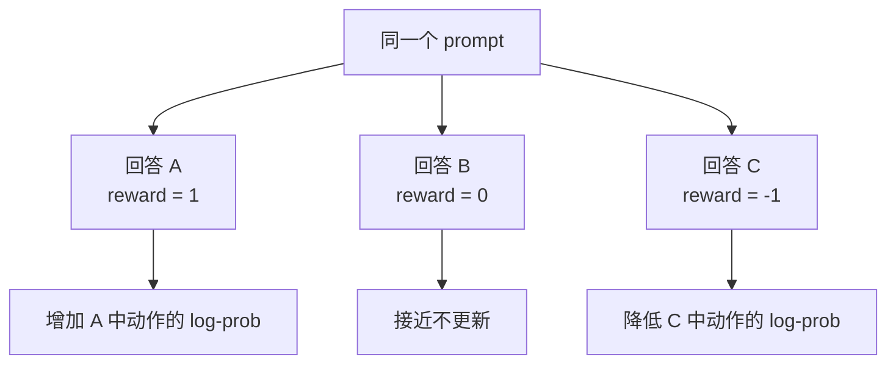

# 第 27 课　策略梯度与 REINFORCE

<div class="lesson-lead">策略梯度的核心可以用一句话说完：采样模型自己的回答，得分高就提高这条轨迹的概率，得分低就降低。但“提高多少、归因到哪些 token、怎样不让噪声淹没信号”需要认真拆开。</div>

::: info Berkeley 课程来源
本课对应 Berkeley [L05 Policy Gradients](https://rail.eecs.berkeley.edu/deeprlcourse/static/slides/lec-5.pdf) 与 [Homework 2](https://rail.eecs.berkeley.edu/deeprlcourse/static/homeworks/hw2.pdf)，并逐页对照 [CMU ANLP L16 第 28–40、48–50 页](https://cmu-l3.github.io/anlp-spring2026/static_files/anlp-s2026-16-rl.pdf#page=28) 的 score-function estimator、完整轨迹推导、reward-to-go、baseline 与 GAE。
:::

## 1. 目标：让平均回报变大

$$
J(\theta)=\mathbb E_{\tau\sim\pi_\theta}[R(\tau)]
$$

难点是奖励常来自不可微的环境：代码测试通过或失败，网页任务成功或失败。我们不能对测试器求梯度，但能对“模型生成这条轨迹的概率”求梯度。

策略参数 θ 不直接出现在奖励函数里，却决定会采到哪些轨迹。训练的对象是**轨迹分布**：

$$
p_\theta(\tau)=p(s_0)\prod_{t=0}^{T-1}
\pi_\theta(a_t\mid s_t)p(s_{t+1}\mid s_t,a_t)
$$

## 2. log-derivative 技巧在做什么

利用 $\nabla p=p\nabla\log p$，可得到最基本的 REINFORCE 估计：

$$
\nabla_\theta J(\theta)\approx
\sum_t \nabla_\theta\log\pi_\theta(a_t\mid s_t)\,R(\tau)
$$

把公式按三块读：

1. $\log\pi(a_t\mid s_t)$：模型给实际采样 token 的对数概率；
2. $R$：这次尝试有多好；
3. 梯度上升：好轨迹的 token 概率升高，坏轨迹的概率降低。

### 2.1 完整推导：为什么不用对环境求导

$$
\begin{aligned}
\nabla_\theta J
&=\nabla_\theta\sum_\tau p_\theta(\tau)R(\tau)\\
&=\sum_\tau p_\theta(\tau)R(\tau)
\nabla_\theta\log p_\theta(\tau)\\
&=\mathbb E_{\tau\sim p_\theta}
[R(\tau)\nabla_\theta\log p_\theta(\tau)]
\end{aligned}
$$

展开轨迹 log probability：

$$
\log p_\theta(\tau)=\log p(s_0)+
\sum_t\left[
\log\pi_\theta(a_t\mid s_t)+
\log p(s_{t+1}\mid s_t,a_t)
\right]
$$

环境初始分布和转移不含 θ，求导后只剩策略项：

$$
\nabla_\theta\log p_\theta(\tau)
=\sum_t\nabla_\theta\log\pi_\theta(a_t\mid s_t)
$$

所以环境可以是编译器、网页或人工评分，不必可微。代价是我们用采样估计期望，方差很高。

### 2.2 单个样本的梯度只是随机估计

一次 rollout 给出：

$$
\hat g=R(\tau)\sum_t\nabla_\theta\log\pi_\theta(a_t\mid s_t)
$$

它不是“真实梯度”，只是期望等于真实梯度的随机变量。batch 越小、奖励越稀疏、轨迹越长，估计噪声通常越大。

<figure class="teaching-figure source-figure"><a href="/paper-figures/berkeley-policy-gradient-intuition.webp" target="_blank"></a><figcaption>Berkeley CS285 Lecture 5 的策略梯度直觉：策略先按当前分布采样，回报只充当 log-prob 梯度的乘数；正回报提高采样动作概率，负回报降低。左边长公式不是对环境求导，而是通过 $\nabla\log\pi_\theta$ 绕开不可微的环境。<a href="https://rail.eecs.berkeley.edu/deeprlcourse/static/slides/lec-5.pdf#page=12">打开原课件第 12 页</a>。</figcaption></figure>



## 3. 一个只有两个回答的数字例子

模型对同一题有两个宏动作：

| 回答 | 当前概率 | 奖励 |
|---|---:|---:|
| A：正确 | 0.3 | 1 |
| B：错误 | 0.7 | 0 |

采样到 A 时，梯度提高 $\log 0.3$；多次更新后，A 的概率会变大。注意 RL 不是把概率直接改成 1，而是通过共享参数影响大量相似状态，因此步长过大可能破坏别的能力。

## 4. reward-to-go：不要让未来之前的奖励倒流错方向

动作 $a_t$ 只应对它之后发生的奖励负责：

$$
\hat G_t=\sum_{t'\ge t}\gamma^{t'-t}r_{t'}
$$

例如 Agent 在第 5 步调用工具产生费用，第 2 步不应被第 1 步已经发生的奖励影响。reward-to-go 删除了与当前动作无关的过去奖励，减少噪声。

为什么能删掉过去奖励？对 (t'<t)，奖励 (r_{t'}) 已在动作 (a_t) 之前发生。条件在状态 (s_t) 上时：

$$
\mathbb E_{a_t\sim\pi}
[r_{t'}\nabla_\theta\log\pi(a_t\mid s_t)]
=r_{t'}\nabla_\theta\sum_{a_t}\pi(a_t\mid s_t)=0
$$

删除这些期望为 0 的项不改变期望梯度，却移除样本噪声。这叫 causality trick。

<ReturnAdvantageLab focus="policy" />

## 5. baseline：减掉“本来就能得到的分”

$$
\nabla_\theta J\approx
\sum_t\nabla_\theta\log\pi_\theta(a_t\mid s_t)
\big(\hat G_t-b(s_t)\big)
$$

只要 baseline 不依赖当前选中的动作，减掉它不会改变期望梯度。最简单 baseline 是一个 batch 的平均奖励；更强的 baseline 是价值网络 $V(s_t)$。

### 5.1 baseline 无偏性的证明

$$
\begin{aligned}
\mathbb E_{a\sim\pi}
[b(s)\nabla_\theta\log\pi_\theta(a\mid s)]
&=b(s)\sum_a\pi(a\mid s)\nabla_\theta\log\pi(a\mid s)\\
&=b(s)\nabla_\theta\sum_a\pi(a\mid s)\\
&=0
\end{aligned}
$$

关键条件是 (b) 在给定状态下不依赖本次选中的动作。若 baseline 偷看动作并与它相关，通常会引入偏差。

### 5.2 最优 baseline 不一定是简单平均分

从降方差角度，理想 baseline 还与状态和梯度范数有关；(V^\pi(s)) 是常用且可学习的近似。batch mean 虽简单，却让一个样本权重依赖同批其他样本；按 prompt 分组、跨设备统计和 leave-one-out 都会改变实际估计。

假设 4 个回答得分 `[1, 1, 0, 0]`，平均分 0.5。减基线后优势是 `[+0.5,+0.5,-0.5,-0.5]`，更新方向比原始 `[1,1,0,0]` 更明确：错误答案不再只是“不奖励”，而是会被压低。

## 6. 为什么策略梯度方差很高

- 采样回答不同，奖励就不同；
- 长序列的许多 token 共享一个最终奖励；
- 奖励模型本身有噪声；
- 少量罕见高分样本可能主导更新；
- 一个 token 的参数变化会影响其他任务。

常用降方差方法：增加每题采样数、优势标准化、value baseline、GAE、奖励裁剪、长度校正和更大的有效 batch。

### 方差来源要分层定位

| 来源 | 观察办法 | 常见处理 |
|---|---|---|
| prompt 难度差 | 按题型分层画 reward | 状态 baseline、分组优势 |
| 生成随机性 | 同题重复采样 | 增大组、控制温度 |
| 环境噪声 | 同一回答重复验证 | 固定环境、去除 flaky test |
| 长序列归因 | reward—长度与 token 梯度 | reward-to-go、Critic、过程信号 |
| reward model 误差 | 人工/隐藏 verifier 复核 | 校准、ensemble、独立评测 |

盲目扩大 batch 只能降低采样噪声，不能修复系统性奖励偏差。

## 7. REINFORCE 与 SFT 的损失长得像，意义不同

SFT 最小化 $-\log\pi(y^*\mid x)$；REINFORCE 也含 $-A\log\pi(a\mid s)$。区别是 SFT 的目标 token 由数据集给出，而 RL 的 token 来自当前策略采样，权重 $A$ 来自环境结果。

```text
SFT：老师说“请模仿这一条”
RL ：模型先尝试，环境再说“这条比平常好/差多少”
```

### PyTorch：宏动作版 REINFORCE

```python
import torch

def reinforce_loss(token_log_probs, completion_mask, rewards):
    # token_log_probs/mask: [B, T]，只包含实际采样 token 的 log-prob
    sequence_log_prob = (token_log_probs * completion_mask).sum(dim=-1)
    advantage = rewards - rewards.mean()  # 最简单的 batch baseline
    advantage = advantage / (rewards.std(unbiased=False) + 1e-6)
    return -(advantage.detach() * sequence_log_prob).mean()
```

负号是因为 PyTorch 默认做梯度下降：正优势样本会让 `sequence_log_prob` 增大，负优势样本让它减小。`detach()` 很关键，奖励和 baseline 在这里是权重，不允许模型靠“改奖励数值”降低损失。生产实现还要正确 mask prompt、padding 与截断 token。

## 8. 两动作 softmax：概率到底怎样改变

设模型只有动作 A、B，A 的 logit 是 (z_A)：

$$
\pi(A)=\frac{e^{z_A}}{e^{z_A}+e^{z_B}}
$$

有两个直观导数：

$$
\frac{\partial\log\pi(A)}{\partial z_A}=1-\pi(A),
\qquad
\frac{\partial\log\pi(A)}{\partial z_B}=-\pi(B)
$$

采到 A 且优势为正时，不只提高 A 的 logit，也会相对压低其他动作。A 已接近概率 1 时，(1-\pi(A)) 很小，更新自然饱和；但共享网络参数仍会影响其他状态。

## 9. 序列 log-prob 的 sum 与 mean

整条回答的 log probability 是 token log-prob 求和：

$$
\log\pi(y\mid x)=\sum_{t=1}^{T}\log\pi(y_t\mid x,y_{<t})
$$

| 归约 | 直接含义 | 可能偏差 |
|---|---|---|
| token sum | 完整序列 log probability | 长回答梯度总量更大 |
| 每回答 token mean | 每条回答平均 log probability | 长回答每 token 权重更小 |
| 全 batch token mean | 每个有效 token 等权 | 长回答总权重更大 |

这不是纯实现细节，而是隐式长度权重。长 CoT RL 必须同时报告长度分布、截断率和 loss reduction。

## 10. 负奖励、零奖励与 baseline

若所有奖励都非负，零奖励样本在没有 baseline 的 REINFORCE 中不产生直接梯度，并不会自动被降概率。减去正 baseline 后，低于平均的样本优势为负，才会被压低。

但“压低错误轨迹的全部 token”仍是粗归因。一条失败回答可能前 95% 都正确；一条成功回答可能靠猜测。策略梯度忠实优化的是奖励，不是人类心中的证明有效性。

## 11. 一次可复核的 REINFORCE 实验

日志至少保存：prompt、采样 token、逐 token log-prob、reward 各分量、baseline、优势、mask 和策略版本。然后做四个单元测试：

1. 正优势样本单步更新后，采样动作 log-prob 应上升；
2. 负优势样本应下降；
3. 优势全 0 时参数不应变化；
4. prompt/padding token 不应进入 policy loss。

这些最小测试不通过时，不要直接进入 PPO、GRPO 或分布式训练。

::: warning 不能把错误回答的全部 token 都当成错误
一条失败推理里可能有正确步骤，一条成功回答也可能靠猜测。只有最终奖励时，REINFORCE 的归因很粗；这正是价值函数、过程奖励和 verifier 研究的重要原因。
:::

<details><summary>自测：减去平均奖励后，为什么低于平均的样本会被降概率？</summary>

它的优势 $A=R-b$ 为负；梯度上升等价于沿着降低该动作 log-prob 的方向更新。比较对象不是绝对的 0，而是同批次、同状态下的正常水平。
</details>

<ConceptCheck question="策略梯度为什么能用于不可微的代码测试器？" :options='["因为它对轨迹概率的 log 求导，奖励只作为样本权重", "因为编译器会自动产生神经网络梯度", "因为奖励从不参与训练"]' :answer="0" explanation="score-function estimator 不需要对环境或奖励求导，但代价是采样估计方差较高。" />

## 12. 推荐阅读路线

1. [CMU ANLP L16 第 28–31、48–50 页](https://cmu-l3.github.io/anlp-spring2026/static_files/anlp-s2026-16-rl.pdf#page=28)：自己重写 score-function 与轨迹分解，不要只看结论。
2. [Berkeley CS285 Lecture 5](https://rail.eecs.berkeley.edu/deeprlcourse/static/slides/lec-5.pdf)：重点看 causality、reward-to-go、baseline 与实际 estimator。
3. 阅读实现时追问：序列 log-prob 是 sum 还是 mean？baseline 是否依赖动作？奖励和优势是否 detach？哪些 token 被 mask？

下一课：[Actor-Critic 与 GAE](/beginner/43-rl-actor-critic)。

<ChapterReadings lesson="42-rl-policy-gradient" />
