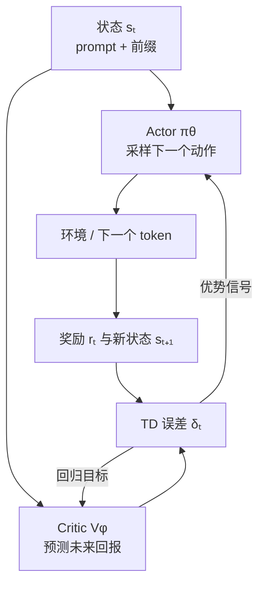

# 第 28 课　Actor-Critic 与 GAE

<div class="lesson-lead">Actor 像正在答题的学生，Critic 像随时估计“照这样下去大概能得几分”的教练。教练不直接替学生作答，只把结果与预期的差告诉学生。</div>

::: info Berkeley 课程来源
本课对应 Berkeley [L06 Actor Critic](https://rail.eecs.berkeley.edu/deeprlcourse/static/slides/lec-6.pdf) 与 L14 中的 “Value function baselines & GAE”，并逐页对照 [CMU ANLP L16 第 38–43 页](https://cmu-l3.github.io/anlp-spring2026/static_files/anlp-s2026-16-rl.pdf#page=38) 的 baseline、TD residual、GAE 和完整训练循环。
:::

## 1. 两个网络各做什么



- **Actor** 参数 $θ$：决定动作概率；
- **Critic** 参数 $φ$：预测 $V_\phi(s)$；
- Actor 用优势更新策略；Critic 用真实或自举回报校准估值。

LLM 实现中，Critic 可以是策略模型顶部新增的 value head，也可以是完整的独立模型。共享骨干省显存，独立模型隔离更清楚但成本更高。

## 2. TD 误差：结果比预期好多少

$$
\delta_t=r_t+\gamma V_\phi(s_{t+1})-V_\phi(s_t)
$$

例子：当前估值 4，执行动作后立刻得 1 分，新状态估值 5，$γ=0.9$：

$$\delta=1+0.9\times5-4=1.5$$

正数表示结果比 Critic 原先预期更好；Actor 应提高该动作概率。负数表示比预期差。

### 2.1 TD 误差同时承担两个角色

对 Actor，它是一步优势估计：这个动作后的结果比原先预期好多少。对 Critic，它是 Bellman residual：

$$
\delta_t=\left[r_t+\gamma V_\phi(s_{t+1})\right]-V_\phi(s_t)
$$

方括号里是一步 bootstrap target。训练 Critic 时通常把 target 一侧 `detach`，否则网络可同时移动两边来缩小误差，目标不再稳定。

## 3. Monte Carlo 与一步 TD 的取舍

| 估计方法 | 目标 | 优点 | 缺点 |
|---|---|---|---|
| 完整回报 | $G_t$ | 少依赖 Critic，偏差低 | 必须等结束，方差高 |
| 一步 TD | $r_t+\gamma V(s_{t+1})$ | 信号密、方差低 | 依赖不准确的 Critic，有偏差 |
| 多步 / GAE | 混合多个跨度 | 可调折中 | 多一个超参数与实现复杂度 |

### 3.1 n-step return 把两端连起来

$$
G_t^{(n)}=\sum_{l=0}^{n-1}\gamma^l r_{t+l}
+\gamma^n V(s_{t+n})
$$

- (n=1)：一步 TD，最依赖 Critic；
- (n) 到 episode 末尾：Monte Carlo，不再 bootstrap；
- 中间 (n)：用真实奖励走几步，再由 Critic 接管尾部。

Critic 准确时，小 (n) 能降方差；Critic 有系统偏差时，小 (n) 会更强地传播偏差。

## 4. GAE：把不同长度的惊喜加权起来

Generalized Advantage Estimation：

$$
\hat A_t^{GAE}=\delta_t+(\gamma\lambda)\delta_{t+1}+(\gamma\lambda)^2\delta_{t+2}+\cdots
$$

- $λ$ 接近 0：更像一步 TD，低方差、高偏差；
- $λ$ 接近 1：更接近完整回报，高方差、低偏差。

<figure class="teaching-figure"><figcaption>λ 控制 GAE 对远处 TD 误差的记忆长度。它不是越大越好：Critic 质量、轨迹长度与奖励噪声共同决定折中。</figcaption></figure>

假设连续 TD 误差是 `[0.2, 1.0, -0.5]`，$γλ=0.9$，第一步优势约为：

$$0.2+0.9\times1.0+0.9^2\times(-0.5)=0.695$$

它不只看眼前 0.2，也吸收了后续变化，但越远权重越小。

<figure class="teaching-figure source-figure"><a href="/paper-figures/berkeley-gae.webp" target="_blank"></a><figcaption>Berkeley CS285 Lecture 6 的 GAE 图。每一种切断位置对应不同的 n-step 目标：切得早更依赖 Critic、方差低但偏差大；切得晚更接近 Monte Carlo。GAE 用 $\lambda$ 对全部切法做指数加权，而不是硬选一个 n。<a href="https://rail.eecs.berkeley.edu/deeprlcourse/static/slides/lec-6.pdf#page=24">打开原课件第 24 页</a>。</figcaption></figure>

### PyTorch：倒序计算 GAE

```python
import torch

def generalized_advantage(rewards, values, dones, gamma=0.99, lam=0.95):
    # rewards/dones: [B, T]；values: [B, T+1]，最后一列是 bootstrap value
    advantages = torch.zeros_like(rewards)
    running = torch.zeros(rewards.size(0), device=rewards.device)

    for t in reversed(range(rewards.size(1))):
        not_done = 1.0 - dones[:, t]
        delta = rewards[:, t] + gamma * values[:, t + 1] * not_done - values[:, t]
        running = delta + gamma * lam * not_done * running
        advantages[:, t] = running

    value_targets = advantages + values[:, :-1]
    return advantages, value_targets
```

`not_done` 同时截断 bootstrap 和 GAE 尾巴，防止一个 episode 穿进下一个。`value_targets` 用来回归 Critic；`advantages.detach()` 后才作为 Actor 权重。LLM 还必须用 completion mask 排除 prompt 与 padding。

<ReturnAdvantageLab focus="gae" />

### 4.1 GAE 的倒序递推

$$
\hat A_t=\delta_t+\gamma\lambda(1-d_t)\hat A_{t+1}
$$

其中 (d_t=1) 表示真正 terminal：

- (gamma) 同时折扣任务回报和远处信用；
- (lambda) 控制优势估计对远处 TD error 的权重；
- terminal 必须清空尾巴；
- time-limit truncation 是否清空取决于是否继续 bootstrap。

### 4.2 GAE 与 lambda-return 的关系

GAE 可理解为不同 n-step 优势的指数加权：

$$
\hat A_t^{GAE(\gamma,\lambda)}
=(1-\lambda)\sum_{n=1}^{\infty}\lambda^{n-1}
\left(G_t^{(n)}-V(s_t)\right)
$$

有限 episode 的最后一项要把剩余权重归到直到终点的 Monte Carlo target。不同库的边界写法可能不同，应该用短轨迹手算做单元测试。

## 5. 为什么 LLM 的 Critic 很难训练

1. 输入很长：同一 prompt 的每个生成位置都要估值；
2. 奖励稀疏：大多 token 前没有直接奖励；
3. 策略不断变化：昨天的价值目标今天可能过时；
4. 奖励非平稳：verifier 或奖励模型可能更新；
5. 数据相关：一题的多条回答相似，不等于独立样本。

Berkeley L14 强调：只在 completion 部分训练 value，不要把 prompt token 当成需要行动的后缀。工程上还要对 padding、终止位置、截断样本正确做 mask。

### 5.1 相邻状态高度相关

长回答中的 (s_t) 与 (s_{t+1}) 只差一个 token，训练样本并不独立。若 minibatch 没按 prompt、长度和奖励平衡，Critic 容易被少量长轨迹主导。

### 5.2 策略变化让 value target 非平稳

(V^\pi) 属于某个策略。Actor 更新后，状态访问分布和未来动作都变了，旧 Critic 目标会过期；value loss 下降不一定表示当前策略下价值更准。

### 5.3 Reward 变化会重写“价值”

若 reward model 或 verifier 更新，同一状态的 target 也改变。日志必须记录 reward 版本，不能把跨版本 value loss 连成一条曲线直接解释。

## 6. Critic 的训练目标与裁剪

常见 target 是：

$$
\hat V_t=\hat A_t+V_{old}(s_t)
$$

value loss：

$$
L_V=\frac12\mathbb E[(V_\phi(s_t)-\hat V_t)^2]
$$

PPO 实现有时也裁剪 value 更新：

$$
V_{clip}=V_{old}+\operatorname{clip}(V_\phi-V_{old},-\epsilon_v,+\epsilon_v)
$$

再取未裁剪与裁剪平方误差的较大者，避免大幅移动 value 来轻易降低 loss。这是额外配方，不是所有 PPO 都必须使用。

### 6.1 Explained variance 怎样读

$$
EV=1-\frac{\operatorname{Var}(\hat V-V)}
{\operatorname{Var}(\hat V)}
$$

- 接近 1：value 解释了大部分 target 变化；
- 接近 0：不比预测常数均值强；
- 小于 0：比常数基线更差。

target 方差很小时 EV 会不稳定；还要按任务和长度分层，不能只看全局平均。

## 7. 没有 Critic 行不行

可以。若同一 prompt 采样多条回答，可用组内平均分做 baseline，不训练价值模型。GRPO 类方法因此节省 Critic 的显存与训练复杂度；代价是每个 prompt 要多次 rollout，而且相对基线质量依赖组内样本多样性。

| baseline | 额外模型 | 泛化到新状态 | 主要代价 |
|---|---:|---:|---|
| batch mean | 否 | 否 | 不同难度互相污染 |
| per-prompt group mean | 否 | 否 | 每题多次 rollout |
| leave-one-out mean | 否 | 否 | 仍依赖组多样性 |
| learned (V(s)) | 是 | 可以 | 训练非平稳 Critic |

“不用 Critic”并非没有 baseline，而是换成样本统计 baseline。

::: warning Critic 只是一位会犯错的估价员
不要把 value loss 下降当成任务能力提升。Critic 可能学会拟合奖励偏差，Actor 仍可能 reward hack。最终判断必须回到独立任务评测和真实环境成功率。
:::

## 8. 一次 Actor-Critic 更新清单

1. 用当前 Actor 生成轨迹；
2. 环境或 verifier 给奖励；
3. Critic 对每个状态估值；
4. 计算 TD 误差与 GAE；
5. 用优势更新 Actor；
6. 用回报目标回归 Critic；
7. 检查 KL、熵、奖励、长度与 value error。

## 9. 共享主干还是独立 Critic

| 方案 | 优点 | 风险 |
|---|---|---|
| Actor 顶部 value head | 参数和前向成本小 | policy/value 梯度冲突 |
| 独立 Critic | 目标隔离、容量可单配 | 近一倍模型存储和额外通信 |
| 冻结主干只训 head | 稳定、便宜 | 表示未必适合逐状态价值 |

若共享主干，应记录 policy loss 与 value loss 的梯度范数或夹角，并谨慎选择 value coefficient。Critic 训练得更快不等于 Actor 学得更好。

## 10. 边界单元测试

1. 单步 terminal：(A=r-V(s))，不能读取下一 episode 的 value；
2. (lambda=0)：GAE 必须等于逐步 TD error；
3. (lambda=1) 且 episode 完整：(A=G-V)；
4. reward 全 0、value 全 0：全部 advantage 为 0；
5. padding 改变：有效 token 的 GAE 不应变化；
6. time-limit truncation：分别测试 bootstrap 开关。

<details><summary>自测：为什么 Critic 的估计不必完全准确也能有用？</summary>

它主要作为 baseline 降低方差。只要误差没有与当前动作形成有害相关，优势的方向仍可提供帮助；但偏差太大或训练失稳会误导 Actor，所以必须监控 explained variance 等指标。
</details>

<ConceptCheck question="GAE 中 λ=0 时，优势估计退化为什么？" :options='["一步 TD 误差", "完整 Monte Carlo 回报且不使用 Critic", "固定为 1"]' :answer="0" explanation="后续 TD error 都被 λ 的幂截掉，只剩当前 δ_t；λ 接近 1 才吸收更长跨度。" />

## 11. 推荐阅读路线

1. [CMU ANLP L16 第 38–43 页](https://cmu-l3.github.io/anlp-spring2026/static_files/anlp-s2026-16-rl.pdf#page=38)：先把 baseline、TD residual、GAE 放在一张时间轴上。
2. [Berkeley CS285 Lecture 6](https://rail.eecs.berkeley.edu/deeprlcourse/static/slides/lec-6.pdf)：重点看 n-step estimator 与 GAE 的加权关系。
3. 阅读 [GAE 原论文](https://arxiv.org/abs/1506.02438) 时追问：理论中的 gamma-just estimator 是什么？实验中 λ 如何与 value fitting 配合？
4. 看代码优先核对 terminal/truncation、末尾 bootstrap value、mask 和 `detach`。

下一课：[重要性采样、TRPO 与 PPO](/beginner/44-rl-ppo)。

<ChapterReadings lesson="43-rl-actor-critic" />
