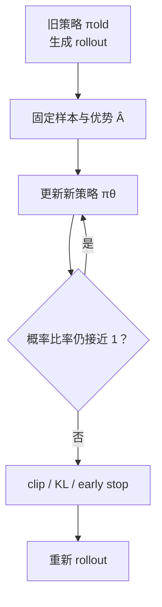

# 第 29 课　重要性采样、TRPO 与 PPO

<div class="lesson-lead">策略梯度有一个麻烦：回答由旧模型生成，但我们更新的是新模型。PPO 的作用不是神秘地“让 RL 更强”，而是限制新模型别离生成这些数据的模型太远。</div>

::: info Berkeley 课程来源
本课重组 Berkeley [L09 Advanced Policy Gradients Part 1](https://rail.eecs.berkeley.edu/deeprlcourse/static/slides/lec-9.pdf)、[L10 Part 2](https://rail.eecs.berkeley.edu/deeprlcourse/static/slides/lec-10.pdf) 与 [Section 5](https://rail.eecs.berkeley.edu/deeprlcourse/static/sections/section-5.pdf)，并逐页对照 [CMU ANLP L16：RL Fundamentals](https://cmu-l3.github.io/anlp-spring2026/static_files/anlp-s2026-16-rl.pdf) 第 28–50 页的 REINFORCE、baseline、GAE、PPO 与附录推导，再核对 [PPO 原论文](https://arxiv.org/pdf/1707.06347.pdf)。PPO clipping 是 PPO-KL 的启发式近似，不应把它当成严格信赖域保证。
:::

## 1. On-policy 与 off-policy

- **on-policy**：数据由当前策略生成；更新几次后就重新采样。
- **off-policy**：数据来自其他策略、旧版本或固定日志。

LLM rollout 很贵，我们希望同一批回答训练多个 epoch；但模型每更新一次，数据就更“旧”。重要性采样用概率比率做修正：

$$
r_t(\theta)=\frac{\pi_\theta(a_t\mid s_t)}{\pi_{old}(a_t\mid s_t)}
$$

- $r=1$：新旧策略对该 token 看法相同；
- $r=1.2$：新策略给它的概率是旧策略的 1.2 倍；
- $r=0.7$：概率降到 0.7 倍。

### 1.1 重要性采样从哪里来

我们想知道新策略 (pi) 下某个量 (f(a)) 的期望，却只有旧策略 (mu) 采出的动作：

$$
\begin{aligned}
\mathbb E_{a\sim\pi}[f(a)]
&=\sum_a\pi(a)f(a)\\
&=\sum_a\mu(a)\frac{\pi(a)}{\mu(a)}f(a)\\
&=\mathbb E_{a\sim\mu}\left[\frac{\pi(a)}{\mu(a)}f(a)\right]
\end{aligned}
$$

比率 (w(a)=\pi(a)/\mu(a)) 不是“动作质量分”，而是在校正样本出现频率。新策略更喜欢的动作权重大于 1；更不喜欢的动作权重小于 1。

<figure class="teaching-figure"><figcaption>重要性采样没有生成新数据，只是改变旧样本在估计中的权重。分布重叠越少，少量样本承担的权重越大，方差越高。</figcaption></figure>

### 1.2 Support overlap 是硬前提

若 (pi(a)>0) 但 (mu(a)=0)，比率无定义：旧策略从未采过这个动作，日志无法告诉我们它的回报。语言模型 softmax 的理论概率常不为 0，但 top-k、top-p、语法约束或 token mask 会把许多动作实际截成 0。

即便数学上无偏，估计也可能不可用。若旧策略仅以 0.1% 采到某动作，新策略给它 10%，权重是：

$$
w=\frac{0.10}{0.001}=100
$$

一次稀有样本就可能支配整个 batch。

### 1.3 为什么不直接使用整条轨迹的概率比

完整轨迹比率是逐步比率的乘积：

$$
\frac{p_\pi(\tau)}{p_\mu(\tau)}
=\prod_{t=1}^{T}\frac{\pi(a_t\mid s_t)}{\mu(a_t\mid s_t)}
$$

每个 token 的比率即使只有 1.02，1000 个 token 的乘积也约为 (3.98\times10^8)。这就是长序列重要性采样方差爆炸的直观来源。PPO 使用逐 token surrogate，并限制局部比率带来的收益。

## 2. 为什么不能无限提高高优势动作

若优势 $A>0$，简单目标 $rA$ 会鼓励把 $r$ 越推越大。但 batch 只覆盖少量状态；一步改得太狠，新策略会进入没见过的状态，旧优势不再可靠。



第 (t) 步动作只能影响之后的奖励，因此 policy gradient 使用 reward-to-go：

$$
R_t=\sum_{t'=t}^{T}\gamma^{t'-t}r_{t'}
$$

对只有末尾 0/1 奖励的推理任务，生成 token 常共享最终 return；对工具 Agent，逐步环境奖励、成本和失败信号会产生不同的 (R_t)。

## 3. PPO clipping 用小数字看

PPO 常用目标：

$$
L^{clip}=\mathbb E\left[
\min\left(r_t\hat A_t,\operatorname{clip}(r_t,1-\epsilon,1+\epsilon)\hat A_t\right)
\right]
$$

取 $ε=0.2$：

| 优势 | 比率 r | 未裁剪 rA | 裁剪后的有效激励 | 直觉 |
|---:|---:|---:|---:|---|
| +2 | 1.10 | 2.20 | 2.20 | 好动作适度提高 |
| +2 | 1.50 | 3.00 | 2.40 | 已涨太多，不再额外奖励 |
| -2 | 0.90 | -1.80 | -1.80 | 坏动作适度降低 |
| -2 | 0.50 | -1.00 | -1.60 | 已降太多，不让目标继续受益 |

“min + clip” 对正负优势的效果不同，死背一条截断规则容易出错。最可靠的理解是：**不让样本对策略产生远离旧分布的过大激励。**

<figure class="teaching-figure source-figure"><a href="/paper-figures/berkeley-ppo-clipping.webp" target="_blank"></a><figcaption>Berkeley CS285 Lecture 9 的裁剪重要性权重图。右侧把概率比率离 1 太远的收益封顶：正优势动作已经涨得过多时不再得到额外激励，负优势动作已经降得过多时也不能继续从代理目标获益。它约束的是这批样本上的优化激励，不是全状态空间的严格 KL 保证。<a href="https://rail.eecs.berkeley.edu/deeprlcourse/static/slides/lec-9.pdf#page=14">打开原课件第 14 页</a>。</figcaption></figure>

### PyTorch：逐 token PPO-Clip 目标

```python
import torch

def ppo_policy_loss(new_logp, old_logp, advantages, mask, epsilon=0.2):
    # 四个张量均为 [B, T]；old_logp 来自 rollout 时冻结的 old policy
    ratio = torch.exp(new_logp - old_logp)
    unclipped = ratio * advantages
    clipped = torch.clamp(ratio, 1 - epsilon, 1 + epsilon) * advantages
    objective = torch.minimum(unclipped, clipped)
    loss = -(objective * mask).sum() / mask.sum().clamp_min(1)
    clip_fraction = (((ratio - 1).abs() > epsilon) * mask.bool()).float().sum() / mask.sum()
    return loss, clip_fraction
```

`old_logp` 必须是生成这条 rollout 时保存的值；不能训练一半后用新模型重算再假装它是 old policy。`advantages` 一般先标准化并停止梯度，`mask` 只覆盖 completion 的有效 token。

<PPOClipLab />

### 3.1 PPO 不是把 ratio 直接 clamp 后乘优势

下面这个常见写法不等价于 PPO：

```python
# 错误：所有方向都只使用裁剪后的 ratio
objective = ratio.clamp(1 - eps, 1 + eps) * advantage
```

正确目标必须在未裁剪项与裁剪项之间取 `minimum`。PPO 只封住“继续让代理目标变好”的越界方向；若更新把好动作概率降低或把坏动作概率提高，它不会用裁剪替你掩盖错误。

### 3.2 比率应从 log probability 计算

$$
r_t=\exp(\log\pi_\theta(a_t\mid s_t)-\log\pi_{old}(a_t\mid s_t))
$$

两边必须使用同一 token、mask、位置、模型前处理和 checkpoint。更新前 `new_logp-old_logp` 应接近 0、ratio 应集中在 1；否则优先查对齐与版本，而不是先调 epsilon。

## 4. KL 约束、TRPO 和 PPO 的关系

- **TRPO**：近似求解“提高代理目标，同时 KL 不超过阈值”的约束优化；理论动机清楚，但实现有二阶近似和共轭梯度。
- **PPO-KL**：直接在损失里加入 KL penalty，系数可动态调节。
- **PPO-Clip**：用概率比率裁剪得到简单的一阶优化，最常见但只是启发式近似。

LLM RL 还常加一项相对参考模型的 KL：

$$
r_{total}=r_{task}-\beta\,D_{KL}(\pi_\theta\Vert\pi_{ref})
$$

这里有两个“旧模型”：`old policy` 用于采样一致性；`reference model` 用于防止语言能力和风格漂移。实现时不要混为一个概念。

<figure class="teaching-figure"><figcaption>TRPO 近似求解带 KL 约束的问题；PPO-KL 把 KL 变成损失惩罚；PPO-Clip 只对采样动作上的概率比收益封顶。三者目标相近，约束对象并不相同。</figcaption></figure>

### 4.1 TRPO 的代理目标与约束

$$
L_{\pi_{old}}(\pi)=
\mathbb E_{s,a\sim\pi_{old}}
\left[\frac{\pi(a\mid s)}{\pi_{old}(a\mid s)}A_{\pi_{old}}(s,a)\right]
$$

TRPO 近似求解：

$$
\max_\pi L_{\pi_{old}}(\pi)
\quad\text{s.t.}\quad
\mathbb E_s[D_{KL}(\pi_{old}\Vert\pi)]\le\delta
$$

若新策略仍在旧策略附近，旧数据估计的优势才更可能可信。实际求解涉及二阶近似、Fisher-vector product、共轭梯度与线搜索。

### 4.2 PPO-KL 与 PPO-Clip

PPO-KL 用软惩罚：

$$
L^{KL}=L_{surrogate}-\beta D_{KL}(\pi_{old}\Vert\pi_\theta)
$$

PPO-Clip 更易用一阶优化器训练，但它只观察 rollout 中被选择动作的 ratio；未采样 token 的概率也可能大幅重排。因此 clip 不保证整体 KL 小，仍应独立监控 KL，并在超阈值时 early stop 或重新 rollout。

## 5. PPO 训练循环的四个模型

| 模型 | 作用 | 是否更新 |
|---|---|---|
| Actor | 生成并学习新策略 | 是 |
| Old actor / rollout policy | 记录生成样本时的 log-prob | 一轮内冻结 |
| Critic | 估计 value / advantage | 是 |
| Reference model | 计算 KL，保留底座行为 | 通常冻结 |

再加奖励模型或 verifier，显存和调度就很重。这也是为什么后来的组相对方法尝试去掉 Critic，以及为什么 LLM RL 是系统问题而不只是一个 loss。

## 6. 必须监控的指标

- `approx_kl`：新旧策略变化；
- `clip_fraction`：多少 token 被裁剪；
- entropy：策略是否过快变得确定；
- advantage mean/std：优势是否正确归一化；
- response length：奖励是否只是鼓励变长；
- reward 与独立 eval：是否出现 reward hacking；
- stale policy gap：异步 rollout 与训练模型差几版。

::: warning PPO 不是“可以反复训练旧数据”的许可证
重要性比率在新旧策略差异大时方差会爆炸；clipping 只能限制优化目标，不能让任意陈旧数据变成可靠的 on-policy 数据。大规模异步系统必须控制 policy lag。
:::

## 7. 完整 PPO 损失不只有 policy loss

典型 Actor-Critic PPO 联合三个目标：

$$
L_{total}=L_{policy}+c_vL_{value}-c_HH(\pi_\theta)
$$

### 7.1 Policy loss

优化器默认最小化，所以最大化 clipped objective 要加负号：

$$
L_{policy}=-\mathbb E[L^{clip}_t]
$$

### 7.2 Value loss

Critic 拟合 return 或 bootstrapped target：

$$
L_{value}=\mathbb E[(V_\phi(s_t)-\hat R_t)^2]
$$

Actor 与 Critic 可以共享 Transformer 主干，也可以独立。共享省参数和前向计算，却让 policy 与 value 两个目标争夺相同表示；独立更清楚，却增加显存、通信和服务调度。

### 7.3 Entropy bonus

$$
H(\pi)=-\sum_a\pi(a\mid s)\log\pi(a\mid s)
$$

最大化熵能延缓策略过早确定，但全词表 token 熵与“解题策略多样性”不是同一个量。模型可能只在措辞上变化，核心错误仍高度相关。

### 7.4 Reference KL

LLM RL 还常加入相对预训练或 SFT 参考模型的 KL。它与新旧策略 KL 监控职责不同：reference KL 保护一般语言行为，old-policy KL 判断这批 on-policy 数据是否已经陈旧。

## 8. Advantage 标准化不是无关紧要的细节

很多实现对 batch 做：

$$
\tilde A=\frac{A-\operatorname{mean}(A)}{\operatorname{std}(A)+\epsilon}
$$

它可降低梯度尺度波动，但会引入以下选择：

- 减均值相当于加入 batch baseline；
- 除标准差改变本 batch 的有效步长；
- 混合不同任务和难度时，彼此影响归一化；
- 分布式训练要明确统计量来自本卡、数据并行组还是全局；
- padding、prompt token、截断后 token 不能进入统计；
- 优势通常要 `detach`，避免 policy loss 反向穿过 Critic。

因此论文或代码只写“normalize advantages”还不够，必须说明归一化维度与 mask。

## 9. 同一批 rollout 应训练多少个 epoch

PPO 把 trajectory 切成 minibatch，重复训练若干 epoch。每次更新后，当前策略都离 `old` 更远：

| 现象 | 说明 |
|---|---|
| ratio 分布变宽 | 新旧策略概率差扩大 |
| clip fraction 上升 | 更多 token 已越过代理收益区间 |
| approximate KL 上升 | 旧优势越来越不可信 |
| entropy 快速下降 | 策略可能在小 batch 上过拟合 |

因此 epoch 不是越多越省样本。常见做法是超过目标 KL 就提前停止：

```python
for epoch in range(max_epochs):
    for minibatch in rollout_buffer:
        update_policy(minibatch)
    if measured_kl > target_kl:
        break  # 重新 rollout，而不是继续榨取陈旧数据
```

异步 LLM RL 还存在 policy lag：长回答开始生成时是版本 (v)，完成时 trainer 可能已到 (v+k)。即使每批只训一个 epoch，样本也可能天然陈旧。

## 10. LLM PPO 的张量边界

设 prompt 长度为 (P)，completion 最大长度为 (T)，batch 为 (B)：

| 张量 | 形状 | 必须注意 |
|---|---|---|
| `input_ids` | `[B, P+T]` | prompt 与 completion 拼接 |
| `old_logp` | `[B, T]` | 只保存被采样 completion token |
| `new_logp` | `[B, T]` | 从 logits gather 完全相同的 token |
| `advantages` | `[B,T]` 或 `[B,1]` | 结果奖励可能广播到所有 token |
| `loss_mask` | `[B,T]` | 排除 padding、prompt 与无效截断位置 |
| `values` | `[B,T]` | token-level MDP 的 Critic 输出 |

### 10.1 最常见的 off-by-one

位置 (t) 的 logits 预测位置 (t+1) 的 token。若同位置对齐，所有 log-prob 都错一格：

```python
logits_for_actions = logits[:, P - 1 : P + T - 1]
actions = input_ids[:, P : P + T]
new_logp = logits_for_actions.log_softmax(-1).gather(
    -1, actions.unsqueeze(-1)
).squeeze(-1)
```

### 10.2 EOS、padding 与截断

- EOS 是模型生成的动作，通常应参与 policy loss；
- EOS 之后的 padding 不是动作，必须 mask；
- 达到长度上限却没有 EOS，要记录为 `truncated`；
- 把截断误当自然结束，会污染 value target 与长度奖励。

### 10.3 rollout 与训练 logits 要一致

dropout、混合精度、adapter 开关、量化路径、词表 mask 或 temperature 处理不同，都可能让同一 checkpoint 重算出的 log-prob 不一致。更新前 ratio 不在 1 附近时，先查这里。

## 11. Approximate KL 与 clip fraction 怎样读

不同库的 `approx_kl` 公式可能不同。常见形式包括：

$$
\widehat{KL}_1=\mathbb E[\log\pi_{old}-\log\pi_\theta]
$$

以及非负性更好的近似：

$$
\widehat{KL}_2=\mathbb E[(r-1)-\log r]
$$

`clip_fraction` 通常是：

$$
\frac{\#\{t:|r_t-1|>\epsilon\}}{\#\{\text{有效 token}\}}
$$

报告前必须说明公式、mask 和归约单位。高 clip fraction 可能是学习快，也可能是数据陈旧、学习率过大、优势尺度异常或 log-prob 对齐错误；要与 ratio 分位数、KL、entropy、reward 和独立评测一起解释。

## 12. 从 rollout 到更新的完整伪代码

```python
for iteration in range(num_iterations):
    old_policy.load_state_dict(policy.state_dict())
    trajectories = collect_rollouts(old_policy, environment)

    with torch.no_grad():
        returns = discounted_returns(trajectories.rewards, gamma)
        old_values = critic(trajectories.states)
        advantages = generalized_advantage_estimation(
            trajectories.rewards, old_values, gamma, lam
        )
        advantages = masked_normalize(advantages, trajectories.mask)

    for epoch in range(ppo_epochs):
        for mb in minibatches(trajectories):
            new_logp = policy.log_probs(mb.states, mb.actions)
            ratio = torch.exp(new_logp - mb.old_logp)

            gain_1 = ratio * mb.advantages
            gain_2 = ratio.clamp(1-eps, 1+eps) * mb.advantages
            policy_loss = -masked_mean(
                torch.minimum(gain_1, gain_2), mb.mask
            )

            value = critic(mb.states)
            value_loss = masked_mean((value - mb.returns) ** 2, mb.mask)
            entropy = masked_mean(policy.entropy(mb.states), mb.mask)

            loss = policy_loss + value_coef * value_loss \
                   - entropy_coef * entropy
            optimize(loss)

        if estimate_kl(old_policy, policy, trajectories) > target_kl:
            break
```

代码仍省略 reference KL、分布式全局统计、梯度累积、序列并行与异步版本控制，但每个量来自哪一份策略已经明确。

## 13. 失败模式排查表

| 现象 | 首先检查 | 不要立刻做什么 |
|---|---|---|
| ratio 首步就远离 1 | token 对齐、checkpoint、dropout、采样变换 | 直接调大 epsilon |
| KL 首个 epoch 暴涨 | 学习率、优势尺度、梯度范数 | 增加 PPO epoch |
| clip fraction 高但 reward 不涨 | 优势符号、数据陈旧、reward 延迟 | 当作“学得很快” |
| entropy 塌缩 | 奖励漏洞、探索、采样温度、clip | 只加随机噪声 |
| value loss 降而 policy 不改善 | target、优势方差、共享主干冲突 | 只换更大 Critic |
| 输出越来越长 | reward-length 相关、EOS、mask、KL | 只看平均 reward |

## 14. 概念检查与手算

<ConceptCheck question="正优势 A>0、概率比 r 已大于 1+ε 时，PPO-Clip 的直接作用是什么？" :options='["继续按 rA 无限奖励", "把继续增大 r 所带来的代理收益封顶", "把整个策略的 KL 严格设为 0"]' :answer="1" explanation="对正优势样本，上界之外取裁剪项；这只是样本代理目标封顶，不是全局 KL 保证。" />

<ConceptCheck question="为什么不能用当前模型重新计算 rollout 时的 old_logp？" :options='["因为比率需要数据生成时行为策略的概率作为分母", "因为当前模型没有词表", "因为 old_logp 只用于显示"]' :answer="0" explanation="重要性比率描述新策略相对行为策略的变化；替换分母会掩盖陈旧程度并破坏校正。" />

<details><summary>手算：A=-2、r=0.5、ε=0.2 时，PPO 为什么取 -1.6？</summary>

未裁剪项是 (0.5\times(-2)=-1.0)，裁剪比率为 0.8，裁剪项是 (-1.6)。目标取两者较小值 (-1.6)，所以继续把坏动作概率压到 0.5 不会得到额外代理收益。
</details>

## 15. 推荐阅读路线

1. **先读课件直觉**：[CMU ANLP L16 第 28–42 页](https://cmu-l3.github.io/anlp-spring2026/static_files/anlp-s2026-16-rl.pdf#page=28)，能口头复述 score-function、baseline、advantage 与 large-update 问题。
2. **再读 PPO 原论文**：[Proximal Policy Optimization Algorithms](https://arxiv.org/pdf/1707.06347.pdf)，重点看 clipped surrogate、adaptive KL、算法伪代码和实验设置。
3. **补理论来源**：先掌握 TRPO 的“代理目标 + KL 约束”形式，不必第一次就推完共轭梯度；带着“clip 是否真能限制 KL”再回到 PPO。
4. **连接 LLM**：[CS224N L08 Post-training](https://web.stanford.edu/class/cs224n/slides_w26/cs224n-2026-lecture08-posttraining.pdf)把 PPO 放进 reward model 与 reference KL 管线；下一章再比较 DPO。

阅读任意实现时固定核对四项：`old_logp` 来自哪里、优势在哪个维度标准化、loss mask 覆盖哪些 token、超过 target KL 后系统怎样处理。

<details><summary>自测：为什么高优势 token 的 r 已到 1.5 时还要停止奖励？</summary>

优势来自旧策略附近的样本；概率已经大幅改变后，这个局部估计可能不再成立。继续推高会过拟合少量 rollout，并让后续状态分布突变。
</details>

下一课：[奖励模型、RLHF 与 DPO](/beginner/45-rlhf-preference)。

<ChapterReadings lesson="44-rl-ppo" />
