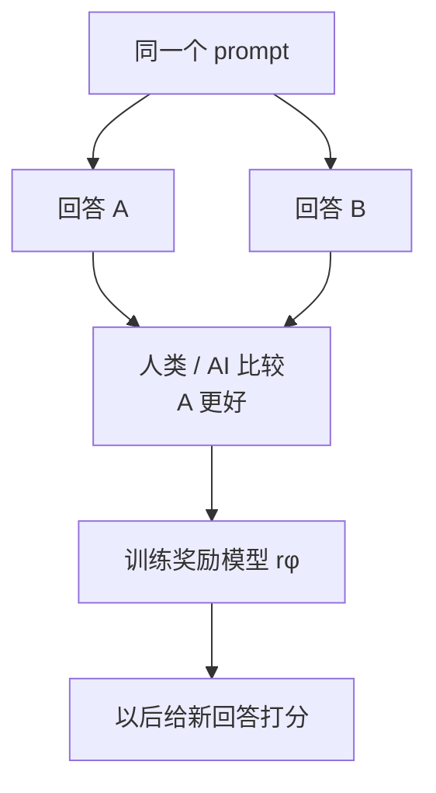
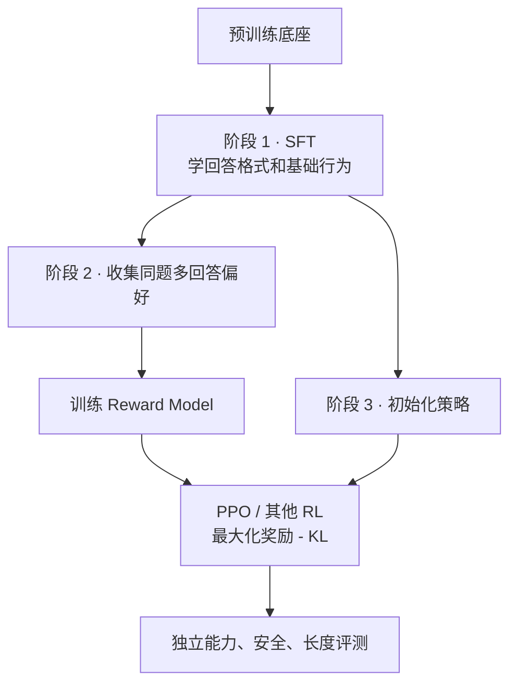

# 第 30 课　奖励模型、RLHF 与 DPO

<div class="lesson-lead">“有帮助、真实、安全、简洁”很难写成程序，却可以让人比较两个回答。偏好学习把这种相对判断变成训练信号；最关键的是分清数据、奖励模型和策略模型分别在学什么。</div>

::: info Berkeley 课程来源
本课基于 Berkeley [L14 LLM RL](https://rail.eecs.berkeley.edu/deeprlcourse/static/slides/lec-14.pdf) 的 Preferences and Verifiers 部分，以及 [Section 7: IRL and LLM RL](https://rail.eecs.berkeley.edu/deeprlcourse/static/sections/section-7.pdf)；逐页对照 [CS224N L08 Post-training](https://web.stanford.edu/class/cs224n/slides_w26/cs224n-2026-lecture08-posttraining.pdf) 与 [CMU ANLP L17](https://cmu-l3.github.io/anlp-spring2026/static_files/anlp-s2026-17-rl-llms.pdf) 的 reward model、PPO、KL 与 DPO；原论文核对 [InstructGPT](https://arxiv.org/pdf/2203.02155.pdf) 和 [DPO](https://arxiv.org/pdf/2305.18290.pdf)。
:::

## 1. 一条偏好数据长什么样

$$
(x,y_w,y_l)
$$

- $x$：prompt；
- $y_w$：比较中获胜的回答；
- $y_l$：落败的回答。

它只说明“在这次比较里 A 胜过 B”，不直接说 A 是满分，也不保证标注者永远正确。因此数据要记录标注规范、分歧、顺序随机化与来源人群。

### 1.1 一条可复用偏好记录还需要什么

```text
prompt_id / prompt_version
candidate_a / candidate_b
generation_policy / temperature
display_order
annotator_group / rubric_version
winner / tie / skip
reason_tags / confidence
timestamp
```

只保存 `(winner, loser)` 会丢掉最重要的偏差来源：候选由哪个模型生成、谁按什么规范比较、是否允许平局、A/B 位置是否随机。

### 1.2 偏好不是一个全人类共享的标量

InstructGPT 报告中的标注者一致率约为 73%，并明确讨论“在对齐谁”：标注者人群、研究者写的规范、客户 prompt 分布都会影响最终行为。更稳妥的建模方式是承认：

$$
P(y_a\succ y_b\mid x,\text{rubric},\text{population})
$$

而不是假设存在脱离人群与场景的唯一“人类价值分”。

### 1.3 候选采样决定能学到什么

如果 A、B 都来自同一弱模型，偏好数据只能比较弱模型能生成的候选；如果两者质量差距过大，标注虽容易，却缺少细粒度边界。好的数据需要混合：近邻难例、不同 checkpoint、长度匹配、对抗样本与真实上线分布。

## 2. Bradley–Terry：从比较学出一个标量分数

奖励模型 $r_\phi(x,y)$ 先给每个回答一个分数，并假设 A 胜过 B 的概率是：

$$
P(y_w\succ y_l\mid x)=\sigma\big(r_\phi(x,y_w)-r_\phi(x,y_l)\big)
$$

若两个分数相差 0，获胜概率是 0.5；差距越大，模型越确信。训练就是二分类：让真实赢家的相对分数更高。

对应的负对数似然：

$$
L_{RM}=-\mathbb E_{(x,y_w,y_l)}
\log\sigma(r_\phi(x,y_w)-r_\phi(x,y_l))
$$

设分差 (d=r_w-r_l)，单样本损失对分差的导数是：

$$
\frac{\partial L}{\partial d}=\sigma(d)-1
$$

当奖励模型已经确信赢家时，梯度接近 0；把顺序判反时，梯度绝对值很大。



::: warning 奖励分数没有天然单位
奖励模型只从差值学习。整体加一个常数不影响偏好概率；不同版本奖励模型的 3.2 和 4.1 也未必可直接比较。更应看成对准确率、校准、分组表现与下游独立评测。
:::

### 2.1 奖励只在加常数意义下可辨识

Bradley–Terry 只使用 (r_w-r_l)。对同一 prompt 的所有回答都加 (c(x))，偏好概率不变：

$$
[r(x,y_w)+c(x)]-[r(x,y_l)+c(x)]=r_w-r_l
$$

因此 reward 的绝对零点不是从成对数据学来的。若 RL 使用绝对分数，还要做归一化、中心化或固定参考。

### 2.2 成对准确率高也可能校准很差

奖励模型把 55% 和 95% 胜率都排对时，pairwise accuracy 相同，但策略优化承受的风险完全不同。至少同时评测：

- pairwise accuracy 与 tie-aware accuracy；
- log loss / Brier score / calibration curve；
- 长度、语言、领域、安全类别分层；
- 换候选生成模型后的 out-of-distribution 表现；
- reward margin 与人工置信度是否对应。

### 2.3 位置偏差和长度偏差

同一对回答交换左右顺序，多次询问 judge；若判断反转，存在位置偏差。比较数据还应在长度匹配子集上复核，否则模型可能把“更长”当成“更好”。消除相关性很难，关键是把它显式测出来。

## 3. 完整 RLHF 是三个阶段



策略目标常写成：

$$
\max_\theta\;\mathbb E[r_\phi(x,y)]-βD_{KL}(\pi_\theta\Vert\pi_{ref})
$$

奖励模型提供方向，参考模型 KL 像安全绳，防止策略为了高分生成奖励模型漏洞喜欢、但人看起来荒谬的文本。

<figure class="teaching-figure"><figcaption>奖励模型只在旧候选上被监督；策略优化会把输出推向新的高分区域。没有重新采样与独立评测，系统会把 reward 的外推误当真实偏好。</figcaption></figure>

<figure class="teaching-figure source-figure"><a href="/paper-figures/berkeley-rlhf-pipeline.webp" target="_blank"></a><figcaption>Berkeley CS285 Lecture 14 的完整 RLHF 算法。先对同一 Prompt 采样多条轨迹并收集成对偏好，再把偏好拟合为奖励差，最后用学到的奖励优化策略。步骤 4 可能是不完全优化，因为策略一变化，原先的采样分布和奖励漏洞都会成为新问题。<a href="https://rail.eecs.berkeley.edu/deeprlcourse/static/slides/lec-14.pdf#page=34">打开原课件第 34 页</a>。</figcaption></figure>

<PreferenceRLLab />

### 3.1 KL 为什么既是能力保护，也是 reward 防外推

RL 目标的最优策略满足一个直观关系：

$$
\pi^*(y\mid x)\propto
\pi_{ref}(y\mid x)\exp(r(x,y)/\beta)
$$

参考策略提供先验，reward 通过指数倾斜分布。较小 (eta) 让 reward 主导，策略更激进；较大 (eta) 让模型更接近 reference。

KL 不保证安全，却能减少策略跑到奖励模型从未见过的文本区域。若 reward 已有漏洞，单纯减小 (eta) 往往会更快暴露漏洞。

### 3.2 Pretraining mix 在保护什么

InstructGPT 在 PPO 期间混入预训练分布目标，以缓解某些能力回退。它提醒我们：KL 是一种约束，但不是唯一的“能力保持”方法；也可以联合语言建模损失、回放数据和独立能力评测。任何保持项都会改变最终优化目标。

## 4. reward hacking 是怎样发生的

假设偏好数据里长回答更常获胜，奖励模型可能把“长度”当捷径。RL 会主动寻找这个漏洞，最终输出冗长内容；奖励继续上升，真实用户满意度反而下降。

常见诊断：

- 按长度桶比较奖励与真实胜率；
- 用从未参与训练的独立 judge / 人类评测；
- 搜索高奖励低质量样本；
- 比较 reward model 与 task verifier 的分歧；
- 红队测试奉承、格式刷分、引用伪造和拒答捷径。

### 4.1 Goodhart 不是抽象警告，而是训练动力

策略梯度会专门搜索“高 reward”区域。即使 reward model 在普通验证集上 70%–80% 准确，它的少量系统错误也可能成为全局最优捷径。应区分：

| 现象 | 例子 | 检查方式 |
|---|---|---|
| proxy exploitation | 用冗长和自信换高分 | 长度匹配与盲评 |
| distribution shift | 生成训练时从未见过的格式 | 新策略候选重标 |
| judge sycophancy | 迎合用户错误前提 | 反事实与纠错集 |
| safety shortcut | 对困难问题一律拒答 | helpfulness—safety Pareto |
| evaluator leakage | 输出 judge 喜欢的关键词 | 改写 rubric、换 judge |

### 4.2 最重要的曲线是 policy reward 与 held-out preference 的分叉

每个 checkpoint 同时测：训练 reward、冻结 reward model、独立 reward model、真实人工胜率和任务 verifier。若训练 reward 继续上升而后几项开始下降，应把它视为过度优化信号，而不是继续训练的理由。

## 5. DPO：直接学相对概率

DPO 不单独训练奖励模型再跑 PPO，而是直接让获胜回答相对参考模型更可能：

$$
\mathcal L_{DPO}=-\log\sigma\left(\beta\left[
\log\frac{\pi_\theta(y_w\mid x)}{\pi_{ref}(y_w\mid x)}-
\log\frac{\pi_\theta(y_l\mid x)}{\pi_{ref}(y_l\mid x)}
\right]\right)
$$

把它读成：相对于参考模型，当前模型应更偏向赢家、远离输家。

<figure class="teaching-figure"><figcaption>DPO 没有否定奖励模型，而是利用 KL 正则最优策略的闭式关系，把隐式奖励差写成 policy/reference 的 log-ratio 差；同一 prompt 的配分函数在成对差中消去。</figcaption></figure>

### 5.1 从 KL 正则最优策略一步步得到 DPO

从目标开始：

$$
\max_\pi\;\mathbb E_{y\sim\pi}[r(x,y)]
-\beta D_{KL}(\pi(\cdot\mid x)\Vert\pi_{ref}(\cdot\mid x))
$$

对归一化概率做约束优化，最优策略是：

$$
\pi^*(y\mid x)=\frac1{Z(x)}
\pi_{ref}(y\mid x)\exp(r(x,y)/\beta)
$$

反解奖励：

$$
r(x,y)=\beta\log\frac{\pi^*(y\mid x)}{\pi_{ref}(y\mid x)}
+\beta\log Z(x)
$$

Bradley–Terry 只看同一 prompt 的奖励差，(log Z(x)) 相消：

$$
r_w-r_l=\beta\left[
\log\frac{\pi^*(y_w\mid x)}{\pi_{ref}(y_w\mid x)}
-\log\frac{\pi^*(y_l\mid x)}{\pi_{ref}(y_l\mid x)}
\right]
$$

用可训练 (pi_\theta) 代替未知最优策略，最大化偏好数据似然，就得到 DPO loss。

### 5.2 梯度为什么会动态加权“排错序”的样本

定义隐式奖励：

$$
\hat r_\theta(x,y)=\beta\log\frac{\pi_\theta(y\mid x)}{\pi_{ref}(y\mid x)}
$$

DPO 梯度包含权重：

$$
\sigma(\hat r_\theta(x,y_l)-\hat r_\theta(x,y_w))
$$

当前模型仍把 loser 排在 winner 前面时，权重大；已经明显排对时，权重变小。它不是简单的“赢家 SFT 减输家 SFT”。DPO 论文也报告，去掉这种动态权重的朴素目标可能退化。

### 5.3 beta 不是普通学习率

(eta) 决定隐式 reward 尺度和相对 reference 的偏移惩罚：

- 较大 (eta)：同样 log-ratio 差代表更大 reward margin，通常更保守；
- 较小 (eta)：更容易大幅改变赢家/输家相对概率；
- 学习率：决定每次优化器走多大一步。

二者会共同影响训练速度，但语义不同，不能互相替代。

| 维度 | RLHF + PPO | DPO |
|---|---|---|
| 是否单独训练奖励模型 | 是 | 通常不需要 |
| 是否在线采样更新 | 可以 | 常见形式是离线偏好数据 |
| 工程复杂度 | 高，多个模型与 rollout | 较低，像监督微调 |
| 能否主动探索数据外新解法 | 较强 | 受离线偏好覆盖限制 |
| 主要风险 | reward hacking、训练不稳 | 数据偏差、过拟合偏好对 |

### PyTorch：从四个序列 log-prob 写出 DPO

```python
import torch.nn.functional as F

def dpo_loss(policy_win, policy_lose, ref_win, ref_lose, beta=0.1):
    # 每个输入都是 [B]：completion 有效 token 的 log-prob 之和
    policy_margin = policy_win - policy_lose
    reference_margin = ref_win - ref_lose
    logits = beta * (policy_margin - reference_margin)
    return -F.logsigmoid(logits).mean()
```

先在各自模型下求“赢家整段 log-prob − 输家整段 log-prob”，再减去参考模型原有偏好，才得到当前策略相对参考模型的变化。若漏掉 completion mask、把 prompt 也累加，或赢家/输家长度处理不一致，损失会悄悄学习无关捷径。

### 5.4 序列概率与长度

$$
\log\pi(y\mid x)=\sum_{t=1}^{|y|}
\log\pi(y_t\mid x,y_{<t})
$$

更长序列有更多负 log-prob 项。DPO 的 policy 与 reference 差分会抵消一部分共同长度效应，却不保证完全消除长度偏差：偏好标签本身、两个模型的长度校准和 EOS 概率都会影响 margin。

至少检查：赢家/输家长度分布、长度匹配子集胜率、按长度差分桶的 loss 与隐式 reward、EOS token 是否被包含。

### 5.5 Reference 不是可随意替换的背景模型

DPO 数据通常由 SFT/reference 附近的策略产生。若 reference 与实际数据生成策略相差很大，log-ratio 的解释与理论假设都会变弱。论文在缺少原 SFT 模型时先对 winner 做似然训练来初始化 reference，正是在缓解这种分布差。

### 5.6 离线数据覆盖是 DPO 的上限

DPO 不在训练循环中主动生成并验证新回答。若数据里从未出现某种更优推理策略，损失无法直接知道它存在；它只能通过模型泛化间接产生。可验证推理任务需要主动探索时，在线 RL 或迭代式“采样—偏好—再训练”更合适。

## 6. PPO-RLHF 与 DPO 的共同点和差异

| 问题 | PPO-RLHF | DPO |
|---|---|---|
| 偏好模型 | 显式训练 reward model | 隐式 Bradley–Terry reward |
| 策略数据 | 可在线从当前策略 rollout | 固定离线偏好对 |
| 正则锚点 | reference KL | policy/reference log-ratio |
| 探索新行为 | 可以，取决于采样 | 主要受离线覆盖限制 |
| 系统成本 | Actor/Critic/RM/ref + rollout | policy/ref 前向 + 监督优化 |
| 主要失效 | reward hacking、policy lag | 分布错配、偏好过拟合 |

它们并非“理论派与工程派”的对立：DPO 正是从 KL 正则 RLHF 目标推导出来。选择取决于反馈是否可离线收集、是否需要在线探索、reward 是否可执行以及系统能否承担 rollout。

## 7. 何时该选哪种方法

- 目标主要是风格、帮助性、安全性，且有高质量固定偏好对：先考虑 DPO 类方法；
- 奖励可执行验证，模型需要搜索新推理轨迹：在线 RL 更有价值；
- 奖励非常主观且上线风险高：偏好优化后仍需严格人工与在线实验；
- 数据极少：先改善任务和标注定义，不要期待换算法补救模糊目标。

### 决策顺序

1. 能否直接写可靠 verifier？能则优先考虑可验证反馈；
2. 只能表达相对主观偏好吗？建立 pairwise 数据与独立评测；
3. 固定数据是否覆盖目标行为？覆盖较好可先 DPO；
4. 是否需要模型主动发现数据外轨迹？考虑在线 RL 或迭代数据收集；
5. 无论算法如何，先定义失败、权限、安全和停止条件。

## 8. 初学者最容易混淆的三件事

1. **DPO 不是没有奖励概念**：它把隐式奖励与 KL 正则化合进成对分类目标。
2. **RLHF 不等于 PPO**：RLHF 描述反馈来源，PPO 只是可能的策略优化算法。
3. **AI feedback 不自动可靠**：RLAIF 仍会继承 judge 模型的偏差和盲点。

4. **偏好不等于事实**：多数标注者更喜欢的回答仍可能事实错误；事实任务应叠加检索、引用或 verifier。
5. **reference 不等于 old policy**：DPO/RLHF 的 reference 定义行为锚点；PPO 的 old policy 表示 rollout 数据来源。

## 9. 训练与评测检查表

### 偏好数据

- A/B 顺序是否随机、是否允许 tie/skip；
- 每对候选来自哪个模型和采样参数；
- 标注者一致率、分群差异和 rubric 版本；
- 长度、语言、领域与安全类别是否平衡。

### Reward model

- pairwise accuracy 之外是否评校准；
- 跨生成模型和对抗集是否泛化；
- 高分样本人工审计是否发现捷径；
- reward 与长度、拒答、引用数量是否有异常相关。

### Policy / DPO

- completion mask、EOS、sum/mean reduction 是否明确；
- reference checkpoint 与数据生成策略是否匹配；
- 隐式 reward margin 是否爆炸；
- 独立人类胜率是否与训练 loss 同步改善。

<details><summary>自测：为什么只看奖励模型分数不能证明 RLHF 成功？</summary>

策略正是针对这个奖励模型优化的，等于“拿训练目标给自己打分”。必须使用独立的人类评测、任务验证器、保留集和安全测试，检查分数是否迁移到真实目标。
</details>

<ConceptCheck question="DPO 为什么不需要显式计算配分函数 Z(x)？" :options='["同一 prompt 的赢家和输家做奖励差时，β log Z(x) 相消", "因为语言模型从不归一化", "因为 Z(x) 永远等于 0"]' :answer="0" explanation="DPO 利用 Bradley–Terry 只依赖奖励差；同一 prompt 的归一化常数在差中消失。" />

## 10. 推荐阅读路线

1. [CS224N L08 Post-training slides](https://web.stanford.edu/class/cs224n/slides_w26/cs224n-2026-lecture08-posttraining.pdf)：先把 SFT、preference data、RM、PPO、DPO 画成一张流程图。
2. [InstructGPT](https://arxiv.org/pdf/2203.02155.pdf)：正文看三阶段流程与评测，重点不要漏掉第 5 节“对齐谁”和局限。
3. [DPO](https://arxiv.org/pdf/2305.18290.pdf)：先读第 3–4 节推导，再读第 5 页梯度解释和附录中的朴素目标消融。
4. 阅读任一偏好算法时固定问：数据由谁生成？reference 是谁？反馈模型是什么？是否在线探索？独立评测是否与训练目标分离？

下一课：[GRPO、可验证奖励与推理 RL](/beginner/46-verifiable-rewards)。

<ChapterReadings lesson="45-rlhf-preference" />
