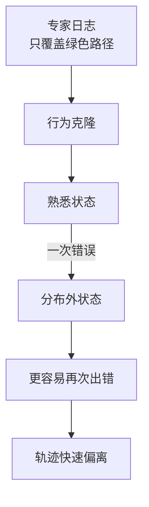
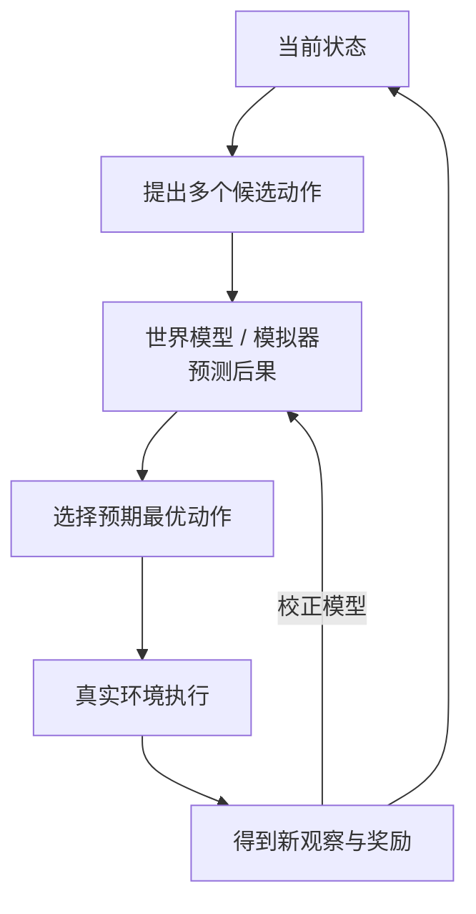

# 第 32 课　离线 RL、探索与 Agent

<div class="lesson-lead">训练聊天回答时，环境常在一句话后结束；训练 Agent 时，一个动作会改变网页、文件或代码库，后续状态也跟着改变。于是离线数据是否可信、怎样安全探索、长程奖励如何归因，都变成核心问题。</div>

::: info Berkeley 课程来源
本课重组 Berkeley 的 [L02–L03 Behavioral Cloning](/courses/berkeley-deeprl-2026#l02-行为克隆一从专家示范学习)、[L15–L16 Model-Based RL](https://rail.eecs.berkeley.edu/deeprlcourse/static/slides/lec-15.pdf)、[L17–L18 Offline RL](https://rail.eecs.berkeley.edu/deeprlcourse/static/slides/lec-17.pdf)、[L19 Exploration](https://rail.eecs.berkeley.edu/deeprlcourse/static/slides/lec-19.pdf) 与 [L24 Multi-task RL](https://rail.eecs.berkeley.edu/deeprlcourse/static/slides/lec-24.pdf)，并逐页整合 [CMU ANLP L18：Language Model-based Agents](https://cmu-l3.github.io/anlp-spring2026/static_files/anlp-s2026-18-zora.pdf) 的 observation、action、memory、skill learning、benchmark 与 human-centered agents。
:::

## 1. 什么才算语言模型 Agent

Agent 至少形成闭环：观察环境、维护内部状态、选择动作、动作改变环境、接收新观察。只有检索后生成一段文字的 RAG，或只在内部延长思维链的 reasoning model，通常没有外部状态改变，不必自动称为 Agent。

<figure class="teaching-figure"><figcaption>语言模型只是闭环里的 policy。观察接口决定它看见什么，记忆决定保留什么，动作接口与权限层决定它能改变什么。</figcaption></figure>

### 1.1 四个对象要分别定义

| 对象 | 设计问题 | 失败例子 |
|---|---|---|
| observation | 给模型 HTML、ax-tree、截图还是摘要？ | 过滤器删掉目标按钮 |
| internal state | 保留目标、事实、工作流还是反思？ | 旧记忆覆盖新事实 |
| action | 原始点击、API 还是封装 skill？ | 参数格式正确却越权 |
| environment | 状态怎样转移、哪些动作不可逆？ | 测试环境误连生产 |

### 1.2 Computation、perception 与 action 不同

模型在上下文中计算一个计划，并不等于观察了真实结果；说“我已更新地址”也不等于环境状态已改变。只有动作接口执行，并由环境返回可核查的新 observation，闭环才前进一步。

## 2. Observation、Action 与 Memory 是三个容量瓶颈

### 2.1 Observation：看不见就无法可靠推理

网页可表示为原始 HTML、accessibility tree、筛选后元素或截图+视觉定位。CMU 课件引用的 Mind2Web 设置中，某种 LM 元素过滤方案有 47% 情况漏掉全部相关项；这个数字属于特定实验，但直觉普遍：前端召回错误无法靠后端 planning 修复。

评测 observation 层应单独测：目标元素 recall、无关 token 数、动态页面更新、截图 grounding 和敏感信息遮蔽。

### 2.2 Action：原始动作与语义工具

<figure class="teaching-figure"><figcaption>高层工具把多个易错点击压成有类型的一次调用，缩短 horizon，也更容易验证前置/后置条件；但权限更强，必须硬编码边界、幂等和审计。</figcaption></figure>

工具接口的完整契约包括：

```text
name / description
typed arguments
preconditions
permission scope
side effects
idempotency key
timeout / retry policy
postcondition verifier
```

函数名写得自然不代表工具安全。更新地址、发邮件、付款等动作需要显式确认与最小权限。

### 2.3 Agent 自己归纳 skill 时发生了什么

CMU 课件展示了把重复点击流程归纳为 `search_reviews(...)`、`open_marketing_reviews()` 一类程序化 skill。它可能带来三种收益：

1. **压缩 horizon**：以后不再逐个决定所有原始动作；
2. **复用程序知识**：同类任务共享已验证流程；
3. **降低监督成本**：人类可检查一个短函数，而非几十步 trace。

但自生成 skill 是可执行代码，必须像第三方依赖一样治理：

| 阶段 | 必须检查 |
|---|---|
| 归纳 | 来源轨迹是否成功，是否含注入或秘密 |
| 静态审查 | 参数类型、权限、网络/文件访问、循环上限 |
| 沙箱测试 | 正例、反例、边界、幂等、超时 |
| 发布 | 版本、签名、允许调用的 Agent/任务 |
| 运行 | 参数、返回、环境变更与调用者全量审计 |
| 回收 | 失效页面/API 后禁用，清理依赖记忆 |

“模型写出函数”不等于工具已可信；真正的 skill 是代码、验证器、权限清单和版本策略的组合。

### 2.4 Internal state：记忆不是无限追加聊天记录

| 记忆类型 | 内容 | 主要风险 |
|---|---|---|
| factual | 用户偏好、文件事实、环境状态 | 过期、来源不明、隐私 |
| episodic | 一次任务的步骤与结果 | 把偶然经历当规则 |
| procedural | 工作流、skill、反思 | 错误流程被反复复用 |
| working state | 当前计划、未完成事项 | 上下文拥塞与冲突 |

每条长期记忆要有来源、时间、作用域、置信度和删除机制。反思文本只是另一种模型输出，不是自动正确的经验。

## 3. 行为克隆为什么一上线就可能变差

离线日志只记录专家走过的状态。模型学到 95% 正确率似乎很高，但执行时一次错误会进入训练集没见过的新状态，随后错误继续累积，叫 **compounding error**。



DAgger 的思路是在学习者实际到达的状态上请专家重新标注，再聚合进数据。对 LLM Agent，可对应为：让当前模型真实运行，收集失败状态，由教师模型、人类或规则给下一步纠正。

### 3.1 95% 单步准确率不等于 95% 任务成功率

若 (H) 步都必须正确，且暂时假设独立，整条轨迹不犯错的概率：

$$
P(\text{all correct})=p^H
$$

单步 (p=0.95)，20 步只有 (0.95^{20}\approx35.8\%\)；50 步约 7.7%。真实错误并不独立，进入陌生状态后准确率往往更低。

经典模仿学习分析中，行为克隆的长期代价可能随 (O(T^2\epsilon)) 放大，而在 learner 访问状态上聚合专家标签的 DAgger 可改善到更接近 (O(T\epsilon))；这依赖理论假设，但揭示了训练分布与部署分布错位。

<AgentShiftLab />

### 3.2 DAgger 需要安全的“专家介入”定义

在真实系统中不能让 learner 先执行危险动作再请专家纠正。可使用：shadow mode、动作执行前标注、模拟器分支、低权限副本或人工接管。记录“模型提议”和“最终执行”两个动作，避免把人工修正误当模型行为。

## 4. 离线 RL 与普通 SFT 的区别

两者都只用固定数据，但离线 RL 还利用奖励，试图在数据覆盖范围内找比行为策略更好的动作。危险在于：模型可能给数据里从未执行过的动作虚高价值，却没有环境证据支持。

| 方法 | 学什么 | 分布外风险 |
|---|---|---|
| SFT / BC | 模仿日志动作 | 难超过日志，执行偏移 |
| 离线 RL | 用奖励重新加权或优化策略 | 可能高估未覆盖动作 |
| 在线 RL | 当前策略真实交互 | 成本、风险和非平稳性 |

保守离线 RL 会惩罚分布外动作或约束策略别离行为数据太远。本质是承认：“没有证据的高价值，不应轻信。”

### 4.1 Bellman max 会主动选择估值误差

价值方法常用：

$$
Q(s,a)\leftarrow r+\gamma\max_{a'}Q(s',a')
$$

离线数据没有覆盖的 (a') 也可能被函数近似器给出高值；`max` 会偏好这个乐观误差，再把它 bootstrap 回前面状态。策略随后更常选择这些无证据动作，产生 extrapolation error。

### 4.2 “保守”有三种常见实现方向

- 约束新策略接近行为策略；
- 降低数据外动作的 Q 值；
- 只在高置信、日志覆盖的动作集合中优化。

保守过强会退化成行为克隆，保守过弱会追逐虚高 Q。需要按状态覆盖度、行为概率和真实在线小流量验证调节。

### 4.3 Off-policy evaluation 也受覆盖限制

用固定日志估计新策略效果可用重要性采样、模型模拟或 doubly robust 方法，但新策略若大量选择日志中罕见动作，比率方差会爆炸。没有任何离线估计器能从完全没有证据的动作中恢复真实结果。

<figure class="teaching-figure source-figure"><a href="/paper-figures/berkeley-offline-rl-shift.webp" target="_blank"></a><figcaption>Berkeley CS285 Lecture 17 的反事实查询例子。训练数据只告诉我们车辆沿直线行驶的结果；离线策略想向上转弯时，没有“试一次看看”的真实反馈，价值函数只能外推。对工具 Agent 也一样：日志从未出现的 API 参数不是新发现的捷径，而是缺乏环境证据的分布外动作。<a href="https://rail.eecs.berkeley.edu/deeprlcourse/static/slides/lec-17.pdf#page=11">打开原课件第 11 页</a>。</figcaption></figure>

## 5. 探索不是把温度调高

提高采样温度只增加随机性，不保证获得有信息的新经验。有效探索要在“可能有价值”和“尚不确定”之间平衡：

- entropy bonus：避免策略过早坍缩；
- intrinsic reward：奖励新状态或预测误差；
- uncertainty / ensemble：优先试不确定但潜在有价值的动作；
- curriculum：在刚好能学会的任务边界探索；
- diverse prompts / tools：扩大环境和任务覆盖。

Agent 的探索必须加安全边界：沙箱、只读模式、动作白名单、预算、速率限制和人工审批。

### 5.1 随机性、信息增益与任务价值是三件事

高温度可能只让模型在同义措辞间随机，不增加状态覆盖。一个探索动作值得执行，通常要同时考虑：

$$
\text{score}(a)=\text{expected task value}
+\alpha\cdot\text{information gain}
-\lambda\cdot\text{risk/cost}
$$

这个式子是设计框架，不是要求把所有量精确标量化。安全约束应在 score 之外硬执行，不能让高信息增益抵消越权。

### 5.2 Epistemic 与 aleatoric 不确定性

- epistemic：模型因缺数据而不知道，可通过收集经验降低；
- aleatoric：环境本身随机，例如用户未来选择，更多数据也无法完全消除。

ensemble 分歧更接近 epistemic 信号；单模型高 entropy 可能混合两类不确定性。

### 5.3 Novelty 会被电视噪声欺骗

若 intrinsic reward 奖励预测误差，随机广告、时钟或不可预测页面可能持续给高分，Agent 会反复观看“噪声电视”。新颖性必须与可控性、任务进展和访问预算结合。

## 6. 模型式 RL：先在脑内预演

Model-Based RL 学习或使用环境模型 $\hat p(s'\mid s,a)$，先预测动作后果，再规划。LLM 本身有丰富世界知识，因此常被当作“隐式世界模型”；但会说不等于能准确预测真实 API、代码执行或网页状态。



模型误差会在长规划中累积。稳妥方法是短视滚动规划：只执行当前最可靠的一步，观察真实结果，再重新规划。

### 6.1 真实环境模型至少要预测什么

不仅是下一个页面文本，还包括：动作是否执行、权限错误、延迟、费用、不可逆副作用和 observation 会暴露哪些信息。只训练“看起来合理的下一段文字”不足以替代 API 或浏览器状态转移。

### 6.2 Model exploitation

规划器会寻找世界模型的漏洞：如果模拟器错误认为某个非法动作高回报，优化越强越会选它。可用短 horizon、模型 ensemble、不确定性惩罚和真实环境频繁校正，但最终安全仍由真实权限层保证。

### 6.3 Receding-horizon planning

每轮只执行计划第一步：

```text
observe real state
simulate several short action sequences
choose one first action
execute in real environment
discard old plan and observe again
```

这降低长期开环误差，却增加反复规划成本。

## 7. 长程 Agent 的信用分配

一次研究任务可能有 50 次工具调用，最后才知道答案是否可用。可设计分层奖励：

- 终局：任务是否完成；
- 里程碑：找到权威来源、测试通过、生成有效文件；
- 约束：未越权、引用可核查、成本不超预算；
- 过程：避免重复搜索、死循环和无效调用。

但中间奖励太密也会诱导模型“刷里程碑”而忘记最终目标。每个过程奖励都要做反例测试。

### 7.1 Potential-based shaping 的安全直觉

经典 RL 中，一类不改变最优策略的 shaping 形式是：

$$
F(s,a,s')=\gamma\Phi(s')-\Phi(s)
$$

(Phi) 像状态进度势能。它在理想 MDP 与正确条件下保留最优策略；真实 Agent 的 (Phi) 常由不完美模型估计、环境部分可观测，不能机械套用，但提醒我们过程奖励应度量“向终点的净进展”，而非可无限重复的事件。

### 7.2 工具调用的分层信用

一次 skill 内有十个原始点击，外层可只给 skill 成败与成本，内层再训练原始动作策略。层级化能缩短外层 horizon，但若 skill 黑箱失败，必须保留内部 trace 供诊断。

### 7.3 失败恢复也应进入数据

只保留成功轨迹会教模型理想流程，却不教它识别“登录过期、页面变化、工具超时”。训练集应包含错误检测、回滚、重新观察、向用户澄清和安全停止等恢复行为。

## 8. 从离线到在线的安全顺序

1. 用高质量轨迹做 SFT / 行为克隆；
2. 在日志覆盖范围内做偏好或离线优化；
3. 在可复现模拟器 / 沙箱中在线探索；
4. 小流量、低权限真实环境试验；
5. 失败轨迹进入回放与分析，但避免无限重复旧偏差；
6. 用离线、模拟、在线三套指标共同判断。

<figure class="teaching-figure"><figcaption>权限和不可逆性应随证据逐层放大。每层都有独立能力与安全门；reward 高不能跳过权限层。</figcaption></figure>

### 8.1 每一级的升级条件

| 阶段 | 能力证据 | 安全证据 |
|---|---|---|
| BC → 离线优化 | 接口格式、基本任务成功 | 不生成禁止动作 |
| 离线 → 沙箱在线 | OOD 检测、恢复策略 | 沙箱逃逸和资源限制测试 |
| 沙箱 → shadow | 隐藏任务泛化、成本曲线 | 真实数据脱敏、只读权限 |
| shadow → 小流量写入 | 与人类/基线对照 | 审批、审计、回滚演练 |

### 8.2 Human-centered 不只是“加一个审批按钮”

CMU L18 最后从 autonomous 转向 collaborative agents。评测还要测：人类何时能看懂状态、介入成本、建议采纳率、纠错后的共同成功率、等待时间和责任归属。一个必须逐步盯着的 Agent 可能自动成功率高，却没有节省真实工作。

::: warning 日志里的“没发生”不等于“不会发生”
危险动作可能从未出现在训练日志，只是因为专家不会做。部署策略却可能在分布外状态发现它。安全约束不能只靠模仿数据，必须由系统权限层强制执行。
:::

## 9. Agent benchmark 必须同时定义三件事

1. **Task**：自然语言目标、初始条件、允许资源；
2. **Environment**：文件、网站、模拟用户、权限、随机性与重置；
3. **Evaluator**：终态规则、过程约束、成本和人工判断。

只发布 prompt 与最终答案无法复现 Agent 任务。环境版本变化会让旧 benchmark 饱和或失真；真实网站改版、依赖包更新、模型可能记住公开测试，均需记录。

### 9.1 成功率之外的指标

| 指标 | 回答的问题 |
|---|---|
| task success | 最终目标是否完成 |
| weighted partial credit | 完成了哪些可核查子目标 |
| step/tool cost | 为成功付出多少动作和费用 |
| recovery rate | 出错后能否回到有效状态 |
| unsafe proposal / execution | 提议和实际越权分别多少 |
| human intervention time | 协作系统占用多少监督 |
| state-change precision | 声称完成时环境是否真的改变 |

### 9.2 Benchmark 可能奖励非真实工作流

Agent 可用网站漏洞、直接编辑数据库或读测试文件拿高分，却不符合人类工作要求。Evaluator 应验证结果与路径约束；工具权限和隐藏状态不能完全暴露给模型。

## 10. 一套安全训练数据闭环

```text
当前策略在可重置环境运行
→ 记录观察、提议动作、实际动作、奖励和审批
→ 聚类失败：感知 / 规划 / 工具 / 权限 / 恢复
→ 人类或 verifier 提供纠正
→ 更新 BC / preference / offline RL 数据
→ 先离线回放，再回沙箱在线验证
```

失败数据不能未经审查直接回灌：若日志含提示注入、秘密或环境漏洞，模型可能把攻击模式学成工作流。

## 11. 概念检查

<ConceptCheck question="为什么把网页 Agent 的采样温度调高不等于有效探索？" :options='["随机措辞可能不增加有信息的状态覆盖，还需考虑价值、不确定性和风险", "温度只能改变 GPU 数量", "探索不需要环境反馈"]' :answer="0" explanation="有效探索要获得有用新证据；纯随机性可能只制造噪声或危险动作。" />

<ConceptCheck question="行为克隆单步准确率 95%，执行 20 步任务时最应警惕什么？" :options='["任务成功率必然仍是 95%", "错误会改变后续状态分布并累积，独立假设下全对也只有约 36%", "单步准确率与轨迹无关"]' :answer="1" explanation="长时域把小单步错误乘起来，且真实分布外状态往往使后续准确率进一步下降。" />

<details><summary>自测：为什么 Agent 学习比单轮问答更需要 on-policy 数据？</summary>

Agent 自己的早期动作决定后续看见什么。静态专家日志没有覆盖模型特有的错误状态；只有运行当前策略，才能收集这些状态并学习如何恢复。
</details>

## 12. 推荐阅读路线

1. [CMU ANLP L18 slides](https://cmu-l3.github.io/anlp-spring2026/static_files/anlp-s2026-18-zora.pdf)：按 observation、action、internal state、training、human collaboration 五列整理每个案例。
2. [Berkeley CS285 Lecture 17 Offline RL](https://rail.eecs.berkeley.edu/deeprlcourse/static/slides/lec-17.pdf)：重点理解反事实动作、分布外 Q 高估和保守约束。
3. [Berkeley CS285 Lecture 19 Exploration](https://rail.eecs.berkeley.edu/deeprlcourse/static/slides/lec-19.pdf)：区分随机性、状态新颖性、不确定性和信息增益。
4. 阅读 Agent 论文时固定问：观察是否漏信息？动作能否真实改变环境？记忆何时更新/删除？benchmark 是否验证终态与路径？人类介入成本是多少？

读完后再做一次反向检查：若把语言模型替换成较弱模型，系统是否仍能靠清楚的 observation、类型化工具、后置验证和恢复流程工作？若完全依赖模型“自己理解”，往往说明接口契约还不够明确。

下一课：[LLM RL 系统、评测与安全](/beginner/48-rl-systems)。

<ChapterReadings lesson="47-rl-agent" />
