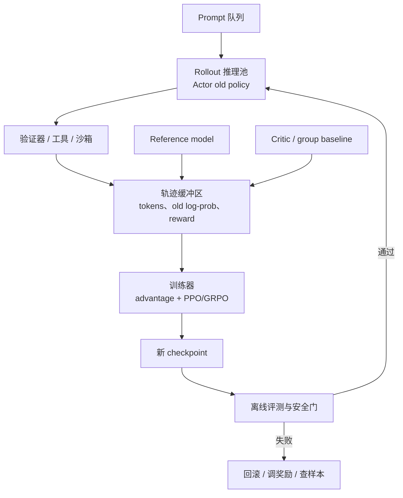

# 第 33 课　LLM RL 系统、评测与安全

<div class="lesson-lead">LLM RL 的公式可能只有一行，系统却同时运行生成模型、参考模型、奖励模型、价值模型、验证器和训练器。真正的大坑往往不是公式，而是样本来自哪个版本、奖励是否被利用、长序列是否浪费算力。</div>

::: info Berkeley 课程来源
本课以 Berkeley [L14 LLM RL](https://rail.eecs.berkeley.edu/deeprlcourse/static/slides/lec-14.pdf)、[Homework 4](https://rail.eecs.berkeley.edu/deeprlcourse/static/homeworks/hw4.pdf) 和 [LLM RL Default Final Project](https://rail.eecs.berkeley.edu/deeprlcourse/static/misc/llm_rl_default_final_project.pdf) 为算法与实践来源；逐页对照 [CS224N L08](https://web.stanford.edu/class/cs224n/slides_w26/cs224n-2026-lecture08-posttraining.pdf)、[L13 Reasoning II](https://web.stanford.edu/class/cs224n/slides_w26/cs224n-2026-lecture13-reasoning-part2.pdf) 的训练系统页，以及 [CMU ANLP L17](https://cmu-l3.github.io/anlp-spring2026/static_files/anlp-s2026-17-rl-llms.pdf) 的 RLVR、reward、KL 与实践工具；并连接本站[在线服务](/beginner/32-serving-systems)、[高级评测](/beginner/36-evaluation-research)和[安全](/beginner/37-safety)课程。
:::

## 1. 一套完整 rollout—训练闭环



关键不是每个框都“有”，而是每条轨迹必须保存可复核的版本信息：prompt、生成 token、终止原因、old log-prob、奖励分项、verifier 版本、policy checkpoint 和随机种子。

<figure class="teaching-figure"><figcaption>policy 在长轨迹生成期间可能已更新数版。轨迹必须绑定采样 checkpoint 的 old log-prob、独立 reference 版本和 verifier 版本；只保存最终模型无法重放训练语义。</figcaption></figure>

<figure class="teaching-figure source-figure"><a href="/paper-figures/berkeley-llm-rl-system.webp" target="_blank"></a><figcaption>Berkeley CS285 Lecture 14 的 LLM PPO 汇总页。一次迭代先用 $\pi_{old}$ 采样，再算奖励、GAE 和 value target，交替更新 Critic 与 Actor；下方还把 reference KL 写进每条样本的整形奖励。图中每一个带帽量都绑定采样时的模型版本，版本混乱会让正确公式也训练失败。<a href="https://rail.eecs.berkeley.edu/deeprlcourse/static/slides/lec-14.pdf#page=30">打开原课件第 30 页</a>。</figcaption></figure>

### 1.1 一条轨迹的最小数据契约

```text
trajectory_id
prompt_id / prompt_version / split
policy_checkpoint / tokenizer_hash
reference_checkpoint
verifier_name / verifier_version
generation_config / seed
token_ids / completion_mask / old_logprobs
tool_calls / observations / environment_id
reward_components / total_reward
termination_reason / response_length
timestamps / worker_id
```

这里的 `tokenizer_hash` 很重要：即使模型 checkpoint 相同，tokenizer 或 chat template 变化也会让 token、log-prob 与 mask 不再可比。

### 1.2 数据状态机要显式

轨迹至少经过：`generated → verified → admitted → trained → archived`。失败要有原因：生成超时、验证器异常、全同组过滤、版本过旧、安全阻断。不要用一个布尔 `valid` 把所有损失原因混起来。

### 1.3 幂等与去重

分布式 worker 重试可能让同一轨迹进入 buffer 两次。`trajectory_id` 应由 prompt、policy version、seed 和 sample index 决定；写入与消费要幂等，否则“吞吐提高”可能只是重复训练。

## 2. 为什么生成常比更新更贵

监督训练一次前向就有全序列标签；RL 要为同题采样多条长回答，可能再跑工具、测试和奖励模型。假设：

- 10,000 个 prompt；
- 每题采样 8 条；
- 平均生成 1,500 token。

仅 rollout 就是 1.2 亿新 token，还没算多模型评分和反向传播。因此需要 continuous batching、prefix/KV 复用、动态长度分桶、早停、异步环境和高价值样本调度。

### 2.1 先写 token 账，再谈 GPU 数

若 prompt 数 (B)、每题样本 (G)、平均 completion 长度 (ar T)：

$$
N_{rollout}=B\times G\times\bar T
$$

若只有比例 (u) 的组进入更新，则有效训练 token 约为 (uN_{rollout})，但被过滤的 ((1-u)N_{rollout}) 仍已消耗生成算力。动态采样提升“每个 optimizer batch 的有效梯度”，不等于减少总 rollout。

### 2.2 Prefill 与 decode 的资源形态不同

- prompt prefill 更像大矩阵计算，吞吐受 FLOPs 影响；
- autoregressive decode 每步只生成一枚 token，常受权重/KV 读取和批处理效率影响；
- 长度差造成 batch 中短序列提前结束，continuous batching 才能及时补入新请求；
- 同题 (G) 条回答共享 prompt，可复用 prefix KV，但要核对随机采样与缓存隔离。

<figure class="teaching-figure"><figcaption>吞吐由最慢阶段决定。无限加队列只会把等待藏成更大的 policy lag；有界队列、超时和版本门限使反压可见。</figcaption></figure>

<RLRolloutLab />

### 2.3 尾延迟比平均吞吐更危险

同步生成常被最长回答拖住。平均长度 2K 不代表 batch 在 2K 结束：少量 16K 循环样本会占住 KV、阻塞 checkpoint 切换和动态采样。必须同时看 P50/P95/P99 长度、每种 termination reason 和最长 worker 占用时间。

## 3. 同步、异步与 stale policy

### 同步

采样完成后全体训练，再发布新策略。数据新鲜、逻辑清楚，但慢环境会让 GPU 等待。

### 异步

rollout 和训练并行，吞吐更高；但样本可能来自几分钟前的旧 checkpoint。policy lag 太大时，概率比率方差升高，PPO 的 on-policy 近似失效。

实用控制手段：限制样本最大版本差、保存并校验采样时 old log-prob、按版本分桶、监控 importance ratio 分布，过旧样本丢弃或只用于离线分析。可以用当前模型重算 `new_logp`，但不能用它覆盖行为策略的 `old_logp`。

### 3.1 Policy lag 只是代理指标

相差 3 个 checkpoint 不一定总比相差 1 个更旧，因为每步学习率和更新量不同。真正应看：

$$
r_t=\exp(\log\pi_{current}-\log\pi_{behavior})
$$

的分位数、clip fraction、approximate KL 和有效样本比例。版本差适合做入口门限，概率分布差才反映算法风险。

### 3.2 三种并行方式

| 方式 | 优点 | 风险 |
|---|---|---|
| 完全同步 | 版本最清楚 | 慢环境造成全局等待 |
| 轮次流水 | rollout (k+1) 与 train (k) 重叠 | 需要冻结清楚的 behavior policy |
| 全异步 | 吞吐高、资源利用灵活 | policy lag、重复消费、非平稳 buffer |

### 3.3 Checkpoint 发布必须是原子操作

worker 不能读取“写到一半”的权重。先写临时版本、校验 shard 与 tokenizer/hash、登记 manifest，再原子切换版本指针。失败时 worker 继续使用上一个完整版本。

### 3.4 队列反压与 admission control

当 verifier 队列持续增长时，不要继续无限生成。可降低 rollout 并发、减少组大小、给昂贵环境单独队列，或按题目价值调度。buffer 水位、样本年龄和最大版本差应共同进入 admission policy。

## 4. 训练仪表盘不能只放 reward

| 类别 | 至少监控 |
|---|---|
| 优化 | policy loss、value loss、gradient norm、learning rate |
| 策略变化 | KL、entropy、clip fraction、ratio 分位数 |
| 生成 | 长度、截断率、重复率、有效格式率 |
| 奖励 | 总分与各分项、全 0/全 1 组比例、组内方差 |
| 能力 | 独立任务 accuracy、pass@k、工具成功率 |
| 安全 | 越权、注入、泄漏、奖励绕过、沙箱异常 |
| 系统 | rollout tokens/s、训练 MFU、队列等待、环境 P99 |

reward 上升而独立能力不升，是最重要的报警之一。

### 4.1 指标必须带分母

`tokens/s` 要说明是生成 token、prompt+completion token、有效训练 token 还是包含被过滤 token；`success rate` 要说明超时和 verifier error 是否进入分母。没有分母定义的吞吐和准确率无法跨实验比较。

### 4.2 用分位数而不是只用均值

ratio、KL、长度、reward、环境延迟都可能重尾。至少记录 P50/P90/P99 与极值样本 ID。均值正常时，少量极端轨迹仍可能支配梯度或拖住整批。

### 4.3 建立跨层关联键

从 eval 失败样本应能追到轨迹、prompt、verifier 日志、模型版本、训练 step 和系统 worker。没有统一 `trajectory_id` / `checkpoint_id`，只能看到曲线，无法解释原因。

### 4.4 四类报警不要混在一起

| 报警 | 例子 | 处理责任 |
|---|---|---|
| 数据质量 | parser 误判、重复 prompt | 数据/验证器 |
| 算法稳定 | KL 暴涨、entropy 塌缩 | 训练算法 |
| 系统健康 | 队列堆积、worker OOM | 基础设施 |
| 安全事件 | 越权、网络访问、秘密泄漏 | 安全隔离与响应 |

## 5. 评测要把“策略变好”与“采样更多”分开

推理模型可通过增加 token、样本数或搜索宽度换正确率。比较版本时固定：

- prompt 集与污染检查；
- 每题 token 上限；
- temperature、top-p、样本数；
- 工具权限与时间预算；
- verifier / judge 版本；
- pass@1、pass@k 和成本—质量曲线。

一张诚实的图应是横轴计算或成本、纵轴任务质量，而不是只报某个预算下的最高分。

### 5.1 训练 checkpoint 选择也会过拟合

若每 50 步在同一个开发集挑最好 checkpoint，开发集已经参与训练决策。最终报告要保留一次性测试集，或使用嵌套验证；任何手动奖励调整也算使用了对应评测反馈。

### 5.2 Pass@k、cons@k 与 pass@1 回答不同问题

- pass@1：单次真实部署能力；
- pass@k：(k) 次中至少一次成功，衡量覆盖；
- cons@k：多次答案聚合后的结果，依赖错误分布；
- Best-of-k：还依赖 verifier 是否选得对。

训练报告必须同时写每题样本数、temperature、总 token 和选择器成本。

### 5.3 置信区间与多随机种子

小型数学集一次多答会产生相关样本，不能把每条 completion 当独立样本计算过窄误差条。优先以 prompt 为重采样单元做 bootstrap，并跨训练 seed 报告波动。

## 6. RL 特有的安全威胁

1. **奖励投机**：找到评分器漏洞；
2. **目标错配**：奖励定义与真实意图不一致；
3. **环境攻击**：Agent 读取测试、越权或污染外部状态；
4. **探索风险**：训练期间尝试不可逆动作；
5. **能力侧漏**：数学能力上升但拒答、安全或通用语言能力退化；
6. **数据回流污染**：把模型自生成错误长期回灌。

防护层应在模型之外：容器沙箱、最小权限、网络隔离、模拟环境、审批点、资源预算、不可篡改日志和一键回滚。

### 6.1 训练环境要比评测环境更保守

RL 会主动探索边界。训练代码 Agent 不应拿到生产密钥、宿主机文件系统或开放网络；工具写操作默认指向可重置模拟环境。即使任务奖励鼓励“完成”，权限层也必须硬拒绝越权。

### 6.2 Verifier 与 Agent 之间建立信任边界

- Agent 输出视为不可信输入；
- parser 使用严格 schema 和长度上限；
- 测试文件、标准答案、judge prompt 不暴露给 Agent；
- verifier 运行用户代码时使用独立 UID、cgroup、seccomp 与超时；
- reward 与安全判定分开：高任务分不能覆盖安全阻断。

### 6.3 可回滚不仅是保存 checkpoint

回滚单包括：policy、reference、reward/verifier、prompt 数据版本、chat template、tokenizer、采样参数和部署配置。只回滚 actor 权重，可能仍在用产生事故的新 verifier 或模板。

## 7. 一个可以实际执行的最小项目

不要一开始训练大模型。用一个小模型和 200–1,000 道可验证题：

1. 建 SFT 基线并冻结测试集；
2. 每题采样 4 条，记录完整 log-prob 与奖励；
3. 先实现 batch mean baseline 的 REINFORCE；
4. 再加入 group normalization 和 KL；
5. 画 reward、accuracy、length、KL 四条曲线；
6. 人工检查最高奖励与最低奖励各 20 条；
7. 对照同等 token 预算的 SFT / rejection sampling 基线。

这套小实验足以暴露 mask、符号、奖励泄漏、长度偏差和策略坍缩等大部分核心问题。

### 7.1 推荐目录与不可变产物

```text
configs/run.yaml
data/prompts-v1.jsonl
verifiers/math-v3/
rollouts/policy-v12/*.parquet
checkpoints/policy-v13/
evals/policy-v13/eval-v5.json
reports/run-manifest.json
```

`run-manifest` 记录代码 commit、依赖镜像、GPU 类型、随机种子、所有数据和模型 hash。原始 rollout 与 verifier 日志只追加，不在原地覆盖。

### 7.2 先做 shadow run

上线训练前，冻结 actor 只跑完整数据管线：生成、验证、buffer、优势、loss 前向，但不 `optimizer.step()`。检查 ratio≈1、奖励分布、mask、队列与重放一致性。能抓住大部分版本与张量错误。

### 7.3 三种基线必须同时存在

1. SFT checkpoint 的 pass@1；
2. 同预算 rejection sampling / Best-of-N；
3. 不做 RL、只继续 SFT 或 DPO 的数据基线。

如果 RL 提升只是来自采样更多或加入新数据，应该如实归因。

## 8. 故障演练：看到曲线后先做什么

### Reward 升、独立正确率降

冻结训练，抽取最高 reward 新样本；用旧、新 verifier 和人工盲评交叉打分；按长度/格式/题型分桶；确认不是 eval 配置变化。不要先调学习率掩盖奖励错配。

### Rollout GPU 利用率低、Trainer 空等

看 prompt prefill/decode 比例、batch occupancy、长度 P99、KV 容量和 verifier 反压；判断是生成慢、队列空，还是环境结果迟迟不回。

### Ratio 首步就远离 1

核对 trajectory 的 policy id、tokenizer/chat template、old log-prob、动作 off-by-one、dropout/adapter/量化路径。算法调参排在版本一致性之后。

### 有效组率逐渐降到 10%

按 prompt 成功率看是全对增多还是全错增多；调整课程、组大小或动态采样，同时记录过滤后分布与额外 rollout token。

### 沙箱出现一次越权尝试

按安全事件处理：停止相关环境、保存不可变轨迹、撤销凭据、检查同类行为和权限边界。不能因“调用失败所以没造成损失”而忽略。

## 9. 到这里，你应该能审问任何“LLM RL”方案

- 状态和动作粒度是什么？
- 奖励来源是什么，能被怎样钻空子？
- 数据是 on-policy、off-policy 还是混合？
- 优势由 Critic、组内基线还是过程模型给出？
- old policy 与 reference model 是否分清？
- rollout 与训练相差几版？
- 提升在固定计算预算和独立评测下还成立吗？
- 真实环境的权限和回滚由谁保证？

<details><summary>专题结业题：reward、KL 都正常，独立 accuracy 下降，先查什么？</summary>

先查奖励与独立指标是否错配、测试参数是否一致、响应长度和格式是否变化、数据是否污染、verifier 是否被利用；再查 checkpoint 与 rollout 版本、mask 和 advantage 符号。不能因为优化指标正常就默认任务真的变好。
</details>

<ConceptCheck question="异步系统里为什么不能只用 policy checkpoint 相差几版判断样本是否陈旧？" :options='["每一步更新幅度不同，还应看 ratio、KL 与 clip fraction", "因为 checkpoint 从不改变概率", "因为陈旧度只由文件大小决定"]' :answer="0" explanation="版本差是方便的门限代理，真正算法风险来自行为策略与当前策略的分布差。" />

## 10. 推荐阅读路线

1. [CS224N L13 Reasoning II](https://web.stanford.edu/class/cs224n/slides_w26/cs224n-2026-lecture13-reasoning-part2.pdf)：重点看 reasoning training systems、推理服务与测试时计算的系统连接。
2. [CMU ANLP L17](https://cmu-l3.github.io/anlp-spring2026/static_files/anlp-s2026-17-rl-llms.pdf)：从 reward、advantage、loss 三层分类回看一套 RL 系统需要哪些模型。
3. [DAPO](https://arxiv.org/pdf/2503.14476.pdf)：逐项记录每个算法修改要求系统新增哪些统计、过滤和 buffer 行为。
4. [Berkeley CS285 L14](https://rail.eecs.berkeley.edu/deeprlcourse/static/slides/lec-14.pdf) 与 [HW4](https://rail.eecs.berkeley.edu/deeprlcourse/static/homeworks/hw4.pdf)：用小模型跑通可复核闭环，再考虑分布式框架。

专题完成后，回到[第 23 课后训练总览](/beginner/28-alignment-rl)检查全局位置，再进入 [Kimi K3 第 10 章](/guide/ch10)阅读真实模型案例。

<ChapterReadings lesson="48-rl-systems" />
