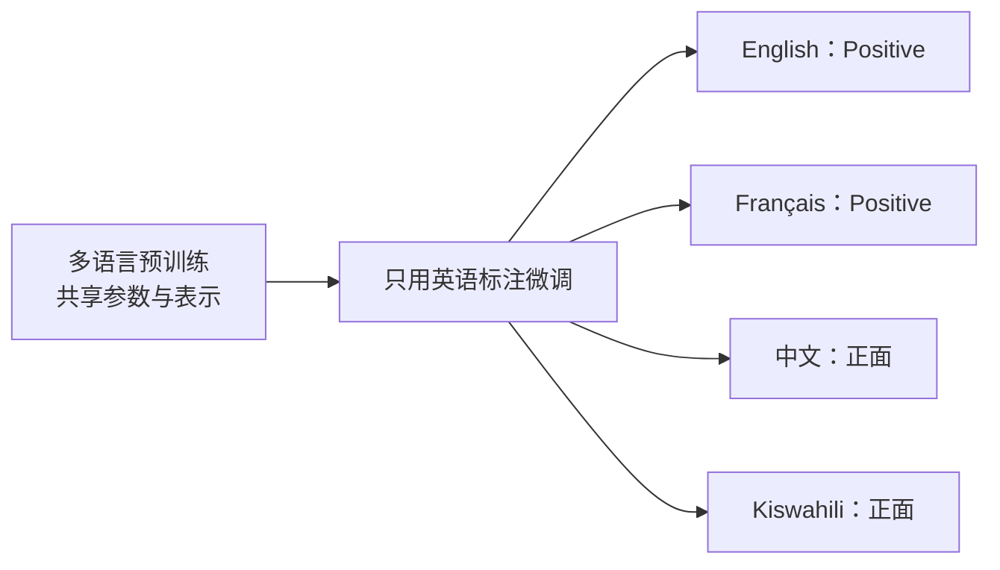

# 第 03 课：多语言模型不是把英文模型翻译一下

<div class="lesson-lead">多语言模型通常仍是同一台 Transformer，真正变化的是 tokenizer、训练数据混合与评测覆盖。共享表示可以把高资源语言学到的能力迁移给低资源语言，也会带来容量竞争、切分不公平与文化语境缺失。</div>

::: info 主要课程来源
本课沿 Stanford CS224N 的 [Tokenization and Multilinguality](https://web.stanford.edu/class/cs224n/slides_w26/cs224n-2026-lecture14-guest-julie-tokenization-multilinguality.pdf) 展开，并把其中 BPE 训练部分留给[第 01 课](/beginner/01-token)。这里集中讲多语言数据、跨语言迁移、共享词表、curse of multilinguality 与公平评测。
:::

## 先看全景：架构没变，训练世界变了


<figure class="teaching-figure concept-figure"><figcaption>低资源语言拿到多少训练 token，是第一本账；同一句话要花多少 token，是第二本账。只修其中一本，仍可能留下明显不公平。</figcaption></figure>

多语言语言模型一般不需要“多语言专用 Attention”。常见差异在：

1. tokenizer 用多语言语料训练；
2. 预训练数据包含多种语言；
3. 数据混合比例与采样温度重新设计；
4. 适配和评测覆盖不同书写系统、语言家族与文化。

## 1. 高资源与低资源不是语言本身的属性

所谓高资源语言，是指它拥有较多数字文本、标注数据、工具与评测集；低资源语言则相对稀缺。它描述的是数字生态，不代表语言“更简单”或使用者更少。

一个语言可能有大量使用者，却因为网页占比低、扫描文档难解析、缺乏标准化工具而在训练数据中很少。Common Crawl 等网页语料的语言分布与世界人口分布差异很大，因此“抓整个互联网”并不会自然得到公平数据。

### 数据缺口会沿流水线放大

```text
网页少 / 解析差
  ↓
Tokenizer 中片段更少、切得更碎
  ↓
预训练有效 token 更少
  ↓
指令数据与评测集更少
  ↓
上线后质量更低、成本更高
```

所以多语言问题不能只在模型训练最后补一点翻译数据。

## 2. 共享词表到底共享了什么

设所有语言共用一个大小为 $V$ 的词表。它可以包含：

- 跨语言共享的数字、标点与代码；
- 相同或相近书写系统中的字符片段；
- 借词、专有名词和网址；
- 每种语言独有的高频子词；
- byte fallback 兜底。

共享词表带来参数共享：相同 token 查到同一行初始 embedding。但“字面相同”不保证语义相同，跨语言能力主要还来自上下文训练把不同语言的表达对齐到可复用的表示空间。

### 词表预算是有限的

若某语言在 tokenizer 训练语料中占比很小，它的常见词也可能只能拆成很多小片段。增大 $V$ 能改善覆盖，却会增加 embedding 与输出层成本；固定 $V$ 时，给一种语言更多片段也意味着减少其他片段。

## 3. Token fertility：同样意思为什么价格不同

一种常见指标是：

$$
\text{fertility}=\frac{\text{生成的子词 token 数}}{\text{原始单词数或字符数}}
$$

比较时必须使用语义等价文本，并说明分母按单词还是字符。fertility 高意味着：

- 占用更多上下文窗口；
- API 按 token 计费时成本更高；
- Attention 与 KV Cache 处理更多位置；
- 同样 token 预算能表达的内容更少。

CS224N 课件提醒：不同语言的等价文本可能存在很大的 token 长度差异。此时“模型支持这种语言”在技术上为真，但体验和价格仍不公平。

### 3.1 把课件中的一行表格算到底

课件用同一段内容展示了一次具体切分：英语 21 token / 75 字符，法语 27 / 95，索马里语 30 / 88，泰语 36 / 79。它不是所有文本的固定比例，但很适合练习“从 token 数推到系统代价”。若以英语为基准：

| 语言 | 本例 token 数 | 相对英语价格 | 2048-token 窗口约能放几份等价内容 |
|---|---:|---:|---:|
| 英语 | 21 | 1.00× | 97 |
| 法语 | 27 | 1.29× | 75 |
| 索马里语 | 30 | 1.43× | 68 |
| 泰语 | 36 | 1.71× | 56 |

若 API 输入价格按 token 计费，泰语用户为本例同一语义约多付 71%；即使不收费，Prefill、Attention 激活和 KV Cache 位置也会增加。注意这仍不是“泰语整体比英语贵 71%”——必须在新闻、对话、代码、医疗等多个领域，用成组的语义等价文本估计分布与置信区间。

::: warning 不能只比较字符数
中文一个字符携带的信息量与英文一个字母不同；Unicode 字符又可能对应不同数量的 UTF-8 字节。公平比较需要语义对齐文本、多个领域和多种长度指标。
:::

## 4. 跨语言迁移为什么可能发生

典型流程：

1. 用 100 种语言预训练一个模型；
2. 只用英语情感标注微调分类头；
3. 直接在法语、德语、中文上测试。

若模型在预训练中把“表达正面情绪”的多语言句子映射到相近的高层表示，英语监督就能部分迁移到其他语言。这叫 **zero-shot cross-lingual transfer**。



迁移来自多种共享信号：

- 数字、实体、标点、借词等表面重叠；
- 相似语境与任务结构；
- 共享模型容量；
- 平行语料或翻译数据（如果使用）；
- 代码、数学等跨语言结构。

它不是保证：书写系统差异大、预训练数据极少或文化任务强时，零样本迁移会明显变弱。

### 4.1 三种实验设置不要混叫“跨语言能力”

| 设置 | 训练/提示看到什么 | 目标语言测试 | 能回答的问题 |
|---|---|---|---|
| translate-test | 英语任务数据 | 先把目标语言翻成英语 | 英语模型加翻译系统是否可用 |
| multilingual supervised | 每种语言都有标注 | 各语言原生输入 | 有本地监督时的上限 |
| zero-shot transfer | 只在源语言有任务标注 | 目标语言原生输入 | 共享表示能迁移多少 |

若先把测试集翻成英语，就无法证明模型真的理解目标语言；翻译器本身还会消除方言、礼貌和文化线索。报告时应写清源语言、目标语言、是否使用平行数据、任务头是否共享，以及 tokenizer 是否相同。

## 5. Vocabulary overlap 有帮助，但不是越多越好

研究常发现共享词表能促进跨语言迁移，因为不同语言通过共享 token 获得直接参数连接。即使“false friends”字面相同但含义不同，模型仍可能从上下文区分。

但是有两条同时成立的约束：

1. 一定程度的共享有助于表示对齐；
2. 每种语言仍需要足够的独立词表预算。

如果只追求重叠，把所有语言都拆成很小的字符或字节，序列会变长；如果给每种语言完全独立的大词表，又会丢失共享与扩大参数。多语言 tokenizer 是容量与迁移的联合优化问题。

## 6. Curse of Multilinguality：语言越多不一定越好

在模型容量固定时，不断加入新语言会发生竞争：

```text
固定参数量 + 固定训练预算
             ↓
语言数增加 → 每种语言平均得到的容量 / token / 更新减少
             ↓
低资源语言先从迁移中受益，随后也可能因竞争退化
```

这叫多语言诅咒。解决方向包括：

- 扩大模型容量和训练预算；
- 调整语言采样温度，给低资源语言适度过采样；
- 使用语言专属 adapter 或 MoE 专家；
- 改善共享词表与 byte/character 架构；
- 用质量更高的多语言指令数据做适配。

但过采样会重复小语料并导致过拟合，语言专属专家也会增加路由与维护成本。

## 7. 数据混合怎样避免英语淹没一切

假设语言 $l$ 的原始 token 比例为 $p_l$。一种常见重采样思路是：

$$
q_l=\frac{p_l^\alpha}{\sum_j p_j^\alpha},\qquad 0<\alpha<1
$$

当 $\alpha<1$，分布被压平：低资源语言相对得到更多采样，高资源语言相对减少。不要把公式当固定配方，真正选择要看：

- 原始数据质量；
- 重复率和领域覆盖；
- 模型容量；
- 是否有高质量平行或指令数据；
- 分语言验证曲线。

混合策略必须记录版本。否则模型质量变化时，无法判断来自数据、tokenizer 还是架构。

### 7.1 手算一次采样温度

假设清洗后训练 token 中英语、索马里语、泰语占比为 $p=(0.80,0.15,0.05)$。原样采样即 $\alpha=1$；取 $\alpha=0.5$ 时先开平方，再归一化：

$$
\sqrt p=(0.894,0.387,0.224),\qquad q\approx(0.594,0.257,0.149)
$$

泰语份额从 5% 提到 14.9%，相当于约 2.98 倍过采样；英语从 80% 降到 59.4%。这不等于“泰语数据变多了”：若原始独立文档很少，同一内容会被重复看到，训练损失继续下降而验证集不再改善。工程上要同时画每种语言的 train/dev 曲线，并记录**独立文档数、重复率和每轮重复次数**。

<TokenFairnessLab />

### 7.2 两个预算必须联合优化

训练 token 份额 $q_l$ 与每条语义样本需要的 token 数 $t_l$ 共同决定大致能看到多少语义样本：

$$
N_l^{\text{semantic}}\approx\frac{T_{\text{train}}q_l}{t_l}
$$

因此，只压平 $q_l$ 但不改善高 fertility，低资源语言每个训练 token 仍承载更少完整语义；只改善 tokenizer 而不给数据，切得更紧凑也学不到足够事实。实验必须把 tokenizer 版本与数据混合版本作为两条独立轴，而不是一次同时改完后只报总分。

## 8. 无空格语言揭示“预分词”的偏见

很多 BPE 实现先按空格切块，再在块内学习合并。对中文、日文、泰文等没有统一空格词界的语言，这个假设并不自然；固定空格边界还无法形成跨词短语 token。

SentencePiece 把空白作为普通符号处理，可在原始字符串上训练 BPE 或 Unigram LM。注意：**SentencePiece 是 tokenizer 工具/框架，不是一种独立的合并算法。**

预分词之外还要固定 Unicode 规范化。视觉上相同的字符可能有组合与分解两种码点序列；全角/半角、阿拉伯字形、零宽字符和 emoji 连接符也会影响切分。上线前至少验证 `decode(encode(x))` 的可逆边界，并对 NFC/NFKC、大小写与空白规则做语言级回归测试，避免“训练时一种写法、用户输入另一种写法”。

## 9. 字符与字节模型为什么重新受到关注

Byte/character 模型有明显优势：

- 完整覆盖，不需要 `<unk>`；
- 直接观察拼写和字符组成；
- 对 typo、字符串反转、形态变化可能更稳；
- 不会出现“词表中存在但语言模型训练几乎没见过”的大 glitch token。

代价是序列更长。新架构尝试动态删除低价值字节、分层合并局部片段或在网络内部学习潜在 token。它们把“怎样切分”从固定预处理逐步移进模型。

## 10. Glitch token：Tokenizer 与模型数据错配

Tokenizer 在语料 A 上学到某个高频片段，但语言模型实际在语料 B 上训练时，这个片段可能极少出现。结果是：

- 词表浪费一个位置；
- 对应 embedding 学得很差；
- 模型遇到它时产生异常行为；
- 形成潜在攻击面。

工程检查应统计每个 token 在最终预训练语料中的频率，寻找极低频但独占词表槽位的片段，并对异常 token 做重复、解释、上下文和安全测试。

## 11. 多语言能力应该怎样评测

### 不能只把英文测试集机器翻译

翻译测试只能控制部分语义，无法覆盖：

- 本地知识与文化规范；
- 代码切换（同一句里混用语言）；
- 方言、口语与非标准拼写；
- 礼貌、身份和语用差异；
- 不同书写系统的 OCR 与输入法噪声。

### 一份分层评测表

| 层面 | 应测内容 |
|---|---|
| Tokenizer | fertility、`<unk>`、decode 可逆性、价格 |
| 基础语言 | 语法、阅读理解、生成流畅度 |
| 跨语言 | 翻译、跨语言检索、零样本迁移 |
| 知识文化 | 本地实体、历史、习俗、语用 |
| 安全 | 各语言拒答、越狱、偏见与过度拦截 |
| 系统 | 延迟、上下文容量、工具参数与 Unicode 鲁棒性 |

每项都要按语言报告，不用宏平均隐藏低资源语言的严重退化。

### 11.1 从平均分升级成差距与成本报告

设语言 $l$ 的任务得分为 $s_l$，等价消息 token 数为 $t_l$。至少同时报告：

$$
\text{quality gap}=\max_l s_l-\min_l s_l,
\qquad
\text{cost ratio}_l=\frac{t_l}{t_{\text{reference}}}
$$

宏平均回答“每种语言等权时平均怎样”，按真实流量加权回答“当前用户总体怎样”，最差语言和分位数回答“谁被平均数藏起来”。安全评测还要分别报告有害内容漏放率与正常请求误拒率；一个语言拒答更多，不一定更安全，也可能只是能力较弱或过度拦截。

## 12. 一个多语言模型项目的检查清单

1. 列出目标语言、书写系统和真实用户比例；
2. 分语言统计原始文档、清洗后 token 与重复率；
3. 用语义等价文本比较 tokenizer fertility；
4. 检查共享词表分配和超低频 token；
5. 选择采样温度并画分语言学习曲线；
6. 准备母语者编写的任务和风险测试；
7. 报告每种语言的准确率、成本、延迟与拒答率；
8. 上线后监控代码切换、输入法噪声和新词。

## 本课练习

### 练习 1

两个模型在同一组语义等价文本上准确率相同，但模型 A 的泰文平均 token 数是英文的 2.5 倍，模型 B 是 1.3 倍。可以得出什么、不能得出什么？

<details><summary>参考答案</summary>

可以说 B 在这组文本上的 tokenizer 成本更均衡；不能仅凭 token 数断言 B 的所有多语言能力更强，还要测数据覆盖、文化任务、安全和系统表现。

</details>

### 练习 2

为什么在固定大小模型里加入更多语言，低资源语言可能先提升、随后下降？

<details><summary>参考答案</summary>

初期会从共享表示和高资源语言迁移中获益；语言继续增加后，有限参数、词表和训练更新发生竞争，每种语言得到的有效容量减少。

</details>

### 练习 3

SentencePiece 与 BPE 是什么关系？

<details><summary>参考答案</summary>

SentencePiece 是可在原始文本上训练和应用 tokenizer 的工具/框架，可实现 BPE 或 Unigram LM；BPE 才是具体的迭代合并算法。

</details>

### 练习 4

某语言在原始语料中占 2%，经重采样后占 8%；同一条消息平均需要英语 2 倍 token。若只看训练 token 配额，它得到英语的多少“语义样本效率”？

<details><summary>参考答案</summary>

8% 是训练 token 份额，但每条语义要花 2 倍 token，所以大致只能转化为相当于 4% 英语消息数的语义样本（忽略长度分布与质量差异）。这正说明采样份额和 tokenizer 成本必须一起算。

</details>

## 13. 课件与论文精读路线

1. 先读 [CS224N L14 Slides 第 62–75 页](https://web.stanford.edu/class/cs224n/slides_w26/cs224n-2026-lecture14-guest-julie-tokenization-multilinguality.pdf#page=62)，把“数据代表性—迁移—多语言诅咒—token 成本—byte 模型”连成一条因果链；不要只记模型名。
2. 再读 [XLM-R：Unsupervised Cross-lingual Representation Learning at Scale](https://aclanthology.org/2020.acl-main.747.pdf)，重点找：语言数增加时，正迁移和容量竞争分别在哪些实验中出现。
3. 最后读 [Do All Languages Cost the Same?](https://aclanthology.org/2023.emnlp-main.614.pdf)，记录它怎样构造等价文本、怎样定义成本差异，以及哪些结论不能外推到所有 tokenizer。

## 闭卷复述

请画出“多语言数据 → 共享 tokenizer → 同一 Transformer → 跨语言迁移 → 分语言评测”，并在图上标出三处可能产生不公平的地方。

下一课：[从噪声到图像：扩散模型与 Flow Matching](/beginner/51-diffusion-flow)。

<ChapterReadings lesson="50-multilingual" />
