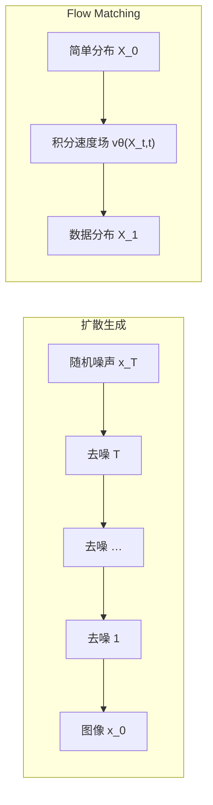
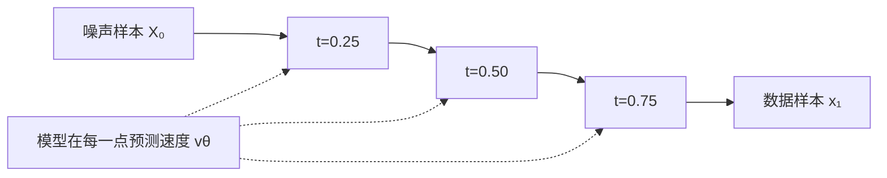

# 第 44 课：图像怎样从随机噪声里生成出来

<div class="lesson-lead">自回归模型把输出拆成“下一个 token”；扩散模型把生成写成“把噪声一步步搬回数据分布”。Flow Matching 又把它改写成学习一片速度场。三者都在学习分布，但状态、训练目标和采样路径不同。</div>

::: info 课程来源与学习边界
本课跟随 CMU Advanced NLP 的 [Multimodal II](https://cmu-l3.github.io/anlp-spring2026/static_files/anlp-s2026-12-multimodal-ii.pdf) 与 [Diffusion and Flows](https://cmu-l3.github.io/anlp-spring2026/static_files/anlp-s2026-15-multimodal-iii.pdf) 重写。重点是初学者能手画训练与采样数据流；ELBO 和 SDE 推导只保留理解后续方法所需的最小部分。
:::

## 先比较三类生成过程

| 方法 | 从什么开始 | 每一步做什么 | 典型状态 |
|---|---|---|---|
| 自回归 | 开始 token | 预测下一个 token | 已生成前缀 |
| 扩散 | 高斯噪声 | 预测并移除一部分噪声 | 不同噪声强度的图像/潜变量 |
| Flow Matching | 简单分布样本 | 沿学习到的速度场移动 | 连续时间位置 |



<figure class="teaching-figure concept-figure"><figcaption>训练和生成不是同一个循环：训练知道原图与自己加入的噪声，可以在任意时刻做一步监督；生成只有噪声，只能靠模型沿时间多次求解。</figcaption></figure>

## 1. 为什么不直接逐像素生成

一张 1024×1024 RGB 图片有 300 多万个通道值。像语言一样逐像素自回归会形成极长序列，而且相邻像素高度相关，采样速度慢。

扩散模型选择另一条路：

1. 定义一个固定加噪过程，把真实图像逐渐破坏成噪声；
2. 学习逆过程，给定带噪图像与时间步，预测怎样去掉噪声；
3. 生成时从纯噪声开始，多步去噪得到新图像。

## 2. 前向过程：按计划加高斯噪声

记真实数据为 $x_0$，第 $t$ 步状态为 $x_t$：

$$
q(x_t\mid x_{t-1})=
\mathcal N\left(x_t;\sqrt{\alpha_t}x_{t-1},(1-\alpha_t)I\right)
$$

$\alpha_t$ 接近 1 时，每步只保留大部分信号并加入少量噪声。连续很多步后，$x_T$ 接近标准高斯噪声。

关键技巧是：不用真的从 1 模拟到 $t$，可以直接采样任意时间的带噪状态：

$$
x_t=\sqrt{\bar\alpha_t}x_0+\sqrt{1-\bar\alpha_t}\epsilon,
\qquad \epsilon\sim\mathcal N(0,I)
$$

其中 $\bar\alpha_t=\prod_{i=1}^{t}\alpha_i$。

上式第二项应读成“噪声标准差乘噪声样本”，完整写法是 $\sqrt{1-\bar\alpha_t}\epsilon$。均值与方差不能混：$1-\bar\alpha_t$ 是方差，真正乘在标准正态样本上的系数是它的平方根。

### 用调色玻璃理解

- $t=0$：玻璃透明，看到完整原图；
- 中间 $t$：玻璃越来越花，结构仍隐约可见；
- $t=T$：只剩随机雪花。

训练时随机抽一个 $t$，因此一张原图能教模型处理各种噪声强度。

<DiffusionNoiseLab />

### 2.1 手算一个像素，不再把公式当装饰

设某个归一化像素 $x_0=0.75$，当前 $\bar\alpha_t=0.64$，采到的噪声 $\epsilon=-0.50$。信号系数是 $0.8$，噪声系数是 $0.6$：

$$
x_t=0.8\times0.75+0.6\times(-0.50)=0.30
$$

训练标签不是 $x_t$，而是我们刚刚采样并保存的 $\epsilon=-0.50$。若网络预测 $\hat\epsilon=-0.45$，就可还原干净值估计：

$$
\hat x_0=\frac{x_t-\sqrt{1-\bar\alpha_t}\hat\epsilon}{\sqrt{\bar\alpha_t}}
=\frac{0.30-0.6\times(-0.45)}{0.8}=0.7125
$$

误差来自噪声预测不准；真正图像上网络会联合周围像素、全局结构和文字条件，而不是独立恢复每个像素。

## 3. 网络到底预测什么

最常见的 DDPM 简化目标让网络预测本轮加入的噪声：

$$
\mathcal L_{simple}=
\mathbb E_{x_0,t,\epsilon}
\left[\left\lVert \epsilon-\epsilon_\theta(x_t,t,c)\right\rVert_2^2\right]
$$

$c$ 是可选条件，例如文字提示。训练的一步可以写成：

```text
真实图像 x0
  + 随机时间 t
  + 随机噪声 ε
       ↓
构造带噪状态 xt
       ↓
网络看到 xt、t、文字条件 c
       ↓
预测噪声 εθ
       ↓
用均方误差比较 εθ 与真实 ε
```

模型也可以预测 $x_0$、速度 $v$ 或 score。不同参数化会影响数值稳定与不同噪声区间的权重，但都服务于恢复数据方向。

### 3.1 四种参数化其实可以互相换算

为了避免符号堆叠，写 $x_t=a_t x_0+\sigma_t\epsilon$。只要 $a_t$ 与 $\sigma_t$ 已知，预测任意一个量都能推出另一个：

$$
\hat x_0=\frac{x_t-\sigma_t\hat\epsilon}{a_t},
\qquad
\hat\epsilon=\frac{x_t-a_t\hat x_0}{\sigma_t}
$$

常见 velocity 参数化定义为 $v=a_t\epsilon-\sigma_t x_0$。它不是 Flow Matching 的速度场本身；名字相同但训练路径与语境不同。工程实现还会给不同时间区间加权，因为高噪声区更依赖全局语义，低噪声区更影响纹理细节。看到“同样是 MSE”时，还必须追问：预测对象、时间采样分布、loss weight 和噪声日程是什么。

## 4. 为什么“预测噪声”能够生成图像

若模型知道 $x_t$ 中哪部分是噪声，就能估计更干净的状态。更深一层的解释是：最优噪声预测器与分布的 **score** 有关系：

$$
\nabla_x\log p_t(x)
$$

score 指向在当前噪声层级中概率密度增大的方向。逐步沿这些方向移动，就从随机低密度区域回到像真实数据的区域。

## 5. 采样：训练可以随机一步，生成却要走完整条路

生成时：

1. 采样 $x_T\sim\mathcal N(0,I)$；
2. 从 $t=T$ 倒序到 1；
3. 每步用网络预测噪声或干净状态；
4. 根据采样器计算 $x_{t-1}$；
5. 最后得到 $x_0$。

这解释了扩散模型的一项主要成本：同一张图要运行网络多次。DDIM、ODE solver、蒸馏和 consistency 方法都在尝试减少采样步数。

### 5.1 用 NFE 而不是“步数”比较速度

**NFE（number of function evaluations）** 是采样期间调用去噪网络/速度网络的次数。Euler 一步通常 1 次 NFE，高阶求解器的一“步”可能调用多次；CFG 若条件与无条件分开算，通常又接近 2 倍前向。因此“20 步采样器”不一定比另一个“25 步采样器”更便宜。

减少 NFE 会增大数值离散误差：全局结构可能漂移，细节与文字先损坏。比较采样器时必须固定模型、分辨率、提示、随机种子和 Guidance，报告 NFE、墙钟时间、显存与质量，而不是只写界面上的 steps。

## 6. 条件生成：文字怎样控制图像

文本编码器先把 Prompt 编成向量，生成主干通过 cross-attention 或联合 Transformer 读取它。目标是学习：

$$
p(x\mid c)
$$

其中 $c$ 可以是文字、类别、深度图、边缘、姿态或另一张图。

### Classifier Guidance

早期方法使用额外分类器 $p_\phi(c\mid x_t)$ 的梯度，把采样方向推向更符合条件的区域。需要一个能处理各种噪声强度的分类器，训练复杂。

### Classifier-Free Guidance（CFG）

同一网络训练时有时给条件、有时把条件置空。采样时组合两次预测：

$$
\tilde\epsilon=(1+w)\epsilon_\theta(x_t,t,c)-w\epsilon_\theta(x_t,t,\varnothing)
$$

$w$ 越大，通常文字对齐更强，但可能降低多样性、产生过饱和或伪影。Guidance scale 不是“画质滑杆”，而是在条件遵循与自然分布之间改方向。

::: warning 不同实现的 scale 记号可能差 1
有的代码写 $\epsilon_{uncond}+s(\epsilon_{cond}-\epsilon_{uncond})$，有的课件写 $(1+w)\epsilon_{cond}-w\epsilon_{uncond}$；二者在 $s=1+w$ 时等价。复制参数前要先看实现公式，不能只抄一个数字“7.5”。
:::

训练 CFG 模型时，会用概率 $p_{drop}$ 把条件替换为空条件。太少的空条件样本会让无条件分支学不好，太多又减少条件学习。部署还可把条件/无条件拼成一个 batch，但这节省的是调度开销，不会凭空消除两份激活计算。

## 7. 为什么在潜空间扩散

像素空间太大。Latent Diffusion 先训练一个自编码器：

```text
图像 x ──Encoder──> 潜变量 z ──Decoder──> 重建图像 x̂
                         ↑
                 扩散模型只在这里工作
```

潜变量的空间尺寸和通道数更小，计算大幅下降。代价是：

- 自编码器可能丢失细小文字和纹理；
- 生成误差与解码误差叠加；
- 潜空间的几何由自编码器决定。

Stable Diffusion 系列就是典型潜空间生成系统。

## 8. U-Net、DiT 与多模态 Transformer

经典扩散使用 U-Net，通过多尺度卷积处理局部和全局结构。Diffusion Transformer（DiT）把潜变量切成 patch token，用 Transformer 预测噪声或速度。

| 主干 | 优势 | 代价/偏置 |
|---|---|---|
| U-Net | 多尺度图像偏置强、成熟 | 架构专用，Scaling 路线不同 |
| DiT | 容易按 Transformer 规模化，与多模态融合自然 | token 数与 Attention 成本高 |
| 联合多模态 Transformer | 文字与图像 token 可共同建模 | 训练数据与系统复杂度更高 |

“用 Transformer”不等于变成语言模型：输出状态仍可能是连续潜变量，训练目标也不是下一 token 交叉熵。

## 9. 连续时间：从离散台阶变成一条轨迹

当扩散步数趋近无穷，可以用随机微分方程（SDE）描述。对应还存在一个 probability flow ODE，它是确定性的，却能保持相同的时间边缘分布。

对初学者，重要结论是：

- 去噪不必只理解成固定 1,000 个台阶；
- 可以选择不同数值求解器与时间步；
- 这为更少步、更稳定的采样提供工具；
- 也自然引出“能否直接学习从噪声到数据的速度”。

### 9.1 ODE 求解器到底在近似什么

对 $dX_t/dt=v_\theta(X_t,t)$，最简单的 Euler 更新是：

$$
X_{t+\Delta t}\approx X_t+\Delta t\,v_\theta(X_t,t)
$$

步长大时便宜，但速度场在这一段若弯得厉害，直线近似会偏离；高阶 solver 会在区间内多问几次速度来降低误差。所谓“Flow 路径更直、可少步采样”，本质是让一个粗粒度数值求解器也不至于走偏，不是生成过程真的只需一次矩阵乘法。

## 10. Flow Matching：学习一张“速度地图”

设起点分布 $p_0$ 是噪声，终点 $p_1$ 是数据。定义连续状态 $X_t$，模型学习速度场：

$$
\frac{dX_t}{dt}=v_\theta(X_t,t)
$$

如果速度场正确，从 $X_0\sim p_0$ 出发积分到 $t=1$，就得到 $X_1\sim p_1$。

### 最直觉的条件直线路径

随机取噪声 $X_0$ 和真实样本 $x_1$：

$$
X_t=(1-t)X_0+tx_1
$$

这条直线的目标速度是：

$$
\frac{dX_t}{dt}=x_1-X_0
$$

训练网络预测这个速度：

$$
\mathcal L_{CFM}=\mathbb E
\left[\left\lVert v_\theta(X_t,t)-(x_1-X_0)\right\rVert_2^2\right]
$$



直线路径通常比弯曲随机去噪轨迹更容易用较少 ODE 步积分，但实际方法还会设计不同路径、时间采样和目标参数化。

### 10.1 “每对样本走直线”不等于整体速度永远简单

训练中会把噪声 $X_0$ 与数据 $x_1$ 配成对。若许多条件直线在同一点附近交叉，却要求相反速度，模型在只看到 $(X_t,t)$ 时无法知道来自哪一对，只能学条件期望，轨迹可能被平均并变弯。不同 coupling（如何配对起点与终点）、最优传输近似和路径设计，会直接影响速度场复杂度与所需 NFE。

这也是读 Flow Matching 论文时应关注的核心：损失公式看起来相同，不同方法可能在 $p_t(X_t\mid x_1)$、时间采样、coupling 与条件信息上完全不同。

## 11. 扩散和 Flow Matching 怎么比较

| 问题 | 扩散 / DDPM | Flow Matching |
|---|---|---|
| 训练直觉 | 预测加入的噪声 / score | 预测从起点到终点的速度 |
| 路径 | 由噪声过程定义，可为随机 SDE | 可设计连续概率路径 |
| 采样 | 逆扩散或求解 ODE/SDE | 积分学习到的 ODE |
| 常见优势 | 理论与生态成熟，条件控制丰富 | 路径可更直，少步采样潜力大 |
| 共同点 | 都从简单分布运输到数据分布 | 都可在潜空间、用 Transformer |

不要把它们描述成完全无关的两派。连续时间视角揭示 score-based diffusion、probability flow ODE 与 flow 方法之间有紧密联系。

## 12. 训练和部署各要算什么账

### 训练账

- 数据：图文配对质量、重复、版权与不安全内容；
- 状态：像素还是潜变量，分辨率与 token 数；
- 目标：噪声、数据、速度或其他参数化；
- 条件：文本编码器是否冻结，空条件概率；
- 计算：网络前向、EMA、混合精度和分布式策略。

### 推理账

- 采样步数 × 每步网络成本；
- CFG 常需要条件/无条件两次预测，是否能批处理；
- 分辨率、批量与显存；
- 文本编码、VAE 解码和安全过滤；
- 首图延迟与每张图成本。

## 13. 图像生成怎样评测

必须拆开：

- **提示对齐**：对象、属性、关系是否符合文字；
- **视觉质量**：结构、纹理与伪影；
- **多样性**：不同随机种子是否只生成相似模板；
- **文字/OCR**：图中文字是否正确；
- **组合能力**：数量、空间关系与罕见组合；
- **安全与版权**：人物、风格模仿、训练记忆和水印；
- **系统成本**：步数、延迟、显存与能耗。

单一 FID 或美学分不能覆盖这些维度。还应保留相同 Prompt、种子和采样设置做可重复比较。

## 本课练习

### 练习 1

为什么训练时可以随机选择一个时间步，采样时却通常要走多个时间步？

<details><summary>参考答案</summary>

训练可直接用重参数化从原图构造任意 $x_t$ 并学习该噪声层级；生成只有随机噪声，没有真实 $x_0$ 可直接跳回，因此要用学习到的逆过程或 ODE 逐步运输。

</details>

### 练习 2

CFG scale 增大时，为什么提示遵循可能更强而图像自然度或多样性下降？

<details><summary>参考答案</summary>

CFG 把方向更强地推向条件分布相对无条件分布的差异，可能离开自然数据的高概率区域，并让多个样本收敛到更相似的强条件模式。

</details>

### 练习 3

Flow Matching 直线路径 $X_t=(1-t)X_0+tx_1$ 的速度是什么？

<details><summary>参考答案</summary>

对 $t$ 求导得到 $x_1-X_0$，与时间无关。模型训练时学习在各中间点给出把噪声向数据移动的速度。

</details>

### 练习 4

模型 A 用 20 个 Euler 步且开启普通 CFG；模型 B 用 15 个二阶求解步骤，每步评估速度 2 次，不用 CFG。若 A 的条件与无条件分支分别前向，谁的 NFE 更少？

<details><summary>参考答案</summary>

A 约为 $20\times2=40$ NFE；B 为 $15\times2=30$ NFE，所以 B 的网络调用更少。真实墙钟时间还受是否批处理 CFG、缓存、并行和实现影响。

</details>

## 14. 课件与论文精读路线

1. 先看 [CMU Slides 第 5–25 页](https://cmu-l3.github.io/anlp-spring2026/static_files/anlp-s2026-15-multimodal-iii.pdf#page=5)，逐页复述 forward、直接采样 $x_t$、噪声预测、score 与 sampling；第 19 页的图应能不看文字自己画出。
2. 再看 [Slides 第 27–40 页](https://cmu-l3.github.io/anlp-spring2026/static_files/anlp-s2026-15-multimodal-iii.pdf#page=27)，重点区分 CFG、latent/DiT、SDE/ODE 与 Flow Matching 分别解决什么问题。
3. 精读 [Denoising Diffusion Probabilistic Models](https://arxiv.org/pdf/2006.11239.pdf)：第一遍只追踪 $x_0,x_t,\epsilon$，第二遍再看 ELBO 怎样化为参数化后的去噪目标。
4. 精读 [Flow Matching for Generative Modeling](https://arxiv.org/pdf/2210.02747.pdf)：回答“条件速度为何可训练边缘速度”“路径选择怎样影响数值积分”两个问题。

## 闭卷复述

请分别画出 DDPM 的“加噪训练 / 逆向采样”和 Flow Matching 的“噪声起点 / 速度场 / 数据终点”，并说明潜空间与 Guidance 各解决什么问题。

下一课：[我们怎样知道模型内部在做什么](/beginner/52-interpretability)。

<ChapterReadings lesson="51-diffusion-flow" />
