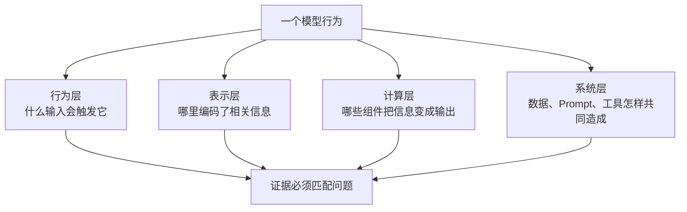
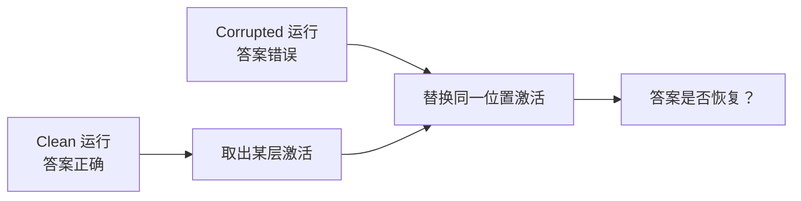

# 第 48 课：我们怎样知道模型内部在做什么

<div class="lesson-lead">“模型说它为什么这样回答”只是自我报告，不等于机制证据。可解释性研究要从行为观察进入内部表示，再通过干预确认哪些部件对结果有因果作用；否则一张漂亮热力图只能说明相关。</div>

::: warning 来源说明：课程官网的 Slides 标题错配
CS224N 2026 的 Interpretability 讲次当前链接到一份“Life after DPO”课件，内容并不是可解释性。本站没有把它冒充解释性来源，而是依照该讲次公开阅读材料重组，包括 [Agentic Interpretability](https://arxiv.org/pdf/2506.12152.pdf)、[Concept Discovery](https://arxiv.org/pdf/2310.16410.pdf) 与 [Existing Vocabulary 的局限](https://arxiv.org/pdf/2502.07586.pdf)。原始索引页保留了错配提示，便于复核。
:::

## 先分清：你到底想解释什么



<figure class="teaching-figure concept-figure"><figcaption>归因、探针和 Logit Lens 适合提出“哪里值得查”的假设；patch、ablation 与 steering 才开始回答“改这里会不会改变行为”。</figcaption></figure>

“模型为什么拒答”可能在问完全不同的问题：

- 哪类输入最容易触发拒答？
- 哪层表示包含风险类别信息？
- 哪些注意力头或 MLP 特征促成拒答 token？
- 是底座模型、系统 Prompt、RAG 文档还是外部安全分类器做了决定？

若问题没定义清楚，解释方法再高级也可能答非所问。

### 0.1 先把“为什么”改写成可测量问题

“为什么模型回答 Paris？”太宽。一个可执行问题应包含：

> 对输入 “France's capital is”，当目标度量是 `logit(Paris) - logit(Rome)` 时，哪一层、哪个 token 位置的 residual activation 携带了由主语国家决定答案的因果信息？

这里明确了输入、对照候选、内部变量和输出度量。目标可以是 logit difference、答案概率、拒答率或工具调用成功率，但实验前就要冻结；看到结果后再换指标，会产生选择性汇报。

## 1. 三类常被混为一谈的解释

### 模型生成的自然语言解释

让模型回答“你为何这么做”。它对用户沟通很有帮助，但可能是事后合理化，无法保证忠实于内部计算。

### 行为解释

系统地改变输入，观察输出怎样变化。例如替换人名、语言、否定词或证据顺序。这能发现触发条件，却未直接说明网络内部机制。

### 机制解释

定位内部表示、注意力头、MLP 特征或计算路径，并通过替换、抑制、放大等干预证明它们对行为有因果作用。

三者都重要，但证据强度和用途不同。

## 2. 从最稳妥的行为实验开始

在打开模型内部之前，先做最小对照：

```text
原句：Alice gave Bob the book because he asked for it.
对照：Alice gave Bob the book because she asked for it.
```

保持其他内容不变，只改一个因素，检查：

- 下一 token 概率；
- 答案或分类；
- 置信度；
- 中间层表示差异；
- 多语言版本是否一致。

行为对照是后续内部解释的地基。若现象本身不稳定，内部热力图很难有可重复结论。

## 3. 归因方法：输入的哪部分最影响输出

常见问题：“哪些输入 token 对答案 `Paris` 的概率贡献最大？”

### 删除或遮盖

逐个移除输入片段，看目标概率下降多少。直观但会产生不自然输入，也忽略特征交互。

### 梯度归因

计算目标 logit 对输入 embedding 的梯度。梯度表示局部敏感性，不一定等于实际因果贡献；饱和区还可能梯度很小。

### Integrated Gradients

从基线输入到真实输入沿路径累积梯度，缓解单点梯度问题。但基线和路径选择会改变解释。

对输入 embedding $x$、基线 $x'$ 和目标函数 $F$，第 $i$ 维归因为：

$$
\mathrm{IG}_i(x)=(x_i-x'_i)\int_0^1
\frac{\partial F(x'+\gamma(x-x'))}{\partial x_i}\,d\gamma
$$

实际用若干插值点近似积分。IG 的 completeness 性质可让各维归因和接近 $F(x)-F(x')$，但它只相对所选基线成立；把 PAD、零向量或语法正常的中性句作为基线，会得到不同问题的答案。

### 3.1 归因实验必须有“反事实仍自然”的意识

删除一个 token 后概率下降，可能因为信息被移除，也可能因为句子变成训练分布外。较稳妥的对照包括同词性替换、同长度实体替换、mask 后用语言模型填补，以及成组测试多个可交换样本。还要检验归因排名是否对随机种子、分词边界和同义改写稳定。

::: warning Attention is not automatically explanation
高注意力权重只说明某层某头在计算中读取较多，并不证明该 token 对最终输出具有最大因果影响。残差流、其他头和 MLP 都可能覆盖或改写它。
:::

## 4. 探针：某种信息能否从表示中读出来

把某层隐藏状态冻结，训练一个小分类器预测属性，例如词性、语言、真假或情感：

$$
\hat y=\operatorname{softmax}(Wh+b)
$$

若线性探针准确率高，说明属性在 $h$ 中**线性可读**。但不能立即得出模型实际使用了它，因为：

- 高维随机表示也可能容易拟合；
- 探针自身可能学会任务；
- 信息存在不等于后续计算依赖它；
- 数据泄漏和类别不平衡会制造假象。

更可靠的做法包括控制探针容量、随机标签基线、最小描述长度、跨域测试，并配合因果干预。

### 4.1 Probe 的两个控制问题

1. **selectivity**：真实标签准确率减去随机控制标签准确率有多大？若两者都很高，探针可能只是在记忆样本。
2. **control task**：在不应包含该属性的表示或随机初始化模型上，探针还能多好？若依旧很好，数据或探针本身可能泄漏。

训练探针时应冻结底座模型，严格分 train/dev/test，并报告探针层数、参数量、正则化与类别基率。比较不同层时要用相同探针容量；否则“第 10 层更可读”可能只是那次超参数更合适。

## 5. Logit Lens：每一层“准备说什么”

把中间层残差状态通过最终归一化和 unembedding 投到词表：

$$
\text{logits}^{(l)}=W_U\,\text{Norm}(h^{(l)})
$$

可以观察答案候选怎样逐层出现。例如早期层偏向表面词，后期层逐渐提高正确实体概率。

但不同层的表示基底并不一定直接对齐最终 unembedding；直接投影可能失真。Tuned Lens 会为各层学习映射，解释更稳定，却引入额外训练。

## 6. Activation Patching：把“好运行”的内部状态移到“坏运行”

准备两次运行：

- clean input：模型能答对；
- corrupted input：只改变关键事实，模型答错。

然后把 clean 运行某个位置、某层、某头的激活复制到 corrupted 运行，观察正确答案是否恢复。



如果恢复明显，该激活对 clean 与 corrupted 差异具有因果作用。还需注意：

- 一次替换可能破坏分布；
- 信息可能分散在多个位置；
- 恢复输出不等于找到完整机制；
- patch 的粒度决定结论是“某层”还是“某头”。

### 6.1 恢复率怎样计算

设 clean、corrupted 和 patched 的目标度量分别为 $m_c,m_b,m_p$，常见归一化恢复率是：

$$
R=\frac{m_p-m_b}{m_c-m_b}
$$

$R=0$ 表示没有恢复，$R=1$ 表示恢复到 clean；噪声与非线性交互也可能使 $R<0$ 或 $R>1$。若 $m_c-m_b$ 本来很小，分母会让恢复率极不稳定，所以必须先筛出行为差异明确的 clean/corrupted 对，并同时报告原始 logit 或概率。

<ActivationPatchingLab />

### 6.2 一次完整扫描的伪代码

```python
clean_cache = model.run_with_cache(clean_prompt)
bad_cache   = model.run_with_cache(corrupted_prompt)

for layer in layers:
    for position in positions:
        patched = run_corrupted_but_replace(
            layer=layer,
            position=position,
            value=clean_cache[layer, position],
        )
        recovery[layer, position] = normalized_recovery(patched)
```

两条 Prompt 的 token 位置必须可对齐。若 `France` 与替换实体被 tokenizer 切成不同数量的 token，简单按索引 patch 会把不同语义位置混在一起；可选长度匹配实体、在 span 上聚合，或明确用 sequence alignment。

## 7. Ablation：移除组件看行为是否消失

可以把注意力头输出置零、替换为均值、屏蔽 MLP 特征或删除边。若目标行为下降，说明组件有因果贡献。

但神经网络有冗余：

- 删除一个头，其他头可能补偿；
- 置零造成异常分布，夸大影响；
- 一个组件可能参与多种任务；
- 多组件组合才形成机制。

因此要比较多种替换基线，并报告对其他能力的副作用。

常见 ablation 基线回答不同反事实：置零问“把这条信号拿掉”，均值替换问“换成典型激活”，resample ablation 问“换成另一真实样本的激活”。置零最简单，却可能把状态推到模型从未见过的区域；结论应在至少两种合理基线上方向一致。

## 8. 从神经元走向特征：Superposition 问题

一个神经元不一定对应一个人类概念。模型可能把比维度更多的稀疏特征叠加在同一向量空间中，这叫 **superposition**。

Sparse Autoencoder（SAE）尝试把激活 $h$ 分解为更多稀疏特征：

$$
z=\operatorname{ReLU}(W_{enc}h+b),\qquad
\hat h=W_{dec}z
$$

训练同时追求重建好与 $z$ 稀疏。研究者再查看哪些输入激活某个特征，并对特征做干预。

一个简化目标是：

$$
\mathcal L_{SAE}=\lVert h-\hat h\rVert_2^2+\lambda\lVert z\rVert_1
$$

$\lambda$ 太小，许多特征同时激活，难以解释；太大，重建变差或出现 dead features。评估 SAE 不能只看“几个例子很像一个概念”，至少要报告重建误差/解释方差、平均激活数、dead feature 比例、特征稳定性，以及把该特征放大或抑制后行为是否按解释变化。

SAE 不是自动概念字典：特征可能难命名、切得过细或混合多个含义；解释还依赖自动/人工标注质量。

## 9. Circuit：把多个部件组织成计算图

机制可解释性最终想回答：哪些注意力头、MLP 特征和残差边组成一个可复现算法？

以简单的复制任务为例，候选 circuit 可能包括：

1. 一个头定位前面相同 token；
2. 另一个头读取它后面的 token；
3. 残差流把结果传到输出；
4. unembedding 提高目标词概率。

验证 circuit 要：定位候选部件 → 做 patch/ablation → 检查必要性与充分性 → 换样本复现 → 检查是否只对特定 Prompt 生效。

### 9.1 必要、充分、完整是三件事

- **必要性**：拿掉候选 circuit 后，行为下降多少？
- **充分性**：只保留候选 circuit 或把它移植过去，行为能恢复多少？
- **完整性**：候选 circuit 是否解释了大部分 clean/corrupted 差距，而不是只找到一条旁路？

一个组件可以“有影响”却不必要，因为其他路径会补偿；也可能必要却不充分，因为还需要上游信息。可信 circuit 研究会逐步压缩图，同时追踪任务性能和无关任务副作用，而不是看到一个强 attention head 就给它命名结束。

## 10. 概念发现为什么需要新词汇

人的现有概念不一定覆盖模型内部表示。模型可能形成我们没有名字的组合特征。CS224N 阅读线强调：解释不应只把内部状态强行匹配到已有标签，还应允许**概念发现**与新的可交流表示。

一种方向是：

- 自动聚类或学习稀疏特征；
- 用代表样本描述它；
- 让人提出/修订概念名；
- 通过干预验证概念边界；
- 把新概念用于控制或协作。

真正目标不是生成漂亮名称，而是缩小“模型可利用的结构”与“人能理解和验证的结构”之间的差距。

## 11. Agentic Interpretability：让模型帮助研究模型

大语言模型可以协助：

- 浏览大量激活样本；
- 提出特征解释候选；
- 生成反例和测试输入；
- 编写实验代码；
- 比较多个 circuit 假设。

但解释模型也会幻觉、迎合和遗漏反例。稳健流程是让它提出假设，再由确定性实验、因果干预与人工复核验证，而不是把语言解释本身当结论。

## 12. 可解释性和安全是什么关系

可解释性可能帮助发现欺骗、偏见、拒答或危险能力，但不能替代安全工程：

- 没解释出来不等于行为安全；
- 找到“有害特征”不保证能无副作用删除；
- 内部方法可能对新模型版本失效；
- 生产风险还来自 RAG、工具、权限和人机流程。

安全系统仍需要威胁模型、权限隔离、运行时验证和红队，详见[第 49 课](/beginner/37-safety)。

## 13. 一项可信解释研究应该报告什么

| 项目 | 最低要求 |
|---|---|
| 行为定义 | 输入、目标输出、成功与失败样本 |
| 定位方法 | 层、位置、头、特征及选择规则 |
| 对照 | 随机组件、替代基线、未相关任务 |
| 因果证据 | patch、ablation、steering 中至少一种 |
| 泛化 | 新 Prompt、样本、语言或模型尺寸 |
| 副作用 | 干预后其他能力是否下降 |
| 复现 | 模型版本、tokenizer、代码和随机种子 |

## 14. 证据强度阶梯

```text
模型自我解释
  ↓
输入相关性 / 可视化
  ↓
信息可被探针读出
  ↓
激活与行为稳定相关
  ↓
干预后行为按预测改变
  ↓
跨样本、跨模型复现的计算机制
```

越往下，结论越强，实验成本也越高。不同产品问题不一定都需要完整 circuit，但必须诚实说明证据处在哪一级。

## 本课练习

### 练习 1

一个注意力热力图显示答案 token 高度关注问题中的某个人名。能否据此断言“这个人名导致答案”？

<details><summary>参考答案</summary>

不能。需要遮盖、patch 或其他因果干预，检查改变该信息是否按预测改变输出；还要考虑残差和其他头的作用。

</details>

### 练习 2

线性探针能从第 10 层表示中以 99% 准确率读出语言类别，说明了什么、没说明什么？

<details><summary>参考答案</summary>

说明语言类别在该表示中线性可读；没有证明模型后续决策实际使用这项信息，也没有证明某个单独神经元负责语言识别。

</details>

### 练习 3

为什么 activation patching 通常比只看相关性更强？

<details><summary>参考答案</summary>

它主动替换内部状态并观察行为是否恢复，提供了“改变该变量会改变结果”的因果证据；但仍需控制分布破坏和多路径冗余。

</details>

### 练习 4

某位置 patch 后目标 logit 从 corrupted 的 1.0 提升到 3.0，clean 为 5.0。恢复率是多少？若 clean 与 corrupted 只差 0.01，还应直接相信同一个归一化公式吗？

<details><summary>参考答案</summary>

$R=(3-1)/(5-1)=0.5$，即恢复 50%。若分母只有 0.01，任何噪声都会被放大，恢复率极不稳定；应先确认行为差异显著，并报告原始度量与不确定性。

</details>

## 15. 课件与论文精读路线

这讲的官网 Slides 链接错配，因此阅读路线以本地收录论文为主，并明确每篇要回答的问题：

1. [Because We Have LLMs, We Can and Should Pursue Agentic Interpretability](https://arxiv.org/pdf/2506.12152.pdf)：区分“LLM 帮忙提出解释”与“实验验证解释”，列出代理在哪些环节可能产生确认偏误。
2. [Bridging the Human–AI Knowledge Gap through Concept Discovery](https://arxiv.org/pdf/2310.16410.pdf)：关注新概念怎样从样本中发现、怎样交给人理解，以及怎样通过迁移或控制验证它不是漂亮标签。
3. [We Can't Understand AI Using Our Existing Vocabulary](https://arxiv.org/pdf/2502.07586.pdf)：思考把内部特征硬套现有词汇会遗漏什么，以及新术语怎样获得可操作定义。
4. [Neologism Learning for Controllability and Self-Verbalization](https://arxiv.org/pdf/2510.08506.pdf)：检查“模型能说出新概念”与“该概念能被稳定干预”之间还缺哪些证据。

## 闭卷复述

画出“行为对照 → 探针/归因 → patch/ablation → circuit”的证据阶梯，并为每一级写出它能说明和不能说明的内容。

完成本课后，可以回到[安全与攻击防护](/beginner/37-safety)或进入[可信研究方法](/beginner/39-research-method)。

<ChapterReadings lesson="52-interpretability" />
