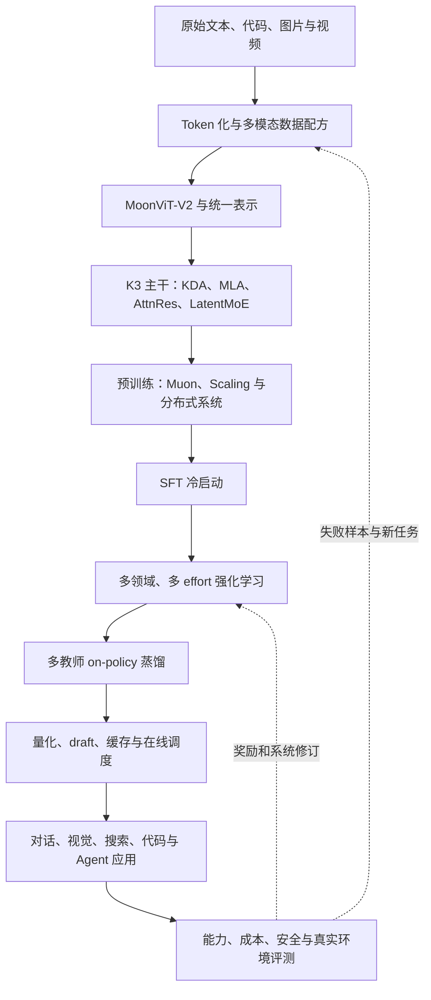

# 第 53 课　毕业项目：从零拆解 Kimi K3

<div class="lesson-lead">这不是让个人“复现一台 2.8T 模型”，而是完成一件真正可检验的事：从需求、数学、张量、资源、数据、训练、Agent、服务和证据九个角度，解释 K3 为什么这样设计；再用小模型实验验证其中能够公开复现的机制。</div>

::: info 项目的一手来源
项目主证据是 [Kimi K3 技术报告](https://arxiv.org/pdf/2607.24653) 和[逐节精读页](/papers/kimi_k3)。前置机制分别核对 [Kimi Linear](https://arxiv.org/pdf/2510.26692)、[Attention Residuals](https://arxiv.org/pdf/2603.15031)、[LatentMoE](https://arxiv.org/pdf/2601.18089)、[Kimi K2](https://arxiv.org/pdf/2507.20534)、[Kimi k1.5](https://arxiv.org/pdf/2501.12599)与 [Kimi K2.5](https://arxiv.org/pdf/2602.02276)。下面把整站课程重新按一个真实模型的生命周期串起来。
:::

## 0. 完成后要交付什么

最终交付不是一份术语摘抄，而是六件可以检查的作品：

1. **一张系统总图**：从多模态输入一直画到在线请求和监控；
2. **一份张量与资源账本**：每个核心模块的输入、输出、状态、参数和通信；
3. **三个代理实验**：KDA 固定状态、MoE 路由、AttnRes 深度选择；
4. **一条后训练闭环**：任务、环境、奖励、rollout、策略更新和独立评测；
5. **一份上线方案**：缓存、调度、SLO、权限、回滚和成本；
6. **一张主张—证据—边界表**：哪些是论文结果，哪些只是你的推断。

::: warning “机制复现”不等于“权重复现”
公开报告不足以让个人重建 K3 的完整数据、训练配方、内核和 2.8T 权重。本项目要求复现公开公式的行为、资源趋势和实验逻辑；不得把 Tiny 模型上的结果写成“K3 性能复现”。
:::

## 1. 先把全站知识放回一台模型



| 生命周期问题 | 本站先修课 | K3 中的具体答案 | 你的毕业产物 |
|---|---|---|---|
| 输入怎样变成表示 | [Token](/beginner/01-token)、[向量](/beginner/02-vector)、[多模态](/beginner/34-multimodal) | 160K 词表；MoonViT-V2 视觉 token 接入共享空间 | 输入与张量卡 |
| token 怎样读历史 | [Attention](/beginner/04-attention)、[长上下文](/beginner/31-efficient-attention) | 3×KDA + 1×Gated MLA，末端 MLA | 序列信息流实验 |
| 很深时怎样保留早期信息 | [Transformer](/beginner/05-transformer)、[训练](/beginner/03-training) | Block AttnRes 沿深度选择历史 block | 深度权重可视化 |
| 很宽时怎样控制计算 | [MoE](/beginner/07-moe)、[分布式](/beginner/27-distributed-training) | Stable LatentMoE，896 选 16，加 2 个 shared experts | 路由与负载账本 |
| 怎样扩大训练 | [Scaling](/beginner/25-data-scaling)、[训练工程](/beginner/26-training-engineering) | 专用 scaling study、Per-Head Muon、MoonEP | 训练预算卡 |
| 怎样得到推理与 Agent 能力 | [后训练](/beginner/28-alignment-rl)、[RL 专题](/beginner/40-rl-language-model) | 3 个领域 × 3 种 effort 的 RL 教师 | 奖励与 rollout 设计 |
| 怎样合并专长 | [蒸馏](/beginner/29-distillation) | Multi-Teacher On-Policy Distillation | 教师—学生数据流 |
| 怎样服务百万上下文 | [生成](/beginner/06-generation)、[在线服务](/beginner/32-serving-systems) | MLA KV 页块 + KDA state checkpoint + 调度 | 缓存命中演算 |
| 怎样成为真实应用 | [Agent](/beginner/33-agents)、[RAG](/beginner/22-rag)、[应用](/beginner/35-applications) | 搜索、代码、视觉与长时程执行 | 任务环境与工具 schema |
| 怎样证明有效且可控 | [评测](/beginner/36-evaluation-research)、[安全](/beginner/37-safety)、[部署](/beginner/38-deployment) | 公开/内部 benchmark、成本曲线、隐藏 verifier | 证据矩阵与发布门槛 |

## 2. 架构答辩：沿三个轴读 Figure 2

<figure class="teaching-figure source-figure"><a href="/paper-figures/kimi-k3-figure-2.webp" target="_blank"></a><figcaption>K3 Figure 2（PDF p.3）不是一张模块清单，而是三种信息流：KDA/MLA 沿 token 序列混合，AttnRes 沿网络深度混合，LatentMoE 沿通道和专家混合；MoonViT-V2 在输入端把视觉变成同一主干可处理的 token。<a href="https://arxiv.org/pdf/2607.24653#page=3">打开原论文第 3 页</a>。</figcaption></figure>

### 2.1 序列轴：为什么不是全 KDA 或全 MLA

标准 softmax Attention 显式比较 query 与所有历史 key，适合精确内容检索，但长序列的计算和缓存昂贵。KDA 把历史压进固定形状状态：

$$
S_t=(I-\beta_tk_tk_t^\top)\operatorname{Diag}(\alpha_t)S_{t-1}
+\beta_tk_tv_t^\top,
\qquad o_t=S_t^\top q_t
$$

按动作读：先按通道衰减旧状态，再擦除当前 key 方向的旧预测，写入新 key–value 关联，最后让 query 读取。它不保存每个历史 token 的完整档案，所以状态不会随上下文线性长大；代价是固定容量会冲突。

K3 每组三层 KDA 后放一层 Gated MLA，就是让“便宜的连续记忆”与“昂贵但精确的全局检索”互补。你的报告必须写出至少一个反例：哪些任务只用 KDA 容易忘，哪些短任务全用 MLA 又浪费资源。

### 2.2 深度轴：AttnRes 不是另一种 token Attention

普通残差把所有早期更新不断相加；网络越深，早期特征在总和中的相对比例可能越来越小。AttnRes 的 query 选择的是**历史层或历史 block**，而 KDA/MLA 的 query 选择的是**历史 token 信息**。

毕业图里必须把这两条箭头画成互相垂直的轴。若把 AttnRes 画在序列缓存里，说明概念仍混在一起。

### 2.3 宽度轴：总参数与每 token 计算不是一回事

K3 报告约 2.78T 总参数、104.2B 激活参数。Stable LatentMoE 让 routed path 先进入低维 latent，再从 896 个 routed experts 中选 16 个，并执行 2 个 shared experts。

只计算 routed expert 选择比例：

$$
\frac{16}{896}=\frac{1}{56}\approx1.79\%
$$

它不能被写成“整台模型节省 56 倍”，因为 Attention、shared experts、路由、投影、通信和内存仍在。你的资源表必须分开：总参数、激活参数、FLOPs、权重读取、All-to-All 与 KV/状态内存。

## 3. 代理实验一：亲手验证 KDA 的固定状态

下面是只保留 delta memory 语义的教学实现。它不是 K3 kernel，也没有 multi-head、gating projection、chunkwise 并行和数值优化。

```python
import torch
import torch.nn as nn
import torch.nn.functional as F

class TinyDeltaMemory(nn.Module):
    def __init__(self, d_key, d_value):
        super().__init__()
        self.d_key = d_key
        self.d_value = d_value

    def forward(self, q, k, v, alpha, beta):
        # q/k: [B, T, Dk]；v: [B, T, Dv]
        batch, length, _ = q.shape
        state = q.new_zeros(batch, self.d_key, self.d_value)
        outputs = []

        for t in range(length):
            key = F.normalize(k[:, t], dim=-1)
            query = F.normalize(q[:, t], dim=-1)

            # Diag(alpha) S：按 key/state 通道衰减
            state = alpha[:, t, :, None] * state
            old_value = torch.einsum("bkd,bk->bd", state, key)
            error = v[:, t] - old_value
            state = state + beta[:, t, None, None] * key[:, :, None] * error[:, None, :]
            outputs.append(torch.einsum("bkd,bk->bd", state, query))

        return torch.stack(outputs, dim=1), state
```

### 实验步骤

1. 固定 `Dk=32, Dv=64`，分别输入长度 128、1,024、8,192；
2. 记录最终 `state.shape`，确认始终是 `[B, 32, 64]`；
3. 构造两个几乎相同的 key，先写 value A、再写 value B，观察 delta rule 是否改写旧关联；
4. 把 `alpha` 从接近 1 调低，观察早期记忆衰减；
5. 与标准 Attention 的逐 token K/V 张量大小作图比较。

你可以证明的是“状态大小与 T 无关”和“相似 key 会定向改写”。你不能由此证明 K3 在 1M 上下文的真实质量或速度。

## 4. 代理实验二：把 MoE 路由画成负载图

对一个 Tiny MoE 记录每个 expert 的 token 数：

```python
def expert_loads(router_logits, top_k):
    # router_logits: [tokens, experts]
    chosen = router_logits.topk(top_k, dim=-1).indices
    return torch.bincount(chosen.flatten(), minlength=router_logits.size(-1))

def load_cv(loads):
    """变异系数：0 表示完全均匀，越大表示越失衡。"""
    loads = loads.float()
    return loads.std(unbiased=False) / loads.mean().clamp_min(1)
```

至少比较三组：无平衡、普通辅助 loss、动态 bias/quantile 风格调节。画出 expert load 柱状图、负载变异系数、路由熵与任务 loss。不能只让负载均匀：如果所有 token 被迫随机平均分配，专家专门化也可能消失。

你的结论应回答：负载平衡解决训练正确性、通信吞吐还是模型质量？答案通常是三者都受影响，但证据口径不同。

## 5. 训练答辩：Scaling 图不是“模型越大越好”

<figure class="teaching-figure source-figure"><a href="/paper-figures/kimi-k3-figure-7-scaling.webp" target="_blank"></a><figcaption>K3 Figure 7（PDF p.11）。横轴是 FLOPs，纵轴是验证损失；红色拟合线相对 K2 下移，报告据此提出约 2.5× 的整体 scaling efficiency 改善。它是架构、数据和配方的联合结果，不能单独归给 KDA、MoE 或 Muon。<a href="https://arxiv.org/pdf/2607.24653#page=11">打开原论文第 11 页</a>。</figcaption></figure>

### 你的训练配方卡必须写全

| 项目 | 必须记录 | 为什么 |
|---|---|---|
| 数据 | 来源、许可、模态、语言、去重、质量分层、混合比例 | 数据变化可伪装成架构收益 |
| Token | tokenizer 版本、词表、chat special tokens | 改变序列长度、成本和跨语言公平性 |
| 模型 | 总/激活参数、层数、维度、专家与注意力比例 | 决定参数、计算和通信 |
| 优化 | Muon/Adam 类参数组、学习率、warmup、裁剪、精度 | 决定稳定性，不能只写优化器名字 |
| 计算 | token 数、训练 FLOPs、GPU 型号与时长、失败运行 | 保证等预算比较 |
| 评测 | 固定 OOD 验证集、按模态/语言/长度分层 | 防止只优化一个平均 loss |

代理实验至少跑“标准 Transformer”“只替换序列模块”“再加入稀疏 FFN”三组，并保持 token、参数或 FLOPs 中至少一种预算严格相同。三种预算不能同时完全相同，就要说明控制了哪一种。

## 6. 后训练答辩：能力来自怎样的反馈

K3 的路线不是一句“做 RL”：先 SFT 冷启动，再把 general、general-agent、coding-agent 三个领域与 low、high、max 三种 effort 交叉为九个教师，最后用多教师 on-policy 蒸馏整合进统一模型。

<figure class="teaching-figure source-figure"><a href="/paper-figures/kimi-k3-figure-8-rl.webp" target="_blank"></a><figcaption>K3 Figure 8（PDF p.13）同时画能力分数与平均 assistant/tool 步数。随 RL FLOPs 增长，多项能力总体上升，轨迹步数也经常增加。毕业报告必须控制 token 和工具预算，避免把“花更多推理计算”直接称为“策略本身更强”。<a href="https://arxiv.org/pdf/2607.24653#page=13">打开原论文第 13 页</a>。</figcaption></figure>

### 把一个 Agent RL 任务写完整

$$
R=R_{task}-\lambda_c C_{tokens/tools}-\lambda_s V_{unsafe}
$$

- `state`：目标、工具观察、文件/网页状态、剩余预算；
- `action`：带类型的工具调用或最终回答；
- `R_task`：由环境最终状态和隐藏 verifier 判断；
- `C`：token、工具次数、延迟或金钱成本；
- `V_unsafe`：越权、泄漏、破坏性动作等硬约束；
- `termination`：成功、预算耗尽、不可恢复错误或人工停止。

若只给“回答是否好”的 Judge 分数，就还没有定义长时程 Agent 环境。若奖励来自最终网页/代码状态，才真正把行动结果带回训练。

## 7. 数据闭环：任务不是凭空出现的

<figure class="teaching-figure source-figure"><a href="/paper-figures/kimi-k3-figure-9-task-synthesis.webp" target="_blank"></a><figcaption>K3 Figure 9（PDF p.15）。系统从分层知识图谱采样相关概念，检索公开材料，再选择 Coding、Knowledge、Vision 等任务类型进行合成。知识图谱控制覆盖和粒度，材料提供现实约束，任务合成器负责把二者变成可训练实例。<a href="https://arxiv.org/pdf/2607.24653#page=15">打开原论文第 15 页</a>。</figcaption></figure>

你的 Mini 项目可以用本站 373 份课程 PDF 做一个透明代理：

1. 从课程覆盖表选一个细粒度概念，如“PPO clipping 的负优势分支”；
2. 从 Slides 与原论文取证，记录页码与来源；
3. 合成直觉题、推导题、代码题和错误诊断题；
4. 为每题编写确定性检查、参考 rubric 或隐藏测试；
5. 让模型作答，按失败类型回流到数据集；
6. 去重并保留来源许可，不把模型自答当成无条件真值。

这一步把 [RAG](/beginner/22-rag)、[任务合成](/beginner/25-data-scaling)、[评测](/beginner/36-evaluation-research)和 [RL](/beginner/46-verifiable-rewards)接成同一个数据闭环。

## 8. Agent 训练：奖励最终状态，不奖励“声称完成”

<figure class="teaching-figure source-figure"><a href="/paper-figures/kimi-k3-figure-10-verifier.webp" target="_blank"></a><figcaption>K3 Figure 10（PDF p.17）的纵轴是 verifier 判断的任务完成度，横轴是工具调用进度。阶梯长时间不动表示 Agent 在行动却没有改善环境；最后突然上升说明关键修复可能出现在后段。评测长轨迹时只看最终 0/1，会漏掉恢复能力和无效循环。<a href="https://arxiv.org/pdf/2607.24653#page=17">打开原论文第 17 页</a>。</figcaption></figure>

为毕业项目设计一个安全的 Autonomous Execution Task：

```text
初始状态：一个有 3 个失败测试的小型课程网站仓库
目标：修复导航、一个公式渲染错误和一个失效本地图片
工具：只读搜索、限定工作区编辑、测试与构建
预算：20 次工具调用、30 分钟、禁止网络写入
公开反馈：构建日志、失败测试名称
隐藏 verifier：链接完整性、Mermaid、页面可访问性、无越权文件修改
成功：隐藏测试全过且 diff 只在允许目录
```

公开测试帮助 Agent 修复，隐藏测试防止硬编码；工作区权限防止通过破坏系统“过关”。这就是第 33、37、47、48 课在一个任务里的合流。

## 9. 服务答辩：混合架构为什么需要混合缓存

<figure class="teaching-figure source-figure"><a href="/paper-figures/kimi-k3-figure-12-prefix-cache.webp" target="_blank"></a><figcaption>K3 Figure 12（PDF p.23）。MLA KV 按 token 页块增长；KDA 每个请求只有固定大小递归状态，但状态快照较大，只在稀疏边界保存。命中 $B=2560$ 后，系统复用前五个 MLA hash block，并恢复同一边界的 KDA checkpoint，从 $B$ 继续 Prefill。<a href="https://arxiv.org/pdf/2607.24653#page=23">打开原论文第 23 页</a>。</figcaption></figure>

手算一次缓存命中：

1. 历史前缀有 4,100 token，hash block 为 512；
2. MLA 可以命中到 4,096，但最近持久化 KDA checkpoint 在 3,584；
3. 联合可复用边界必须回到 3,584；
4. 系统恢复该点 KDA state，复用此前 MLA KV，再重算 3,584–4,100；
5. 若新请求在命中边界后分叉，MLA 部分页块使用 copy-on-write，已发布 checkpoint 不原地修改。

这说明“缓存命中 token 多”不等于“都能直接继续算”。混合模型的复用边界由两种状态共同决定。

## 10. Chat Template 也是模型—系统接口

<figure class="teaching-figure source-figure"><a href="/paper-figures/kimi-k3-figure-16-chat-template.webp" target="_blank"></a><figcaption>K3 Figure 16（PDF p.46）。全局选项放在历史前，单次选项放在历史后，减少每请求选项改变导致的缓存失效；assistant 消息把 think、response、tools 分区；并行工具调用带 index 和类型化参数，返回结果才能正确配对。模板既是训练格式，也是流式解析和缓存协议。<a href="https://arxiv.org/pdf/2607.24653#page=46">打开原论文第 46 页</a>。</figcaption></figure>

你需要为 Mini Agent 写一个 schema，并检查：

- 工具名和参数是否能确定性校验；
- 并行调用与返回是否有稳定 ID；
- 用户数据是否可能伪造系统/工具边界；
- per-request 选项改变时缓存哪些部分失效；
- 输出被截断时解析器能否安全失败；
- 高风险动作是否在模型之外再次鉴权。

## 11. 评测答辩：从“榜单分数”回到证据

毕业报告至少包含五张表，而不是只抄论文主表：

| 表 | 要回答的问题 | 最小分层 |
|---|---|---|
| 能力表 | 能完成什么任务 | 知识、推理、代码、视觉、Agent |
| 预算表 | 用了多少测试时计算 | effort、token、样本数、工具次数 |
| 成本表 | 同等任务花多少钱和时间 | TTFT、TPOT、P95、每题成本 |
| 安全表 | 哪些失败不能上线 | 越权、注入、泄漏、reward hacking |
| 证据表 | 结论由什么支持 | 原论文页码、对照、消融、限制 |

### 主张—证据卡示例

```text
主张：K3 相对 K2 的整体 scaling efficiency 约提升 2.5×。
证据：技术报告 Figure 7，拟合的 validation loss–FLOPs 曲线。
控制：同一报告的 scaling study；仍需核对数据和架构配方是否共同变化。
不能推出：KDA 单独带来 2.5×；真实在线吞吐必然提升 2.5×。
你的代理实验：在等 token 和近似等 FLOPs 下比较 Tiny baseline 与逐步替换模块。
```

每个重要数字都应有这样一张卡。若找不到对照与页码，就把措辞降为“报告声称”或“我们推测”。

## 12. RAG、模型编辑和 K3 是怎样共存的

K3 是底座/策略，不会让外部知识系统消失：

- 频繁更新且必须引用的知识仍用 RAG；
- 用户或组织权限仍由检索和工具层过滤；
- 少量稳定行为可用 Prompt、LoRA 或 SFT；
- 局部事实修复可以研究模型编辑，但必须测 locality；
- 多步行动交给 Agent 环，最终状态由 verifier 判断；
- 高风险领域仍需权威数据源与人工复核。

毕业系统图中，RAG 在模型外提供证据，工具层改变环境，K3 负责理解、生成和决策；不要把所有能力都画在一个“LLM”黑箱里。

## 13. 四周执行计划

### 第 1 周：架构和账本

- 重画 Figure 2，不看原图标出序列、深度、宽度与视觉四条线；
- 完成 KDA 固定状态和 MoE 路由实验；
- 为 K2 → K3 结构变化写等预算对照；
- 输出：系统图 v1、张量表、两份实验 notebook。

### 第 2 周：训练和后训练

- 用小模型跑一个可控预训练/SFT 基线；
- 构造 200–1,000 道可验证课程题，每题采样 4 条；
- 实现 batch baseline REINFORCE 或组相对优势；
- 同时画 reward、独立 accuracy、长度与 KL；
- 输出：训练卡、数据卡、失败样本表。

### 第 3 周：Agent 和服务

- 搭建只读/沙箱工具环境与隐藏 verifier；
- 保存 rollout 版本、工具回执、奖励分项与终止原因；
- 模拟 MLA page + KDA checkpoint 的联合缓存命中；
- 压测短聊天、长文、RAG 和 Agent 四种请求；
- 输出：Agent 轨迹、缓存演算、SLO 和故障演练。

### 第 4 周：评测和答辩

- 固定计算预算比较所有版本；
- 做配对 bootstrap、失败分层和安全回归；
- 为每项主张补原论文页码和不能外推的边界；
- 录制 10 分钟答辩：需求 1 分钟、架构 3 分钟、训练/RL 2 分钟、系统 2 分钟、证据和限制 2 分钟。

## 14. 最终报告模板

1. 问题与能力目标；
2. K3 一页总图；
3. Token、视觉与数据；
4. 序列/深度/宽度架构与张量；
5. 参数、FLOPs、显存与通信账本；
6. 预训练和 Scaling 设计；
7. SFT、RL、蒸馏与奖励；
8. Agent 环境、工具和 verifier；
9. 推理服务、缓存、SLO 与成本；
10. 评测、安全、消融和失败案例；
11. 与 K2/前置论文的因果关系；
12. 无法复现的部分和下一步实验。

## 15. 评分量表

| 维度 | 分值 | 满分标准 |
|---|---:|---|
| 概念与数学 | 25 | 能区分 token/layer/channel 三轴，公式、张量和代码一致 |
| 系统闭环 | 20 | 数据、训练、RL、Agent、服务和监控之间有明确接口 |
| 实验可信度 | 20 | 强基线、等预算、消融、随机性和失败分析完整 |
| 证据使用 | 20 | 关键结论有 PDF 页码，事实与推断分开，不过度外推 |
| 可自学表达 | 10 | 每个难概念都有图、类比、逐项解释和练习 |
| 安全与治理 | 5 | 权限、隐私、隐藏 verifier、回滚和人工审批明确 |

低于 60 分通常不是“代码写少了”，而是系统只讲了某一层；80 分以上应能回答模块之间的代价转移；90 分以上还要主动指出论文证据不能覆盖的边界。

## 毕业答辩的十个问题

1. KDA 与 MLA 分别保存什么历史状态，为什么 3:1 混合？
2. AttnRes 与 token Attention 的轴为什么不同？
3. 896 选 16 为什么不能写成整台模型快 56 倍？
4. Figure 7 的 2.5× 能归因给哪个模块吗？
5. 原生视觉训练与外挂视觉编码器的训练目标差在哪里？
6. 九个 RL 教师怎样产生，为什么还要统一蒸馏？
7. Agent 奖励为什么必须基于最终环境状态？
8. MLA KV 与 KDA state 为什么不能用同一种缓存粒度？
9. 模型能力变强后，RAG、工具权限和人工复核为什么仍需要？
10. 哪三项 K3 主张你能做代理实验，哪三项不能凭公开资料复现？

如果能闭卷回答，并用自己的实验、图和证据卡支持，就完成了“大模型系统课”的主线。接下来可回到[17 章 K3 案例课](/guide/ch00)补弱项，或从[33 篇论文库](/papers/)选择一个方向做真正的研究项目。

<ChapterReadings lesson="53-k3-capstone" />
