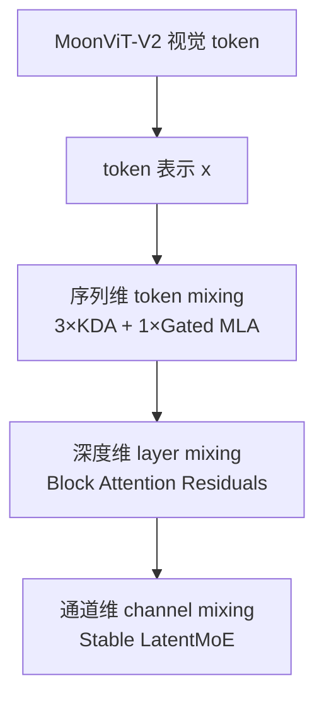
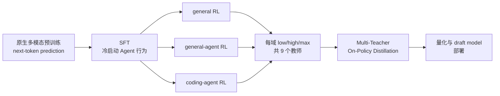

# 第 0 章　Kimi K3 到底是什么

先不要记模块名。我们从六个“规模变大后哪里会坏”的问题出发，给整门课搭一张地图。

::: info 零基础入口
如果“自回归、MoE、KDA”仍然像缩写墙，请先学 [零基础第 52 课：K3 全景拼装](/beginner/09-k3-map)。那一页先按五个规模问题讲，不要求公式。
:::

<figure class="teaching-figure"><figcaption>把 K3 看成一座共同规划的城市：长序列、网络深度、专家通道、视觉入口和基础设施必须协同。</figcaption></figure>

### 0.1 一句话版本

Kimi K3 是一个原生视觉—语言、自回归、稀疏 MoE 模型：总参数约 2.8T，但每个 token 激活约 104B 参数；它以 3 层 KDA + 1 层 Gated MLA 的混合注意力处理最长 1M token，用 AttnRes 改造深度信息流，用 Stable LatentMoE 扩展宽度，再通过 SFT、分领域多 effort RL 和多教师 on-policy distillation 获得推理与 Agent 能力。

### 0.2 六个规模问题

理解 K3 最好的方法不是记模块名，而是先问“规模增长后，旧方案哪里坏掉了”。

| 规模轴 | 直接问题 | K3 的主要回答 |
|---|---|---|
| 序列变长 | softmax attention 计算和 KV cache 随 `T` 增长 | 大部分层用固定状态 KDA，周期性用 MLA 保留全局交互 |
| 网络变深 | 标准 residual 把所有历史层等权累加，信息被稀释 | AttnRes 沿深度选择性读取早期表示 |
| 模型变宽/专家变多 | 总参数、专家权重流量和 All-to-All 通信上升 | LatentMoE 让 routed experts 在半宽 latent space 工作 |
| 稀疏度变极端 | 激活爆炸、router 不平衡、专家“饿死” | RMSNorm + SiTU-GLU + Quantile Balancing |
| 轨迹变长 | rollout 长尾、KV cache 占用、环境状态难保留 | partial rollout、外部 KV cache、可暂停/恢复 microVM |
| 服务请求跨度变大 | 2K 与 1M token 请求互相拖垮，prefix miss 极贵 | 混合 cache、cache affinity、按资源预算准入 |

### 0.3 三维信息流

K3 报告用一个很有价值的视角组织结构：

- KDA/MLA 决定一个 token 如何读取其他位置；
- AttnRes 决定当前层如何读取其他深度；
- MoE 决定一个 token 经过哪些通道变换。

这三者不是三个可互换的“效率技巧”。它们分别作用在序列、深度、通道三个维度。

### 0.4 2.8T 和 104B 为什么不矛盾

设每层有 `E` 个 routed experts，每个 token 只选 `k` 个。磁盘和显存需要容纳全部 `E` 个专家，因此总参数量很大；一次前向只执行 `k` 个，再加 attention、shared experts、router 等始终激活的参数，因此激活参数远小于总参数。

粗略地说：

$$
P_{total}=P_{dense}+E P_{expert},
$$

$$
P_{active/token}\approx P_{dense}+kP_{expert}.
$$

**[K3 明示]** K3 有约 2.78T 总参数、104.2B 激活参数、896 个 routed experts、每 token 激活 16 个、2 个 shared experts。`896/16=56`，报告称 routed path 的稀疏度为 56。

注意：激活参数不等于精确 FLOPs；同一参数在序列不同位置被复用，attention、投影、激活函数和通信也会贡献成本。

### 0.5 K3 的生命周期

<figure class="teaching-figure concept-figure"><figcaption>同一模型在四个阶段接收不同信号：token 监督、示范、结果奖励和工具环境反馈。</figcaption></figure>

预训练负责“世界模型 + 表示 + 基本生成能力”，SFT 负责可用的行为起点，RL 负责优化可验证的长程结果，蒸馏负责把多个专长与计算预算合并回一个模型。系统工程贯穿所有阶段。

---

# 第二部分：从视觉 Transformer 迁移到自回归语言模型
