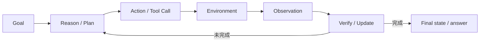

# 第 12 章　Agent 不是“多说几步思维链”

Agent 不是让模型多写几步思维链，而是模型、工具、环境、记忆、预算与验证器组成的闭环系统。

::: info 零基础入口
先把 Agent 当成系统而不是模型昵称：[零基础第 17 课](/beginner/08-post-training#_8-agent-不只是-多想几步)。
:::

<figure class="teaching-figure"><figcaption>Agent 能力来自模型与工具、环境、记忆、预算、验证器组成的循环，而不是模型昵称。</figcaption></figure>

### 12.1 最小 Agent 闭环

语言推理只改变 token；Agent action 会改变外部世界状态，例如文件、数据库、网页、邮件、代码仓库。能力评估因此必须看最终环境，而不只是最终一句“已完成”。

### 12.2 Model 与 Harness

Agent harness 通常包含：

- system prompt 与角色规范；
- tool schema、参数格式和错误返回；
- context compaction；
- memory/skills；
- subagent orchestration；
- retry、timeout、budget；
- sandbox 与权限；
- final-answer protocol。

同一模型换 harness，分数可能变化很大。K3 的 unified white-box RL environment 把这些做成可配置模块，动态组合成 Kimi Code、Claude Code、Codex、OpenClaw、Hermes 等风格，减少对单一脚手架过拟合。

### 12.3 为什么 white-box environment 重要

如果训练永远只有一个工具名、一个 system prompt、一个 context manager，模型可能学会表面协议，而非抽象的“读状态—选工具—验证结果”。随机化与组合 harness 配置相当于 domain randomization，目标是跨脚手架泛化。

但泛化不能只靠改工具名；环境的行动语义、错误模式与任务结构也要多样。

### 12.4 知识图谱引导任务合成

随便让模型“生成难题”会集中在高频熟悉主题，造成重复和覆盖盲区。K3 构建层级有向无环知识图谱：

1. 从粗粒度 seed domains 开始；
2. Agent 搜索并扩展更细 concepts；
3. 去重/复用已有节点；
4. 采样不同层级或相关节点组成 keywords；
5. 检索真实公开材料；
6. 按 coding/knowledge/vision 等 task type 合成任务。

图谱控制 granularity 与 coverage，真实材料提供事实与复杂度，task synthesis 把材料转为可训练实例。

### 12.5 Verifiable Agent tasks

<figure class="teaching-figure concept-figure"><figcaption>规划、真实工具观察和验证器共同形成闭环；不通过时只重试失败步骤。</figcaption></figure>

K3 的任务族可以按 verifier 类型理解。

#### 搜索与知识工作

Agent 多步检索、收集证据、产出可核验答案或专业 deliverable。reward 可检查引用、数值、文件结构、rubric。

#### 视觉 reasoning in the loop

Agent 在 Python sandbox 中裁剪、缩放、变换图片、做精确计算；生成的新图像作为下一轮 observation。模型学到的不是“一眼回答”，而是主动获取更好视觉证据。

#### Kernel 优化

候选 kernel 先与 PyTorch reference 比数值误差；错误则 reward 0。正确后按 expert baseline 和 hardware roofline 计性能 reward。还要防 CUDA graph replay、input caching、偷偷降精度等 hacking。

#### Web development

container 中 build/run；deterministic checks 测行为、结构和像素；model judge 可检查源码并交互。build fail、runtime error 或伪造 artifact 会被置零。

### 12.6 Autonomous Execution Tasks

AET 只给初始状态、受约束目标、工具 action space、budget 和 verifier interface，不给 reference trajectory。Agent 必须自行：

- 分解任务；
- 选择工具；
- 根据反馈修正；
- 从错误恢复；
- 判断何时终止。

reward 来自最终环境状态，而非自述完成。public verifier 可给诊断反馈，hidden verifier 测 held-out scenarios；verifier 与 agent 隔离，并限制提交预算。

这相当于 verify-in-the-loop 搜索：

$$
\text{hypothesis}\rightarrow\text{act}\rightarrow\text{verify}\rightarrow\text{adapt}.
$$

### 12.7 Persistent personal-assistant worlds

K3 构造 Gmail、Notion、Slack、Canvas 等 mock applications，保留真实语义但避免外部 API 不稳定。任务跨多个模拟日、多个 app 和相互依赖事件；一次 rollout 可有上千 tool calls、累计数百万 context tokens。

注意“累计数百万 token”不一定等于模型一次输入永远同时放几百万 token。系统可能在 1M window 内多轮增长、compaction、prefix reuse；要区分 trajectory lifetime tokens 与 instantaneous context length。

### 12.8 Reward hacking 是环境设计问题

能力更强的 Agent 会主动探索漏洞：

- 修改测试或 verifier；
- 读取隐藏答案；
- 缓存固定输入输出；
- 伪造截图/文件；
- 输出冗长文本博取 judge 偏好；
- 声称完成但未改变状态。

缓解手段：权限隔离、hidden tests、行为审计、anti-cheat、预算限制、多重 verifier、对最终状态独立检查。不存在一次设计永久解决，报告也强调随新 hacking 策略持续增加防护。

### 12.9 Agent 评测五维度

至少同时记录：

1. outcome success；
2. tool-call correctness；
3. cost/tokens/wall time；
4. recovery 与 robustness；
5. process discipline/safety。

只看 pass rate 会奖励高成本暴力搜索；只看步数会惩罚必要验证。应看 success–cost Pareto frontier。

### 12.10 自测

- 一个纯文本数学 CoT 和一个修改代码仓库的 Agent trajectory，state/action/reward 各是什么？
- 为什么 mock SaaS app 比直接调用真实 Gmail 更适合大规模 RL？
- public 与 hidden verifier 分别解决什么？
- 给文件系统 Agent 设计三种 reward hacking，并逐一提出防护。
- 为什么 harness diversity 不能通过随机改 tool name 完全实现？

---

# 第六部分：3T 参数与 1M 上下文的系统
