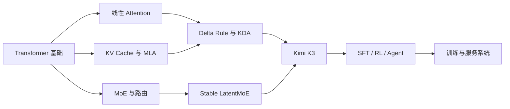

# 如何建立论文阅读顺序

## 主线：按问题依赖，不按年份

## 第一次只读 7 篇

| 顺序 | 论文 | 只回答一个问题 |
|---:|---|---|
| 1 | Transformer | token 怎样读取其他位置？ |
| 2 | DeepSeek-V2 | KV Cache 怎样压缩？ |
| 3 | DeepSeekMoE | 总参数怎样和单 token 计算解耦？ |
| 4 | Gated DeltaNet | 固定状态怎样更新记忆？ |
| 5 | Kimi Linear | KDA 怎样与全 attention 混合？ |
| 6 | Attention Residuals | 当前层怎样选择性读取历史深度？ |
| 7 | Kimi K3 | 上述模块怎样组成一个完整模型与系统？ |

每篇先完成[一页论文笔记模板](/start/paper-reading)，再决定是否精读公式与附录。

## 选方向再扩展

- **模型架构**：Mamba-2、RoFormer、YaRN、LatentMoE；
- **训练与推理系统**：Megatron-LM、ZeRO、FlashAttention-2、Ring Attention、Ulysses、vLLM、Mooncake；
- **后训练与 Agent**：InstructGPT、DPO、DeepSeekMath、DeepSeek-R1、ReAct、MOPD、K2.5。

第 16 章提供核心论文的浓缩精读卡：[进入论文精读卡](/guide/ch16)。
