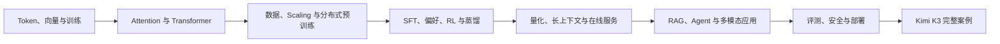

# 8 周学习大纲：从零开始学习大语言模型，最后读懂 Kimi K3

## 课程定位

对象：不要求机器学习、线性代数或 GPU 背景。会使用浏览器、愿意做小练习即可。

建议投入：每周 6–10 小时。时间不足时先完成每课的图、核心数据流和自测，公式推导与名校论文可以第二遍补。

最终目标：能从数据、算法、训练、后训练、推理服务、应用、评测与安全八个角度，解释一台真实大语言模型为什么这样设计；并用 Kimi K3 做完整案例。

## 学习总图

## 第 1 周：文字怎样进入模型（6–8 小时）

### 学习内容

- [00 · 模型、参数与训练](/beginner/00-model)
- [01 · 从文字到 Token](/beginner/01-token)
- [02 · 向量与 Word Embeddings](/beginner/02-vector)
- [03 · 多语言、跨语言迁移与 Token 公平性](/beginner/50-multilingual)
- [04 · 损失、梯度与训练](/beginner/03-training)
- [05 · 语言模型演化](/beginner/10-language-models)

### 本周只抓五个问题

1. 模型参数与程序规则有什么不同？
2. token ID 与 embedding 为什么不是同一个东西？
3. 点积为什么能表示“相关程度”？
4. loss、梯度和学习率怎样形成更新循环？
5. n-gram、RNN、Transformer 分别保留怎样的历史？

### 动手产物

手画一条“文字 → token → 向量 → logits → 概率 → loss → 参数更新”数据流，并用自己的 4 个词手算一次点积相似度。

### 过关标准

不使用“AI 很智能”之类句子，能向朋友解释模型为什么可以从文本例子中改变参数。

## 第 2 周：拆开模型架构（8–10 小时）

### 学习内容

- [06 · Attention](/beginner/04-attention)
- [07 · 完整 Transformer](/beginner/05-transformer)
- [08 · BERT](/beginner/14-bert)、[09 · T5/BART](/beginner/15-encoder-decoder)、[10 · GPT/LLaMA/SSM](/beginner/16-decoder-ssm)
- [11 · 架构全景](/beginner/13-architectures)
- [12 · 生成与 KV Cache](/beginner/06-generation)
- [13 · MoE](/beginner/07-moe)

### 动手产物

画一个 Transformer block，标出 Attention、FFN、Residual、Norm；再画训练与生成两条路径，解释为什么训练能并行而 Decode 要逐 token。

### 过关标准

能比较 Encoder-only、Encoder–Decoder、Decoder-only 的可见信息；能说清 MoE 的总参数与每 token 激活参数为什么不同。

## 第 3 周：大模型怎样预训练（8–10 小时）

### 学习内容

- [14 · Scaling：参数、数据与算力怎样配平](/beginner/25-data-scaling)
- [15 · 自动微分、优化器、框架与 GPU](/beginner/26-training-engineering)
- [16 · 分布式训练与通信](/beginner/27-distributed-training)

### 动手产物

给一个假想 1B 模型写训练账本：数据来源与去重、训练 token、上下文长度、权重/梯度/优化器/激活显存，以及准备采用的数据并行或 ZeRO 方案。

### 过关标准

能解释“参数量翻 10 倍但数据不变”为什么可能浪费预算；能区分数据并行、张量并行、流水线并行与专家并行切的是什么。

## 第 4 周：模型怎样学会按目标工作（8–10 小时）

### 学习内容

- [17 · 后训练总览](/beginner/08-post-training)
- [18–19 · Prompt](/beginner/17-prompting)
- [20–21 · PEFT 与 LoRA](/beginner/19-peft)
- [22 · 模型编辑](/beginner/21-model-editing)
- [23 · SFT、RLHF、DPO 与推理 RL](/beginner/28-alignment-rl)
- [24 · 推理、验证器与测试时计算](/beginner/49-reasoning-test-time)
- [25–29 · RL 定义、MDP、策略梯度、Actor-Critic 与 PPO](/beginner/40-rl-language-model)
- [30–33 · RLHF、GRPO、Agent RL 与训练系统](/beginner/45-rlhf-preference)
- [34 · 知识蒸馏](/beginner/29-distillation)

### 动手产物

任选一个任务，分别写出用 Prompt、RAG、LoRA、SFT 和 RL 解决时需要的数据、直接目标、成本与风险。不是每种方法都要用。

### 过关标准

能解释 SFT 与 RL 的反馈信号差异；知道 DPO 仍然来自偏好；不会把蒸馏与量化混成同一种压缩。

## 第 5 周：高效生成与在线服务（7–9 小时）

### 学习内容

- [35 · 解码与采样](/beginner/11-decoding)
- [36 · 量化](/beginner/30-quantization)
- [37 · FlashAttention 与长上下文](/beginner/31-efficient-attention)
- [38 · vLLM、PagedAttention 与在线服务](/beginner/32-serving-systems)

### 动手产物

用本站实验计算不同 batch、上下文和精度下的 KV Cache；再为一个聊天服务写指标表：TTFT、TPOT、吞吐、P99、显存和每百万 token 成本。

### 过关标准

能说清 FlashAttention 为何精确、PagedAttention 管什么、INT4 为什么不保证端到端 4 倍加速、Prefill 与 Decode 为什么适合不同资源池。

## 第 6 周：RAG、Agent 与多模态应用（8–10 小时）

### 学习内容

- [39–41 · RAG 三课](/beginner/22-rag)
- [42 · Agent 与 Deep Research](/beginner/33-agents)
- [43 · 多模态与具身智能](/beginner/34-multimodal)
- [44 · 扩散模型、Guidance 与 Flow Matching](/beginner/51-diffusion-flow)
- [45 · 大模型应用全景](/beginner/35-applications)

### 动手产物

设计一个有来源引用的研究助手：写清文档解析、切块、召回、重排、生成、工具、证据检查和失败恢复。只需流程和测试样例，不要求一开始就写完整产品。

### 过关标准

能把 RAG 错误分成解析、召回、重排和生成；能解释 Agent 为什么是系统闭环；知道图像理解、图像生成、世界模型与机器人是不同任务。

## 第 7 周：评测、安全与部署（7–9 小时）

### 学习内容

- [46 · 评测基础](/beginner/12-evaluation)
- [47 · 基准、LLM Judge 与实验设计](/beginner/36-evaluation-research)
- [48 · 模型可解释性](/beginner/52-interpretability)
- [49 · 安全与攻击防护](/beginner/37-safety)
- [50 · 部署、监控与成本](/beginner/38-deployment)
- [51 · 可信研究方法](/beginner/39-research-method)

### 动手产物

给第 6 周的应用写 20 条最小评测集，覆盖正常任务、检索失败、提示注入、工具错误和高风险请求；定义上线门槛、监控和回滚条件。

### 过关标准

知道 LLM Judge 的位置与长度偏好；安全不只靠系统 Prompt；能用消融而不是单一总分解释模块收益。

## 第 8 周：用 Kimi K3 做毕业案例（10–12 小时）

### 学习内容

先学[52 · Kimi K3 全景拼装](/beginner/09-k3-map)，再按下面顺序读 17 章案例课：

1. [第 0–4 章](/guide/ch00)：全景、生成、KV Cache、MLA 与 MoE；
2. [第 5–9 章](/guide/ch05)：KDA、Attention Residuals、LatentMoE、视觉与 Scaling；
3. [第 10–13 章](/guide/ch10)：预训练、SFT/RL、蒸馏、Agent、训练与服务；
4. [第 14–16 章](/guide/ch14)：评测、三遍阅读法与核心论文链。

### 毕业产物

做一张 Kimi K3 系统图，至少标出：

- token 如何经过序列、深度和专家通道；
- 训练数据、预训练、后训练与多教师蒸馏；
- 视觉输入、长上下文和 Agent 环境；
- 分布式训练、缓存、量化与在线服务；
- 每个关键结论的论文证据和未披露边界。

### 毕业答辩题

“为什么 K3 不是把几个热门模块堆在一起？”回答必须同时包含能力目标、资源账本、模块耦合和实验验证，不能只复述缩写。

## 怎样使用名校资料

主线学习时只看本站教程。卡在某个机制时，从[名校课程知识覆盖表](/curriculum/sources)找到对应讲次，再打开原始 Slides；需要判断证据时进入[论文库](/papers/)。七门课不需要从头各学一遍；想把公式变成实现时，优先回到 Stanford CS336。
