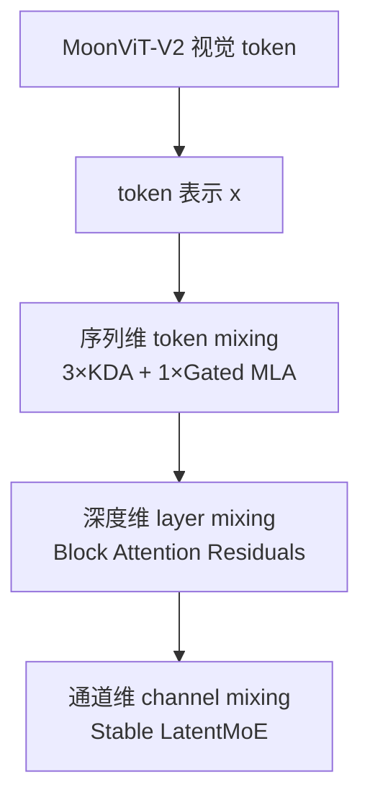
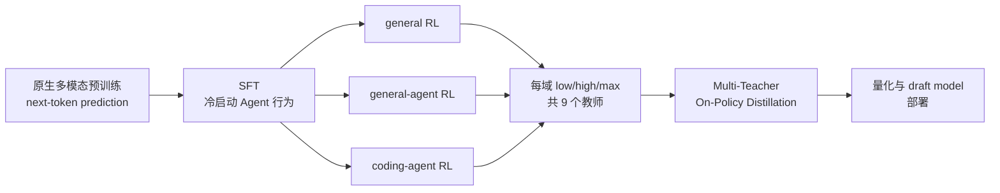
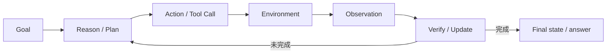

# 《从视觉 Transformer 到 Kimi K3》

## 一本面向 AI 工程师的现代大语言模型短教材

版本：0.1（配套 Kimi K3 v1 技术报告）

---

## 前言：这本教材替你省什么时间

Kimi K3 报告同时横跨模型架构、稀疏计算、原生多模态、预训练、强化学习、Agent 环境、分布式训练和在线服务。逐篇追完其 150 条参考文献，容易花几个月，却仍没有统一的心智模型。

本教材采用“从 K3 反推前置知识”的路线。它不代替原论文中的完整实验和证明，而是替你完成三件耗时的工作：

1. 把来自不同论文的概念放进同一套张量与资源账本；
2. 解释 K3 每个设计究竟在解决哪一种瓶颈；
3. 指出技术报告说了什么、没有说什么，以及哪些结论不能过度外推。

### 三种证据标签

文中使用三种标签：

- **[K3 明示]**：K3 报告直接给出公式、配置或结论。
- **[相关工作]**：需要 Kimi Linear、K2.5、DeepSeek-V2/V3 等材料补足。
- **[解释/推论]**：为了教学给出的工程解释，不应伪装成 K3 的原话或独立实验证据。

### 阅读约定

- 采用 batch 维省略的记号。
- 序列长度为 `T`，隐藏维为 `d`，head 数为 `H`，每个 head 的 key/value 维为 `d_k/d_v`。
- “状态”指推理时跨 token 保留的对象；“激活”指反向传播前需要保留或重算的中间张量；“参数”是模型权重。这三者不要混用。
- 所有复杂度都是用于比较的主项，真实速度还取决于 kernel、并行、batch、dtype 和硬件。

---

# 第一部分：先建立一张 K3 全景图

## 第 0 章　Kimi K3 到底是什么

### 0.1 一句话版本

Kimi K3 是一个原生视觉—语言、自回归、稀疏 MoE 模型：总参数约 2.8T，但每个 token 激活约 104B 参数；它以 3 层 KDA + 1 层 Gated MLA 的混合注意力处理最长 1M token，用 AttnRes 改造深度信息流，用 Stable LatentMoE 扩展宽度，再通过 SFT、分领域多 effort RL 和多教师 on-policy distillation 获得推理与 Agent 能力。

### 0.2 六个规模问题

理解 K3 最好的方法不是记模块名，而是先问“规模增长后，旧方案哪里坏掉了”。

| 规模轴 | 直接问题 | K3 的主要回答 |
|---|---|---|
| 序列变长 | softmax attention 计算和 KV cache 随 `T` 增长 | 大部分层用固定状态 KDA，周期性用 MLA 保留全局交互 |
| 网络变深 | 标准 residual 把所有历史层等权累加，信息被稀释 | AttnRes 沿深度选择性读取早期表示 |
| 模型变宽/专家变多 | 总参数、专家权重流量和 All-to-All 通信上升 | LatentMoE 让 routed experts 在半宽 latent space 工作 |
| 稀疏度变极端 | 激活爆炸、router 不平衡、专家“饿死” | RMSNorm + SiTU-GLU + Quantile Balancing |
| 轨迹变长 | rollout 长尾、KV cache 占用、环境状态难保留 | partial rollout、外部 KV cache、可暂停/恢复 microVM |
| 服务请求跨度变大 | 2K 与 1M token 请求互相拖垮，prefix miss 极贵 | 混合 cache、cache affinity、按资源预算准入 |

### 0.3 三维信息流

K3 报告用一个很有价值的视角组织结构：



- KDA/MLA 决定一个 token 如何读取其他位置；
- AttnRes 决定当前层如何读取其他深度；
- MoE 决定一个 token 经过哪些通道变换。

这三者不是三个可互换的“效率技巧”。它们分别作用在序列、深度、通道三个维度。

### 0.4 2.8T 和 104B 为什么不矛盾

设每层有 `E` 个 routed experts，每个 token 只选 `k` 个。磁盘和显存需要容纳全部 `E` 个专家，因此总参数量很大；一次前向只执行 `k` 个，再加 attention、shared experts、router 等始终激活的参数，因此激活参数远小于总参数。

粗略地说：

\[
P_{total}=P_{dense}+E P_{expert},
\]

\[
P_{active/token}\approx P_{dense}+kP_{expert}.
\]

**[K3 明示]** K3 有约 2.78T 总参数、104.2B 激活参数、896 个 routed experts、每 token 激活 16 个、2 个 shared experts。`896/16=56`，报告称 routed path 的稀疏度为 56。

注意：激活参数不等于精确 FLOPs；同一参数在序列不同位置被复用，attention、投影、激活函数和通信也会贡献成本。

### 0.5 K3 的生命周期



预训练负责“世界模型 + 表示 + 基本生成能力”，SFT 负责可用的行为起点，RL 负责优化可验证的长程结果，蒸馏负责把多个专长与计算预算合并回一个模型。系统工程贯穿所有阶段。

---

# 第二部分：从视觉 Transformer 迁移到自回归语言模型

## 第 1 章　你已有的知识，哪些可以直接迁移

### 1.1 相同的骨架

ViT 和 decoder-only LM 都把离散或连续输入变成一串向量，再反复执行：

\[
x \leftarrow x + \operatorname{Mixer}(\operatorname{Norm}(x)),
\]

\[
x \leftarrow x + \operatorname{FFN}(\operatorname{Norm}(x)).
\]

你已经熟悉的矩阵投影、multi-head attention、PreNorm、residual、mixed precision、data parallel，全部可以迁移。

### 1.2 四个根本差异

#### 差异一：目标函数

典型视觉分类学习 `p(y|image)`；自回归 LM 学习整个 token 序列的联合分布：

\[
p(x_{1:T})=\prod_{t=1}^{T}p(x_t\mid x_{<t}).
\]

训练损失是：

\[
\mathcal{L}_{NTP}=-\sum_{t=1}^{T}\log p_\theta(x_t\mid x_{<t}).
\]

它既是表征学习，也是生成模型训练。每个位置都提供一个监督信号，标签来自数据本身。

#### 差异二：因果性

ViT 通常允许 patch 互相双向读取；decoder-only LM 的位置 `t` 不能看到未来 token，因此 attention score 使用下三角 causal mask。

训练时虽然逻辑上是自回归的，但 ground-truth 前缀已知，可以用一次矩阵运算并行计算所有位置。这就是 teacher forcing。推理时下一个 token 未知，只能生成一个、拼回前缀、再生成下一个。

#### 差异三：推理是系统主角

分类模型通常一次 forward 结束。LLM 生成 2,000 个 token 就要进行 2,000 次依赖前一步的 decode。于是 cache、memory bandwidth、batch scheduling、speculative decoding 都变成一等问题。

#### 差异四：能力是训练阶段的组合

一个 base LM 可能会续写，却不会稳定遵循指令或调用工具。现代 LLM 常经历：

\[
\text{pre-training}\rightarrow\text{SFT}\rightarrow\text{preference/RL}\rightarrow\text{deployment adaptation}.
\]

不能仅凭 backbone 架构预测 Agent 行为。

### 1.3 tokenization 是语言模型的“输入传感器”

视觉模型中 patch size 改变空间分辨率与计算量；语言模型中 tokenizer 以类似方式决定：

- 同一文本变成多少 token；
- 代码、数学、中文等域的压缩效率；
- vocabulary embedding/output head 的参数量；
- 上下文窗口在真实字符或代码行上的有效长度。

K3 的词表大小为 160K。词表越大并非无条件越好：序列可能变短，但 embedding 与输出 softmax 更大，低频 token 学习也更难。

### 1.4 next-token prediction 为什么能学到“知识”

最朴素的解释是压缩：要预测下一个 token，模型必须捕获语法、事实、程序结构、图像中的文字与空间关系等数据规律。规模、数据多样性和优化让这些规律以参数形式被压缩。

但 NTP 不自动保证：

- 事实在生成时被可靠取回；
- 多步推理总是正确；
- 输出服从用户意图；
- 工具调用产生正确世界状态。

这些正是 SFT、RL、检索、工具和 verifier 发挥作用的空间。

### 1.5 本章常见误解

1. **“decoder-only 只有 decoder cross-attention 被删掉。”** 架构描述没错，但工程含义不够：它同时改变了训练目标、数据构造和生成系统。
2. **“训练也是一个 token 一个 token 跑。”** teacher forcing 下，所有位置并行算 logits；因果性由 mask 保证。
3. **“context length 就是模型真正能利用的记忆长度。”** 可接受 1M token 只说明接口与训练支持；远距离检索、组合推理仍需专门数据与评测。

### 1.6 自测

- 用一句话区分 encoder 表征学习与 autoregressive density modeling。
- 如果将 causal mask 错换成双向 mask，训练 loss 为什么可能很好、生成却失效？
- tokenizer 把代码平均压缩率改善 20%，会影响哪些训练与推理成本？

---

## 第 2 章　Prefill、Decode 与 KV Cache

### 2.1 一次请求的两个阶段

假设输入 prompt 长 `T_p`，输出 `T_o`。

**Prefill**：一次处理全部 `T_p` 个已知 token，建立各层 cache。矩阵较大、并行度高，通常更接近计算受限。

**Decode**：每步只输入最新 token，读取历史 cache，输出一个 token。矩阵变成窄 GEMM/GEMV，并不断搬运权重和 cache，常更接近内存带宽受限。

“模型训练很快”不能推出“在线 decode 很快”，因为两者工作负载形状完全不同。

### 2.2 为什么需要 KV cache

标准 causal attention 在第 `t` 步需要当前 query 与所有历史 key/value：

\[
o_t=\operatorname{softmax}\left(\frac{q_tK_{1:t}^\top}{\sqrt{d_k}}\right)V_{1:t}.
\]

若不缓存，生成每个新 token 都要重新计算全部历史 token 的 K/V。KV cache 保存每层历史 K/V，使当前步只计算新 token 的投影。

单层、单请求的近似 cache 字节数：

\[
M_{KV}\approx 2\,T\,H_{kv}\,d_h\,b,
\]

其中 2 表示 K 与 V，`b` 是每元素字节数。全模型再乘层数与 batch/并发序列数。

这解释了为什么长上下文不仅让 attention FLOPs 上升，也直接吞噬服务显存。

### 2.3 MHA、MQA、GQA 的 cache 变化

- MHA：每个 query head 有自己的 K/V head，`H_kv=H_q`。
- MQA：所有 query heads 共用一组 K/V，`H_kv=1`。
- GQA：若干 query heads 共用一组 K/V，`1<H_kv<H_q`。

它们主要改变 cache 与 K/V 投影，不直接减少 Q heads 的全部计算。共享过强可能损失容量，因此是质量—内存—吞吐权衡。

### 2.4 Prefix cache

系统 prompt、代码仓库快照、长对话历史可能在多次请求中重复。prefix cache 通过内容 hash 复用此前算好的 KV blocks，跳过重复 prefill。

它与单请求 KV cache 的区别：

- KV cache 是当前生成必须的运行状态；
- prefix cache 是跨请求复用这些状态的系统机制。

在 1M context 中，一个 prefix miss 可能意味着重算几十万 token，因此调度器需要尽量把会话路由到持有其 cache 的集群。

### 2.5 采样不是模型结构

模型输出 logits，服务层再应用 temperature、top-p、top-k 等采样策略。评测时改变 temperature 或 reasoning effort，可能显著改变结果与成本。

因此任何 benchmark 分数都应理解为：

\[
\text{score}=f(\text{weights},\text{prompt/harness},\text{tools},\text{budget},\text{sampling},\text{evaluator}).
\]

### 2.6 K3 的特殊之处

K3 不是每层都有随 `T` 增长的 KV cache：

- KDA 层保留固定大小 recurrent state；
- MLA 层保留压缩后的、随 `T` 增长的 latent KV 信息；
- 混合结构要求 prefix cache 在同一命中边界同时恢复两类状态。

这会在第 13 章展开。

### 2.7 小练习

一个 60 层模型，`H_kv=8`，`d_h=128`，BF16，context 128K。忽略对齐与元数据，估算单请求 KV cache。再将 `H_kv` 降到 1，比较节省比例。最后说明为何这个比例不等于端到端延迟提升比例。

---

# 第三部分：现代 LLM 的注意力与稀疏宽度

## 第 3 章　MLA：压缩 KV，而不是压缩一切

### 3.1 从低秩联合压缩开始

在普通 MHA 中，每个 token 生成完整 K/V。Multi-head Latent Attention 的核心是先把隐藏状态压到低维 latent：

\[
c_t^{KV}=W^{DKV}h_t,
\]

再通过上投影为各 head 生成内容 key/value：

\[
k_t^C=W^{UK}c_t^{KV},\qquad v_t=W^{UV}c_t^{KV}.
\]

推理时主要缓存 `c_t^{KV}`，而不是所有 head 的完整 K/V，因此 cache 大幅减少。

### 3.2 为什么低秩不等于简单丢信息

多个 head 的 K/V 并非完全独立。MLA 假设它们可由共享 latent 表示重建。训练会共同优化下投影、上投影和 attention，使有限 latent 容量保留对预测有用的信息。

这与视觉中的 low-rank adapter 或 bottleneck 有相似形式，但用途不同：这里的首要目标是推理 cache 与带宽，而不是参数高效微调。

### 3.3 位置编码的麻烦

在 DeepSeek-V2 的 MLA 中，RoPE 部分需要单独处理，因为旋转位置操作与低秩吸收/重参数化并不任意交换。于是产生 decoupled RoPE key/query 分量。

**[K3 明示]** K3 周期性 Gated MLA 层使用 NoPE，不给 query/key 显式位置编码。序列顺序与近期性主要由中间 KDA 层的递推和衰减提供，MLA 负责不受限的全局内容交互。

这带来两个理解：

1. MLA 不是失去所有顺序信息，因为输入表示已经经过有序的 KDA 层；
2. NoPE 让 context extension 无需重调 RoPE base 或应用 YaRN，但长上下文能力仍需数据 curriculum。

### 3.4 Gated MLA

K3 给 MLA 输出增加输入依赖、逐通道 full-rank gate：

\[
y_t=W_o\left[\sigma(W_gx_t)\odot \tilde{o}_t\right].
\]

它允许当前 token 决定从全局 attention 输出中放行哪些通道。这里“full-rank”主要是在对比 Kimi Linear 旧版低秩 output gate。

### 3.5 MLA 与 KDA 的分工

| 问题 | MLA | KDA |
|---|---|---|
| 任意历史 token 的精确内容交互 | 强，显式 attention over cached latents | 被固定大小状态压缩，不保证精确保留 |
| cache 随序列长度 | 线性增长，但常数较小 | 固定大小 |
| decode 状态更新 | 追加 latent cache | 原地更新 recurrent state |
| 顺序信息（K3） | NoPE，本层不显式注入 | decay/recurrence 天然有序 |
| 并行训练 | softmax attention kernel | 需 chunkwise/scan 算法 |

K3 使用 3:1 混合，是在有限状态的效率与全局 softmax 的表达力之间做结构性折中。报告没有证明 3:1 对所有模型都最优；这是其 scaling study 下的工程选择。

### 3.6 常见误解

- **“MLA 是 linear attention。”** 不是。MLA 仍对序列位置做 softmax/global attention，只是压缩缓存表示。
- **“用了 MLA，attention 复杂度就变 O(T)。”** cache 常数下降，不代表全局 attention 的 token-pair 计算消失。
- **“NoPE 就无法感知位置。”** 在混合网络中，前层 KDA 已将顺序写入 hidden state。

---

## 第 4 章　MoE：参数容量、计算和通信的三角形

### 4.1 从 dense FFN 到专家集合

现代 Transformer 的 FFN 常占大部分参数。以 SwiGLU 为例：

\[
\operatorname{FFN}(x)=W_o\left[\operatorname{Swish}(W_gx)\odot W_ux\right].
\]

忽略 bias，参数量约为 `3 d d_ff`。

MoE 把一个 FFN 换成 `E` 个专家。router 为每个 token 产生分数，选 Top-k：

\[
T(x)=\operatorname{TopK}(r(x),k),
\]

\[
y=\sum_{i\in T(x)}p_iE_i(x).
\]

总参数随 `E` 增长，单 token 专家计算主要随 `k` 增长。这使模型在近似受控 FLOPs 下增加参数容量。

### 4.2 shared experts 与 routed experts

若所有 token 都争抢 routed experts，共通知识可能在专家间冗余。DeepSeekMoE/Kimi 系列加入 shared experts：

\[
y=\sum_{j=1}^{N_s}E_j^{shared}(x)+\sum_{i\in T(x)}p_iE_i^{routed}(x).
\]

直觉上：shared path 学通用变换，routed path 学条件化专长。这是归纳偏置，不应机械理解为“某个专家只懂法律、另一个只懂代码”；真实专家表征通常更分散。

### 4.3 为什么 MoE 难在系统而不只难在算法

在 expert parallelism 中，不同专家分布在不同 GPU。router 决定后需要：

1. dispatch：把 token 发送到持有相应专家的设备；
2. expert GEMM：各设备处理收到的 token；
3. combine：把输出发回 token 原属设备并加权合并。

若热点专家收到很多 token：

- 最慢 rank 决定整步时间；
- 动态 shape 导致显存碎片和 host 同步；
- 冷门专家训练不足；
- capacity 限制可能丢 token。

负载平衡同时影响模型质量和系统吞吐。

### 4.4 辅助损失的两难

传统做法加入 load-balancing auxiliary loss，推动各专家使用均匀。但辅助目标可能干扰主 next-token objective：router 被迫为“均匀”牺牲语义选择。

DeepSeek-V3 风格的 auxiliary-loss-free balancing 给每个专家添加仅用于 Top-k dispatch 的 bias；bias 不进入 mixture weight，从而尽量把“路由负载控制”与“主任务梯度”分开。K3 的 Quantile Balancing 是该路线在 896 专家规模下的改进，第 7 章详述。

### 4.5 MoE 的资源账本

| 资源 | 随专家总数 E | 随激活数 k | 其他主因 |
|---|---:|---:|---|
| 权重存储 | 近似线性增加 | 无关 | dtype、量化、分片 |
| 单 token expert FLOPs | 无直接增加 | 近似线性增加 | expert hidden width |
| 路由计算 | 增加 | Top-k 有关 | router 实现 |
| 通信量 | 专家分布更复杂 | 通常增加 | latent width、EP topology |
| 模型容量 | 通常增加 | 选择空间增加 | 数据与专家是否充分训练 |

因此“K3 激活 16 个专家”不能单独判断快慢。Stable LatentMoE 把 routed representation 降到半宽，正是为了让较大的 `k` 变得可承受。

### 4.6 自测

- 为什么 MoE 可以 FLOPs 近似不变却显存需求大增？
- router 完全均匀是否一定最好？
- expert parallel 和 tensor parallel 切分的对象有何不同？
- 为什么增大 `E` 而不增大数据/训练步，可能产生大量未充分训练的专家？

---

## 第 5 章　从线性 Attention 到 Kimi Delta Attention

### 5.1 Softmax attention 为什么需要保存历史

单头 causal attention：

\[
o_t=\sum_{i\le t}\frac{\exp(q_t^\top k_i)}{\sum_{j\le t}\exp(q_t^\top k_j)}v_i.
\]

权重依赖当前 query 与每个历史 key 的两两相似度。一般情况下，不能把任意历史 K/V 无损压成一个与 `T` 无关的小状态，同时对所有未来 query 保留完全相同的 softmax 结果。

### 5.2 核技巧线性 attention

若相似度能写成：

\[
\operatorname{sim}(q,k)=\phi(q)^\top\phi(k),
\]

忽略或另行处理归一化，则：

\[
o_t=\phi(q_t)^\top\left(\sum_{i\le t}\phi(k_i)v_i^\top\right).
\]

定义状态：

\[
S_t=S_{t-1}+\phi(k_t)v_t^\top,
\]

就有：

\[
o_t=S_t^\top\phi(q_t).
\]

decode 时不再保存全部 K/V，而只保存固定形状 `d_k × d_v` 的 `S_t`。

### 5.3 代价：有限状态的记忆冲突

additive update 只是不断把 key–value outer product 累加。若相似 key 对应的新 value 到来，旧映射仍留在状态里，会相互干扰。状态容量固定，也意味着它必须有选择地遗忘或覆盖。

### 5.4 Delta rule：读出旧值，再写误差

把状态看成一个 fast-weight associative memory。对当前 key，状态预测旧值：

\[
\hat v_t=S_{t-1}^\top k_t.
\]

若目标是 `v_t`，则只写入误差：

\[
S_t=S_{t-1}+\beta_t k_t(v_t-\hat v_t)^\top.
\]

展开：

\[
S_t=(I-\beta_tk_tk_t^\top)S_{t-1}+\beta_tk_tv_t^\top.
\]

这就是“先沿当前 key 方向擦除旧关联，再写入新关联”。`β_t` 是写入强度。

如果 `k_t` 已归一化、`β_t=1`，更新后在理想算术下有 `S_t^T k_t≈v_t`。这比无条件累加更适合反复更新同一个关联。

### 5.5 从 Gated DeltaNet 到 KDA

**[K3 明示]** KDA 在 delta update 前加入逐 key-channel 的 retention `α_t`：

\[
S_t=(I-\beta_tk_tk_t^\top)\operatorname{Diag}(\alpha_t)S_{t-1}+\beta_tk_tv_t^\top,
\]

\[
\tilde o_t=S_t^\top q_t.
\]

注意两个门的职责：

- `α_t∈(0,1)^{d_k}`：逐通道保留/遗忘旧状态；
- `β_t∈(0,1)`：当前 token 的 delta 写入强度。

KDA 相比标量 decay 更细：不同 key channel 可有不同记忆时间尺度。

### 5.6 Q/K/V 的参数化

K3 对 Q/K/V 投影后使用短卷积与 Swish；Q/K 再做 L2 normalization。低秩投影产生每个 head、每个 key channel 的 decay logit。最后对 recurrent output 做 head-wise RMSNorm 与输入依赖的 full-rank output gate：

\[
y_t=W_o\left[\sigma(W_gx_t)\odot\operatorname{RMSNorm}(\tilde o_t)\right].
\]

短卷积提供局部上下文，L2Norm 控制 key/query 尺度，decay 控制时间尺度，delta rule 控制关联写入，output gate 控制读出通道。这些机制要分别理解。

### 5.7 为什么 log-decay 要有下界

Kimi Linear 使用可能趋向负无穷的 log-decay 映射。chunkwise 并行时需要用累计 retention 对 Q/K 重标定；若一段内 retention 的乘积太小，其倒数可能溢出。

K3 改为：

\[
g_t=g_{min}\,\sigma(e^A z_t),\qquad g_{min}=-5,
\]

\[
\alpha_t=\exp(g_t)\in(e^{-5},1).
\]

对 16-token tile，累计 log-decay 在 `(-80,0)`，倒数小于 `e^80`，仍在 BF16 动态范围内。这样 diagonal 与 off-diagonal causal tiles 都可走 dense Tensor Core matmul，避免昂贵的逐 position-pair diagonal path。

这是典型的 algorithm–system co-design：数学参数化的边界来自数值格式与 kernel 路径，而不只是抽象优化稳定性。

### 5.8 递推怎么变成训练时并行

逐 token recurrence 对 GPU 不友好。KDA 把序列分 chunk：

- chunk 之间传递 recurrent state，仍有顺序依赖；
- chunk 内把交互整理成下三角矩阵运算并行执行；
- 用 UT transform 计算伪 value，分离 incoming state 的 inter-chunk 项与当前 chunk 的 intra-chunk 项。

概念形式：

\[
O_{chunk}=\underbrace{Q' S_{in}}_{\text{过去 chunks}}+
\underbrace{A_{causal}\tilde V}_{\text{当前 chunk}}.
\]

工程上还要把 token-parallel 计算与 head-parallel state propagation 重叠，K3 的 FlashKDA kernel 用于训练和 prefill。

第一次学习无需重写完整 UT 推导，但必须验证三点：

1. chunk form 与 recurrent form 数学等价；
2. causal 下三角包含对角线，因为输出读取当前 token 更新后的状态；
3. 数值范围决定能否使用高效 dense matmul。

### 5.9 为什么仍需要 MLA

固定状态带来 O(1) decode memory，但也形成信息瓶颈。K3 每个 block 用 3 KDA + 1 Gated MLA，并在 backbone 末尾再放一层 global MLA。

**[解释/推论]** KDA 擅长带遗忘的压缩记忆与高效长序列；MLA 提供周期性的显式全局 token-to-token 内容读取，弥补有限状态可能丢失的细节。混合比“全线性”更稳健，比“全全局 attention”更省缓存。

### 5.10 四个极限情况

- `α≈1, β≈1`：长期保留且强更新。
- `α≈1, β≈0`：保留旧状态，几乎不写当前 token。
- `α≈0`：旧状态快速清空，偏局部记忆。
- 周期性 MLA：即使 KDA 状态遗忘某细节，global layer 仍可能从 latent KV 历史读取。

### 5.11 自测

1. 从误差修正视角推导 delta update。
2. `α` 和 `β` 为什么不能合并成同一个标量门？
3. 固定大小状态意味着 decode memory 与 `T` 无关，是否也意味着训练 FLOPs 与 `T` 完全无关？
4. `g_min=-5` 太接近 0 或太负，分别可能产生什么表达与数值问题？
5. 为什么 KDA 的 state cache 不能像 KV cache 那样简单删除最后几个 token 来回滚 speculative decoding？

---

## 第 6 章　Attention Residuals：沿深度做检索

### 6.1 标准 residual 的展开

PreNorm block 可写为：

\[
h_{l+1}=h_l+f_l(\operatorname{Norm}(h_l)).
\]

展开后：

\[
h_l=h_0+\sum_{i<l}f_i(\cdot).
\]

所有早期层输出以固定系数 1 累加进同一个 residual stream。随着深度增加，当前层只拿到压缩后的总和，不能选择性地说“这个 token 现在主要需要第 3、17、42 层的表示”。

### 6.2 把序列 attention 的思想转到深度

Transformer 沿时间维取消了 RNN 的单一历史状态，让 query 选择读取所有先前 token。AttnRes 把同样的思想用于层维：让当前层选择读取所有先前 layer outputs。

对层 `l`，使用可学习 pseudo-query `q_l=w_l`，历史层输出既做 key 又做 value，并在 key 上 RMSNorm：

\[
\alpha_{i\to l}=
\frac{\exp(q_l^\top\operatorname{RMSNorm}(k_i))}
{\sum_{j<l}\exp(q_l^\top\operatorname{RMSNorm}(k_j))},
\]

\[
h_l=\sum_{i<l}\alpha_{i\to l}v_i.
\]

query 是层特定的学习向量，key/value 依赖当前 token 在各深度的表示，所以路由仍是 token/content-dependent。

### 6.3 为什么 RMSNorm 放在 key 上

若某层输出范数特别大，点积可能仅因尺度而占据 softmax，而非因方向/内容更匹配。RMSNorm 让 depth routing 更关注表示方向，缓解大幅值层支配权重。

### 6.4 Full AttnRes 的真正成本

深度 `L<100`，沿层做 attention 的算术 `O(L^2d)` 相对 token attention 未必昂贵；主要成本是：

- 为反向保留所有层输出，额外 `O(Ld)` activation；
- pipeline parallel 中跨 stage 传递历史层表示；
- inference 每层读取更长的 depth history，增加内存访问。

### 6.5 Block AttnRes

把 `L` 层分成 `N` 个 block。block 内仍顺序累加为一个 block representation，block 间对这些表示做 depth attention。保存对象从所有层降为所有 block：

\[
O(Ld)\rightarrow O(Nd),\qquad N\ll L.
\]

K3 使用约 8 个 12-layer block，并把 embedding 作为始终可读取的源；报告的计数表述包含 partial final block/embedding，阅读时不要把“模型层数”“block 数”“embedding source 数”混为一谈。

### 6.6 AttnRes 和 DenseNet/skip connection 的区别

- 普通 residual：固定加和。
- DenseNet：concat 多层表示，再由后续操作处理，宽度/内存增加。
- learned scalar residual：每层有固定可学习权重，但不随 token 内容变化。
- AttnRes：对每个 token，根据各层表示动态 softmax 选择深度来源。

### 6.7 AttnRes 能证明什么，不能证明什么

**[相关工作]** Attention Residuals 论文通过 scaling law、消融和较大模型训练支持“depth-wise selective aggregation 改善优化与下游表现”。

**不能直接推出**：每个 depth attention peak 都可解释为人类语义层级；也不能保证任意更深网络都获益。其效果与 block 粒度、归一化、并行实现共同相关。

### 6.8 自测

- 为什么说标准 residual 像“沿深度的 RNN bottleneck”？
- Full AttnRes 算术不贵，为何大规模训练仍需要 Block 版本？
- pseudo-query 不依赖 token，为什么 attention weight 仍可依赖 token？
- 如果所有历史 key 完全相同，AttnRes 退化成什么？

---

## 第 7 章　Stable LatentMoE：896 选 16 如何不失控

### 7.1 为什么普通 MoE 不能无限加专家与 Top-k

普通 routed expert 接收完整 `d` 维 token。每多激活一个专家，就多一次完整宽度 dispatch、专家权重读取和 combine。增大 `E` 提升选择空间，增大 `k` 提升每 token 的组合容量，但通信与计算迅速上升。

LatentMoE 把 full model width 与 routed expert width 解耦：

\[
z=W_{\downarrow}x\in\mathbb{R}^{\ell},\qquad \ell<d,
\]

\[
u=\sum_{i\in T_k(x)}p_iE_i^{routed}(z),
\]

\[
y=\sum_{j=1}^{N_s}E_j^{shared}(x)+W_{\uparrow}u.
\]

shared experts 仍处理 full-width `x`，routed experts 只在 latent width `ℓ` 工作。

**[K3 明示]** K3 的 hidden dimension 为 7168，latent MoE dimension 为 3584，即 0.5×；每层 2 个 full-width shared experts、896 个 routed experts、每 token 选 16 个。

### 7.2 低维 routed path 省了什么

若专家 FFN 主矩阵规模近似与输入宽度平方相关，把 `d` 降到 `ℓ` 会显著降低每个 routed expert 的参数和 GEMM 成本。dispatch/combine 传输的 token 表示也从 `d` 变为 `ℓ`。

因此 K3 可以激活更多小 latent experts，让一个 token 组合多个专长，同时不支付 16 个 full-width experts 的成本。

但路径变成：

\[
W_\downarrow\rightarrow \text{expert gate/up/down matrices}\rightarrow W_\uparrow,
\]

连续多次矩阵乘法容易放大条件数与 activation outlier。896 个专家也让负载平衡更难。Stable LatentMoE 正是同时修复数值与路由问题。

### 7.3 组件一：聚合后 RMSNorm

K3 在 routed aggregate `u` 与上投影之间插入 RMSNorm：

\[
y=\sum_j E_j^{shared}(x)+W_\uparrow\operatorname{RMSNorm}(u).
\]

不同 token 选中不同专家、获得不同 mixture weights，`u` 的尺度会波动。先归一化再升回 full width，可以降低 `W_↑` 对这种尺度变化的敏感性。

不要把它说成“防止所有梯度爆炸”的万能机制；它只直接控制 routed aggregate 进入上投影前的尺度。

### 7.4 组件二：SiTU-GLU

SwiGLU：

\[
\operatorname{SwiGLU}(x)=
[W_gx\odot\sigma(W_gx)]\odot W_ux.
\]

gate 与 up branch 都无上界。如果同一坐标上两者都很大，乘积可产生极端 activation，低精度训练尤其危险。

K3 的 Sigmoid Tanh Unit GLU 对两条 branch 的线性因子做 smooth cap：

\[
\operatorname{SiTU\mbox{-}GLU}(x)=
\left[\beta_1\tanh\left(\frac{W_gx}{\beta_1}\right)\odot\sigma(W_gx)\right]
\odot
\left[\beta_2\tanh\left(\frac{W_ux}{\beta_2}\right)\right].
\]

K3 取 `β₁=4, β₂=25`。因为 `|tanh|≤1` 且 `0<σ<1`：

\[
|\operatorname{SiTU\mbox{-}GLU}(x)|\le\beta_1\beta_2=100
\]

（逐坐标）。在原点附近 `tanh(a)≈a`，所以局部仍接近 SwiGLU；在大正值处则平滑饱和。相比 hard clamp，smooth cap 连续可导且不会突然把梯度截成零。

### 7.5 组件三：Quantile Balancing 的问题设定

router raw score：

\[
s_i=\sigma(W_rx_i).
\]

dispatch 使用加 bias 的 score：

\[
T_i=\operatorname{TopK}(s_i+b,k),
\]

mixture weight 只用 raw score 归一化：

\[
p_{i,j}=\frac{s_{i,j}}{\sum_{r\in T_i}s_{i,r}},\quad j\in T_i.
\]

这样 bias 只影响谁被选中，不直接进入专家输出权重和主梯度优化。

对一个包含 `m` token、`n` expert、Top-k 的全局 batch，理想每 expert 负载：

\[
q=\frac{mk}{n}.
\]

旧的 fixed-step bias update 按专家过热/过冷缓慢加减一个 `γ`。`γ` 小则响应慢，`γ` 大则负载振荡。专家到 896 个时，这种一阶试探更难精确。

### 7.6 用“进 Top-k 的门槛”推导 Quantile Balancing

对 token `i`，先在旧 biased score `s_i+b^{(t)}` 上取 Top-(k+1)。第 `k+1` 大的分数记为 cutoff `α_i^{(t)}`。某专家 `j` 若要进入该 token 的 Top-k，需要：

\[
s_{i,j}+b_j^{(t+1)}>\alpha_i^{(t)}.
\]

改写：

\[
s_{i,j}-\alpha_i^{(t)}>-b_j^{(t+1)}.
\]

对固定专家 `j`，在所有 token 上看 margin：

\[
m_{i,j}=s_{i,j}-\alpha_i^{(t)}.
\]

若希望恰有 `q` 个 token 的 margin 超过阈值，就把阈值设在第 `q+1` 大附近，也就是相应 quantile：

\[
b_j^{(t+1)}=-\operatorname{Quantile}_{1-k/n}(m_{:,j}).
\]

最后减去所有 bias 的均值，因为 Top-k 对共同平移不敏感。新 bias 下一 step 才生效，避免用同一 batch 先统计再反过来改变同一 batch 的路由。

### 7.7 为什么训练规模下要用 histogram

全局 batch 的 margin 可能有数百万个，分散在许多 rank 与 gradient accumulation step。收集全部值求 exact quantile 通信太贵。

K3 为每个 expert 建 margin histogram：

1. 各 rank 本地计数；
2. 一次 all-reduce 汇总 bin counts；
3. 从累计计数定位 quantile。

通信量取决于 `专家数 × bin 数`，而非 token 数。代价是 quantile 有一个由 bin width 控制的近似误差。

### 7.8 三个稳定化组件不能互相替代

| 组件 | 直接对象 | 主要故障 |
|---|---|---|
| RMSNorm | routed aggregate 的尺度 | 不同专家组合导致上投影输入波动 |
| SiTU-GLU | expert 内部逐坐标 activation | 多重矩阵与乘法门造成 outlier/overflow |
| Quantile Balancing | token→expert dispatch | 热点、冷门、吞吐不均、专家训练不足 |

只做负载均衡不会阻止 expert activation 爆炸；只做 SiTU 也不会让 896 个专家均匀收到 token。

### 7.9 关键批判点

**[K3 明示]** 报告说三项设计共同稳定 extreme sparsity，并报告 additional RMSNorm 改善 validation loss/downstream。

**报告没有充分给出** 三项在最终 2.8T 设置中的完整逐项消融表。不能把 2.5× scaling efficiency 全归因给 Stable LatentMoE，也不能由一个训练配置断言该激活函数普遍优于 SwiGLU。

### 7.10 自测

1. `ℓ=d/2` 时 routed token 通信宽度下降多少？专家 GEMM FLOPs 是否一定正好减半？
2. 为什么 routing bias 不进入 `p_i` 很重要？
3. 推导 `q=mk/n`。
4. 如果一个 batch 很小，quantile balancing 可能遇到什么离散与噪声问题？
5. SiTU-GLU 的上界为何是逐坐标上界，不等于整层向量范数固定为 100？

---

# 第四部分：原生多模态与预训练

## 第 8 章　MoonViT-V2 与“原生视觉”

### 8.1 三种多模态路线

粗略区分：

1. **后接式**：先有文本 LLM，再接冻结或预训练视觉塔，通过 projector/alignment data 对齐。
2. **分阶段联合**：先独立训练模态组件，再在后期共同微调。
3. **原生联合**：从预训练早期就在统一 token stream 与 next-token objective 中共同优化视觉塔、projector 与语言 backbone。

**[K3 明示]** K3 采用第三种：文本、图片、视频在一个 context 中进入 shared backbone；MoonViT-V2 从 scratch 用 next-token prediction 训练，没有单独 post-hoc modality alignment stage。

### 8.2 这和“图片变 token”不是一回事

能够把 image embeddings 拼到文本前，并不足以称为训练意义上的原生多模态。K3 强调的是：

- visual encoder 的表示直接受语言建模目标塑形；
- visual/text tokens 在同一训练过程中交错出现；
- 视觉输出、生成代码、渲染截图和后续修改可处于一条 Agent 轨迹。

这种设计的目标不是只提高静态 VQA，而是支持 vision-in-the-loop 的行动—观察闭环。

### 8.3 为什么不用 SigLIP 初始化

传统直觉：contrastive pre-trained vision encoder 已有强视觉语义，接 LLM 会更快。

K3 报告给出两个理由：

1. SigLIP 初始化的 MoonViT-3D 在联合训练中 gradient norm 更高、spike 更多；from-scratch MoonViT-V2 更稳。
2. contrastive objective 偏向全局语义，NTP 可直接塑造细粒度文字、结构、代码—渲染对应关系需要的表示。

报告称 from-scratch 版本在视觉评测上匹配 SigLIP-initialized baseline，因此在其规模和 recipe 下，contrastive initialization 并非必要。

边界条件很重要：这不等于小数据、小算力训练也应放弃视觉预训练。大规模联合数据可能补偿从 scratch 的冷启动成本。

### 8.4 MoonViT-V2 结构

**[K3 明示]**：

- 27 层、约 0.4B 参数；
- patch size 14，12 attention heads；
- RMSNorm，linear/attention projection 去 bias；
- image/video 完全共享参数；
- spatial intra-frame attention 与 temporal inter-frame attention 分解；
- temporal pooling 压缩视频 token；
- projector 前 2×2 pixel shuffle，使视觉 token 数减少 4 倍；
- 最高处理 3584×3584 输入。

这里 pixel shuffle 的首要作用是 token downsampling，不要与超分辨率任务中“把通道重排到空间”的输出用途混淆。它通过重排/聚合邻近 patch 信息，用更少 token 进入昂贵的 LLM backbone。

### 8.5 视觉数据不仅是 caption

K3 视觉预训练数据包括 caption、交错图文、OCR、perception、video、visual coding。特别重要的是程序化多模态数据：

\[
\text{code}\leftrightarrow\text{rendered SVG / webpage / game / 3D / CAD}.
\]

这给模型提供可执行因果联系：代码改变什么，画面就如何变化。后训练再让模型写代码、看截图、裁剪/放大/计算、继续修改，把静态配对变成长轨迹能力。

### 8.6 视觉工程师的迁移优势

你已有的强项：resolution、patch、spatial/temporal factorization、augmentation、OCR/grounding、gradient stability。

需要补的部分：

- 视觉 token 如何占用语言 context budget；
- visual representation 如何服务 NTP，而非只服务 contrastive/classification；
- 多轮 Agent 中图片不是一次输入，而是工具执行后不断新增的 observation；
- 评测既要测 atomic perception，也要测 tool-augmented reasoning。

### 8.7 自测

- 原生多模态与 post-hoc alignment 的最小判别标准是什么？
- 为什么视觉 token 压缩直接影响 1M context 的可用性？
- 从 scratch 更稳定这一结论为什么不能直接迁移到你的 7B/小数据实验？
- 设计一个能验证 visual code data 价值的消融。

---

## 第 9 章　Scaling Law、Muon 与长上下文课程

### 9.1 Scaling law 不是“大模型一定更强”的口号

经验 scaling law 常拟合 validation loss 与模型参数 `N`、数据 token `D`、计算量 `C` 的幂律关系，例如：

\[
L(N,D)\approx L_\infty+aN^{-\alpha}+bD^{-\beta}.
\]

它的工程用途是：在小模型/较少 token 上做多组实验，估计固定训练预算下更好的模型大小、数据量、shape、batch、learning rate、schedule 等，再外推大训练。

Chinchilla 的核心启示不是一个永恒 token/parameter 常数，而是：在固定 compute 下，参数与数据要共同扩展；训练一个过大的欠训练模型可能不如更小但看更多数据的模型。

### 9.2 K3 的 2.5× 应如何理解

**[K3 明示]** K3 为新 model family 重新搜索 batch size、learning rate、tokens-per-parameter、model shape，并在 held-out OOD validation 上拟合 scaling curves。报告称架构、数据、训练改进共同带来相对 K2 约 2.5× overall scaling efficiency。

正确表述：达到相似 validation loss，K3 family 的拟合曲线需要约 1/2.5 的计算，或在相同计算下达到更低 loss（按图示语义）。

不正确表述：

- “KDA 单独让训练快 2.5×”；
- “K3 在线推理一定便宜 2.5×”；
- “所有下游 benchmark 都提高 2.5×”。

### 9.3 schedule 也需要独立调参

K3 比较 cosine decay 与 Warmup Stable Decay，发现二者的最优 peak LR 和 batch 差异显著。在共享超参数下比较 schedule 会把“调参更匹配”误认为“schedule 更优”。分别做 scaling search 后，K3 选择 cosine decay。

这是非常通用的研究方法：比较算法 A/B 时，若它们的最优超参数区域不同，必须允许各自合理调参，否则结论不公平。

### 9.4 Muon 的直觉

Muon 对二维 hidden-layer matrix 的 momentum 做近似正交化，常用 Newton–Schulz 迭代，目标是让更新在不同奇异方向上更均衡，而不让最大奇异方向支配。

K3 延续 K2 的 Muon，并对 Q/K/V projection 做 per-head 版本：把 momentum 沿 head 切成小矩阵，逐 head 正交化。

**[解释/推论]** full matrix 处理会把所有 heads 耦合；大尺度 head 可能主导共享更新。per-head 让每个 head 的更新尺度更独立，也让 tall small-block 的 Newton–Schulz 更便宜。

注意：Muon 主要用于 matrix parameters，通常仍需 AdamW 类优化器处理 embedding、norm、bias 等非二维参数。具体参数分组要看实现，不应只凭“使用 Muon”猜测全部 optimizer state。

### 9.5 从 8K 到 1M 的 curriculum

**[K3 明示]**：

- pre-training 先 8K，后扩到 64K；
- cooldown 阶段扩到 256K，再到 1M；
- NoPE 无需 RoPE interpolation/rescaling；
- 真正长且连贯的文档/视频稀缺，因此需要清洗、去重、上采样；
- 还要合成必须跨全上下文取信息才能解的任务。

为什么要渐进：长序列训练昂贵，如果从第一步全用 1M context，大量计算花在模型尚未学会基本 token statistics 的阶段。把最贵的长序列集中在后期一小部分预算更经济。

### 9.6 NoPE 不等于“零成本得到 1M”

NoPE 只消除了显式位置编码参数修改。仍然需要：

- KDA/MLA 在目标长度上稳定运行；
- context parallelism 和高效 kernel；
- 长而有用的训练数据；
- 跨远距离依赖的合成任务；
- 评测模型到底使用了多远的信息；
- 足够的 prefill/cache/scheduling 系统。

### 9.7 数据 recipe 的披露边界

K3 报告给出文本域：Web、Code、Math、Knowledge；视觉域与过滤/去重/改写原则也有描述。但没有给出可复现的：

- 预训练总 token 数；
- 各域精确比例与阶段变化；
- 数据源完整清单；
- 全部质量分类器；
- contamination 控制细节；
- 关键超参数数值。

因此它是技术报告，不是完整训练复现手册。

### 9.8 自测

- scaling law 的横轴是 FLOPs，为什么不等价于 wall-clock time？
- 比较两个 LR schedule 为什么要分别调参？
- 设计一个 needle retrieval、一个 compositional long-context task；两者分别测什么？
- K3 没有 RoPE，为何仍知道 token 顺序？

---

# 第五部分：能力从哪里来

## 第 10 章　Pre-training、SFT 与 RL 的分工

### 10.1 Pre-training：学习条件分布

base model 通过 NTP 学习 `p(next token | prefix)`。它获得广泛知识、代码模式、视觉—文本联系与基本推理倾向，但数据分布里也包含矛盾风格、错误行为和非对话文本。

### 10.2 SFT：把可用行为放进高概率区域

SFT 仍是 token-level cross entropy，只是数据变成高质量的指令—响应或 Agent trajectory：

\[
\mathcal L_{SFT}=-\sum_t\log\pi_\theta(y_t^*\mid x,y_{<t}^*).
\]

它直接模仿目标序列，优点是稳定、dense supervision；缺点是受示范质量/覆盖限制，也没有直接优化执行后的世界状态。

**[K3 明示]** K3 用先前 Kimi 系列的 domain-specialized models 合成复杂 Agent trajectories，再做多阶段 verification 与 human-in-the-loop annotation；使用 XTML chat template 统一序列化 reasoning、tool call、observation 等结构。SFT 还从一开始就加入 MXFP4/MXFP8 quantization-aware training。

### 10.3 RL：优化采样轨迹的结果

把模型看成 policy：

- state：prompt、历史 reasoning、tool observations、环境状态的可见部分；
- action：下一 token，或更高层的 tool call；
- trajectory：从问题到最终答案/环境状态的一串 token 与动作；
- reward：verifier、单元测试、数值评分或 learned judge 的结果。

目标抽象为：

\[
\max_\theta\;\mathbb E_{y\sim\pi_\theta(\cdot|x)}[R(x,y)]
-\text{regularization}.
\]

RL 的关键信号来自模型自己采样到的行为及其后果。它可以发现示范中没有的策略，但方差高、成本大、会 reward hack，也可能破坏已有能力。

### 10.4 可验证奖励与生成式奖励

#### 可验证奖励

数学答案、代码测试、kernel 正确性/速度、网页 build、最终文件状态等可用程序判定。优点是客观可扩展；缺点是任务覆盖有限，verifier 漏洞会被利用。

#### Generative Reward Model / LLM judge

开放式写作、体验、专业 deliverable 难以写 deterministic verifier，可由强模型基于 rubric 比较候选。优点是覆盖广；缺点是偏见、位置效应、长度偏好、自洽幻觉和 judge hacking。

K3 的 Agentic GRM 采用 tournament-style binary group comparison，并强制 judge：读结果→生成 rubric→按 rubric 打分→写 scorepad。还对超过基准长度乘数的候选自动判负，抑制“越长越容易赢”。

### 10.5 K3 的三域 × 三 effort

K3 训练三类 domain experts：

1. general：通用体验、视觉、推理、faithfulness、搜索、知识工作；
2. general agents：长程助手、deep research、段落级写作等；
3. coding agents：SWE、kernel、web development、coding experience。

每域有 low/high/max 三种 reasoning effort，共 9 个 expert policies。

这里的 expert 是九个完整 post-trained policy，不是 MoE 层里的 routed expert。二者同名但层级完全不同。

### 10.6 Reasoning effort 的预算控制

对问题 `x`，先由 cold-start model 估计初始预算 `b_0(x)`。若轨迹 token 使用量 `T(y)` 超过 `τ b_0(x)`，reward 覆盖为 `-1`：

\[
R'(x,y)=
\begin{cases}
-1,& T(y)>\tau b_0(x),\\
R(x,y),&\text{otherwise}.
\end{cases}
\]

general task 的 `T` 主要是 thinking tokens；Agent task 还包括 reasoning 与 tool-call arguments 的累计输出。先用大 `τ` 训练 max，再逐步退火得到 high/low。

它把“更会想”和“更省 token”变成 Pareto 权衡，而不是假设越长的 chain-of-thought 越好。

### 10.7 Partial rollout

同步 RL 中，同一 batch 的短轨迹完成后要等最慢的长轨迹，GPU 可能空闲。K3/K1.5 的 partial rollout 维护 `N×K` 条轨迹，当比例 `λ` 完成就暂停 generation、先做 policy update；未完成轨迹排队，下一 iteration 优先恢复。

好处：减少 straggler tail，提升硬件利用率。

代价：一条轨迹可能跨越多次参数更新。后半段 rollout 使用的新 policy 与前半段/生成数据时 policy 不一致，产生 data staleness 和极端 off-policy。K3 报告说其 per-token regularization 能容忍这一点，但具体优化算法主要引用 K2.5，K3 报告没有完整重写。

### 10.8 不能随便把它叫 GRPO/PPO

论文圈常把 group sampling 的 reasoning RL 都简称 GRPO，或把有 ratio clipping 的方法都叫 PPO。严谨做法是逐项确认：

- advantage 如何估计？
- 是否有 value model？
- ratio 在 token 级还是 sequence 级？
- old policy、reference policy 各自是什么？
- clipping/regularization 公式是什么？
- stale rollout 如何校正？

K3 v1 在本报告中未完整披露这些细节。正确说法是“采用并扩展 K2.5 的 policy optimization，并使用 partial rollout 与 per-token regularization”，除非你已从被引材料核实具体算法。

### 10.9 自测

- SFT trajectory 与 RL trajectory 的监督密度有何不同？
- 为什么 deterministic verifier 仍会被 reward hack？
- partial rollout 提高了哪种利用率，牺牲了哪种 on-policy 性？
- effort control 与简单设置 max output tokens 有什么训练层面的差别？
- “九个 RL experts”与“896 个 routed experts”分别位于哪里？

---

## 第 11 章　Multi-Teacher On-Policy Distillation 与部署感知后训练

### 11.1 为什么不能直接上线九个模型

三领域 × 三 effort 得到九个 policy。为每种请求维护、路由和服务九套 2.8T 权重不现实，也会让跨域问题难以组合。K3 需要把专长合回一个 student，同时保留 `low/high/max` 的可控计算预算。

最简单办法是收集九个 teacher 的离线轨迹做 SFT。但离线 imitation 有 exposure mismatch：student 推理时会到达 teacher 数据里没有的 prefix，一旦早期 token 偏离，后续行为无法得到适合当前状态的 teacher 指导。

### 11.2 On-policy distillation 的关键差异

让 student 自己采样 trajectory，因此 prefix `y_{<t}` 来自 student 当前 policy；teacher 在这些 student-visited states 上给 token 概率评价。

对 domain `d`、effort `e`，K3 的逐 token OPD reward：

\[
r_{d}^{OPD}(y_t\mid e,x,y_{<t})=
\operatorname{clip}\left(
\operatorname{sg}\left[
\log\frac{\pi_{teacher(d,e)}(y_t\mid x,y_{<t})}
{\pi_\theta(y_t\mid e,x,y_{<t})}
\right],
-R_{max},R_{max}
\right).
\]

其中 `sg` 是 stop-gradient。直觉：若 teacher 比 student 更认可 student 刚采样的 token，reward 为正；反之为负。clip 避免极端概率比产生不稳定优势信号。

### 11.3 它与 KL distillation 的关系

经典 teacher-forced distillation 常在固定数据 prefix 上最小化：

\[
D_{KL}(\pi_T\|\pi_S)
\quad\text{或}\quad
D_{KL}(\pi_S\|\pi_T).
\]

On-policy distillation 的状态分布来自 student rollout，再把 teacher/student log-ratio 当 dense reward 接入 RL。其优势：

- 训练覆盖 student 真会访问的状态；
- 每个 token 都有 dense 信号，不必等最终 outcome；
- 可与 partial rollout、Agent environment 的 RL 基础设施复用；
- domain/effort 选择能显式决定当前 teacher。

它仍不是魔法：若 teacher 对 student 到达的 OOD state 也判断很差，蒸馏会继承错误；九个 teacher 互相冲突时还会有 capacity/interference 问题。

### 11.4 为什么称 Multi-Teacher

训练时采样 `(d,e)`，选择对应 `π_teacher(d,e)`。student 还以 effort `e` 为条件，因此同一套参数学习不同预算下的策略。

这类似多任务学习，但 supervision 来源是多个 policy distribution，而非静态标签。最终模型要同时完成：

- domain consolidation；
- effort conditioning；
- 保持 student 自己 rollout 时的鲁棒性。

### 11.5 K3 报告的披露边界

报告给出 OPD token reward，但未给出完整的总 loss、outcome reward 与 OPD reward 权重、每域采样比例、teacher 更新时机、全部超参数。它足以理解方法结构，不足以从零复现最终 post-training。

### 11.6 为什么 post-training 就开始量化

MoE expert weights 占绝大多数存储。若先用高精度完成 SFT/RL，部署时再量化，policy rollout 与线上执行会出现 train–inference mismatch；低比特噪声可能破坏刚学到的长轨迹行为。

**[K3 明示]**：

- routed MoE expert weights 用 MXFP4；
- expert activations 用 MXFP8；
- attention projection、latent MoE projection、shared experts、router 等保留更高精度；
- 从 SFT 起贯穿 RL 做 QAT；
- RL rollout 和训练使用相同量化方案。

选择性量化的逻辑：对参数占比最大的 experts 获得最大存储收益，对数值敏感或占比小的组件保留精度。

### 11.7 Speculative decoding

大 target model 每次 decode 很贵。speculative decoding 用小 draft model 一次猜多个 token，再由 target 并行验证；连续接受越多，平均每 token 的 target step 越少。若按无损 speculative sampling，理论接受率与两分布重叠有关：

\[
A(p,q)=\sum_{x\in V}\min(p(x),q(x)).
\]

K3 有一个预训练 MTP layer，其结构类似 backbone block。后训练把它微调成 EAGLE-3 风格单层 draft：target 冻结，仅更新 draft layer 与 feature-fusion projection。

### 11.8 为什么融合低、中、高层特征

draft 输入取第 1、第 4 和最后 AttnRes block 输出，concat 后投影。投影初始化 `[0,0,I]`，初始时只等于 high-level feature，也就是 MTP 预训练熟悉的输入；训练再逐渐利用低/中层信息。

这个初始化是一种 function-preserving warm start：避免一开始突然改变 draft 输入分布。

训练展开 7 步；第一步之后，最新位置的 target feature 不可用，draft 使用自己的早期输出，模拟真实 inference 的 recurrent drafting，从而减少 teacher-forcing mismatch。

### 11.9 为什么不用普通 KL 训练 draft

capacity-limited draft 最重要的服务指标是 target 接受多少 token，不是抽象分布距离。最小 KL 不保证最大 `A(p,q)`。K3 直接用：

\[
\mathcal L_{LK}=-\log\sum_{x\in V}\min(p(x),q(x)).
\]

在 temperature 1 下优化接受率，无额外 ground-truth CE。

### 11.10 KDA 给 speculative decoding 带来的回滚问题

KV cache 追加多个 draft token 后，如果只接受前几个，通常可丢弃未接受位置的 KV。KDA state 是原地递推后的单一矩阵，已经混入所有 draft token，不能通过“删最后几行”回滚。

K3 服务 kernel 不为每个 draft 位置复制巨大 state，而缓存较小的 projected inputs；验证后在片上 replay 被接受 token，重建正确 state，再写回 verified/bonus token 状态。这是固定状态 recurrence 与 speculative decoding 相遇后产生的新系统问题。

### 11.11 自测

- 为什么 student-generated prefix 是 on-policy distillation 的核心？
- OPD reward 中为什么需要 stop-gradient 和 clip？
- QAT 只在最后做一次，与从 SFT 开始做，分别有什么风险？
- draft 的 KL 更小，是否保证接受率更高？用两个离散分布思考反例。
- KDA 为什么适合固定内存 decode，却让 speculative rollback 更复杂？

---

## 第 12 章　Agent 不是“多说几步思维链”

### 12.1 最小 Agent 闭环



语言推理只改变 token；Agent action 会改变外部世界状态，例如文件、数据库、网页、邮件、代码仓库。能力评估因此必须看最终环境，而不只是最终一句“已完成”。

### 12.2 Model 与 Harness

Agent harness 通常包含：

- system prompt 与角色规范；
- tool schema、参数格式和错误返回；
- context compaction；
- memory/skills；
- subagent orchestration；
- retry、timeout、budget；
- sandbox 与权限；
- final-answer protocol。

同一模型换 harness，分数可能变化很大。K3 的 unified white-box RL environment 把这些做成可配置模块，动态组合成 Kimi Code、Claude Code、Codex、OpenClaw、Hermes 等风格，减少对单一脚手架过拟合。

### 12.3 为什么 white-box environment 重要

如果训练永远只有一个工具名、一个 system prompt、一个 context manager，模型可能学会表面协议，而非抽象的“读状态—选工具—验证结果”。随机化与组合 harness 配置相当于 domain randomization，目标是跨脚手架泛化。

但泛化不能只靠改工具名；环境的行动语义、错误模式与任务结构也要多样。

### 12.4 知识图谱引导任务合成

随便让模型“生成难题”会集中在高频熟悉主题，造成重复和覆盖盲区。K3 构建层级有向无环知识图谱：

1. 从粗粒度 seed domains 开始；
2. Agent 搜索并扩展更细 concepts；
3. 去重/复用已有节点；
4. 采样不同层级或相关节点组成 keywords；
5. 检索真实公开材料；
6. 按 coding/knowledge/vision 等 task type 合成任务。

图谱控制 granularity 与 coverage，真实材料提供事实与复杂度，task synthesis 把材料转为可训练实例。

### 12.5 Verifiable Agent tasks

K3 的任务族可以按 verifier 类型理解。

#### 搜索与知识工作

Agent 多步检索、收集证据、产出可核验答案或专业 deliverable。reward 可检查引用、数值、文件结构、rubric。

#### 视觉 reasoning in the loop

Agent 在 Python sandbox 中裁剪、缩放、变换图片、做精确计算；生成的新图像作为下一轮 observation。模型学到的不是“一眼回答”，而是主动获取更好视觉证据。

#### Kernel 优化

候选 kernel 先与 PyTorch reference 比数值误差；错误则 reward 0。正确后按 expert baseline 和 hardware roofline 计性能 reward。还要防 CUDA graph replay、input caching、偷偷降精度等 hacking。

#### Web development

container 中 build/run；deterministic checks 测行为、结构和像素；model judge 可检查源码并交互。build fail、runtime error 或伪造 artifact 会被置零。

### 12.6 Autonomous Execution Tasks

AET 只给初始状态、受约束目标、工具 action space、budget 和 verifier interface，不给 reference trajectory。Agent 必须自行：

- 分解任务；
- 选择工具；
- 根据反馈修正；
- 从错误恢复；
- 判断何时终止。

reward 来自最终环境状态，而非自述完成。public verifier 可给诊断反馈，hidden verifier 测 held-out scenarios；verifier 与 agent 隔离，并限制提交预算。

这相当于 verify-in-the-loop 搜索：

\[
\text{hypothesis}\rightarrow\text{act}\rightarrow\text{verify}\rightarrow\text{adapt}.
\]

### 12.7 Persistent personal-assistant worlds

K3 构造 Gmail、Notion、Slack、Canvas 等 mock applications，保留真实语义但避免外部 API 不稳定。任务跨多个模拟日、多个 app 和相互依赖事件；一次 rollout 可有上千 tool calls、累计数百万 context tokens。

注意“累计数百万 token”不一定等于模型一次输入永远同时放几百万 token。系统可能在 1M window 内多轮增长、compaction、prefix reuse；要区分 trajectory lifetime tokens 与 instantaneous context length。

### 12.8 Reward hacking 是环境设计问题

能力更强的 Agent 会主动探索漏洞：

- 修改测试或 verifier；
- 读取隐藏答案；
- 缓存固定输入输出；
- 伪造截图/文件；
- 输出冗长文本博取 judge 偏好；
- 声称完成但未改变状态。

缓解手段：权限隔离、hidden tests、行为审计、anti-cheat、预算限制、多重 verifier、对最终状态独立检查。不存在一次设计永久解决，报告也强调随新 hacking 策略持续增加防护。

### 12.9 Agent 评测五维度

至少同时记录：

1. outcome success；
2. tool-call correctness；
3. cost/tokens/wall time；
4. recovery 与 robustness；
5. process discipline/safety。

只看 pass rate 会奖励高成本暴力搜索；只看步数会惩罚必要验证。应看 success–cost Pareto frontier。

### 12.10 自测

- 一个纯文本数学 CoT 和一个修改代码仓库的 Agent trajectory，state/action/reward 各是什么？
- 为什么 mock SaaS app 比直接调用真实 Gmail 更适合大规模 RL？
- public 与 hidden verifier 分别解决什么？
- 给文件系统 Agent 设计三种 reward hacking，并逐一提出防护。
- 为什么 harness diversity 不能通过随机改 tool name 完全实现？

---

# 第六部分：3T 参数与 1M 上下文的系统

## 第 13 章　从并行训练到在线服务

### 13.1 五种并行先不要混

| 并行 | 切分对象 | 典型通信 | 主要目的 |
|---|---|---|---|
| DP | batch/sample | gradient all-reduce/reduce-scatter | 扩吞吐 |
| TP | 单层矩阵/head/channel | 每层 all-reduce/all-gather | 放下并加速大矩阵 |
| PP | layers/stages | stage 间 activation/gradient | 沿深度放下模型 |
| EP | experts | token all-to-all dispatch/combine | 分布 MoE 专家 |
| CP/SP | sequence tokens | KV/state/activation 交换 | 处理超长序列 |

K3 pre-training 组合 PP+virtual stages、EP、ZeRO-1 DP、pipeline ZeRO-2 gradient sharding、CP。真实系统不是“五选一”，而是多维 process mesh。

### 13.2 为什么 KDA Context Parallelism 不同

softmax attention 的 context parallel 往往交换随 segment length 增长的 K/V blocks。普通 additive linear attention 的状态是各段贡献之和，可做 prefix sum。

KDA segment 对 incoming state 的作用不是纯加法。把一个 segment 的变换写成 affine map：

\[
S_{out}=M_{seg}S_{in}+\hat S_{seg},
\]

其中：

- `M_seg`：该段所有 token 的累计 state transition；
- `Ŝ_seg`：从零状态开始，该段自己写出的状态。

两个 segment 可关联组合：

\[
(M_2,\hat S_2)\circ(M_1,\hat S_1)
=
(M_2M_1,\;M_2\hat S_1+\hat S_2).
\]

因为组合满足结合律，可对 rank-level fragments 做 prefix scan。每个 rank 先独立算自己的 `(M,Ŝ)`，all-gather 固定大小 fragments，再重建本 rank 的 incoming state。

关键优势：通信对象大小由 state 维度决定，不随本地 segment token 数线性增长；关键难点：`M` 不是简单标量/加法，必须保留输入状态依赖。

### 13.3 Device 内与 device 间 CP

- device 内：把长序列 segment 分给不同 SM，独立算 transition，再精确合并，避免只有少数 heads 时 SM 利用不足。
- device 间 KCP：跨 GPU 交换 segment affine fragments，用 prefix scan 恢复状态。

同叫 context parallel，执行层级和通信成本不同。

### 13.4 MoonEP 为什么追求“完美平衡”

普通 EP 中各 rank token 数动态变化：最慢 rank 拖累 step，activation shape 动态，host 还要同步读取 token count 再 launch expert GEMM。

MoonEP 在线规划 redundant expert replicas，让每 rank 恰好接收 `S×K` token workload。报告证明每 rank 至多预留 `E/R` 个 redundant expert slots 就总存在可行平衡方案，并用 GPU heuristic 近似 ILP 最优。

完美平衡的系统收益：

- rank compute 相同；
- static shapes，消除逐层 host sync；
- 通信 buffer 固定；
- token 可直接发送到 remote expert-grouped position，zero-copy；
- 专家内仍可能负载不均，需要 workload-aware GEMM scheduler。

注意 Quantile Balancing 与 MoonEP 的区别：

- QB 在训练算法层调长期 token→expert 分布，关心专家学习与全局负载；
- MoonEP 在当前 micro-batch/硬件映射层复制与调度专家，关心 rank 执行平衡。

两者互补。

### 13.5 显存不是只有参数

训练显存包含：

- parameters；
- gradients；
- optimizer states/momentum；
- forward activations；
- communication buffers；
- temporary workspace 与 fragmentation。

K3 的统一 activation manager 把 recompute、quantize、CPU/GPU offload、remote offload 当作每个 tensor 可组合的 storage policy。大部分 activation 用 block-wise FP8 + offload，element-wise op 可重算。

其他措施包括：

- 改写 MoE backward 依赖，少存 forward output；
- backward 重新 dispatch，通信与 group GEMM 重叠；
- Block AttnRes checkpoint，使每层保存量接近标准 residual；
- 把早期 PP rank 多余 activation 远程 offload 到较空 rank；
- ZeRO-2 shard gradients，并放 CPU；
- Muon 只 P2P 拉取本 rank 参数需要的 shards，不全量 all-gather。

系统优化的通用套路：少存、低精度存、重算、移到别处、与计算重叠。

### 13.6 把 ViT 藏进 pipeline bubble

多模态 sample 的图像/视频大小差异大，ViT compute 不均。K3 对超大视觉输入做 dynamic CP，把 patch 分设备；再把多个大图分到 sub-CP groups 平衡。

PP 的 1F1B schedule 有 bubble。K3 将除最早关键 micro-batch 外的 ViT forward/backward 尽量塞进 text pipeline bubbles，隐藏视觉 encoder 的有效开销。

这不是“ViT 不花 FLOPs”，而是 wall-clock critical path 上与原本空闲时间重叠。

### 13.7 百万 token Agent RL 的状态竞争

co-located RL 让 rollout inference 与 policy training 共享 GPU。训练时需要 gradient/activation memory；rollout 若要跨 iteration 恢复，需要保留巨大的 KV cache。两者争同一显存。

K3 把暂停 rollout 的 KV blocks 外置，在恢复前按需 prefetch；调度器根据 active/queued requests 与 KV utilization 自适应 throttle 并发，早期多发请求提高利用率，cache 紧张时降并发避免 OOM。

reference/non-policy model forward 还会复用 policy 的 FP32 gradient buffer 作为临时 parameter backing storage，chunk-by-chunk 从 CPU stream 权重，用双 buffer 重叠拷贝与 forward。

这说明 RL 系统优化不能只看 training step：rollout、cache、reference model、environment 都竞争资源。

### 13.8 为什么 sandbox 需要 microVM

容器共享宿主 kernel。强 Agent 会执行不可预期操作，报告称早期容器实验出现 kernel panic/deadlock；同时复杂任务又希望允许 mount disk、run container、甚至启动 VM。

AgentENV 基于 Firecracker microVM，强调：

- 隔离与接近真实系统的 fidelity；
- 增量 checkpoint，只保存 dirty pages；
- Pause/Resume：等待模型推理时不占 CPU/memory；
- Fork：从完全相同状态分叉 judge，不影响原环境；
- Snapshot：定期恢复；
- copy-on-write、共享 image、P2P transport，提高启动密度。

长轨迹 RL 要同时恢复两种状态：模型侧 KV/recurrent cache，以及环境侧 filesystem/process/memory state。只保存对话文本无法恢复正在运行的真实世界。

### 13.9 混合 KDA–MLA prefix cache

一个 prefix 只有同时恢复：

- MLA 的 token-wise latent KV pages；
- 每个 KDA cache group 在同一 token boundary 的 recurrent checkpoint；

才可复用。

KDA state 大但固定，不能每 token 快照；MLA entries 小但随 token 追加。K3 将二者放入统一 paged pool，物理页可很大，但把 prefix hash granularity 解耦为较细单位（例：512 token）。KDA 只在部分 hash endpoints 保存 checkpoint，尤其 conversation-turn boundary。

lookup 先找 MLA 最长 hash match，再要求所有 KDA groups 都在候选 boundary 有 checkpoint，最终命中两者共同满足的最长边界。命中后：

- MLA partial page 用 copy-on-write；
- KDA checkpoint 复制到请求私有 running state；
- 共享 checkpoint 永不原地修改。

并发调度还要原子 pin 各 cache group、避免刚分配但 GPU copy 未完成的 block 被命中、任一 KDA group eviction 时整体失效。

### 13.10 Fleet scheduling

K3 使用两类策略：

1. **cache-aware affinity**：会话尽量去持有 prefix cache 的 primary cluster；consistent hashing 预分配 secondary，primary 故障时重 prefill，并把恢复压力分散到全 fleet。
2. **budget-based admission**：按短请求、超长请求等类别分配资源预算，避免一波 1M 请求占满集群，让 2K 请求 TTFT 全部恶化。

按“请求数”限流在成本跨度三个数量级时没有意义；应按 token、prefill、cache、decode 等资源预算准入。

### 13.11 自测

- 写出两个 affine state fragments 的组合，并证明结合律。
- QB 与 MoonEP 分别在何时、以什么对象做平衡？
- activation offload 为什么不一定降低 wall-clock throughput？什么条件下能隐藏？
- 为什么暂停一条 Agent rollout 需要同时 checkpoint model state 与 sandbox state？
- prefix cache 为什么不能只命中 MLA KV 而忽略 KDA state？
- 请求数相同的 1M 与 2K traffic，为什么容量含义完全不同？

---

# 第七部分：如何判断论文是否真的证明了它声称的事

## 第 14 章　评测、成本与批判性阅读

### 14.1 K3 的评测不是一个分数

报告覆盖四类公开能力：

- reasoning & knowledge；
- coding；
- agentic；
- vision（含/不含 Python tool）。

另外还有内部 coding experience、general agent experience、conversational experience 与安全评测。不同 benchmark 的单位可能是准确率、pass rate、F1、Elo、judge preference、任务完成度，不能直接平均为一个“智商”。

### 14.2 配置对结果有实质影响

**[K3 明示]** K3 公开评测通常使用 reasoning effort=max、temperature=1；single-step reasoning/knowledge 多用 top-p=.95，coding/agentic 多用 top-p=1。不同 coding benchmark 还使用 Kimi Code、Claude Code 或 Codex harness。

因此比较模型时至少核对：

| 变量 | 可能造成的偏差 |
|---|---|
| reasoning effort/budget | 更多 token/tool calls 常提高成功率，也增加成本 |
| temperature/top-p | 改变探索、多样性和 pass@k |
| harness | system prompt、工具、重试与 context management 不同 |
| tool access | Python/search 可把纯模型题变成 Agent 题 |
| context compaction | 长轨迹是否丢信息、是否省成本 |
| judge | 模型偏好、长度偏好、版本漂移 |
| hardware | kernel benchmark 与 post-training task 的速度/可行性 |
| benchmark snapshot | 在线 leaderboard、软件仓库和 task image 会变化 |

### 14.3 Pass@1、Pass@k 与 temperature

单次成功概率为 `p` 且样本独立时：

\[
\operatorname{pass@k}=1-(1-p)^k.
\]

更高 temperature 可能降低单样本稳定性，却提高多样性与 pass@k；Agent 轨迹又并不真正独立。看到 pass@5 与 pass@1 必须分开解释。

### 14.4 Harness 是被测系统的一部分

对于 SWE/terminal/computer-use，模型不直接输出一个最终 class，而是通过 harness 循环工作。一个更好的 context compactor、错误处理器或 tool schema 会提高同一权重的成绩。

严谨报告应：

- 尽量同 harness 比模型；
- 或清楚披露每个模型的原生/最佳 harness；
- 同时报成本、步数和失败模式；
- 避免把 system-level gain 全归因给 weights。

### 14.5 LLM-as-a-judge 的双刃剑

开放式网页、文档和专业工作很难写 deterministic metric。模型 judge 可以看整体质量，但会受：

- verbosity；
- style/brand familiarity；
- position/order；
- 自家模型偏好；
- rubric 含糊；
- judge 与 candidate 共享错误；
- prompt injection in artifact。

缓解方法：blind pairwise、随机顺序、多 judge、明确 rubric、human audit、deterministic gates、长度控制。K3 内部 webdev 采用 blind expert judging，是有价值但仍不可完全复现的证据。

### 14.6 Benchmark contamination

预训练和 RL 数据来自 web、GitHub、合成与检索材料，公开 benchmark 可能被直接或间接见过。去重只能发现表面相同；任务改写、solution discussion、测试代码泄露更难检测。

技术报告若未给完整训练数据，读者无法独立排除 contamination。更可信的证据包括：

- post-cutoff/private tasks；
- dynamic/held-out environments；
- adversarially refreshed benchmark；
- independent third-party evaluation；
- 能解释泛化机制的消融，而非只报 leaderboard。

### 14.7 成本—能力曲线比单点更有用

Agent 可用更多 reasoning tokens、工具调用和重试换成功率。真正产品问题是：给定成本或 latency SLO，谁的成功率更高？

画 Pareto frontier：横轴每任务成本/总 tokens/wall time，纵轴成功率。被另一点同时在成本与质量上支配的配置没有部署吸引力。

K3 报告专门比较 score vs cost，这是正确方向；但成本来源有内部测量、API 标价和第三方图表，口径仍需核对。

### 14.8 一条证据阶梯

从弱到强：

1. 直觉/架构故事；
2. 单一训练曲线；
3. controlled ablation；
4. 多尺度 scaling trend；
5. 下游多域评测；
6. 成本/稳定性/失败模式；
7. 第三方复现或独立评测；
8. 开源权重、代码、数据与完整 recipe。

K3 在权重、部分 kernel/infra、广泛评测和 scaling study 上较强；在完整数据、超参数、RL objective、逐组件 final-scale ablation 上仍有披露缺口。

### 14.9 读技术报告时的三栏笔记

| 事实 | 论文证据 | 仍未知 |
|---|---|---|
| KDA log-decay 下界 -5 | 公式 + BF16 tile 范围 + kernel 动机 | 对不同模型/精度的最优下界 |
| 3:1 KDA–MLA | 最终配置、引用 Kimi Linear | 完整比例 sweep 是否在 K3 scale 进行 |
| Stable LatentMoE 更稳 | 机制、曲线/描述、相关消融 | 三组件在 2.8T 最终训练的独立贡献 |
| 2.5× scaling efficiency | family-level scaling curve | 架构/数据/optimizer 各自占比 |
| RL FLOPs 增加，多项能力与步数提升 | 训练曲线 | reward/harness 改动是否完全控制 |
| frontier benchmark 结果 | 多 benchmark + 配置说明 | contamination、内部集的可复现性 |

### 14.10 自测

- 为什么 effort=max 的冠军不一定是线上产品最优配置？
- 同模型换 harness 后提升 10 分，能否称为模型能力提升？
- 设计一个区分“更会推理”与“只是调用更多工具”的评测。
- 2.5× scaling efficiency 至少需要哪些曲线与控制变量才可可信估计？

---

## 第 15 章　Kimi K3 原论文三遍阅读法

### 15.1 第一遍：90 分钟，只搭骨架

按顺序读：

1. Abstract；
2. §1 Introduction；
3. Figure 2；
4. Table 1；
5. 每个 §2–5 一级/二级标题与首段；
6. §8 Conclusion。

第一遍只回答：

- K3 的目标是什么？
- 相比 K2 新增/替换了什么？
- 每个模块解决序列、深度、宽度、训练、轨迹或服务的哪个瓶颈？
- 2.8T/104B/1M 三个规模指标分别意味着什么？

第一遍不要停在 Eq. 4、Eq. 17 或 MoonEP 证明。

### 15.2 第二遍：架构与训练，6–8 小时

#### §2.1 Hybrid Attention

带着问题读：

- recurrent state 形状是什么？
- `α`、`β`、output gate 各做什么？
- lower-bounded log-decay 为什么改变 kernel path？
- Gated MLA 为什么 NoPE？
- 3:1 与 final global layer 的角色？

读完在纸上从 delta error update 推到 K3 Eq. 1，并写出 KDA/MLA cache 随 `T` 的变化。

#### §2.2 AttnRes

- attention 的序列长度不再是 token 数，而是什么？
- key/value 为什么用层输出，query 为什么是 pseudo-query？
- Full→Block 省的是算术还是 activation/communication？

#### §2.3 Stable LatentMoE

- full width 和 latent width 分别在哪条 path？
- 896/16/2 各是什么？
- 三个稳定化组件各针对什么 failure mode？
- QB 的 cutoff 为什么来自 Top-(k+1)？

#### §2.4–3

- from-scratch MoonViT 的证据是什么？
- 原生多模态的 objective 与数据如何组织？
- scaling law 搜哪些超参数？
- 8K→64K→256K→1M 每个阶段属于哪里？
- 2.5× 的归因边界？

#### §4

- SFT data 如何构造和验证？
- 3×3 RL experts 如何得到？
- partial rollout 如何暂停与恢复？
- effort budget 的惩罚对象是什么？
- MOPD reward 是谁产生 prefix、谁打分？
- QAT 与 draft model 为什么属于 post-training？

### 15.3 第三遍：系统、评测与附录，8–12 小时

系统部分不要求一次掌握所有 kernel。先按“瓶颈—状态—通信—优化”四格笔记：

| 小节 | 瓶颈 | 关键状态/张量 | 核心优化 |
|---|---|---|---|
| KDA kernels | recurrence 与 GPU 并行冲突 | `S`, chunk transition | overlap、intra-device CP |
| KDA CP | segment 依赖 incoming state | `(M_seg, Ŝ_seg)` | associative prefix scan |
| MoonEP | rank token 不均与动态 shape | route plan、redundant experts | perfect balance、zero-copy |
| Memory | activations/grad/optimizer 超预算 | saved tensors | quantize/recompute/offload |
| Agent RL | rollout cache 与训练抢显存 | KV + policy buffers | external cache、throttling |
| Sandbox | 长环境不可恢复/隔离不足 | VM memory/disk/process | microVM checkpoint/fork |
| Serving | KDA/MLA cache 异构 | recurrent ckpt + KV pages | unified pool、joint hit |
| Fleet | cache miss 与长短流量干扰 | session affinity/budget | consistent hash、admission |

评测部分要建立一张配置表，记录每项 benchmark 的 harness、effort、temperature、tools、pass@k、来源。没有配置的分数不进你的横向比较。

附录 B–D 用于核对 SiTU、QB 与 histogram 的数学细节；附录 E 的 MoonEP bound 只在系统/理论方向精读；chat template 在做 Agent data serialization 时再读。

### 15.4 读完后必须能复原的表

| 维度 | Kimi K2 | Kimi K3 | 解释 |
|---|---:|---:|---|
| total params | 1.04T | 2.78T | 专家池大幅扩大 |
| activated params | 32.6B | 104.2B | 每 token 计算容量增加 |
| layers | 61 | 93 | 深度增加并配 AttnRes |
| hidden size | 7168 | 7168 | 主宽度不变 |
| routed experts | 384 | 896 | 专家选择空间增加 |
| active experts | 8 | 16 | 每 token 组合更多专家 |
| shared experts | 1 | 2 | full-width common path 增强 |
| attention | MLA | 69 KDA + 24 MLA | 3:1 hybrid + final global |
| context | 128K | 1M | 8×，依赖 KDA/NoPE/curriculum/infra |
| activation | SwiGLU | SiTU-GLU | 控制 routed activation outlier |
| vision encoder | 无原生配置 | 401M / 27 layers | 从 scratch NTP 联合训练 |

### 15.5 十分钟白板讲解模板

1. 画一个 block：`KDA→MoE` 重复三次，接 `MLA→MoE`。
2. 横向画 token 轴：解释 KDA 固定状态与 MLA 全局 cache。
3. 纵向画 layer 轴：解释 AttnRes 选历史 block。
4. 在 FFN 旁画 shared full-width 与 routed latent-width，标 896→16。
5. 在输入端画 MoonViT-V2/projector。
6. 在输出端画 SFT→9 RL policies→MOPD。
7. 最后画 model cache + sandbox state，说明为何 Agent RL/serving 是系统问题。

如果十分钟讲解只能列模块名，说明还没有形成因果链；如果能对每个箭头说明“传什么张量、成本随什么增长、为何这样设计”，才算真正看懂。

### 15.6 K3 报告没有告诉你的内容

以下不能从 v1 报告完整恢复：

- 预训练总 token、各数据域精确配比和完整数据源；
- 最终 batch、peak LR、TPP、训练 FLOPs 与全部 optimizer 超参；
- 所有模块在最终 scale 的逐项消融；
- SFT/RL 数据量、采样比例、完整 reward composition；
- K2.5 policy optimization 在 K3 中的全部实现细节；
- MOPD 总目标与超参数；
- 内部 benchmark 数据与完整 judge；
- 2.5× gain 的逐因素因果分解。

“看懂论文”包括知道这些空白，而不是用常见 recipe 自动补上。

---

<!-- BEGIN GENERATED PAPER DIGEST -->

# 第八部分：把 13 篇论文压缩成一条技术演化链

## 第 16 章　必读论文浓缩精读卡

本章由脚本从 **13 篇、483 页、约 152.1 万字符**的本地解析语料生成。
它不是摘要拼接，而是按“问题 → 机制 → 证据 → 与 K3 的关系 → 适用边界”重新组织。
所有结论均为对本地 PDF 的转述；公式、表格和精确数字若要引用到工作文档中，必须回到 PDF 核对。

> 生成说明：论文元数据来自 `papers/manifest.json`，解析统计来自 `output/papers/index.json`，编者笔记来自 `study/paper_notes.json`。运行 `python scripts/build_paper_digest.py` 可幂等重建本章。

### 16.1　先按因果关系读，不按发表时间读

1. **预算观**：Chinchilla——先理解固定计算下参数与数据怎样分配。
2. **稀疏宽度**：DeepSeekMoE → DeepSeek-V2/V3 → LatentMoE——从专家专门化走到真实硬件瓶颈。
3. **长序列**：Gated DeltaNet → Kimi Linear——从 delta rule 走到逐通道 KDA 和 3:1 hybrid。
4. **网络深度**：Attention Residuals——把内容相关检索从 token 轴扩展到 layer 轴。
5. **后训练与 Agent**：Kimi k1.5 → DeepSeek-R1 → Kimi K2 → Kimi K2.5——从可验证推理扩到工具、视觉和并行协作。
6. **总装复盘**：最后重读 Kimi K3，检查这些模块怎样被系统共设计连接起来。

### 16.2　语料索引

| # | 论文 | 页数 | 在学习链中的位置 | 本地材料 |
|---:|---|---:|---|---|
| 0 | Kimi K3: Open Frontier Intelligence | 47 | 总纲：先建立问题地图，最后再回来逐节核对 | [PDF](../papers/00_kimi_k3_2607.24653.pdf) · [解析全文](../output/papers/00_kimi_k3/00_kimi_k3_2607.24653.md) |
| 1 | DeepSeek-V2: A Strong, Economical, and Efficient Mixture-of-Experts Language Model | 52 | MLA 与现代稀疏 LLM 的起点 | [PDF](../papers/01_deepseek_v2_2405.04434.pdf) · [解析全文](../output/papers/01_deepseek_v2/01_deepseek_v2_2405.04434.md) |
| 2 | Gated Delta Networks: Improving Mamba2 with Delta Rule | 22 | 从线性 attention 到可控关联记忆 | [PDF](../papers/02_gated_deltanet_2412.06464.pdf) · [解析全文](../output/papers/02_gated_deltanet/02_gated_deltanet_2412.06464.md) |
| 3 | Kimi Linear: An Expressive, Efficient Attention Architecture | 28 | KDA 与 3:1 混合注意力的直接前传 | [PDF](../papers/03_kimi_linear_2510.26692.pdf) · [解析全文](../output/papers/03_kimi_linear/03_kimi_linear_2510.26692.md) |
| 4 | Attention Residuals | 21 | 把 token attention 的思想旋转到网络深度轴 | [PDF](../papers/04_attention_residuals_2603.15031.pdf) · [解析全文](../output/papers/04_attention_residuals/04_attention_residuals_2603.15031.md) |
| 5 | DeepSeekMoE: Towards Ultimate Expert Specialization in Mixture-of-Experts Language Models | 33 | 理解细粒度专家与共享专家为何成为主流 | [PDF](../papers/05_deepseek_moe_2401.06066.pdf) · [解析全文](../output/papers/05_deepseek_moe/05_deepseek_moe_2401.06066.md) |
| 6 | DeepSeek-V3 Technical Report | 53 | 算法—框架—硬件共设计的现代 MoE 样板 | [PDF](../papers/06_deepseek_v3_2412.19437.pdf) · [解析全文](../output/papers/06_deepseek_v3/06_deepseek_v3_2412.19437.md) |
| 7 | LatentMoE: Toward Optimal Accuracy per FLOP and Parameter in Mixture of Experts | 18 | Stable LatentMoE 的直接结构来源 | [PDF](../papers/07_latent_moe_2601.18089.pdf) · [解析全文](../output/papers/07_latent_moe/07_latent_moe_2601.18089.md) |
| 8 | Training Compute-Optimal Large Language Models | 36 | 训练计算预算如何分给参数和数据 | [PDF](../papers/08_chinchilla_2203.15556.pdf) · [解析全文](../output/papers/08_chinchilla/08_chinchilla_2203.15556.md) |
| 9 | Kimi K2: Open Agentic Intelligence | 32 | K3 的直接基线：稀疏预训练、Muon 与 Agent RL | [PDF](../papers/09_kimi_k2_2507.20534.pdf) · [解析全文](../output/papers/09_kimi_k2/09_kimi_k2_2507.20534.md) |
| 10 | Kimi k1.5: Scaling Reinforcement Learning with LLMs | 25 | Kimi 系列长 CoT RL 与 partial rollout 的源头 | [PDF](../papers/10_kimi_k1.5_2501.12599.pdf) · [解析全文](../output/papers/10_kimi_k1_5/10_kimi_k1.5_2501.12599.md) |
| 11 | Kimi K2.5: Visual Agentic Intelligence | 30 | 原生多模态与并行 Agent 的直接前传 | [PDF](../papers/11_kimi_k2.5_2602.02276.pdf) · [解析全文](../output/papers/11_kimi_k2_5/11_kimi_k2.5_2602.02276.md) |
| 12 | DeepSeek-R1: Incentivizing Reasoning Capability in LLMs via Reinforcement Learning | 86 | 可验证 outcome RL、纯 RL 边界与多阶段对齐 | [PDF](../papers/12_deepseek_r1_2501.12948.pdf) · [解析全文](../output/papers/12_deepseek_r1/12_deepseek_r1_2501.12948.md) |

### 16.3　逐篇精读卡

#### 16.3.1　Kimi K3: Open Frontier Intelligence

**定位**：总纲：先建立问题地图，最后再回来逐节核对  
**定向阅读**：第一遍读 PDF p.1–12；学完前置论文后读 p.17–29；系统部分按需读 p.21–24  
**本地来源**：[PDF](../papers/00_kimi_k3_2607.24653.pdf) · [带页码解析全文](../output/papers/00_kimi_k3/00_kimi_k3_2607.24653.md) · [arXiv:2607.24653](https://arxiv.org/pdf/2607.24653)

**一句话抓住它**：K3 不是靠单点技巧扩到 2.8T，而是同时重构序列、深度、宽度三条信息流，并为 1M 上下文的训练、RL 与服务做系统共设计。

**它在解决什么**：把更强的预训练底座、长上下文推理、原生视觉和长时程 Agent 放进同一个可训练、可服务的 3T 级稀疏模型中。

**核心机制**

- 序列维：每个 block 采用 3 个 KDA 加 1 个 Gated MLA，末层再放全局 MLA；KDA 提供线性递归记忆，MLA 周期性恢复显式全局交互。

- 深度维：Block AttnRes 让模块从 embedding 和历史 block 表示中内容相关地取信息，而不是把所有历史层固定权重相加。

- 宽度维：Stable LatentMoE 在低维 latent 中运行大量 routed experts，配合归一化、SiTU-GLU 与 Quantile Balancing，在每 token 激活 896 个 routed experts 中的 16 个。

- 能力维：原生视觉预训练、多领域多 effort RL、multi-teacher on-policy distillation 与部署感知后训练共同形成最终策略。

- 系统维：KDA kernel/context parallel/prefix cache、MoonEP、外置 KV cache、可暂停 rollout 与可恢复 microVM 都是 1M Agent 训练成立的必要条件。

**论文给了什么证据**

- 报告给出的主规格是 2.8T 总参数、104B 激活参数、1M context，并声称相对 K2 的总体 scaling efficiency 约提升 2.5×。

- 体系同时报告公开 benchmark、内部 benchmark、成本效率和多个系统 case study；它更像完整工程系统报告，而不是只隔离一个变量的算法论文。

**怎样接到 K3**

- 这是其余 12 篇论文的汇合点：MLA、delta rule/KDA、AttnRes、DeepSeekMoE/LatentMoE、scaling law、Muon、reasoning RL、视觉 RL 与 Agent Swarm 都在这里被重新组合。

**不要过度外推**

- 约 2.5× 是整套架构、数据和训练配方的联合收益，不能归因于某一个模块。

- 不同模型使用的 agent harness、reasoning effort、工具与成本口径并不总是相同；横向表格适合判断数量级，不适合当严格同条件科学实验。

- 报告披露了大量系统设计，但完整数据配比、全部训练超参和失败实验仍不足以独立复现。

**闭卷检查**：闭卷画出 K3 的五层因果链：架构 → 优化稳定性 → 并行系统 → 后训练 → 在线服务，并为每条箭头写出一个失败模式。

---

#### 16.3.2　DeepSeek-V2: A Strong, Economical, and Efficient Mixture-of-Experts Language Model

**定位**：MLA 与现代稀疏 LLM 的起点  
**定向阅读**：精读 PDF p.6–11 的 MLA/DeepSeekMoE；再读 p.31–33 的 MLA 消融  
**本地来源**：[PDF](../papers/01_deepseek_v2_2405.04434.pdf) · [带页码解析全文](../output/papers/01_deepseek_v2/01_deepseek_v2_2405.04434.md) · [arXiv:2405.04434](https://arxiv.org/pdf/2405.04434)

**一句话抓住它**：MLA 的关键不是让 attention 变成低秩，而是把历史 token 的 K/V 压成一个可缓存 latent，并把能在推理时吸收到投影矩阵里的部分提前做代数重写。

**它在解决什么**：标准 MHA 在 decode 时为每层、每个历史 token 保存全部 head 的 K/V，长上下文和大 batch 下首先被显存容量与带宽卡住。

**核心机制**

- 先计算共享 latent $c_t^{KV}=W^{DKV}h_t$，再用上投影恢复各 head 的 content key/value；decode 只缓存 $c_t^{KV}$。

- 无位置部分的 $W^{UK}$ 可吸收到 query 投影，$W^{UV}$ 可吸收到 output 投影，因此服务时不必真的物化完整 K/V。

- RoPE 会破坏这种吸收，所以论文把位置通道拆为 decoupled RoPE query 和共享 RoPE key；缓存变为 latent 加一个较小的位置 key。

- query 也做低秩压缩，但主要节约训练 activation，而不是历史 KV cache。

**论文给了什么证据**

- 236B total/21B activated 模型在 8.1T token 上训练；论文报告相对 DeepSeek 67B 节省 42.5% 训练成本、减少 93.3% KV cache，并给出最高 5.76× generation throughput。

- 附录的小、大规模消融中 MLA 在保持较小 cache 的同时不弱于所比较的 MHA/GQA 变体。

**怎样接到 K3**

- K3 每四层保留一个 Gated MLA 作为全局交互锚点，但使用 NoPE 思路，把顺序信息更多交给 KDA；这比 V2 的 decoupled RoPE 更进一步。

- 理解 MLA 后，才能区分 K3 的两种省资源机制：MLA 压缩全局 attention 的历史缓存，KDA 用固定大小递归状态替代逐 token 缓存。

**不要过度外推**

- 93.3% cache 降幅取决于 head 数、latent 维度和上下文；5.76× 是特定部署设置的上限测量，不是任意 GPU 和 batch 的常数。

- 低秩投影并不等于 attention matrix 低秩，也不意味着计算复杂度从二次变成线性。

**闭卷检查**：推导为什么 $W^{UK}$ 能吸收到 query，而带 RoPE 的 key 分支不能直接吸收；再写出 decode 时每个历史 token 真正缓存的张量。

---

#### 16.3.3　Gated Delta Networks: Improving Mamba2 with Delta Rule

**定位**：从线性 attention 到可控关联记忆  
**定向阅读**：精读 PDF p.3–7 的 delta rule/Gated DeltaNet；扫读 p.10–13 的结果与 p.22 消融  
**本地来源**：[PDF](../papers/02_gated_deltanet_2412.06464.pdf) · [带页码解析全文](../output/papers/02_gated_deltanet/02_gated_deltanet_2412.06464.md) · [arXiv:2412.06464](https://arxiv.org/pdf/2412.06464)

**一句话抓住它**：DeltaNet 把线性 attention 的累加状态解释成快速权重，并在写入新键值关联前先擦除旧关联；Gated DeltaNet 再用衰减门管理整张记忆的寿命。

**它在解决什么**：普通线性 attention 只会把 outer product 不断累加，键冲突时无法有选择地改写旧值；单纯指数衰减又会丢失需要长期保留的信息。

**核心机制**

- 按论文的矩阵方向，delta 更新为 $S_t=S_{t-1}(I-β_tk_tk_t^T)+β_tv_tk_t^T$：先从状态中减去当前 key 已绑定的预测，再写入目标 value。

- 它等价于对快速权重损失 $0.5 ||S k_t-v_t||^2$ 做一步 SGD，β 是样本相关学习率。

- Gated DeltaNet 增加标量 α：$S_t=α_tS_{t-1}(I-β_tk_tk_t^T)+β_tv_tk_t^T$；α 管全局遗忘，delta 项管定向改写。

- 论文用 WY/UT 形式构造 chunkwise 并行算法，让递归模型能在训练时利用矩阵乘法吞吐。

**论文给了什么证据**

- 作者在约 1.3B、100B token 的受控比较中报告 Gated DeltaNet 优于所比较的 recurrent baselines；与 sliding-window attention 混合后进一步改善。

- Single Needle 分析展示互补性：只有 decay 容易遗忘，只有 delta 容易发生容量碰撞，二者结合兼顾过滤与关联记忆。

**怎样接到 K3**

- KDA 把标量 α 升级为逐通道对角门，使不同 value channel 拥有不同时间尺度；K3 再把 KDA 与周期性全局 MLA 组合。

**不要过度外推**

- 状态矩阵的左右乘方向在不同论文中会因 row/column 约定而转置，比较时应看语义，不要把转置误当成算法差异。

- 固定大小状态不可能无损保存无限历史；门控改善的是资源分配，不是消除记忆容量上限。

**闭卷检查**：把 delta 更新写成“预测—误差—写回”三步，并说明当两个 key 高度相似时它如何替换旧关联。

---

#### 16.3.4　Kimi Linear: An Expressive, Efficient Attention Architecture

**定位**：KDA 与 3:1 混合注意力的直接前传  
**定向阅读**：精读 PDF p.4–7 的 KDA/架构；读 p.8–16 的消融、长上下文与速度  
**本地来源**：[PDF](../papers/03_kimi_linear_2510.26692.pdf) · [带页码解析全文](../output/papers/03_kimi_linear/03_kimi_linear_2510.26692.md) · [arXiv:2510.26692](https://arxiv.org/pdf/2510.26692)

**一句话抓住它**：Kimi Linear 将 Gated DeltaNet 的单一时间尺度扩展为逐通道时间尺度，并用 3:1 的 KDA–MLA 混合承认了递归记忆与显式全局检索各自不可替代。

**它在解决什么**：纯 full attention 的 prefill 和 KV cache 随上下文增长，纯 recurrent/linear attention 又容易在精确回忆和复杂全局匹配上吃亏。

**核心机制**

- KDA 使用逐通道门 $Diag(α_t)$：$S_t=(I-β_tk_tk_t^T)Diag(α_t)S_{t-1}+β_tk_tv_t^T$；每个 value channel 可选择不同遗忘速度。

- 作者把 KDA 归入可高效 chunk 化的 DPLR 递推族，并给出硬件友好的 UT 算法。

- 架构每 3 层 KDA 插入 1 层 MLA；NoPE MLA 负责无位置偏置的全局内容检索，顺序线索主要由 KDA 递归提供。

- Kimi Linear 使用低秩 output gate；K3 把它改成 full-rank gate，并在更深网络上加入 AttnRes。

**论文给了什么证据**

- 论文在 matched 1.4T-token 预训练中比较 MLA、GDN-H 与 Kimi Linear，并报告后者在多数预训练、SFT 和长上下文指标上更优。

- 3:1 在质量与速度间优于论文测试的 1:1、7:1 和纯 attention 配方；论文还报告最多减少 75% KV cache、1M 上下文 decode 最多 6×，以及约 1.16× compute efficiency。

**怎样接到 K3**

- K3 基本继承 3:1 骨架，但把它扩展到 93 层级别、加入末端全局 MLA、Block AttnRes、Stable LatentMoE 和更完整的 KDA 系统实现。

**不要过度外推**

- 3:1 是该模型族和训练配方下的经验最优点，不是所有任务的理论最优比例。

- 1M 下 6× decode 与 75% cache 是配置相关的峰值；短上下文、不同 batch 或 kernel 下收益会显著变化。

**闭卷检查**：分别给出一个 KDA 擅长、MLA 擅长的检索例子，并解释为什么 7:1 可能更快却验证损失更差。

---

#### 16.3.5　Attention Residuals

**定位**：把 token attention 的思想旋转到网络深度轴  
**定向阅读**：精读 PDF p.2–6 的动机与方法；读 p.8–12 的 scaling/下游/消融  
**本地来源**：[PDF](../papers/04_attention_residuals_2603.15031.pdf) · [带页码解析全文](../output/papers/04_attention_residuals/04_attention_residuals_2603.15031.md) · [arXiv:2603.15031](https://arxiv.org/pdf/2603.15031)

**一句话抓住它**：AttnRes 把残差流从固定系数求和改成对历史层表示的内容相关检索，让深层模块不必从越来越稀释的单一残差流中恢复早期特征。

**它在解决什么**：PreNorm Transformer 的残差流不断以权重 1 累加，深度增长时幅值扩大，任一早期层对当前层的相对贡献被稀释，而且当前 token 无法按内容选择需要哪一层。

**核心机制**

- Full AttnRes 用每层学习到的 pseudo-query 对所有前序层输出做 softmax attention；历史输出同时充当 key/value，key 先 RMSNorm。

- Full 版本沿深度的计算为二次量级，并要求保留全部层表示；Block AttnRes 先在 block 内普通累加，只在 block 边界保留代表，成本由层数 L 降为 block 数 N。

- pseudo-query 零初始化使初始权重近似均匀，避免训练初期某个深度源被随机放大。

- 在 pipeline parallel 和 activation recomputation 中，真正昂贵的不只 FLOPs，还有跨 stage 传输和保存的历史 activation，因此 block 化是系统设计而非纯近似。

**论文给了什么证据**

- 论文的 scaling fit 显示 Block AttnRes 在最大实验点达到约等价于 baseline 1.25× compute 的 loss；Full 版本略强但系统成本更高。

- 48B total/3B activated、1.4T token 实验中，Block AttnRes 对多个下游指标有增益；权重可视化显示相邻层通常最重要，但 embedding 与非局部层仍会被选择。

**怎样接到 K3**

- K3 用 Block AttnRes 支撑更深的混合注意力骨架：KDA/MLA 解决 token 轴的信息流，AttnRes 解决 layer 轴的信息流，两者正交。

**不要过度外推**

- 约 1.25× 是 loss scaling 拟合出的 compute-equivalent，不等于 wall-clock 训练直接快 25%。

- 注意力权重可帮助诊断信息路径，但不能自动当成因果解释。

**闭卷检查**：把标准 residual、Full AttnRes、Block AttnRes 画成三张计算图，并分别标出需要跨 pipeline stage 保存/传输的张量。

---

#### 16.3.6　DeepSeekMoE: Towards Ultimate Expert Specialization in Mixture-of-Experts Language Models

**定位**：理解细粒度专家与共享专家为何成为主流  
**定向阅读**：精读 PDF p.4–7；读 p.9–16 的实验、消融与扩展  
**本地来源**：[PDF](../papers/05_deepseek_moe_2401.06066.pdf) · [带页码解析全文](../output/papers/05_deepseek_moe/05_deepseek_moe_2401.06066.md) · [arXiv:2401.06066](https://arxiv.org/pdf/2401.06066)

**一句话抓住它**：DeepSeekMoE 用更小但更多的 routed experts 提高组合精度，再让 always-on shared experts 吸收公共知识，从而减少 routed experts 的知识混杂与重复。

**它在解决什么**：传统少量大专家容易同时学习多类无关知识，不同专家又会重复存储公共模式，导致稀疏参数没有真正转化为专门化容量。

**核心机制**

- 在总专家参数和激活计算近似不变时，把 N 个专家各切成 m 份，并把 top-K 改为 top-mK；粒度更细后，一个 token 能组合多个小技能。

- 从 routed 集合中隔离 Ks 个 shared experts，使它们对每个 token 总是激活；公共知识进入 shared experts，routed experts 更专注差异化模式。

- 组合空间会快速扩大：论文示例中 16 选 2 只有 120 种组合，而切细后 64 选 8 超过 44 亿种。

- 负载均衡仍是必要约束，否则路由坍缩会让部分专家学不到数据，并造成跨设备 straggler。

**论文给了什么证据**

- 2B 受控实验与消融分别验证细粒度切分和 shared expert；16B/2.8B activated 模型用约 40% 计算达到论文所比较 7B dense 模型的相近表现。

- 论文还给出 145B 初步扩展结果，但措辞和实验完整度弱于 2B/16B 部分，应降低证据权重。

**怎样接到 K3**

- K2、DeepSeek-V3 与 K3 都沿用 fine-grained routed + shared expert 范式；K3 进一步把 routed experts 放进 latent 维度并把专家数扩到 896。

**不要过度外推**

- 组合数是可用函数族的上界直觉，不代表训练后每种组合都被充分使用或语义独立。

- 总参数、激活参数、FLOPs 和显存带宽是四个不同量；MoE 降低每 token 计算，并不会自动降低存储和通信。

**闭卷检查**：在固定激活 FLOPs 下比较“8 个大专家 top-1”和“64 个小专家 top-8”，列出质量、通信、权重读取和负载均衡的变化。

---

#### 16.3.7　DeepSeek-V3 Technical Report

**定位**：算法—框架—硬件共设计的现代 MoE 样板  
**定向阅读**：精读 PDF p.6–14；读 p.21–24 的数据与长上下文；后训练按需读 p.28–31  
**本地来源**：[PDF](../papers/06_deepseek_v3_2412.19437.pdf) · [带页码解析全文](../output/papers/06_deepseek_v3/06_deepseek_v3_2412.19437.md) · [arXiv:2412.19437](https://arxiv.org/pdf/2412.19437)

**一句话抓住它**：DeepSeek-V3 的价值不只在 671B 模型，而在于展示 MLA、细粒度 MoE、无辅助损失均衡、MTP、FP8 和通信重叠如何共同把稀疏模型变成可训练系统。

**它在解决什么**：大规模 MoE 同时遭遇路由均衡与模型质量冲突、跨节点 all-to-all、低精度数值误差、pipeline bubble 和 activation memory。

**核心机制**

- auxiliary-loss-free balancing 给每个 expert 一个只影响 top-K 选择、不影响 gating weight 的 bias；过载就下调、欠载就上调，从优化目标中移除主要均衡压力。

- MTP 除 next token 外再预测后续 token，作为训练时的稠密辅助目标，也可为 speculative decoding 提供候选。

- DualPipe 双向调度并重排 attention、dispatch、MLP、combine，使 forward/backward 计算与 all-to-all/PP 通信重叠。

- 细粒度 FP8 训练、block-wise scaling、重计算与专用通信 kernel 共同降低显存和训练时间；任何一项单独看都解释不了整体成本。

**论文给了什么证据**

- 模型为 671B total/37B activated，在 14.8T token 上预训练；报告总正式训练成本 2.788M H800 GPU-hours，其中不含前期研究和消融。

- 61 层、256 routed experts 中激活 8 个，外加 1 个 shared expert；长上下文通过 4K→32K→128K 两阶段 YaRN 激活。

**怎样接到 K3**

- K2 从 V3 骨架继续扩大 sparsity，K3 又把 MLA 主干换成 KDA-dominant hybrid，并用 Quantile Balancing/MoonEP 处理更极端的路由与执行均衡。

- 读 V3 能理解 K3 的系统主张：模型架构选择必须和网络拓扑、通信 kernel、精度格式及调度一起评估。

**不要过度外推**

- “auxiliary-loss-free”并非完全没有任何均衡项：论文仍保留很小的 sequence-wise 辅助损失以防单序列极端失衡。

- 公开训练美元数依赖假定的 H800 时租，也排除了研究试错；不能直接等同项目总成本。

**闭卷检查**：解释 routing bias 为什么能改变 expert 负载而不直接扭曲被选 expert 的输出权重，并说明它与普通 auxiliary loss 的梯度路径差异。

---

#### 16.3.8　LatentMoE: Toward Optimal Accuracy per FLOP and Parameter in Mixture of Experts

**定位**：Stable LatentMoE 的直接结构来源  
**定向阅读**：精读 PDF p.3–8；读 p.10–13 的 scaling 与 inference 结果  
**本地来源**：[PDF](../papers/07_latent_moe_2601.18089.pdf) · [带页码解析全文](../output/papers/07_latent_moe/07_latent_moe_2601.18089.md) · [arXiv:2601.18089](https://arxiv.org/pdf/2601.18089)

**一句话抓住它**：LatentMoE 把 routed expert 的输入/输出维度从模型宽度 d 压到 latent 宽度 ℓ，再把省下的参数、权重带宽和通信预算换成更多专家与更高 top-k。

**它在解决什么**：MoE 在小 batch decode 时常被加载专家权重的 HBM 带宽限制，在大吞吐 expert parallel 时又被 all-to-all 限制；只看 FLOPs 会漏掉这两类真实瓶颈。

**核心机制**

- token 经共享 down-projection 从 d 到 ℓ，在 latent 空间路由、执行 expert 并聚合，最后用 up-projection 回到 d；shared experts 和 router 可继续留在原宽度。

- expert 参数读取和传输 token 的体积都近似按 d/ℓ 缩小，而中间非线性宽度 m 保持不变，因此每 token 的 nonlinear budget K·m 不必下降。

- 令 α=d/ℓ，可把总专家 N 与激活专家 K 同比例增加；在近似不增加专家侧带宽/通信预算时，组合稀疏空间显著扩大。

- 论文强调同时优化 accuracy per FLOP 与 accuracy per parameter：前者偏计算，后者更能反映低延迟服务中的存储和带宽。

**论文给了什么证据**

- 作者进行最高 95B 参数、超过 1T token 的设计空间实验，并在 iso-FLOP/iso-parameter 设置下比较标准 MoE。

- 压缩率存在拐点：ℓ 低于任务所需 effective feature rank 后质量会塌陷，因此 latent 不是越窄越好。

**怎样接到 K3**

- K3 的 Stable LatentMoE 继承 latent routed experts，再加入归一化、SiTU-GLU 与 Quantile Balancing，重点解决 2.8T、896 experts 下的训练稳定性。

**不要过度外推**

- roofline 推导使用特定 GPU、精度、并行度和 batch 假设；换硬件后转折点会变，但分析方法仍可迁移。

- 专家组合空间扩大只是表达能力代理；最终收益仍取决于 router 学习、数据覆盖和均衡机制。

**闭卷检查**：给定 d=4096、ℓ=1024，计算理论压缩因子；说明为什么可以把 N、K 扩 4×，以及哪些非 expert 成本不会随之缩小。

---

#### 16.3.9　Training Compute-Optimal Large Language Models

**定位**：训练计算预算如何分给参数和数据  
**定向阅读**：精读 PDF p.1–8；方法细节按需读附录  
**本地来源**：[PDF](../papers/08_chinchilla_2203.15556.pdf) · [带页码解析全文](../output/papers/08_chinchilla/08_chinchilla_2203.15556.md) · [arXiv:2203.15556](https://arxiv.org/pdf/2203.15556)

**一句话抓住它**：在固定训练 FLOPs 下，模型并非越大越好；Chinchilla 的核心经验是参数量 N 与训练 token 数 D 应随计算预算近似等比例增长。

**它在解决什么**：早期 scaling 实践常固定约 300B token 只扩大模型，导致大模型没有被充分训练，也让推理成本不必要地升高。

**核心机制**

- 论文用三种方法估计 compute-optimal frontier：训练曲线包络、IsoFLOP 谷底和参数化损失 $L(N,D)=E+A/N^α+B/D^β$。

- 三种估计都得到近似 $N_{opt} ∝ C^{0.5}$、$D_{opt} ∝ C^{0.5}$；训练计算粗略为参数量与 token 数的乘积。

- 关键是优化约束：这是固定 pre-training compute 下的最终 loss 最优，不等于固定延迟、固定显存、固定数据质量或固定项目总成本下的最优。

**论文给了什么证据**

- 作者训练 400 多个 70M–16B 模型，覆盖约 5B–500B token，并用 70B/1.4T 的 Chinchilla 在与 280B Gopher 相近训练计算下验证预测。

- Chinchilla 不仅下游表现更强，较小参数量也降低微调与推理成本，说明训练最优与部署经济性可以同时受益。

**怎样接到 K3**

- K2/K3 的 scaling law 已把 MoE sparsity、架构效率和 token utility 纳入设计，不能机械套用 dense Chinchilla 比例；但“先做小模型族拟合，再决定大 run”仍是核心方法论。

**不要过度外推**

- 常见的“每参数约 20 token”只是该论文拟合区域和假设下的便捷近似，不是自然常数。

- 重复数据、合成数据、数据质量、MoE 激活参数与推理次数都会改变真正的项目最优点。

**闭卷检查**：分别写出训练计算最优和生命周期成本最优的目标函数；解释为什么面向高 QPS 服务时可能选择比 Chinchilla frontier 更小、更充分训练的模型。

---

#### 16.3.10　Kimi K2: Open Agentic Intelligence

**定位**：K3 的直接基线：稀疏预训练、Muon 与 Agent RL  
**定向阅读**：精读 PDF p.2–9 的预训练；读 p.9–15 的 agentic SFT/RL/系统  
**本地来源**：[PDF](../papers/09_kimi_k2_2507.20534.pdf) · [带页码解析全文](../output/papers/09_kimi_k2/09_kimi_k2_2507.20534.md) · [arXiv:2507.20534](https://arxiv.org/pdf/2507.20534)

**一句话抓住它**：K2 把 1T 级超稀疏 MoE、MuonClip、数据重述和大规模 agentic 后训练放进同一条流水线，是理解 K3 所谓“相对 K2 提升”的基准。

**它在解决什么**：高质量人类 token 逐渐稀缺，同时工具使用、长期规划和错误恢复在自然语料中又很少，预训练 token utility 与后训练交互数据都必须扩展。

**核心机制**

- MuonClip 用 Muon 提高 token efficiency，再用 per-head QK-Clip 在参数更新后缩放 query/key 权重，抑制 attention logits 爆炸。

- 知识与数学重述在保持事实/推理内容的同时生成风格、视角和表达多样性，试图比简单多 epoch 重复提供更有效的新信号。

- 架构为 1.04T total/32.6B activated、384 routed experts 选 8、1 shared expert；sparsity scaling law 在固定激活计算下选择 sparsity 48。

- 后训练用工具规格、模拟器、任务和 judge 合成 agent trajectories；RL 同时覆盖可验证 reward 与 self-critique rubric reward。

- co-located RL、checkpoint engine、并发环境和 partial rollout 让长时程交互不被最慢轨迹拖死。

**论文给了什么证据**

- K2 在 15.5T token 训练中报告无 loss spike；受控重述实验在 SimpleQA 上优于直接重复，sparsity 实验显示固定 active experts 时增加总专家持续降低验证 loss。

- 论文报告 agent、代码和推理基准增益，同时明确列出过长输出、模糊工具定义和一键软件项目成功率等限制。

**怎样接到 K3**

- K3 延续 Muon、超稀疏 MoE、agentic 数据与 partial rollout，但用 KDA/AttnRes/Stable LatentMoE 重做底座，并把 agent context 从 128K 量级推到 1M。

**不要过度外推**

- “15.5T 无 loss spike”证明该配方在这次 run 上稳定，不证明 QK-Clip 是唯一原因。

- 重述增加 token utility 的同时会带入生成模型偏差；论文也承认事实一致性、幻觉和跨域扩展仍是问题。

**闭卷检查**：用一页表格区分 K2 的三种 scaling：总专家数、有效训练 token、agent rollout 计算；说明它们分别受什么资源限制。

---

#### 16.3.11　Kimi k1.5: Scaling Reinforcement Learning with LLMs

**定位**：Kimi 系列长 CoT RL 与 partial rollout 的源头  
**定向阅读**：精读 PDF p.2–8；读 p.11–14 的主结果/长上下文，系统细节按需  
**本地来源**：[PDF](../papers/10_kimi_k1.5_2501.12599.pdf) · [带页码解析全文](../output/papers/10_kimi_k1_5/10_kimi_k1.5_2501.12599.md) · [arXiv:2501.12599](https://arxiv.org/pdf/2501.12599)

**一句话抓住它**：K1.5 把更长 context 看成 RL 搜索预算：模型在单条自回归轨迹中学习规划、回退与修正，再用 partial rollout 复用未完成轨迹以控制采样成本。

**它在解决什么**：显式 MCTS、value model 和 process reward 难以在开放 token 空间稳定扩展，而长 CoT rollout 又昂贵、长尾严重并容易无效变长。

**核心机制**

- 先用小而高质量的 long-CoT SFT 冷启动规划、反思和探索模式，再在可验证问题上做 outcome RL。

- 策略优化是带相对熵正则的 online mirror descent 变体；每题采样一组响应，用组内平均 reward 作 baseline，并惩罚相对旧策略的 log-ratio。

- length penalty 只在组内正确答案间鼓励更短轨迹，避免把错误但短的答案奖励成捷径。

- partial rollout 暂停未完成长轨迹并在下一轮续跑，复用前缀而不是从头重新生成；hybrid deployment 在同一批设备切换 rollout 与训练。

- long2short 通过长度约束、长 CoT 激活/数据与模型合并，把长推理能力压缩到短输出。

**论文给了什么证据**

- 论文把 RL context 扩到 128K，并报告随 context 增长继续改善的趋势；文本、代码和视觉 reasoning 结果共同支持跨模态 outcome RL。

- 消融强调 prompt 集合的覆盖、难度和可验证性，以及 sampling 与 length control 对训练效率的重要性。

**怎样接到 K3**

- K2 继承其 policy objective 与 partial rollout，K3 再加入外置 KV cache、persistent sandbox 和 1M context，把“保存模型前缀”升级为“保存模型与环境联合状态”。

**不要过度外推**

- 长 context 是可用搜索预算，不保证模型有效使用预算；若 reward 或数据不对，额外 token 会变成重复和 overthinking。

- 论文的强结果来自较强 base model、精心筛选的可验证任务和大规模系统，不能由小模型上的简单 GRPO 实验直接外推。

**闭卷检查**：比较重新 rollout 128K 轨迹与保存 partial rollout 的成本；列出恢复时除 token 前缀外还必须保存的随机性、环境与版本状态。

---

#### 16.3.12　Kimi K2.5: Visual Agentic Intelligence

**定位**：原生多模态与并行 Agent 的直接前传  
**定向阅读**：精读 PDF p.1–9；读 p.23–24 的统一 agentic RL 环境  
**本地来源**：[PDF](../papers/11_kimi_k2.5_2602.02276.pdf) · [带页码解析全文](../output/papers/11_kimi_k2_5/11_kimi_k2.5_2602.02276.md) · [arXiv:2602.02276](https://arxiv.org/pdf/2602.02276)

**一句话抓住它**：K2.5 的两条主线是让视觉与文本从预训练起共同优化，以及让一个可训练 orchestrator 学会何时拆任务、如何并行调用冻结 subagents。

**它在解决什么**：晚期把视觉接到文本模型容易造成模态冲突；顺序 Agent 的延迟又随分支数线性增长，难以完成宽搜索和多专业协作。

**核心机制**

- 在固定 vision/text token 预算下，较早、较低比例地混入视觉优于后期高比例注入；MoonViT-3D 共享图像/视频参数，并以时间 patch 聚合获得约 4× 视频压缩。

- zero-vision SFT 只用高质量文本工具轨迹激活视觉工具能力，避免低质人工视觉轨迹限制泛化；随后用视觉 outcome RL 修复忽略图像等问题。

- Agent Swarm 的 PARL 只更新 orchestrator，subagents 冻结且其轨迹视为环境观察，从而简化 credit assignment 和稳定性。

- parallel-instantiation 与 subtask-finish 辅助奖励先防 serial collapse、再防无意义 spawn，训练后期退火到零；critical steps 用最长并行分支而不是总工作量计延迟。

- RL 的 token-level log-ratio masking、Toggle 长度预算和统一异步环境分别处理 train–inference mismatch、token efficiency 与大规模 rollout。

**论文给了什么证据**

- early-fusion 消融在固定 token 预算下同时改善视觉与文本侧指标；joint visual RL 还带来部分文本 benchmark 的正迁移。

- 宽搜索场景中，论文报告 Agent Swarm 相对单 Agent 最多 4.5× 延迟降低，同时 item-F1 从 72.8% 提升到 79.0%。

**怎样接到 K3**

- K3 继承原生视觉、统一 agentic RL 与并行协调能力；差异是 K3 从头训练 MoonViT-V2，并把长时程任务、上下文和持久环境进一步扩展。

**不要过度外推**

- 并行只对可分解任务有利；强依赖链、共享可变状态和高汇总成本会让更多 subagents 反而更慢。

- zero-vision SFT 的成功依赖已经完成的联合多模态预训练，不能理解为视觉模型普遍不需要视觉监督。

**闭卷检查**：给一个适合 swarm 和一个不适合 swarm 的 CV/软件任务，画出依赖 DAG，并用 critical path 而非 subagent 数判断加速上限。

---

#### 16.3.13　DeepSeek-R1: Incentivizing Reasoning Capability in LLMs via Reinforcement Learning

**定位**：可验证 outcome RL、纯 RL 边界与多阶段对齐  
**定向阅读**：精读 PDF p.1–10；读 p.63–64 的关键发现与失败尝试  
**本地来源**：[PDF](../papers/12_deepseek_r1_2501.12948.pdf) · [带页码解析全文](../output/papers/12_deepseek_r1/12_deepseek_r1_2501.12948.md) · [arXiv:2501.12948](https://arxiv.org/pdf/2501.12948)

**一句话抓住它**：R1-Zero 证明强 base model 可仅靠结果可验证的 RL 涌现反思与自检，但最终可用的 R1 仍需要 cold start、SFT、第二阶段 RL 与偏好/安全信号。

**它在解决什么**：人工长 CoT 昂贵且会限制探索，process reward 又难标注且容易被 hack；问题是能否只验证最终答案而让模型自己发现推理过程。

**核心机制**

- GRPO 对每题采样一组输出，用组内 reward 的均值和标准差得到 advantage，不训练单独的 critic/value network；PPO-style ratio clipping 与 KL 控制策略漂移。

- R1-Zero 跳过 SFT，reward 主要是数学/代码/逻辑的 accuracy 加格式约束，因而自然增长响应长度并出现验证、反思和策略切换。

- 最终 R1 加入数千条 cold-start 数据、reasoning RL、rejection-sampling SFT、通用非推理数据和第二阶段混合 RL，以修复可读性、语言混杂与通用能力。

- 蒸馏把大模型产生的推理轨迹传给较小模型；论文发现直接蒸馏常比在小 base 上从零做同规模 RL 更有效。

**论文给了什么证据**

- R1-Zero 的 AIME 2024 pass@1 在训练中由 15.6% 增至 77.9%，平均生成长度同时上升；最终多阶段 R1 在 reasoning 与通用偏好指标间取得更均衡结果。

- 讨论部分明确报告小 base 模型的纯 RL 尝试没有得到有意义提升，并说明 PRM 与 MCTS 在其大规模训练中的成本、value 学习和 reward hacking 问题。

**怎样接到 K3**

- K3 延续“强底座 + 可验证环境 + outcome RL”的路线，但从数学/代码扩到搜索、专业工作、视觉工具、软件工程和多 effort，并用多教师 on-policy distillation 合并策略。

**不要过度外推**

- R1 不是“纯 RL 模型”：纯 RL 指 R1-Zero，正式 R1 是多阶段系统。

- 组内相对 advantage 在一组全对或全错时信号很弱；数据难度、verifier 可靠性与 rollout 多样性比算法名称更关键。

- 过程看起来像人类反思不等于内部机制与人类认知相同，也不保证中间文字忠实反映计算。

**闭卷检查**：设计一个 CV 可验证 RL 任务：定义 prompt、环境、outcome verifier、group sampling、可被 hack 的漏洞及防护；再判断是否需要 SFT cold start。

---

### 16.4　读完后的统一心智模型

把现代 LLM 看成六本账，而不是一张参数表：

- **训练计算账**：参数、token、optimizer 与精度格式决定一次大 run 能否完成。

- **激活计算账**：MoE 让总容量和每 token FLOPs 解耦，但会增加权重读取、路由和 all-to-all。

- **状态内存账**：MLA 压缩历史 K/V，KDA 用固定递归状态；二者的表达能力与成本结构不同。

- **信息流账**：KDA/MLA 管 token 轴，AttnRes 管 depth 轴，LatentMoE 管 channel/专家轴。

- **学习信号账**：pre-training 学分布，SFT 建立接口和冷启动，RL 在环境反馈下探索，distillation 合并策略。

- **在线系统账**：prefix cache、batch、并行拓扑、sandbox 状态与调度策略决定论文里的能力能否经济地交付。

如果一个新方案只给出 loss，却不报告参数读取、通信、cache、吞吐和部署形态，你还不能判断它是否真的比 K3 的对应模块更好。

<!-- END GENERATED PAPER DIGEST -->

# 附录 A　核心术语表

| 英文 | 中文/解释 |
|---|---|
| activated parameters | 单 token 前向真正经过的参数规模，不含未选专家 |
| agent harness | 包装模型、工具、prompt、memory、循环和预算的执行脚手架 |
| All-to-All | 各 rank 互相发送不同数据，MoE dispatch/combine 常用 |
| AttnRes | 对历史层/块表示做内容依赖的深度 attention |
| autoregressive | 当前输出依赖此前输入/输出，逐步生成 |
| auxiliary-loss-free balancing | 不用额外负载损失干扰主梯度，以 dispatch bias 等方式平衡 |
| Block AttnRes | 以 block representation 代替所有 layer outputs 的 AttnRes |
| causal mask | 禁止 token 读取未来位置的下三角 mask |
| context parallelism | 沿序列维切分计算/状态 |
| cooldown | 预训练后期降学习率并调整数据/上下文的阶段 |
| decode | 已有 cache 后逐 token 生成阶段 |
| delta rule | 按当前 key 的预测误差擦写 fast-weight memory |
| draft model | speculative decoding 中提出候选 token 的小模型 |
| effort | 推理/Agent 允许使用的 thinking/token/tool budget 档位 |
| expert parallelism | 将不同 MoE experts 分布到不同设备 |
| FFN | Transformer 的逐 token 通道混合网络 |
| Gated MLA | 带输入依赖 output gate 的 MLA |
| GRM | 生成式奖励模型/Agent judge，根据 rubric 评估开放输出 |
| KCP | KDA Context Parallelism，用 affine fragments 做 prefix scan |
| KDA | Kimi Delta Attention，逐通道 decay 的 gated delta recurrence |
| KV cache | 为 autoregressive decode 保存历史 attention key/value |
| latent width | routed path 中低于 model hidden width 的表示维度 |
| linear attention | 可用固定状态递推/核分解计算的 attention 家族 |
| MLA | Multi-head Latent Attention，低秩压缩 K/V cache |
| MoE | Mixture of Experts，条件激活部分专家的稀疏层 |
| MOPD | Multi-Teacher On-Policy Distillation，多教师在 student 状态上蒸馏 |
| MTP | Multi-Token Prediction，额外预测未来多个 token 的训练模块 |
| MXFP4/8 | microscaling 低精度格式，分块共享 scale |
| NoPE | query/key 不加显式位置编码 |
| on-policy | 数据状态分布由当前/近当前 policy 自己采样 |
| partial rollout | 完成一定比例轨迹就更新，剩余轨迹暂停后续跑 |
| pipeline bubble | pipeline stage 因依赖而空闲的时间段 |
| prefill | 并行处理完整输入 prompt、建立 cache 的阶段 |
| prefix cache | 跨请求复用相同前缀的模型运行状态 |
| QAT | Quantization-Aware Training，训练时模拟目标量化误差 |
| Quantile Balancing | 用 router margin quantile 直接设下一步专家 bias |
| recurrent state | 递推模型跨 token 保留的固定/有限状态 |
| reward hacking | 利用 verifier/judge 漏洞得高分但不完成真实目标 |
| routed expert | 每 token 由 router 条件选择的专家 |
| shared expert | 每个 token 固定执行的通用专家 |
| SiTU-GLU | 两 branch 用 scaled tanh softcap 的有界 gated FFN activation |
| speculative decoding | draft 提案、target 并行验证的无损加速方法 |
| state staleness | rollout 由旧 policy 生成，训练时 policy 已更新 |
| teacher forcing | 训练时用真实历史 token 并行预测各下一个 token |
| token mixing | 跨序列位置的信息交互 |
| TTFT | Time To First Token，首 token 延迟 |
| verifier | 依据答案/最终环境状态给分的独立检查器 |

---

# 附录 B　公式速查

### B.1 自回归目标

\[
\mathcal L=-\sum_t\log p(x_t|x_{<t}).
\]

### B.2 KV cache

\[
M_{KV}\approx 2LBT H_{kv}d_h\cdot bytes.
\]

### B.3 MoE

\[
y=\sum_{shared}E_j(x)+\sum_{i\in TopK}p_iE_i(x).
\]

### B.4 Delta update

\[
S_t=S_{t-1}+\beta k_t(v_t-S_{t-1}^Tk_t)^T.
\]

### B.5 KDA

\[
S_t=(I-\beta kk^T)\operatorname{Diag}(\alpha)S_{t-1}+\beta kv^T,
\quad o_t=S_t^Tq_t.
\]

### B.6 K3 bounded decay

\[
g=g_{min}\sigma(e^Az),\quad g_{min}=-5,\quad \alpha=e^g.
\]

### B.7 AttnRes

\[
\alpha_{i\to l}=\operatorname{softmax}_i(w_l^T\operatorname{RMSNorm}(h_i)),
\quad h_l=\sum_i\alpha_{i\to l}h_i.
\]

### B.8 LatentMoE

\[
z=W_\downarrow x,\quad
u=\sum_{i\in TopK}p_iE_i(z),\quad
y=\sum E^{shared}(x)+W_\uparrow RMSNorm(u).
\]

### B.9 SiTU-GLU

\[
[\beta_1\tanh(g/\beta_1)\sigma(g)]\odot[\beta_2\tanh(u/\beta_2)].
\]

### B.10 Quantile Balancing

\[
b_j^{t+1}=-Q_{1-k/n}(s_{:,j}-\alpha^t),
\quad b\leftarrow b-mean(b).
\]

### B.11 Effort budget

\[
T(y)>\tau b_0(x)\Rightarrow R=-1.
\]

### B.12 OPD reward

\[
r=clip\left(sg\left[\log\frac{\pi_T(y_t|state)}{\pi_S(y_t|state)}\right],-R_{max},R_{max}\right).
\]

### B.13 Speculative acceptance loss

\[
L_{LK}=-\log\sum_x\min(p(x),q(x)).
\]

### B.14 KDA segment composition

\[
(M_2,S_2)\circ(M_1,S_1)=(M_2M_1,M_2S_1+S_2).
\]

---

# 附录 C　最小实现伪代码

这些代码用于验证数学，不是高性能 kernel。

### C.1 单头 recurrent KDA 核心

```python
def kda_step(state, q, k, v, alpha, beta):
    # state: [d_k, d_v]
    # q, k: [d_k], v: [d_v], alpha: [d_k], beta: scalar
    k = k / (k.norm() + 1e-6)
    q = q / (q.norm() + 1e-6)

    decayed = alpha[:, None] * state
    old_value = decayed.T @ k
    state = decayed + beta * k[:, None] * (v - old_value)[None, :]
    output = state.T @ q
    return state, output
```

对照 K3 公式：`decayed + β k(v-decayedᵀk)ᵀ` 展开后就是 `(I-βkkᵀ)Diag(α)S + βkvᵀ`。

### C.2 Full AttnRes

```python
def full_attn_res(history, layer_query, rms_norm):
    # history: list of [batch, tokens, d]
    values = torch.stack(history, dim=-2)       # [B, T, depth, d]
    keys = rms_norm(values)
    logits = torch.einsum("btld,d->btl", keys, layer_query)
    weights = logits.softmax(dim=-1)
    return torch.einsum("btl,btld->btd", weights, values)
```

layer query 固定，但 keys 依赖每个 batch/token，所以 weights 仍随内容变化。

### C.3 教学版 Top-k MoE

```python
def moe(x, router, experts, k=2, bias=None):
    raw = torch.sigmoid(router(x))
    dispatch_score = raw if bias is None else raw + bias
    ids = dispatch_score.topk(k, dim=-1).indices
    selected_raw = raw.gather(-1, ids)
    probs = selected_raw / selected_raw.sum(-1, keepdim=True)

    out = torch.zeros_like(x)
    for slot in range(k):
        expert_id = ids[:, slot]
        # 教学实现逐专家 mask；真实系统会 permute + grouped GEMM + all-to-all
        for j, expert in enumerate(experts):
            mask = expert_id == j
            out[mask] += probs[mask, slot, None] * expert(x[mask])
    return out, ids
```

### C.4 Quantile bias update

```python
@torch.no_grad()
def quantile_balance_bias(raw_score, old_bias, k):
    # raw_score: [m, n]
    biased = raw_score + old_bias
    top_k1 = biased.topk(k + 1, dim=-1).values
    cutoff = top_k1[:, k]                 # [m]
    margin = raw_score - cutoff[:, None]  # [m, n]
    n = raw_score.shape[-1]
    new_bias = -torch.quantile(margin, 1 - k / n, dim=0)
    return new_bias - new_bias.mean()
```

大规模实现必须用跨 rank histogram 估计，不能 gather 所有 margin。

---

# 附录 D　综合练习与参考要点

### 练习 1：三种“省资源”不要混

分别说明 KDA、MLA、MoE 对训练 FLOPs、decode cache、权重存储、通信的主要影响。

**参考要点**：KDA 用固定 recurrent state 取代大部分随 `T` 增长的 KV，并改变 attention 计算；MLA 仍是 global softmax，但低秩压缩 KV；MoE 扩总参数、按 token 稀疏激活，主要挑战是 expert weight/communication。三者作用轴不同。

### 练习 2：重复 key

令归一化 key `k` 连续两次出现，value 先为 `v_1` 后为 `v_2`，`α=1, β=1`。若第一次更新后 `S_1^Tk=v_1`，求第二次后 `S_2^Tk`。

**答案**：`S_2=S_1+k(v_2-v_1)^T`，若 `k^Tk=1`，则 `S_2^Tk=v_2`。这体现 delta overwrite。

### 练习 3：MoE 数量

`m=8192` token、`n=256` experts、Top-8，理想每 expert 收多少 token？若某 expert 收 400 个，为什么既可能拖慢系统又影响学习？

**答案**：`q=mk/n=256`。400 是 1.5625× 目标负载，所在 rank 可能成为 straggler；其他专家数据不足、该专家过度共享，也改变 specialization。

### 练习 4：AttnRes 退化

若所有 depth logits 相同，Full AttnRes 输出是什么？与标准 residual sum 有何尺度差异？

**答案**：softmax 均匀平均历史 values，而标准 residual 是求和；二者方向相似但尺度随历史长度不同，后续 norm 会进一步改变效果。

### 练习 5：长上下文真假

设计三个层次测试 1M context：接口可运行、远距检索、跨多处组合推理。

**参考要点**：

1. 1M random/valid tokens 能 prefill/decode 且数值稳定；
2. needle 位于不同深度与干扰分布，测定位取回；
3. 答案必须联合开头/中间/结尾多个事实并执行约束，防局部 shortcut。

### 练习 6：Partial rollout stale policy

一条轨迹前 70% 由 `π_0` 生成，暂停两次后最后 30% 由 `π_2` 生成；训练时已是 `π_3`。列出三种 mismatch。

**参考要点**：trajectory 内行为 policy 不一致；数据相对 current policy stale；environment state 由旧动作塑造，后续 state distribution 也偏离 `π_3`。需要 token-level ratio/regularization、版本记录与稳定 update。

### 练习 7：Agent benchmark 公平性

模型 A 用 20 次工具、模型 B 用 200 次，B 成功率高 5 分。你会如何判断谁更好？

**参考要点**：给出 success–cost Pareto；控制相同 budget 再比；报告 wall time、token/API cost、failure/recovery；检查 harness/tool 差异。没有唯一答案，取决于产品预算与 SLO。

### 练习 8：KDA prefix 命中

MLA prefix 匹配到 token 4096，但最近共同 KDA checkpoint 在 3584。可从哪里恢复？

**答案**：最多从 3584，因为两类状态必须在同一 boundary 一致；3584–4096 的 MLA cache 即使存在也不能单独使用来跳过 KDA recurrence。

### 练习 9：Scaling claim

要把 K3 的 2.5× 分解成 KDA、AttnRes、Stable LatentMoE、数据和 optimizer 各自贡献，需要什么实验？

**参考要点**：多尺度 factorial/逐步 ablation，每个 family 独立调优 LR/batch/shape，固定数据与 compute 口径，多 seed/OOD loss；模块有交互，贡献未必可加，总成本极高。

### 练习 10：职业迁移

从以下选一项写一页设计：

- 用视觉 Agent 自动修 UI；
- 用 verifier RL 优化 CUDA kernel；
- 为 256K 代码 Agent 设计 cache/sandbox；
- 在 3B 模型比较 softmax/KDA hybrid。

必须包含：可验证目标、数据/环境、模型改动、资源预算、baseline、ablation、失败模式、安全边界。

---

# 结语

K3 最值得学习的不是“参数又大了”，而是一种协同设计方式：

- 用 KDA/MLA 决定长序列该保留显式历史还是压缩状态；
- 用 AttnRes 修复深度上的单一 residual bottleneck；
- 用 LatentMoE 把参数容量与每 token 计算解耦，再用数值与路由机制稳定极端稀疏；
- 用原生多模态数据把视觉从一次性输入变成 Agent 可反复观察的环境；
- 用 SFT、RL、effort control、on-policy distillation 形成可部署策略；
- 用 cache、并行、microVM 和 fleet scheduling 让百万 token 长轨迹真正跑得起来。

当你能同时追踪“信息流、梯度流、状态流、通信流和奖励流”，你就不只是看懂了 Kimi K3，也跨过了从单个视觉模型工程师到现代 LLM/Agent 工程师最关键的一道门槛。
